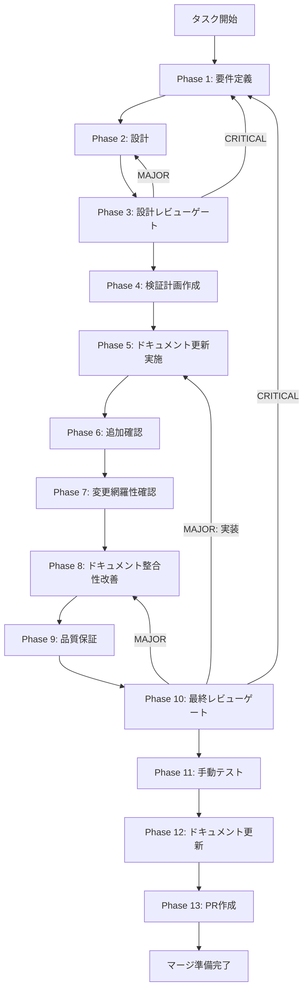

# ut-verify-doc-consolidation-001 - タスク実行仕様書

## ユーザーからの元の指示

```
Issue #1916: verify 関連ドキュメントの正本・履歴分離と責務分離明示
TASK-P0-01 Phase 12 skill-feedback-report で指摘されたドキュメント構造的課題の解消
```

## メタ情報

| 項目         | 内容                                          |
| ------------ | --------------------------------------------- |
| タスクID     | UT-VERIFY-DOC-CONSOLIDATION-001               |
| タスク名     | verify-doc-consolidation                      |
| 分類         | 改善                                          |
| 対象機能     | aiworkflow-requirements / verify ドキュメント |
| 優先度       | 中                                            |
| 見積もり規模 | 小規模                                        |
| ステータス   | 完了                                          |
| 完了日       | 2026-04-06                                    |
| 作成日       | 2026-04-06                                    |
| Issue        | #1916                                         |

---

## タスク概要

### 目的

verify 関連ドキュメント群（task-workflow系 / interfaces-skill-verify-contract）において、正本（current contract）と履歴（history record）の境界を見出しレベルで明確化し、`verifySkill()` / `verifyAndImproveLoop()` / `verify()` の3関数の責務分離をドキュメントに明示する。

### 背景

TASK-P0-01（verify 実行エンジン Layer 1/2 コア）の Phase 12 skill-feedback-report において、以下の構造的課題が指摘された:

- `task-workflow.md` と `task-workflow-completed.md` の見出しレベルで正本と履歴が区別されていない
- `verifySkill()` / `verifyAndImproveLoop()` の責務分離がドキュメントに明示されていない
- `artifacts.json` root/outputs parity 同期で正本判別困難による手戻りが発生した

### 最終ゴール

1. 各ドキュメントの冒頭に `> 区分:` 形式で役割（正本 / 履歴 / 契約仕様）を明記
2. `task-workflow.md` インデックステーブルに「区分」列を追加
3. `interfaces-skill-verify-contract.md` に verify エンジン責務分離セクション（`verifySkill()` / `verifyAndImproveLoop()` / `verify()`）を追加（追記先はこのファイルに固定する）

### 成果物一覧

| 種別         | 成果物                                        | 配置先                                                                                  |
| ------------ | --------------------------------------------- | --------------------------------------------------------------------------------------- |
| ドキュメント | 役割ラベル付与済み task-workflow.md           | `.claude/skills/aiworkflow-requirements/references/task-workflow.md`                    |
| ドキュメント | 役割ラベル付与済み task-workflow-completed.md | `.claude/skills/aiworkflow-requirements/references/task-workflow-completed.md`          |
| ドキュメント | 役割ラベル付与済み task-workflow-active.md    | `.claude/skills/aiworkflow-requirements/references/task-workflow-active.md`             |
| ドキュメント | 責務分離セクション追記済みドキュメント        | `.claude/skills/aiworkflow-requirements/references/interfaces-skill-verify-contract.md` |
| 証跡         | Phase 11 目視確認レポート                     | `outputs/phase-11/manual-test-report.md`                                                |

---

## 参照ファイル

| 参照資料                                                                                    | 役割                          |
| ------------------------------------------------------------------------------------------- | ----------------------------- |
| `.claude/skills/aiworkflow-requirements/references/task-workflow.md`                        | 親仕様書・インデックス        |
| `.claude/skills/aiworkflow-requirements/references/task-workflow-active.md`                 | アクティブガイド（正本）      |
| `.claude/skills/aiworkflow-requirements/references/task-workflow-completed.md`              | 完了記録（履歴）              |
| `.claude/skills/aiworkflow-requirements/references/interfaces-skill-verify-contract.md`     | verify 契約 Check ID 体系     |
| `apps/desktop/src/main/services/runtime/SkillCreatorVerificationEngine.ts`                  | verify エンジン実装           |
| `apps/desktop/src/main/services/runtime/RuntimeSkillCreatorFacade.ts`                       | Facade（verifySkill 294行目） |
| `docs/30-workflows/completed-tasks/step-09-par-task-p0-01-verify-execution-engine-layer12/` | TASK-P0-01 成果物             |

---

## タスク分解サマリー

| ID     | フェーズ | サブタスク名           | 責務                                                                 | 依存   |
| ------ | -------- | ---------------------- | -------------------------------------------------------------------- | ------ |
| T-01-1 | Phase 1  | 現状調査               | 対象4ファイルの現状構造・既存ラベル確認                              | -      |
| T-01-2 | Phase 1  | 要件確定               | 改善要件・受け入れ基準の定義                                         | T-01-1 |
| T-02-1 | Phase 2  | ラベル形式設計         | `> 区分:` 形式の統一・挿入位置の決定                                 | T-01   |
| T-02-2 | Phase 2  | 責務分離セクション設計 | 3関数比較表・追記箇所（`interfaces-skill-verify-contract.md`）の決定 | T-01   |
| T-03-1 | Phase 3  | 設計レビューゲート     | 設計方針の品質確認・PASS/FAIL判定                                    | T-02   |
| T-04-1 | Phase 4  | 検証計画作成           | 目視確認ベースのテストケース定義                                     | T-03   |
| T-05-1 | Phase 5  | インデックス更新       | task-workflow.md に「区分」列追加                                    | T-04   |
| T-05-2 | Phase 5  | 各ファイルラベル付与   | 4ファイルに `> 区分:` 追記                                           | T-04   |
| T-05-3 | Phase 5  | 責務分離セクション追記 | 3関数比較表を `interfaces-skill-verify-contract.md` に追記           | T-04   |
| T-06-1 | Phase 6  | 追加確認               | child companion 全件のラベル確認                                     | T-05   |
| T-07-1 | Phase 7  | 変更網羅性確認         | 全対象ファイルの変更確認                                             | T-06   |
| T-08-1 | Phase 8  | ドキュメント整合性改善 | ラベル形式統一・責務分離表現の改善                                   | T-07   |
| T-09-1 | Phase 9  | 品質保証               | Prettier確認・リンク確認・Check ID影響確認                           | T-08   |
| T-10-1 | Phase 10 | 最終レビューゲート     | 全変更内容の最終確認・PASS/FAIL判定                                  | T-09   |
| T-11-1 | Phase 11 | 手動テスト             | 各ファイルの目視確認・ラベル統一確認                                 | T-10   |
| T-12-1 | Phase 12 | ドキュメント更新       | task-workflow.md インデックス更新・unassigned-task更新               | T-11   |
| T-13-1 | Phase 13 | PR作成                 | コミット・PR作成・CI確認                                             | T-12   |

**総サブタスク数**: 17個

---

## 多角的分析観点（30思考法）

本タスクでは、設計レビュー（Phase 3）と最終レビュー（Phase 10）の判定観点へ 30 思考法を落とし込む。

| カテゴリ     | 思考法                                                               |
| ------------ | -------------------------------------------------------------------- |
| 論理分析系   | 批判的思考、演繹思考、帰納的思考、アブダクション、垂直思考           |
| 構造分解系   | 要素分解、MECE、2軸思考、プロセス思考                                |
| メタ・抽象系 | メタ思考、抽象化思考、ダブル・ループ思考                             |
| 発想・拡張系 | ブレインストーミング、水平思考、逆説思考、類推思考、if思考、素人思考 |
| システム系   | システム思考、因果関係分析、因果ループ                               |
| 戦略・価値系 | トレードオン思考、プラスサム思考、価値提案思考、戦略的思考           |
| 問題解決系   | why思考、改善思考、仮説思考、論点思考、KJ法                          |

---

## SubAgent 実行ポリシー（並列）

並列実行できる箇所は SubAgent 分担で同時に進め、ゲート（Phase 3/10）で統合判断する。

### Phase 1（要件定義）

| SubAgent             | 目的                                                                               | 成果物                                    |
| -------------------- | ---------------------------------------------------------------------------------- | ----------------------------------------- |
| SubAgent-P1-VERIFY   | skill準拠・参照整合の検証観点で現状を分解し、差分とリスクを列挙する                | `outputs/phase-1/investigation-report.md` |
| SubAgent-P1-THINK-30 | 30思考法で「正本/履歴/契約仕様」の境界・責務分離の表現を多角的に点検し改善案を出す | `outputs/phase-1/requirements-report.md`  |

### Phase 2（設計）

| SubAgent                   | 目的                                                                 | 成果物                                     |
| -------------------------- | -------------------------------------------------------------------- | ------------------------------------------ |
| SubAgent-P2-LABEL          | `> 区分:` とインデックス「区分」列の仕様を確定する                   | `outputs/phase-2/label-design.md`          |
| SubAgent-P2-RESPONSIBILITY | `interfaces-skill-verify-contract.md` へ責務分離セクションを設計する | `outputs/phase-2/responsibility-design.md` |
| SubAgent-P2-PLAN           | 変更対象・順序・リスクの計画を確定する                               | `outputs/phase-2/change-plan.md`           |

### Phase 5（ドキュメント更新実施）

| SubAgent                  | 担当ファイル（ownership）                                                               | 目的                                     |
| ------------------------- | --------------------------------------------------------------------------------------- | ---------------------------------------- |
| SubAgent-P5-TASK-WORKFLOW | `.claude/skills/aiworkflow-requirements/references/task-workflow.md`                    | インデックスに「区分」列を追加する       |
| SubAgent-P5-COMPLETED     | `.claude/skills/aiworkflow-requirements/references/task-workflow-completed.md`          | `> 区分:` を追記する                     |
| SubAgent-P5-ACTIVE        | `.claude/skills/aiworkflow-requirements/references/task-workflow-active.md`             | `> 区分:` を追記する                     |
| SubAgent-P5-CONTRACT      | `.claude/skills/aiworkflow-requirements/references/interfaces-skill-verify-contract.md` | `> 区分:` と責務分離セクションを追記する |

---

## 実行フロー図



---

## Phase一覧

| Phase | 名称                   | 仕様書                                                       | ステータス |
| ----- | ---------------------- | ------------------------------------------------------------ | ---------- |
| 1     | 要件定義               | [phase-1-requirements.md](phase-1-requirements.md)           | 未実施     |
| 2     | 設計                   | [phase-2-design.md](phase-2-design.md)                       | 未実施     |
| 3     | 設計レビューゲート     | [phase-3-design-review.md](phase-3-design-review.md)         | 未実施     |
| 4     | 検証計画作成           | [phase-4-test-creation.md](phase-4-test-creation.md)         | 未実施     |
| 5     | ドキュメント更新実施   | [phase-5-implementation.md](phase-5-implementation.md)       | 未実施     |
| 6     | 追加確認               | [phase-6-test-expansion.md](phase-6-test-expansion.md)       | 未実施     |
| 7     | 変更網羅性確認         | [phase-7-coverage-check.md](phase-7-coverage-check.md)       | 未実施     |
| 8     | ドキュメント整合性改善 | [phase-8-refactoring.md](phase-8-refactoring.md)             | 未実施     |
| 9     | 品質保証               | [phase-9-quality-assurance.md](phase-9-quality-assurance.md) | 未実施     |
| 10    | 最終レビューゲート     | [phase-10-final-review.md](phase-10-final-review.md)         | 未実施     |
| 11    | 手動テスト             | [phase-11-manual-test.md](phase-11-manual-test.md)           | 未実施     |
| 12    | ドキュメント更新       | [phase-12-documentation.md](phase-12-documentation.md)       | 未実施     |
| 13    | PR作成                 | [phase-13-pr-creation.md](phase-13-pr-creation.md)           | 未実施     |

---

## 注意事項（ドキュメント専用タスク）

このタスクはコード変更を含まない**ドキュメント更新専用**タスクである。

| Phase | 通常タスクでの位置づけ | 本タスクでの扱い                    |
| ----- | ---------------------- | ----------------------------------- |
| 4     | テスト作成             | 目視確認ベースの検証計画作成        |
| 5     | 実装                   | ドキュメントの更新実施              |
| 6     | テスト拡充             | child companion 全件の追加確認      |
| 7     | カバレッジ確認         | 変更対象の網羅性確認                |
| 8     | リファクタリング       | ドキュメント整合性・表現の改善      |
| 9     | 品質保証               | Prettier・リンク・Check ID 影響確認 |

---

## Phase完了時の必須アクション

**各Phase完了時に以下を必ず実行すること:**

1. **タスク100%実行**: Phase内で指定された全タスクを完全に実行
2. **成果物確認**: 全ての必須成果物が生成されていることを検証
3. **実行記録**: 実行タスクの結果を記録
4. **artifacts.json更新**: Phase完了ステータスを更新
5. **Phase末端の実行確認**: 各タスクを100%実行し、完遂した旨を必ず明記

```bash
# Phase完了時の検証コマンド
node .claude/skills/task-specification-creator/scripts/validate-phase-output.js \
  docs/30-workflows/ut-verify-doc-consolidation-001 --phase {{PHASE_NUMBER}}
```
