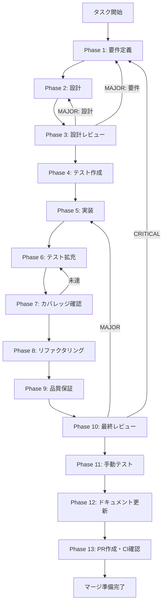

# w4a-sc-ipc-di-wiring - タスク実行仕様書

## ユーザーからの元の指示

```
RuntimeSkillCreatorFacade のコンストラクタに skillFileManager、llmAdapter、resourceLoader の
3依存が未注入であることを修正し、plan() と improve() の LLM 統合パスを有効化する。
```

## メタ情報

| 項目         | 内容                                                               |
| ------------ | ------------------------------------------------------------------ |
| タスクID     | UT-SC-05-IPC-DI-WIRING                                             |
| タスク名     | RuntimeSkillCreatorFacade DI 配線完了                              |
| 分類         | バグ修正                                                           |
| 対象機能     | Skill Creator（RuntimeSkillCreatorFacade）                         |
| 優先度       | 高                                                                 |
| 見積もり規模 | 小規模（修正対象: `apps/desktop/src/main/ipc/index.ts` 1ファイル） |
| ステータス   | 完了（PR待ち）                                                     |
| 作成日       | 2026-03-23                                                         |
| 検出元       | TASK-SC-05-IMPROVE-LLM Phase 12                                    |
| ブランチ     | feature/task-sc-05-improve-llm                                     |

---

## タスク概要

### 目的

`apps/desktop/src/main/ipc/index.ts` L898-902 において、`RuntimeSkillCreatorFacade` のコンストラクタに `skillFileManager`、`llmAdapter`、`resourceLoader` の3依存を注入し、`plan()` と `improve()` の LLM 統合パス（integrated_api 経路）を有効化する。

### 背景

`RuntimeSkillCreatorFacade` は `skillExecutor` と `authKeyService` のみが注入されている。`RuntimeSkillCreatorFacadeDeps` インターフェースでは `llmAdapter`、`resourceLoader`、`skillFileManager` がオプショナルフィールドとして定義されているが、これらが未注入のため、`plan()` と `improve()` の LLM 統合パスが常に Graceful Degradation（スタブ応答）にフォールバックしている。

### 最終ゴール

- `RuntimeSkillCreatorFacade` のコンストラクタに全5依存（`skillExecutor`, `authKeyService`, `skillFileManager`, `llmAdapter`, `resourceLoader`）が注入されている
- `plan()` が LLM 呼び出しパスを実行する（API キー設定済み環境）
- `improve()` が LLM 呼び出しパスを実行する（API キー設定済み環境）
- API キー未設定環境では Graceful Degradation が維持される
- 既存テストが全て PASS する

### 成果物一覧

| 種別         | 成果物                       | 配置先                                |
| ------------ | ---------------------------- | ------------------------------------- |
| 機能         | DI 配線修正済み `index.ts`   | `apps/desktop/src/main/ipc/index.ts`  |
| テスト       | 追加テスト（必要な場合のみ） | `apps/desktop/src/main/**/__tests__/` |
| ドキュメント | 各Phase成果物                | `outputs/phase-*/`                    |
| PR           | GitHub Pull Request          | GitHub UI                             |

---

## 参照ファイル

| 参照資料                  | パス                                                                  | 内容                                 |
| ------------------------- | --------------------------------------------------------------------- | ------------------------------------ |
| IPC エントリポイント      | `apps/desktop/src/main/ipc/index.ts`                                  | 修正対象ファイル                     |
| RuntimeSkillCreatorFacade | `apps/desktop/src/main/services/runtime/RuntimeSkillCreatorFacade.ts` | Facade クラス・Deps インターフェース |
| LLMAdapterFactory         | `apps/desktop/src/main/adapters/llm/LLMAdapterFactory.ts`             | LLM アダプターファクトリ             |
| ResourceLoader            | `apps/desktop/src/main/services/skill/ResourceLoader.ts`              | リソース読み込み基盤                 |
| SkillFileManager          | `apps/desktop/src/main/services/skill/SkillFileManager.ts`            | スキルファイル管理                   |
| Constants                 | `apps/desktop/src/main/services/skill/constants.ts`                   | DEFAULT_SKILL_CREATOR_PATH           |

### システム仕様（aiworkflow-requirements）

> 実装前に必ず以下のシステム仕様を確認し、既存設計との整合性を確保してください。

| 参照資料                        | パス                                                                                               | 内容                                                      |
| ------------------------------- | -------------------------------------------------------------------------------------------------- | --------------------------------------------------------- |
| Facade DI 仕様                  | `.claude/skills/aiworkflow-requirements/references/interfaces-agent-sdk-skill-reference.md`        | RuntimeSkillCreatorFacade L475: setLLMAdapter・DI配線仕様 |
| IPC ハンドラ登録一覧            | `.claude/skills/aiworkflow-requirements/references/architecture-overview-core.md`                  | L234-276: registerSkillCreatorHandlers 引数仕様           |
| IPC セキュリティ                | `.claude/skills/aiworkflow-requirements/references/security-electron-ipc-details.md`               | Graceful Degradation 設計                                 |
| Setter Injection 教訓           | `.claude/skills/aiworkflow-requirements/references/lessons-learned-current-safetygrate-ipc-gap.md` | L328: 非同期 getAdapter() の DI パターン選択理由          |
| LLMAdapterFactory clearInstance | `.claude/skills/aiworkflow-requirements/references/api-ipc-system-core.md`                         | L365: apiKey save/delete 後の clearInstance 仕様          |

---

## タスク分解サマリー

| ID     | フェーズ | サブタスク名                           | 責務                                              | 依存   |
| ------ | -------- | -------------------------------------- | ------------------------------------------------- | ------ |
| T-01-1 | Phase 1  | 依存注入欠損箇所の特定                 | 未注入依存の列挙・インスタンス化方法調査          | -      |
| T-01-2 | Phase 1  | LLM アダプター取得戦略の決定           | 非同期取得の3案評価・推奨案決定                   | -      |
| T-01-3 | Phase 1  | 受入基準の定義                         | 検証可能な受入基準5項目の策定                     | -      |
| T-02-1 | Phase 2  | LLM アダプター取得戦略の最終決定       | 案Cの採用と設計詳細                               | T-01   |
| T-02-2 | Phase 2  | 修正箇所の設計                         | 変更前/変更後コードの設計                         | T-02-1 |
| T-02-3 | Phase 2  | import 追加の設計                      | 必要な import 文4行の設計                         | T-02-2 |
| T-02-4 | Phase 2  | skillFileManager スコープ確認          | 親関数スコープからの参照可能性確認                | T-02-2 |
| T-02-5 | Phase 2  | 非同期 track() 互換性確認              | async コールバックの受入可否確認                  | T-02-2 |
| T-03-1 | Phase 3  | 要件・設計整合性レビュー               | 3依存注入・Graceful Degradation・P34/P65 準拠確認 | T-02   |
| T-03-2 | Phase 3  | セキュリティレビュー                   | API キー・IPC チャンネル・ログの安全性確認        | T-03-1 |
| T-03-3 | Phase 3  | テスト影響レビュー                     | 既存テスト互換性・track() async 化影響確認        | T-03-1 |
| T-03-4 | Phase 3  | 判定                                   | PASS/MINOR/MAJOR の判定記録                       | T-03-3 |
| T-04-1 | Phase 4  | 既存テスト確認                         | 7ファイル・211件のテスト構造確認                  | T-03   |
| T-04-2 | Phase 4  | DI 配線検証テスト設計                  | DI-P1/DI-P2/DI-I1/DI-I2 の設計                    | T-04-1 |
| T-04-3 | Phase 4  | テスト実装・全テスト PASS 確認         | 新規テスト追加（必要時）・既存テスト PASS 確認    | T-04-2 |
| T-05-1 | Phase 5  | import 文追加                          | 4行の import 文を追加                             | T-04   |
| T-05-2 | Phase 5  | track() ブロック修正                   | async 化・LLM アダプター取得・3依存注入           | T-05-1 |
| T-05-3 | Phase 5  | 型チェック・テスト実行                 | pnpm typecheck・全テスト PASS 確認                | T-05-2 |
| T-06-1 | Phase 6  | カバレッジ分析                         | Branch/Function Coverage の不足箇所特定           | T-05   |
| T-06-2 | Phase 6  | 不足テスト追加                         | TE-1〜TE-4 の追加判定・実装                       | T-06-1 |
| T-07-1 | Phase 7  | カバレッジ計測・基準照合               | Line 80%+/Branch 60%+/Function 80%+ の確認        | T-06   |
| T-08-1 | Phase 8  | コード品質チェック                     | any型・未使用import・命名・try-catchスコープ確認  | T-07   |
| T-09-1 | Phase 9  | ESLint/TypeScript/Prettier 検証        | Lint・型チェック・フォーマット全PASS確認          | T-08   |
| T-10-1 | Phase 10 | 要件充足・セキュリティ・回帰リスク評価 | 多角的最終レビュー・PASS/MINOR/MAJOR 判定         | T-09   |
| T-11-1 | Phase 11 | Electron アプリ起動・IPC ハンドラ確認  | 手動テストまたは CLI 代替確認                     | T-10   |
| T-12-1 | Phase 12 | 実装ガイド・システム仕様書更新         | Part1/Part2 作成・LOGS.md/SKILL.md 更新           | T-11   |
| T-12-2 | Phase 12 | 未タスク検出                           | 残課題検出・レポート作成                          | T-12-1 |
| T-13-1 | Phase 13 | 最終テスト・コミット・PR 作成          | lint/typecheck/test → コミット → PR               | T-12   |

**総サブタスク数**: 26個

---

## 実行フロー図



---

## Phase一覧

| Phase | 名称             | 仕様書                                                               | ステータス |
| ----- | ---------------- | -------------------------------------------------------------------- | ---------- |
| 1     | 要件定義         | [phase-01-requirements.md](phase-01-requirements.md)                 | 完了       |
| 2     | 設計             | [phase-02-design.md](phase-02-design.md)                             | 完了       |
| 3     | 設計レビュー     | [phase-03-design-review.md](phase-03-design-review.md)               | 完了       |
| 4     | テスト作成       | [phase-04-test-creation.md](phase-04-test-creation.md)               | 完了       |
| 5     | 実装             | [phase-05-implementation.md](phase-05-implementation.md)             | 完了       |
| 6     | テスト拡充       | [phase-06-test-expansion.md](phase-06-test-expansion.md)             | 完了       |
| 7     | カバレッジ確認   | [phase-07-coverage.md](phase-07-coverage.md)                         | 完了       |
| 8     | リファクタリング | [phase-08-refactoring.md](phase-08-refactoring.md)                   | 完了       |
| 9     | 品質保証         | [phase-09-quality-verification.md](phase-09-quality-verification.md) | 完了       |
| 10    | 最終レビュー     | [phase-10-final-review.md](phase-10-final-review.md)                 | 完了       |
| 11    | 手動テスト       | [phase-11-manual-testing.md](phase-11-manual-testing.md)             | 完了       |
| 12    | ドキュメント更新 | [phase-12-documentation.md](phase-12-documentation.md)               | 完了       |
| 13    | PR作成           | [phase-13-pr-creation.md](phase-13-pr-creation.md)                   | 未実施     |

---

## テストカバレッジ目標

### ユニットテスト

| 指標              | 最低基準 | 推奨基準 |
| ----------------- | -------- | -------- |
| Line Coverage     | 80%      | 90%      |
| Branch Coverage   | 60%      | 70%      |
| Function Coverage | 80%      | 90%      |

### 結合テスト

| 指標                         | 最低基準 |
| ---------------------------- | -------- |
| API エンドポイント           | 100%     |
| モジュール間インターフェース | 100%     |
| 正常系シナリオ               | 100%     |
| 異常系シナリオ               | 80%+     |
| 外部連携ポイント             | 100%     |

### 関連テストファイル

| ファイル                                    | テスト数 |
| ------------------------------------------- | -------- |
| `RuntimeSkillCreatorFacade.test.ts`         | 9        |
| `RuntimeSkillCreatorFacade.plan.test.ts`    | 20       |
| `RuntimeSkillCreatorFacade.improve.test.ts` | 21       |
| `skillCreatorHandlers.runtime.test.ts`      | 5        |
| `skillCreatorHandlers.validation.test.ts`   | 46       |
| `skillCreatorHandlers.security.test.ts`     | 39       |
| `skillCreatorIpc.integration.test.ts`       | 71       |
| **合計**                                    | **211**  |

---

## 統合テスト連携（Phase 1〜11で必須）

| Phase | 統合テスト連携アクション                                               |
| ----- | ---------------------------------------------------------------------- |
| 1     | DI 依存の欠損による LLM パス未到達を確認し、テスト要件に明記           |
| 2     | LLM アダプター取得戦略（案C: try-catch）の統合テスト観点を設計に反映   |
| 3     | DI 配線変更が既存テスト 211 件に影響しないことをレビューで確認         |
| 4     | DI-P1/DI-I1（LLM パス到達テスト）の設計・既存テストとの重複確認        |
| 5     | 実装後に既存テスト全件 PASS を確認（回帰テスト）                       |
| 6     | Branch/Function Coverage の不足箇所特定・追加テスト作成                |
| 7     | カバレッジ基準（Line 80%+, Branch 60%+, Function 80%+）の達成確認      |
| 8     | リファクタリング後のテスト継続成功確認                                 |
| 9     | ESLint/TypeScript/Prettier/全テスト一括検証                            |
| 10    | 要件充足・セキュリティ・回帰リスクの最終確認                           |
| 11    | Electron アプリ起動確認・IPC ハンドラ登録確認（または CLI 代替テスト） |

---

## 既知の落とし穴（Known Pitfalls）

| ID  | 内容                                 | 対策                                       |
| --- | ------------------------------------ | ------------------------------------------ |
| P34 | 遅延初期化 DI パターン               | try-catch で非同期依存を安全に取得         |
| P65 | dead-end namespace                   | 新規 IPC namespace を追加しない            |
| P63 | サブエージェントのインポートパス誤り | 既存テストの import パスを事前確認         |
| P60 | IPC テスト応答形式の不一致           | テストの期待値とレスポンス形式を一致させる |

---

## Phase完了時の必須アクション

各Phase完了時に以下を必ず実行すること:

1. **タスク100%実行**: Phase内で指定された全タスクを完全に実行
2. **成果物確認**: 全ての必須成果物が生成されていることを検証
3. **実行記録**: 実行タスクの結果を記録
4. **artifacts.json更新**: Phase完了ステータスを更新
5. **Phase末端の実行確認**: 各タスクを100%実行し、完遂した旨を必ず明記

```bash
# Phase完了時の検証コマンド
node .claude/skills/task-specification-creator/scripts/validate-phase-output.js docs/30-workflows/w4a-sc-ipc-di-wiring --phase {{PHASE_NUMBER}}
node .claude/skills/task-specification-creator/scripts/verify-all-specs.js --workflow docs/30-workflows/w4a-sc-ipc-di-wiring
```
