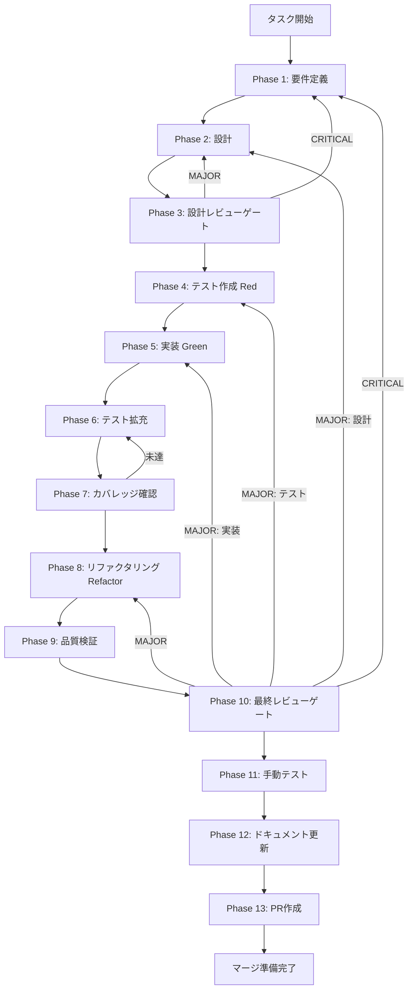

# w5b-sc-e2e-terminal-handoff - タスク実行仕様書

## ユーザーからの元の指示

```
Skill Creator LLM統合の全フローをE2Eテストし、TerminalHandoff経路の動作検証と全AC充足確認を行う。
verify() を実装し、生成スキルが要求を満たすかトータル検証できるようにする。
```

## メタ情報

| 項目         | 内容                                           |
| ------------ | ---------------------------------------------- |
| タスクID     | TASK-SC-08-E2E-VALIDATION                      |
| タスク名     | w5b-sc-e2e-terminal-handoff                    |
| 分類         | 要件（E2E検証 + verify実装 + TerminalHandoff） |
| 対象機能     | Skill Creator LLM統合                          |
| 優先度       | 高                                             |
| 見積もり規模 | 大規模                                         |
| ステータス   | 未実施                                         |
| 作成日       | 2026-03-25                                     |
| Wave         | 5（並列: w5a と同時実行可能）                  |
| 前提タスク   | w3a, w3b, w4                                   |
| 関連FR       | FR-4（verify）, FR-6（TerminalHandoff）        |
| 関連AC       | AC-6（verify）, 全AC（E2E検証）                |

---

## タスク概要

### 目的

Skill Creator LLM統合の全フロー（plan → execute-plan → verify → improve → TerminalHandoff）を5シナリオのE2Eテストで検証する。verify() を実装し（FR-4）、TerminalHandoff 経路を検証する（FR-6）。最終的に全AC（AC-1〜AC-8）と全NFR（NFR-1〜NFR-4）の充足を確認する。

### 背景

Skill Creator LLM統合は Wave 1〜5 の8タスクで構成される。本タスク（w5b）は Wave 5 の最終タスクであり、以下の3つの責務を持つ:

1. **E2E検証**: タスク01〜07 の全成果物が統合されて正常に動作することを検証する
2. **verify() 実装**: FR-4（生成スキルの要求充足をトータル検証）を実装する
3. **TerminalHandoff 検証**: FR-6（API Key 未設定時の TerminalHandoff 経路保証）を検証する

### 最終ゴール

- 5シナリオのE2Eテストが全て PASS し、全AC（AC-1〜AC-8）の充足が証明されている
- verify() が実装され、生成スキルの要求充足をトータル検証できる
- TerminalHandoff の `suggestedCommand` が CLI で実行可能であることが確認されている
- 全NFR（NFR-1〜NFR-4）の充足が確認されている

### 成果物一覧

| 種別         | 成果物                | 配置先                                                        |
| ------------ | --------------------- | ------------------------------------------------------------- |
| テスト       | E2E統合テスト         | `apps/desktop/src/test/e2e/skill-creator-integration.test.ts` |
| テスト       | TerminalHandoffテスト | `apps/desktop/src/test/e2e/terminal-handoff.test.ts`          |
| テスト       | テストヘルパー        | `apps/desktop/src/test/helpers/skill-creator-test-helpers.ts` |
| ドキュメント | 実装ガイド            | `outputs/phase-12/implementation-guide.md`                    |
| ドキュメント | テスト結果報告書      | `outputs/phase-12/test-results-report.md`                     |
| ドキュメント | 全体完了レポート      | `outputs/phase-12/overall-completion-report.md`               |
| PR           | GitHub Pull Request   | GitHub UI                                                     |

---

## 参照ファイル

本仕様書は以下を参照:

- `docs/30-workflows/skill-creator-llm-integration/index.md` - 正本（AC/FR定義・アーキテクチャ・型設計）
- `.claude/skills/aiworkflow-requirements/references/ui-ux-skill-creator.md` - Skill Creator UI/UX仕様
- `.claude/rules/06-known-pitfalls.md` - 既知の落とし穴（P40, P60, P63 等）
- `.claude/rules/05-task-execution.md` - タスク実行ルール

---

## E2Eテストシナリオ

| シナリオ | 名称            | 検証対象                                 | 対応AC     |
| -------- | --------------- | ---------------------------------------- | ---------- |
| A        | 正常フロー      | plan → execute-plan → スキル生成完了     | AC-1, AC-2 |
| B        | TerminalHandoff | API Key 未設定時の suggestedCommand 返却 | AC-4       |
| C        | LLMエラー回復   | エラーメッセージ表示 + リトライ          | AC-7       |
| D        | improve 機能    | 既存スキルのフィードバック → 差分適用    | AC-5       |
| E        | 後方互換        | 既存 skill:create チャンネルの動作継続   | AC-8       |

### AC-FR-シナリオ対応表

| AC   | 正本定義                                                    | 対応シナリオ        | 対応FR |
| ---- | ----------------------------------------------------------- | ------------------- | ------ |
| AC-1 | 自然言語入力 → LLM がカテゴリベースでスキル一式を生成する   | シナリオA           | FR-1   |
| AC-2 | 生成スキルが `.claude/skills/` に永続化され即座に実行可能   | シナリオA           | FR-2   |
| AC-3 | 生成進捗が UI にストリーミング表示される                    | w5a で検証済み      | FR-2   |
| AC-4 | API Key 未設定時は TerminalHandoffBundle + CLI コマンド表示 | シナリオB           | FR-6   |
| AC-5 | improve: フィードバック → 差分提案 → 承認で適用             | シナリオD           | FR-3   |
| AC-6 | verify: 生成スキルが要求を満たすかトータル検証できる        | シナリオA（verify） | FR-4   |
| AC-7 | エラー時に適切なメッセージ表示                              | シナリオC           | -      |
| AC-8 | 既存 skill:create（テンプレート生成）が破壊されない         | シナリオE           | -      |

### NFR 検証項目

| NFR   | 確認内容                                  | 検証方法              |
| ----- | ----------------------------------------- | --------------------- |
| NFR-1 | IPC経由で機密情報が漏洩しないこと         | セキュリティテスト    |
| NFR-2 | plan 30秒以内・execute 120秒以内          | パフォーマンステスト  |
| NFR-3 | 既存APIが破壊されないこと                 | シナリオE（後方互換） |
| NFR-4 | LLMエラー後にアプリがクラッシュしないこと | シナリオC             |

---

## タスク分解サマリー

| ID   | フェーズ | サブタスク名                 | 責務                                         | 依存 |
| ---- | -------- | ---------------------------- | -------------------------------------------- | ---- |
| T-01 | Phase 1  | 要件定義                     | E2Eシナリオ・AC対応表・NFR定義               | -    |
| T-02 | Phase 2  | 設計                         | テストインフラ・IPC定義・TerminalHandoff設計 | T-01 |
| T-03 | Phase 3  | 設計レビューゲート           | 網羅性・実現可能性検証                       | T-02 |
| T-04 | Phase 4  | テスト作成（Red）            | 5シナリオE2Eテストコード作成                 | T-03 |
| T-05 | Phase 5  | 実装（Green）                | テストインフラ・LLMモック・verify()実装      | T-04 |
| T-06 | Phase 6  | テスト拡充                   | 境界値・タイムアウト・セキュリティテスト     | T-05 |
| T-07 | Phase 7  | カバレッジ確認               | Line 80%+ / Branch 60%+ / Function 80%+      | T-06 |
| T-08 | Phase 8  | リファクタリング（Refactor） | ヘルパー共通化・重複排除・型安全性           | T-07 |
| T-09 | Phase 9  | 品質検証                     | Lint・型チェック・全テスト・パフォーマンス   | T-08 |
| T-10 | Phase 10 | 最終レビューゲート           | AC/NFR全充足確認・リリース判定               | T-09 |
| T-11 | Phase 11 | 手動テスト                   | 5シナリオ手動確認・CLI実行可能性             | T-10 |
| T-12 | Phase 12 | ドキュメント更新             | 実装ガイド・報告書・仕様書更新・未タスク検出 | T-11 |
| T-13 | Phase 13 | PR作成                       | 成果物確認・PR準備・ユーザー承認後PR作成     | T-12 |

**総サブタスク数**: 13個

---

## 実行フロー図



---

## Phase一覧

| Phase | 名称               | 仕様書                                                               | ステータス |
| ----- | ------------------ | -------------------------------------------------------------------- | ---------- |
| 1     | 要件定義           | [phase-01-requirements.md](phase-01-requirements.md)                 | 未実施     |
| 2     | 設計               | [phase-02-design.md](phase-02-design.md)                             | 未実施     |
| 3     | 設計レビューゲート | [phase-03-design-review.md](phase-03-design-review.md)               | 未実施     |
| 4     | テスト作成         | [phase-04-test-creation.md](phase-04-test-creation.md)               | 未実施     |
| 5     | 実装               | [phase-05-implementation.md](phase-05-implementation.md)             | 未実施     |
| 6     | テスト拡充         | [phase-06-test-coverage.md](phase-06-test-coverage.md)               | 未実施     |
| 7     | カバレッジ確認     | [phase-07-coverage-check.md](phase-07-coverage-check.md)             | 未実施     |
| 8     | リファクタリング   | [phase-08-refactoring.md](phase-08-refactoring.md)                   | 未実施     |
| 9     | 品質検証           | [phase-09-quality-verification.md](phase-09-quality-verification.md) | 未実施     |
| 10    | 最終レビューゲート | [phase-10-final-review.md](phase-10-final-review.md)                 | 未実施     |
| 11    | 手動テスト         | [phase-11-manual-test.md](phase-11-manual-test.md)                   | 未実施     |
| 12    | ドキュメント更新   | [phase-12-documentation.md](phase-12-documentation.md)               | 未実施     |
| 13    | PR作成             | [phase-13-completion.md](phase-13-completion.md)                     | 未実施     |

---

## IPC チャネルインベントリ

| チャネル                      | 用途                    | レスポンス形式（成功）                                                                           |
| ----------------------------- | ----------------------- | ------------------------------------------------------------------------------------------------ |
| `skill-creator:plan`          | 要求分析・カテゴリ選択  | `{ success: true, data: { steps: string[], estimatedTime: number } }`                            |
| `skill-creator:execute-plan`  | ファイル生成・永続化    | `{ success: true, data: { skillPath: string, terminalHandoff?: { suggestedCommand: string } } }` |
| `skill-creator:verify`        | 生成スキル動作検証      | `{ success: true, data: { passed: boolean, score: number, details: string[] } }`                 |
| `skill-creator:improve-skill` | フィードバック→差分適用 | `{ success: true, data: { diff: SkillDiff, applied: boolean } }`                                 |
| `skill-creator:cancel`        | キャンセル              | `{ success: true }`                                                                              |
| `SKILL_CREATOR_PROGRESS`      | 進捗ストリーミング      | `{ stage: string, progress: number }`                                                            |
| `skill:create`                | 既存テンプレート生成    | （後方互換）                                                                                     |

---

## テストカバレッジ目標

### ユニットテスト

| 指標              | 最低基準 | 推奨基準 |
| ----------------- | -------- | -------- |
| Line Coverage     | 80%      | 90%      |
| Branch Coverage   | 60%      | 70%      |
| Function Coverage | 80%      | 90%      |

---

## 統合テスト連携（Phase 1〜11で必須）

| Phase | 統合テスト連携アクション                                     |
| ----- | ------------------------------------------------------------ |
| 1     | IPC チャネル・レスポンス形式・進捗ストリーミングを要件に明記 |
| 2     | 統合ポイント/契約（IPC スキーマ）を設計に反映                |
| 3     | 統合テスト観点のレビューゲートを実施                         |
| 4     | E2Eテストシナリオを5カテゴリで作成                           |
| 5     | LLMモック・IPC統合のテストインフラ整備                       |
| 6     | 境界値・セキュリティ・パフォーマンスの統合テスト拡充         |
| 7     | 統合テストのカバレッジ計測とゲート判定                       |
| 8     | リファクタリング後の統合テスト継続成功確認                   |
| 9     | 品質保証で統合テスト結果を最終確認                           |
| 10    | 最終レビューで全AC/NFRの統合テスト結果を確認                 |
| 11    | 手動統合テスト（Electron UI + CLI 実行可能性）を確認         |

---

## Phase完了時の必須アクション

各Phase完了時に以下を必ず実行すること:

1. **タスク100%実行**: Phase内で指定された全タスクを完全に実行
2. **成果物確認**: 全ての必須成果物が生成されていることを検証
3. **実行記録**: 実行タスクの結果を記録
4. **Phase末端の実行確認**: 各タスクを100%実行し、各タスクを完遂した旨を必ず明記

---

## 正本との整合性に関する注意

> **正本宣言**: 本タスクの Phase ファイルは `docs/30-workflows/skill-creator-llm-integration/index.md` を正本とする。
>
> - AC番号は正本の AC-1〜AC-8 を使用する
> - IPC チャネル名は正本の定義（`skill-creator:execute-plan` 等）を使用する
> - 型名・インターフェース定義は正本を参照する
