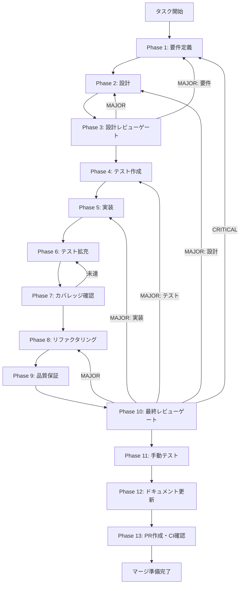

# workspace-chat-edit-ui - タスク実行仕様書

## メタ情報

```yaml
issue_number: 468
```

## ユーザーからの元の指示

```
Workspace Chat Edit UI Components の実装。
ファイルコンテキスト表示・操作UI、差分プレビュー機能、適用/却下ボタン、
ドラッグ&ドロップによるファイル添付の実装。
```

## メタ情報

| 項目         | 内容                                            |
| ------------ | ----------------------------------------------- |
| タスクID     | UT-WCE-001                                      |
| タスク名     | workspace-chat-edit-ui-components               |
| 分類         | 実装                                            |
| 対象機能     | ワークスペースチャット編集機能 UIコンポーネント |
| 優先度       | 高                                              |
| 見積もり規模 | 中〜大規模                                      |
| ステータス   | 未実施                                          |
| 作成日       | 2026-01-24                                      |
| 発見元       | Phase 11（ISSUE-001）                           |
| 関連タスク   | workspace-chat-edit（コアロジック実装済み）     |
| 依存タスク   | なし（コアロジック実装済み）                    |

---

## タスク概要

### 目的

実装済みのchatEditSlice、useFileContext、useDiffApplyを活用し、6種類のUIコンポーネントを実装する。
ユーザーがワークスペース内のファイルをチャットで編集する機能のUIを提供する。

### 背景

workspace-chat-edit機能のコアロジック（Renderer側）がPhase 1-12で実装完了した。
Zustand Slice、Hooks、型定義が整備されており、UIコンポーネントを実装することで機能が利用可能になる。

現状の課題:

- ファイルコンテキストを表示・操作するUIが未実装
- 差分プレビュー機能が未実装
- 適用/却下ボタンが未実装
- ドラッグ&ドロップによるファイル添付が未実装

### 最終ゴール

以下6種類のUIコンポーネントが実装され、ユーザーがworkspace-chat-edit機能を利用できる状態。

| コンポーネント          | 説明                             |
| ----------------------- | -------------------------------- |
| FileContextBadge.tsx    | 添付ファイルバッジ（表示・削除） |
| ApplyControls.tsx       | 適用/却下ボタン                  |
| FileContextDropZone.tsx | D&Dドロップゾーン                |
| DiffPreview.tsx         | 差分プレビューパネル             |
| DiffEditor.tsx          | Monaco Diff Editor統合           |
| EditCommandInput.tsx    | 編集コマンド入力UI               |

### 成果物一覧

| 種別         | 成果物                  | 配置先                                                                         |
| ------------ | ----------------------- | ------------------------------------------------------------------------------ |
| 機能         | 6種類のUIコンポーネント | `apps/desktop/src/renderer/features/workspace-chat-edit/components/`           |
| テスト       | コンポーネントテスト    | `apps/desktop/src/renderer/features/workspace-chat-edit/components/__tests__/` |
| ドキュメント | 実装ガイド              | `outputs/phase-12/implementation-guide.md`                                     |
| PR           | GitHub Pull Request     | GitHub UI                                                                      |

---

## 参照ファイル

### システム仕様（aiworkflow-requirements）

> 実装前に必ず以下のシステム仕様を確認し、既存設計との整合性を確保してください。

| 参照資料                | パス                                                                         | 内容                                       |
| ----------------------- | ---------------------------------------------------------------------------- | ------------------------------------------ |
| UI/UXコンポーネント     | `.claude/skills/aiworkflow-requirements/references/ui-ux-components.md`      | コンポーネント設計原則、アクセシビリティ   |
| アーキテクチャパターン  | `.claude/skills/aiworkflow-requirements/references/architecture-patterns.md` | chatEditSlice、Zustand Sliceパターン       |
| インターフェース（LLM） | `.claude/skills/aiworkflow-requirements/references/interfaces-llm.md`        | FileContext、EditCommand型定義             |
| APIエンドポイント       | `.claude/skills/aiworkflow-requirements/references/api-endpoints.md`         | chat-edit IPC チャネル仕様                 |
| 品質要件                | `.claude/skills/aiworkflow-requirements/references/quality-requirements.md`  | テストカバレッジ目標、アクセシビリティ基準 |

### 既存実装参照

| 実装           | パス                                                            | 内容                       |
| -------------- | --------------------------------------------------------------- | -------------------------- |
| chatEditSlice  | `apps/desktop/src/renderer/features/workspace-chat-edit/store/` | Zustand状態管理            |
| useFileContext | `apps/desktop/src/renderer/features/workspace-chat-edit/hooks/` | ファイルコンテキスト管理   |
| useDiffApply   | `apps/desktop/src/renderer/features/workspace-chat-edit/hooks/` | 差分計算・適用             |
| 型定義         | `apps/desktop/src/renderer/features/workspace-chat-edit/types/` | FileContext, EditCommand等 |

### 関連ドキュメント

| ドキュメント   | パス                                                                             |
| -------------- | -------------------------------------------------------------------------------- |
| 元タスク指示書 | `docs/30-workflows/unassigned-task/task-workspace-chat-edit-ui-components.md`    |
| 実装ガイド     | `docs/30-workflows/workspace-chat-edit/outputs/phase-12/implementation-guide.md` |
| 設計書         | `docs/30-workflows/workspace-chat-edit/outputs/phase-2/architecture-design.md`   |

---

## タスク分解サマリー

| ID     | フェーズ | サブタスク名                 | 責務                                   | 依存 |
| ------ | -------- | ---------------------------- | -------------------------------------- | ---- |
| T-01-1 | Phase 1  | 要件定義                     | 各コンポーネントの機能・非機能要件定義 | -    |
| T-02-1 | Phase 2  | 設計                         | コンポーネント設計、Props設計          | T-01 |
| T-03-1 | Phase 3  | 設計レビューゲート           | 設計の妥当性検証                       | T-02 |
| T-04-1 | Phase 4  | テスト作成（Red）            | 失敗するテストの作成                   | T-03 |
| T-05-1 | Phase 5  | 実装（Green）                | テストを通す実装                       | T-04 |
| T-06-1 | Phase 6  | テスト拡充                   | カバレッジ向上のためのテスト追加       | T-05 |
| T-07-1 | Phase 7  | カバレッジ確認               | 80%以上の達成確認                      | T-06 |
| T-08-1 | Phase 8  | リファクタリング（Refactor） | 品質改善                               | T-07 |
| T-09-1 | Phase 9  | 品質保証                     | Lint、型チェック、セキュリティ         | T-08 |
| T-10-1 | Phase 10 | 最終レビューゲート           | 全体品質・整合性検証                   | T-09 |
| T-11-1 | Phase 11 | 手動テスト                   | UX、実環境動作確認                     | T-10 |
| T-12-1 | Phase 12 | ドキュメント更新             | 実装ガイド、システム仕様更新           | T-11 |
| T-13-1 | Phase 13 | PR作成                       | コミット・PR・CI確認                   | T-12 |

**総サブタスク数**: 13個

---

## 実行フロー図



---

## Phase一覧

| Phase | 名称               | 仕様書                                                 | ステータス |
| ----- | ------------------ | ------------------------------------------------------ | ---------- |
| 1     | 要件定義           | [phase-1-requirements.md](phase-1-requirements.md)     | 未実施     |
| 2     | 設計               | [phase-2-design.md](phase-2-design.md)                 | 未実施     |
| 3     | 設計レビューゲート | [phase-3-design-review.md](phase-3-design-review.md)   | 未実施     |
| 4     | テスト作成         | [phase-4-test-creation.md](phase-4-test-creation.md)   | 未実施     |
| 5     | 実装               | [phase-5-implementation.md](phase-5-implementation.md) | 未実施     |
| 6     | テスト拡充         | [phase-6-test-expansion.md](phase-6-test-expansion.md) | 未実施     |
| 7     | カバレッジ確認     | [phase-7-coverage-check.md](phase-7-coverage-check.md) | 未実施     |
| 8     | リファクタリング   | [phase-8-refactoring.md](phase-8-refactoring.md)       | 未実施     |
| 9     | 品質保証           | [phase-9-quality.md](phase-9-quality.md)               | 未実施     |
| 10    | 最終レビューゲート | [phase-10-final-review.md](phase-10-final-review.md)   | 未実施     |
| 11    | 手動テスト         | [phase-11-manual-test.md](phase-11-manual-test.md)     | 未実施     |
| 12    | ドキュメント更新   | [phase-12-documentation.md](phase-12-documentation.md) | 未実施     |
| 13    | PR作成             | [phase-13-pr-creation.md](phase-13-pr-creation.md)     | 未実施     |

---

## テストカバレッジ目標

### ユニットテスト

| 指標              | 最低基準 | 推奨基準 |
| ----------------- | -------- | -------- |
| Line Coverage     | 80%      | 90%      |
| Branch Coverage   | 60%      | 70%      |
| Function Coverage | 80%      | 90%      |

### 結合テスト

| 指標                 | 目標 |
| -------------------- | ---- |
| コンポーネント間連携 | 100% |
| Hooks統合テスト      | 100% |
| 正常系シナリオ       | 100% |
| 異常系シナリオ       | 80%+ |

---

## 統合テスト連携（Phase 1〜11で必須）

各Phaseで以下の統合テスト連携アクションを実施すること:

| Phase | 統合テスト連携アクション                           |
| ----- | -------------------------------------------------- |
| 1     | useFileContext, useDiffApply連携要件を明記         |
| 2     | コンポーネント間統合ポイントを設計に反映           |
| 3     | 統合テスト観点のレビューゲートを実施               |
| 4     | Hooks連携テスト、コンポーネント統合テストを作成    |
| 5     | Hooks連携実装とテスト支援コード整備                |
| 6     | 統合テストの拡充                                   |
| 7     | 統合テストの再実行とゲート判定                     |
| 8     | リファクタ後の統合テスト継続成功を確認             |
| 9     | 品質保証で統合テスト結果を確認                     |
| 10    | 最終レビューで統合テスト結果を確認                 |
| 11    | 手動統合テスト（UI操作・コンポーネント連携）を確認 |

---

## Phase完了時の必須アクション

**各Phase完了時に以下を必ず実行すること:**

1. **タスク100%実行**: Phase内で指定された全タスクを完全に実行
2. **成果物確認**: 全ての必須成果物が生成されていることを検証
3. **実行記録**: 実行タスクの結果を記録
4. **artifacts.json更新**: Phase完了ステータスを更新
5. **Phase末端の実行確認**: 各タスクを100%実行し、各タスクを完遂した旨を必ず明記

---

## 実装対象コンポーネント詳細

### 1. FileContextBadge.tsx

**目的**: 添付されたファイルコンテキストをバッジ形式で表示し、削除操作を提供

**Props**:

```typescript
interface FileContextBadgeProps {
  context: FileContext;
  onRemove?: () => void;
}
```

**機能要件**:

- ファイル名の表示
- 削除ボタン（XアイコンまたはCloseボタン）
- ホバー時のツールチップ（ファイルパス表示）
- aria-label属性による削除ボタンのアクセシビリティ

### 2. ApplyControls.tsx

**目的**: LLM生成結果に対する適用/却下操作のUIを提供

**Props**:

```typescript
interface ApplyControlsProps {
  resultId: string;
  onApplied?: (result: ApplyResult) => void;
  onRejected?: () => void;
}
```

**機能要件**:

- 適用ボタン（変更をファイルに反映）
- 却下ボタン（変更を破棄）
- ローディング状態表示
- 成功/失敗フィードバック

### 3. FileContextDropZone.tsx

**目的**: ドラッグ&ドロップによるファイル添付UIを提供

**Props**:

```typescript
interface FileContextDropZoneProps {
  onFilesDropped?: (files: File[]) => void;
  maxFiles?: number;
  maxFileSize?: number;
  children?: React.ReactNode;
}
```

**機能要件**:

- ドラッグ中のビジュアルフィードバック
- ファイルサイズバリデーション（10MB上限）
- ファイル数バリデーション（10ファイル上限）
- エラーメッセージ表示

### 4. DiffPreview.tsx

**目的**: 差分プレビューパネルを提供

**Props**:

```typescript
interface DiffPreviewProps {
  result: GeneratedResult;
  onClose?: () => void;
}
```

**機能要件**:

- ファイル名ヘッダー
- DiffEditor統合
- ApplyControls統合
- 閉じるボタン

### 5. DiffEditor.tsx

**目的**: Monaco Diff Editorを統合した差分表示コンポーネント

**Props**:

```typescript
interface DiffEditorProps {
  original: string;
  modified: string;
  language: string;
  readOnly?: boolean;
}
```

**機能要件**:

- Monaco Diff Editorのレンダリング
- シンタックスハイライト（言語別）
- 行番号表示
- レスポンシブ対応

### 6. EditCommandInput.tsx

**目的**: 編集コマンド入力UIを提供

**Props**:

```typescript
interface EditCommandInputProps {
  onSubmit: (command: EditCommand) => void;
  disabled?: boolean;
}
```

**機能要件**:

- コマンドタイプ選択（continue, refactor, generate-test, add-comment, custom）
- カスタム指示入力フィールド
- 送信ボタン
- キーボードショートカット対応

---

**作成日**: 2026-01-24
**作成者**: Claude Code
**バージョン**: 1.0
