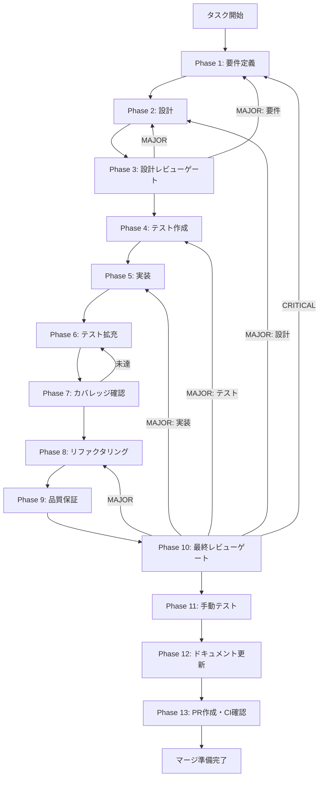

# workspace-chat-edit - タスク実行仕様書

## ユーザーからの元の指示

```
ワークスペースの方で開いているファイルに対してチャットの方で続きを書かせたり、
そのチャットワークスペース側でそのLLMとのやり取りができて、
そこで成果物を追加で生成するような機能が欲しいです。
```

## メタ情報

| 項目         | 内容                     |
| ------------ | ------------------------ |
| タスクID     | TASK-WS-CHAT-EDIT-001    |
| タスク名     | workspace-chat-edit      |
| 分類         | 新規機能                 |
| 対象機能     | ワークスペース・チャット |
| 優先度       | 高                       |
| 見積もり規模 | 大規模                   |
| ステータス   | 未実施                   |
| 作成日       | 2026-01-23               |
| GitHub Issue | #384                     |

---

## タスク概要

### 目的

ワークスペースで開いているファイルをチャットのコンテキストとして使用し、LLMと対話しながらファイルを編集・生成できる機能を実装する。これにより、ファイルのコンテキストを保持しながら続きを書かせたり、リファクタリングを依頼したりできるAIアシスト開発環境を実現する。

### 背景

現状の課題:

- ファイルの内容をチャットにコピーする必要がある
- コンテキストの維持が手動
- 生成結果をファイルに戻す作業が煩雑

放置した場合の影響:

- AIアシスト開発の効率が低い
- ワークフローが断片化
- 競合製品と比較して機能的に劣る

### 最終ゴール

1. ワークスペースファイルをチャットコンテキストに追加できる
2. ファイルの続きを書かせる機能が動作する
3. ファイルの一部を選択してリファクタリング依頼ができる
4. 生成結果をファイルに直接適用できる
5. 差分プレビュー・承認フローが機能する

### 成果物一覧

| 種別         | 成果物                           | 配置先                                              |
| ------------ | -------------------------------- | --------------------------------------------------- |
| 機能         | ファイルコンテキスト連携ロジック | `apps/desktop/src/renderer/features/workspace/`     |
| 機能         | 差分プレビューUI                 | `apps/desktop/src/renderer/components/DiffPreview/` |
| 機能         | 結果適用ロジック                 | `apps/desktop/src/renderer/hooks/`                  |
| テスト       | ユニットテスト・統合テスト       | `apps/desktop/src/**/*.test.ts`                     |
| ドキュメント | 実装ガイド・API仕様              | `outputs/phase-*/`                                  |
| PR           | GitHub Pull Request              | GitHub UI                                           |

---

## 参照ファイル

本仕様書のコマンド選定は以下を参照：

- `docs/00-requirements/master_system_design.md` - システム要件
- `.claude/skills/aiworkflow-requirements/references/` - システム仕様

### システム仕様（aiworkflow-requirements）

> 実装前に必ず以下のシステム仕様を確認し、既存設計との整合性を確保してください。

| 参照資料                     | パス                                                                             | 内容                                    |
| ---------------------------- | -------------------------------------------------------------------------------- | --------------------------------------- |
| UIコンポーネント設計         | `.claude/skills/aiworkflow-requirements/references/ui-ux-components.md`          | コンポーネント設計原則・HIG準拠         |
| パネル設計                   | `.claude/skills/aiworkflow-requirements/references/ui-ux-panels.md`              | パネル共通ガイドライン                  |
| アーキテクチャパターン       | `.claude/skills/aiworkflow-requirements/references/architecture-patterns.md`     | Zustand Slice・IPC Handler Registration |
| チャット履歴アーキテクチャ   | `.claude/skills/aiworkflow-requirements/references/architecture-chat-history.md` | レイヤー構成・依存関係ルール            |
| LLMインターフェース          | `.claude/skills/aiworkflow-requirements/references/interfaces-llm.md`            | LLMチャット関連型定義                   |
| チャット履歴インターフェース | `.claude/skills/aiworkflow-requirements/references/interfaces-chat-history.md`   | Repositoryインターフェース              |
| APIエンドポイント            | `.claude/skills/aiworkflow-requirements/references/api-endpoints.md`             | Electron IPC API設計                    |
| セキュリティ                 | `.claude/skills/aiworkflow-requirements/references/security-api-electron.md`     | Electronセキュリティ                    |

---

## タスク分解サマリー

| ID     | フェーズ | サブタスク名               | 責務                             | 依存 |
| ------ | -------- | -------------------------- | -------------------------------- | ---- |
| T-01-1 | Phase 1  | 要件定義                   | 機能要件・非機能要件の抽出       | -    |
| T-02-1 | Phase 2  | アーキテクチャ設計         | システム構造・データフローの設計 | T-01 |
| T-02-2 | Phase 2  | ドメインモデリング         | エンティティ・関係の定義         | T-01 |
| T-02-3 | Phase 2  | API設計                    | IPC APIエンドポイント設計        | T-01 |
| T-03-1 | Phase 3  | 設計レビュー               | 要件・設計の妥当性検証           | T-02 |
| T-04-1 | Phase 4  | コンテキスト連携テスト作成 | ファイル添付機能のテスト         | T-03 |
| T-04-2 | Phase 4  | 編集指示テスト作成         | 編集コマンドのテスト             | T-03 |
| T-04-3 | Phase 4  | 結果適用テスト作成         | 差分プレビュー・適用のテスト     | T-03 |
| T-04-4 | Phase 4  | 統合テストシナリオ作成     | E2Eテストシナリオ設計            | T-03 |
| T-05-1 | Phase 5  | コンテキスト連携実装       | ファイル添付ロジック実装         | T-04 |
| T-05-2 | Phase 5  | 編集指示UI実装             | チャットUI拡張                   | T-04 |
| T-05-3 | Phase 5  | 差分プレビューUI実装       | Monaco Diff Editor統合           | T-04 |
| T-05-4 | Phase 5  | 結果適用ロジック実装       | ファイル書き込み処理             | T-04 |
| T-05-5 | Phase 5  | IPC Handler実装            | Main Process連携                 | T-04 |
| T-06-1 | Phase 6  | テスト拡充                 | カバレッジ目標達成               | T-05 |
| T-07-1 | Phase 7  | カバレッジ確認             | テストカバレッジ検証             | T-06 |
| T-08-1 | Phase 8  | リファクタリング           | コード品質改善                   | T-07 |
| T-09-1 | Phase 9  | 品質保証                   | 静的解析・セキュリティ検証       | T-08 |
| T-10-1 | Phase 10 | 最終レビュー               | 全体品質・整合性検証             | T-09 |
| T-11-1 | Phase 11 | 手動テスト検証             | UX・実環境動作確認               | T-10 |
| T-12-1 | Phase 12 | ドキュメント更新           | 実装ガイド・仕様書更新           | T-11 |
| T-13-1 | Phase 13 | PR作成                     | コミット・PR・CI確認             | T-12 |

**総サブタスク数**: 22個

---

## 実行フロー図



---

## Phase一覧

| Phase | 名称               | 仕様書                                                 | ステータス |
| ----- | ------------------ | ------------------------------------------------------ | ---------- |
| 1     | 要件定義           | [phase-1-requirements.md](phase-1-requirements.md)     | 未実施     |
| 2     | 設計               | [phase-2-design.md](phase-2-design.md)                 | 未実施     |
| 3     | 設計レビューゲート | [phase-3-design-review.md](phase-3-design-review.md)   | 未実施     |
| 4     | テスト作成         | [phase-4-test-creation.md](phase-4-test-creation.md)   | 未実施     |
| 5     | 実装               | [phase-5-implementation.md](phase-5-implementation.md) | 未実施     |
| 6     | テスト拡充         | [phase-6-test-expansion.md](phase-6-test-expansion.md) | 未実施     |
| 7     | カバレッジ確認     | [phase-7-coverage-check.md](phase-7-coverage-check.md) | 未実施     |
| 8     | リファクタリング   | [phase-8-refactoring.md](phase-8-refactoring.md)       | 未実施     |
| 9     | 品質保証           | [phase-9-quality.md](phase-9-quality.md)               | 未実施     |
| 10    | 最終レビューゲート | [phase-10-final-review.md](phase-10-final-review.md)   | 未実施     |
| 11    | 手動テスト         | [phase-11-manual-test.md](phase-11-manual-test.md)     | 未実施     |
| 12    | ドキュメント更新   | [phase-12-documentation.md](phase-12-documentation.md) | 未実施     |
| 13    | PR作成             | [phase-13-pr-creation.md](phase-13-pr-creation.md)     | 未実施     |

---

## テストカバレッジ目標

### ユニットテスト

| 指標              | 最低基準 | 推奨基準 |
| ----------------- | -------- | -------- |
| Line Coverage     | 80%      | 90%      |
| Branch Coverage   | 60%      | 70%      |
| Function Coverage | 80%      | 90%      |

### 結合テスト

| 指標                         | 目標 |
| ---------------------------- | ---- |
| APIエンドポイント            | 100% |
| モジュール間インターフェース | 100% |
| 正常系シナリオ               | 100% |
| 異常系シナリオ               | 80%+ |
| 外部連携ポイント             | 100% |

---

## 統合テスト連携（Phase 1〜11で必須）

各Phaseで以下の統合テスト連携アクションを実施すること:

| Phase | 統合テスト連携アクション                           |
| ----- | -------------------------------------------------- |
| 1     | 接続要件（IPC/状態管理/データフロー）を要件に明記  |
| 2     | 統合ポイント/契約（IPC API・スキーマ）を設計に反映 |
| 3     | 統合テスト観点のレビューゲートを実施               |
| 4     | 統合テストシナリオを全カテゴリで作成               |
| 5     | Renderer/Main接続の実装とテスト支援コード整備      |
| 6     | 統合テストの拡充（全カテゴリのカバレッジ向上）     |
| 7     | 統合テストの再実行とゲート判定                     |
| 8     | リファクタ後の統合テスト継続成功を確認             |
| 9     | 品質保証で統合テスト結果を確認                     |
| 10    | 最終レビューで統合テスト結果を確認                 |
| 11    | 手動統合テスト（UI/IPC接続）を確認                 |

---

## Phase完了時の必須アクション

**各Phase完了時に以下を必ず実行すること:**

1. **タスク100%実行**: Phase内で指定された全タスクを完全に実行
2. **成果物確認**: 全ての必須成果物が生成されていることを検証
3. **実行記録**: 実行タスクの結果を記録
4. **artifacts.json更新**: Phase完了ステータスを更新
5. **Phase末端の実行確認**: 各タスクを100%実行し、各タスクを完遂した旨を必ず明記

```bash
# Phase完了時の検証コマンド
node .claude/skills/task-specification-creator/scripts/validate-phase-output.js docs/30-workflows/workspace-chat-edit --phase {{PHASE_NUMBER}}

# Phase完了・成果物登録
node .claude/skills/task-specification-creator/scripts/complete-phase.js \
  --workflow docs/30-workflows/workspace-chat-edit --phase {{PHASE_NUMBER}} --artifacts "..."
```

---

## 機能詳細

### コンテキスト連携

- 開いているファイルをチャットに添付
- 選択範囲のみを添付
- 複数ファイルの同時添付
- ファイルパスとコンテンツの自動取得

### 編集指示

- 「続きを書いて」機能
- 「この部分をリファクタリングして」機能
- 「テストを生成して」機能
- 「コメントを追加して」機能

### 結果適用

- 生成結果のプレビュー
- 差分表示（変更前/変更後）
- 承認/却下フロー
- 部分適用（選択範囲のみ）
- 直接ファイルへの書き込み

### UI/UX

- ファイルタブからチャットへのドラッグ&ドロップ
- 右クリックメニューからの「チャットで編集」
- ショートカットキー（Cmd/Ctrl + Shift + C）
