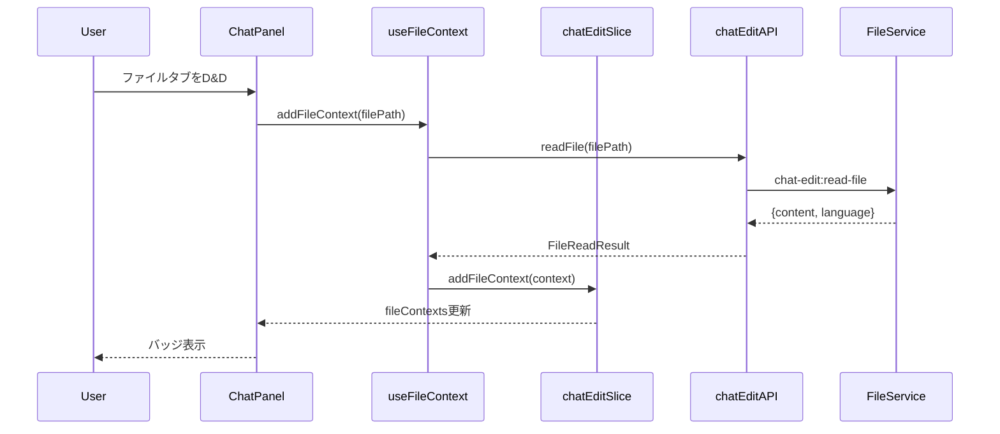
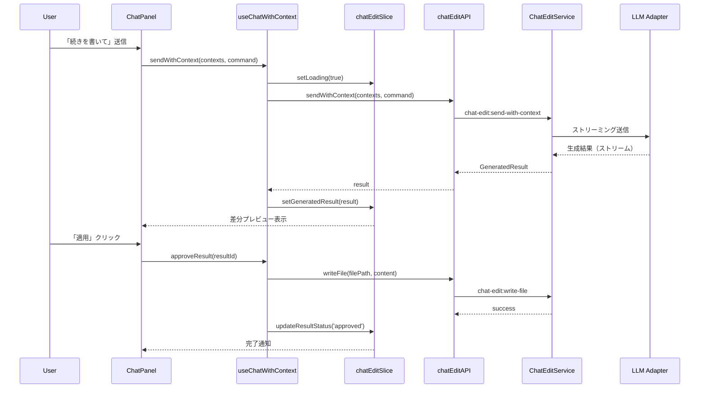

# アーキテクチャ設計書 - workspace-chat-edit

## メタ情報

| 項目     | 内容                  |
| -------- | --------------------- |
| タスクID | TASK-WS-CHAT-EDIT-001 |
| Phase    | 2                     |
| 作成日   | 2026-01-23            |

---

## 設計原則

### アーキテクチャ準拠

| 原則               | 適用                                            |
| ------------------ | ----------------------------------------------- |
| Clean Architecture | 依存関係は外から内へ（UI→Application→Domain）   |
| Facade Pattern     | 外部からは単一のサービスインターフェースを提供  |
| Zustand Slice      | 機能単位でSliceを分離し、型安全性と保守性を確保 |
| IPC Security       | ホワイトリスト検証付きIPC呼び出し               |

---

## レイヤー構成

```
┌─────────────────────────────────────────────────────────────────────┐
│                         UI Layer (React)                             │
│  ┌─────────────┐  ┌────────────────┐  ┌───────────────────────────┐ │
│  │ ChatPanel   │  │ DiffPreview    │  │ FileContextBadge          │ │
│  │ (拡張)      │  │ (新規)         │  │ (新規)                    │ │
│  └─────────────┘  └────────────────┘  └───────────────────────────┘ │
├─────────────────────────────────────────────────────────────────────┤
│                    Application Layer (Hooks)                         │
│  ┌──────────────────┐  ┌─────────────────┐  ┌────────────────────┐  │
│  │ useFileContext   │  │ useChatWithCtx  │  │ useDiffApply       │  │
│  │ (新規)           │  │ (新規)          │  │ (新規)             │  │
│  └──────────────────┘  └─────────────────┘  └────────────────────┘  │
├─────────────────────────────────────────────────────────────────────┤
│                      State Layer (Zustand)                           │
│  ┌──────────────────┐  ┌─────────────────────────────────────────┐  │
│  │ workspaceSlice   │  │ chatEditSlice (新規)                    │  │
│  │ (既存)           │  │ - fileContexts, generatedResults        │  │
│  └──────────────────┘  └─────────────────────────────────────────┘  │
├─────────────────────────────────────────────────────────────────────┤
│                   Infrastructure Layer (IPC)                         │
│  ┌──────────────────────────────────────────────────────────────┐   │
│  │ Preload API: window.chatEditAPI                               │   │
│  │ - readFile, writeFile, getSelection, sendWithContext          │   │
│  └──────────────────────────────────────────────────────────────┘   │
└─────────────────────────────────────────────────────────────────────┘
                               │ IPC
                               ▼
┌─────────────────────────────────────────────────────────────────────┐
│                        Main Process (Electron)                       │
│  ┌─────────────────────┐  ┌─────────────────────────────────────┐   │
│  │ FileService         │  │ ChatEditService                     │   │
│  │ - readFile          │  │ - buildContextPrompt                │   │
│  │ - writeFile         │  │ - sendToLLM                         │   │
│  │ - getLanguage       │  │ - parseGeneratedContent             │   │
│  └─────────────────────┘  └─────────────────────────────────────┘   │
│                              │                                       │
│                              ▼                                       │
│  ┌─────────────────────────────────────────────────────────────┐    │
│  │ LLM Adapters (既存)                                          │    │
│  │ - OpenAIAdapter, AnthropicAdapter, GoogleAdapter, xAIAdapter │    │
│  └─────────────────────────────────────────────────────────────┘    │
└─────────────────────────────────────────────────────────────────────┘
```

---

## コンポーネント構成

### ディレクトリ構造

```
apps/desktop/src/
├── main/
│   ├── services/
│   │   └── chat-edit/
│   │       ├── FileService.ts           # ファイルI/O
│   │       ├── ChatEditService.ts       # チャット編集ロジック
│   │       ├── ContextBuilder.ts        # プロンプトコンテキスト構築
│   │       └── index.ts                 # エクスポート
│   └── ipc/
│       └── chatEditHandlers.ts          # IPCハンドラ
├── preload/
│   ├── chatEditApi.ts                   # Preload API定義
│   └── channels.ts                      # チャンネル定数追加
└── renderer/
    ├── components/
    │   ├── ChatPanel/
    │   │   ├── ChatPanel.tsx            # 拡張
    │   │   ├── FileContextBadge.tsx     # 添付ファイル表示
    │   │   ├── FileContextDropZone.tsx  # D&Dゾーン
    │   │   └── EditCommandInput.tsx     # 編集コマンド入力
    │   └── DiffPreview/
    │       ├── DiffPreview.tsx          # 差分プレビューパネル
    │       ├── DiffEditor.tsx           # Monaco Diff Editor
    │       ├── ApplyControls.tsx        # 適用/却下ボタン
    │       └── index.ts                 # エクスポート
    ├── features/
    │   └── workspace-chat-edit/
    │       ├── hooks/
    │       │   ├── useFileContext.ts    # ファイルコンテキスト管理
    │       │   ├── useChatWithContext.ts # コンテキスト付きチャット
    │       │   └── useDiffApply.ts      # 差分適用ロジック
    │       ├── store/
    │       │   └── chatEditSlice.ts     # 状態管理スライス
    │       ├── types/
    │       │   └── index.ts             # 型定義
    │       └── index.ts                 # エクスポート
    └── store/
        └── slices/
            └── chatEditSlice.ts         # Zustand Slice
```

---

## コンポーネント詳細

### UI Layer

| コンポーネント      | 責務                        | 依存               |
| ------------------- | --------------------------- | ------------------ |
| ChatPanel           | チャット表示・入力（拡張）  | useChatWithContext |
| FileContextBadge    | 添付ファイルのバッジ表示    | chatEditSlice      |
| FileContextDropZone | ドラッグ&ドロップの受け入れ | useFileContext     |
| EditCommandInput    | 編集コマンドの入力支援      | chatEditSlice      |
| DiffPreview         | 差分プレビューパネル        | useDiffApply       |
| DiffEditor          | Monaco Diff Editor統合      | なし               |
| ApplyControls       | 適用/却下ボタン             | useDiffApply       |

### Application Layer

| Hook               | 責務                             | 依存                   |
| ------------------ | -------------------------------- | ---------------------- |
| useFileContext     | ファイルコンテキストの追加・削除 | chatEditSlice, IPC     |
| useChatWithContext | コンテキスト付きメッセージ送信   | chatSlice, chatEditAPI |
| useDiffApply       | 差分の適用・却下処理             | chatEditSlice, IPC     |

### State Layer

| Slice         | 責務                                         |
| ------------- | -------------------------------------------- |
| chatEditSlice | ファイルコンテキスト、生成結果、UI状態の管理 |

### Infrastructure Layer

| サービス        | 責務                       | 場所         |
| --------------- | -------------------------- | ------------ |
| FileService     | ファイル読み書き、言語検出 | Main Process |
| ChatEditService | プロンプト構築、LLM連携    | Main Process |
| chatEditAPI     | Renderer→Main IPC          | Preload      |

---

## データフロー

### ファイル添付フロー



### 編集→生成→適用フロー



---

## 統合ポイント

### 既存機能との連携

| 連携先         | 連携方法                     | 備考               |
| -------------- | ---------------------------- | ------------------ |
| workspaceSlice | 開いているファイル情報の参照 | 読み取りのみ       |
| chatSlice      | チャット履歴への統合         | メッセージ追加     |
| LLM Adapters   | 既存LLMアダプター経由で送信  | ストリーミング対応 |
| Monaco Editor  | Diff Editorとして使用        | 差分表示           |

### 契約定義

| 統合ポイント  | 契約                            |
| ------------- | ------------------------------- |
| Renderer→Main | IPC: `chat-edit:*` チャンネル群 |
| Main→LLM      | LLMChatRequest/LLMChatResponse  |
| 状態同期      | chatEditSlice ⇔ chatSlice       |
| UI連携        | DiffPreview ⇔ Monaco Editor     |

---

## セキュリティ考慮

### IPC Security

| 対策                 | 実装                                     |
| -------------------- | ---------------------------------------- |
| ホワイトリスト       | ALLOWED_INVOKE_CHANNELSに追加            |
| sender検証           | validateIpcSender使用                    |
| ファイルアクセス制限 | ワークスペース内ファイルのみ許可         |
| パス検証             | path.isAbsolute + ワークスペースチェック |

### ファイル操作

| 対策           | 実装                                       |
| -------------- | ------------------------------------------ |
| 書き込み前確認 | 承認フロー必須                             |
| バックアップ   | 書き込み前に.bakファイル作成（オプション） |
| サイズ制限     | 10MB以上は警告                             |

---

## エラーハンドリング

### エラー分類

| エラー種別     | 例                         | 対処                     |
| -------------- | -------------------------- | ------------------------ |
| ファイルエラー | 読み取り失敗、書き込み失敗 | トースト通知、リトライ   |
| LLMエラー      | タイムアウト、レート制限   | リトライ、フォールバック |
| バリデーション | 無効なファイルパス         | エラーメッセージ表示     |
| 状態エラー     | コンテキスト未設定で送信   | UI無効化                 |

### Result Pattern

```typescript
type ChatEditResult<T> =
  | { success: true; data: T }
  | { success: false; error: ChatEditError };

interface ChatEditError {
  code: ChatEditErrorCode;
  message: string;
  details?: Record<string, unknown>;
}

type ChatEditErrorCode =
  | "FILE_NOT_FOUND"
  | "FILE_READ_ERROR"
  | "FILE_WRITE_ERROR"
  | "PERMISSION_DENIED"
  | "LLM_ERROR"
  | "CONTEXT_TOO_LARGE"
  | "INVALID_COMMAND";
```

---

## 品質要件

### パフォーマンス

| 項目         | 目標              |
| ------------ | ----------------- |
| ファイル添付 | 1MB以下で1秒以内  |
| 差分計算     | 500行で100ms以内  |
| UI応答       | 全操作で100ms以内 |

### アクセシビリティ

| 項目               | 実装                                 |
| ------------------ | ------------------------------------ |
| キーボード操作     | 全機能がTabキーでアクセス可能        |
| スクリーンリーダー | aria-label、role属性の適切な設定     |
| フォーカス管理     | モーダル開閉時の適切なフォーカス移動 |

---

## 関連ドキュメント

- 要件定義書: `outputs/phase-1/requirements-definition.md`
- ドメインモデル: `outputs/phase-2/domain-model.md`
- IPC API設計: `outputs/phase-2/ipc-api-design.md`
- アーキテクチャパターン: `.claude/skills/aiworkflow-requirements/references/architecture-patterns.md`
