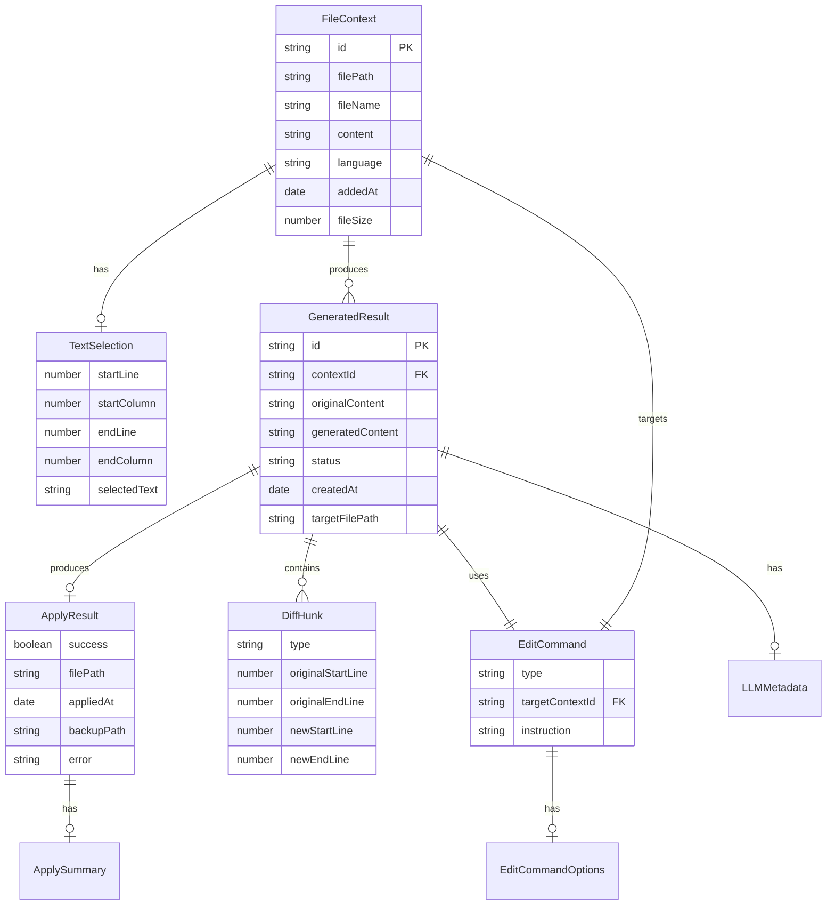

# ドメインモデル設計書 - workspace-chat-edit

## メタ情報

| 項目     | 内容                  |
| -------- | --------------------- |
| タスクID | TASK-WS-CHAT-EDIT-001 |
| Phase    | 2                     |
| 作成日   | 2026-01-23            |

---

## エンティティ定義

### FileContext - 添付ファイルコンテキスト

ワークスペースから添付されたファイルの情報を表すエンティティ。

```typescript
interface FileContext {
  /** ユニークID（UUID v4） */
  id: string;

  /** ファイルの絶対パス */
  filePath: string;

  /** ファイル名（表示用） */
  fileName: string;

  /** ファイル内容（テキスト） */
  content: string;

  /** 選択範囲（オプション） */
  selection?: TextSelection;

  /** プログラミング言語（拡張子から検出） */
  language: string;

  /** 添付日時 */
  addedAt: Date;

  /** ファイルサイズ（バイト） */
  fileSize: number;
}
```

| プロパティ | 型            | 必須 | 説明                       |
| ---------- | ------------- | ---- | -------------------------- |
| id         | string        | ✓    | UUID v4形式のユニークID    |
| filePath   | string        | ✓    | ファイルの絶対パス         |
| fileName   | string        | ✓    | ファイル名（拡張子含む）   |
| content    | string        | ✓    | ファイル内容               |
| selection  | TextSelection | -    | 選択範囲（部分添付時）     |
| language   | string        | ✓    | 言語識別子（typescript等） |
| addedAt    | Date          | ✓    | 添付日時                   |
| fileSize   | number        | ✓    | ファイルサイズ（バイト）   |

---

### TextSelection - テキスト選択範囲

エディタで選択されたテキスト範囲を表す値オブジェクト。

```typescript
interface TextSelection {
  /** 開始行（1始まり） */
  startLine: number;

  /** 開始列（1始まり） */
  startColumn: number;

  /** 終了行（1始まり） */
  endLine: number;

  /** 終了列（1始まり） */
  endColumn: number;

  /** 選択されたテキスト */
  selectedText: string;
}
```

| プロパティ   | 型     | 必須 | 説明                   |
| ------------ | ------ | ---- | ---------------------- |
| startLine    | number | ✓    | 開始行（1始まり）      |
| startColumn  | number | ✓    | 開始列（1始まり）      |
| endLine      | number | ✓    | 終了行（1始まり）      |
| endColumn    | number | ✓    | 終了列（1始まり）      |
| selectedText | string | ✓    | 選択されたテキスト内容 |

---

### EditCommand - 編集コマンド

ユーザーからの編集指示を表すエンティティ。

```typescript
type EditCommandType =
  | "continue" // 続きを書く
  | "refactor" // リファクタリング
  | "generate-test" // テスト生成
  | "add-comment" // コメント追加
  | "custom"; // カスタム指示

interface EditCommand {
  /** コマンド種別 */
  type: EditCommandType;

  /** 対象FileContextのID */
  targetContextId: string;

  /** カスタム指示（typeがcustomの場合） */
  instruction?: string;

  /** 追加のオプション */
  options?: EditCommandOptions;
}

interface EditCommandOptions {
  /** 言語指定（テスト生成時） */
  testFramework?: string;

  /** コメントスタイル（JSDoc, 単行等） */
  commentStyle?: "jsdoc" | "inline" | "block";

  /** リファクタリングの観点 */
  refactorFocus?: "readability" | "performance" | "type-safety";
}
```

| プロパティ      | 型                 | 必須 | 説明                         |
| --------------- | ------------------ | ---- | ---------------------------- |
| type            | EditCommandType    | ✓    | コマンド種別                 |
| targetContextId | string             | ✓    | 対象FileContextのID          |
| instruction     | string             | -    | カスタム指示（custom時のみ） |
| options         | EditCommandOptions | -    | 追加オプション               |

---

### GeneratedResult - LLM生成結果

LLMが生成したコード/テキストの結果を表すエンティティ。

```typescript
type GeneratedResultStatus = "pending" | "approved" | "rejected";

interface GeneratedResult {
  /** ユニークID（UUID v4） */
  id: string;

  /** 関連FileContextのID */
  contextId: string;

  /** 元のコンテンツ */
  originalContent: string;

  /** 生成されたコンテンツ */
  generatedContent: string;

  /** 差分情報 */
  diffHunks: DiffHunk[];

  /** ステータス */
  status: GeneratedResultStatus;

  /** 作成日時 */
  createdAt: Date;

  /** 適用先ファイルパス */
  targetFilePath: string;

  /** 使用したコマンド */
  command: EditCommand;

  /** LLMのメタ情報 */
  llmMetadata?: LLMMetadata;
}

interface LLMMetadata {
  /** 使用したモデル */
  model: string;

  /** 使用したトークン数 */
  tokensUsed: number;

  /** 生成時間（ms） */
  generationTimeMs: number;
}
```

| プロパティ       | 型                    | 必須 | 説明                      |
| ---------------- | --------------------- | ---- | ------------------------- |
| id               | string                | ✓    | UUID v4形式のID           |
| contextId        | string                | ✓    | 関連FileContextのID       |
| originalContent  | string                | ✓    | 元のコンテンツ            |
| generatedContent | string                | ✓    | 生成されたコンテンツ      |
| diffHunks        | DiffHunk[]            | ✓    | 差分情報                  |
| status           | GeneratedResultStatus | ✓    | pending/approved/rejected |
| createdAt        | Date                  | ✓    | 作成日時                  |
| targetFilePath   | string                | ✓    | 適用先ファイルパス        |
| command          | EditCommand           | ✓    | 使用したコマンド          |
| llmMetadata      | LLMMetadata           | -    | LLMのメタ情報             |

---

### DiffHunk - 差分の塊

ファイルの変更差分を表す値オブジェクト。

```typescript
type DiffHunkType = "add" | "remove" | "modify";

interface DiffHunk {
  /** 差分タイプ */
  type: DiffHunkType;

  /** 開始行（元ファイル） */
  originalStartLine: number;

  /** 終了行（元ファイル） */
  originalEndLine: number;

  /** 開始行（新ファイル） */
  newStartLine: number;

  /** 終了行（新ファイル） */
  newEndLine: number;

  /** 元の行 */
  originalLines: string[];

  /** 新しい行 */
  newLines: string[];
}
```

| プロパティ        | 型           | 必須 | 説明               |
| ----------------- | ------------ | ---- | ------------------ |
| type              | DiffHunkType | ✓    | add/remove/modify  |
| originalStartLine | number       | ✓    | 元ファイルの開始行 |
| originalEndLine   | number       | ✓    | 元ファイルの終了行 |
| newStartLine      | number       | ✓    | 新ファイルの開始行 |
| newEndLine        | number       | ✓    | 新ファイルの終了行 |
| originalLines     | string[]     | ✓    | 元の行配列         |
| newLines          | string[]     | ✓    | 新しい行配列       |

---

### ApplyResult - 適用結果

ファイルへの適用結果を表すエンティティ。

```typescript
interface ApplyResult {
  /** 成功/失敗 */
  success: boolean;

  /** 適用先ファイルパス */
  filePath: string;

  /** 適用日時 */
  appliedAt: Date;

  /** バックアップファイルパス（作成した場合） */
  backupPath?: string;

  /** エラーメッセージ */
  error?: string;

  /** 適用した差分のサマリー */
  summary?: ApplySummary;
}

interface ApplySummary {
  /** 追加行数 */
  linesAdded: number;

  /** 削除行数 */
  linesRemoved: number;

  /** 変更行数 */
  linesModified: number;
}
```

| プロパティ | 型           | 必須 | 説明                     |
| ---------- | ------------ | ---- | ------------------------ |
| success    | boolean      | ✓    | 成功/失敗                |
| filePath   | string       | ✓    | 適用先ファイルパス       |
| appliedAt  | Date         | ✓    | 適用日時                 |
| backupPath | string       | -    | バックアップファイルパス |
| error      | string       | -    | エラーメッセージ         |
| summary    | ApplySummary | -    | 適用サマリー             |

---

## 状態管理（Zustand Slice）

### ChatEditState

```typescript
interface ChatEditState {
  // ===== ファイルコンテキスト =====
  /** 添付されたファイルコンテキスト一覧 */
  fileContexts: FileContext[];

  /** 現在アクティブなコンテキストID */
  activeContextId: string | null;

  // ===== 生成結果 =====
  /** LLM生成結果一覧 */
  generatedResults: GeneratedResult[];

  /** 現在表示中の結果ID */
  currentResultId: string | null;

  // ===== UI状態 =====
  /** ローディング中 */
  isLoading: boolean;

  /** 差分プレビュー表示中 */
  isDiffPreviewOpen: boolean;

  /** エラーメッセージ */
  error: string | null;

  /** ドラッグ中フラグ */
  isDragging: boolean;
}

interface ChatEditActions {
  // ===== ファイルコンテキスト操作 =====
  /** ファイルコンテキストを追加 */
  addFileContext: (context: Omit<FileContext, "id" | "addedAt">) => void;

  /** ファイルコンテキストを削除 */
  removeFileContext: (id: string) => void;

  /** 全コンテキストをクリア */
  clearAllContexts: () => void;

  /** アクティブコンテキストを設定 */
  setActiveContext: (id: string | null) => void;

  // ===== 生成結果操作 =====
  /** 生成結果を設定 */
  setGeneratedResult: (result: GeneratedResult) => void;

  /** 結果を承認 */
  approveResult: (resultId: string) => Promise<ApplyResult>;

  /** 結果を却下 */
  rejectResult: (resultId: string) => void;

  /** 結果をクリア */
  clearResults: () => void;

  // ===== UI状態操作 =====
  /** 差分プレビューを開く */
  openDiffPreview: (resultId: string) => void;

  /** 差分プレビューを閉じる */
  closeDiffPreview: () => void;

  /** ローディング状態を設定 */
  setLoading: (loading: boolean) => void;

  /** エラーを設定 */
  setError: (error: string | null) => void;

  /** ドラッグ状態を設定 */
  setDragging: (dragging: boolean) => void;

  /** 状態をリセット */
  reset: () => void;
}

type ChatEditSlice = ChatEditState & ChatEditActions;
```

### 初期状態

```typescript
const initialChatEditState: ChatEditState = {
  fileContexts: [],
  activeContextId: null,
  generatedResults: [],
  currentResultId: null,
  isLoading: false,
  isDiffPreviewOpen: false,
  error: null,
  isDragging: false,
};
```

---

## ドメインルール

### ファイルコンテキスト

| ルールID | 内容                         | 検証場所    |
| -------- | ---------------------------- | ----------- |
| DC-001   | 最大添付ファイル数は10件     | Slice       |
| DC-002   | 同一ファイルの重複添付は不可 | Slice       |
| DC-003   | ファイルサイズは10MB以下     | IPC Handler |
| DC-004   | バイナリファイルは添付不可   | IPC Handler |

### 編集コマンド

| ルールID | 内容                            | 検証場所 |
| -------- | ------------------------------- | -------- |
| EC-001   | targetContextIdは有効なIDである | Hook     |
| EC-002   | customタイプはinstruction必須   | Hook     |
| EC-003   | 空のコンテキストでは実行不可    | Hook     |

### 生成結果

| ルールID | 内容                      | 検証場所  |
| -------- | ------------------------- | --------- |
| GR-001   | approvedは1回のみ実行可能 | Slice     |
| GR-002   | rejected後は再利用不可    | Slice     |
| GR-003   | 適用前に確認UIを表示      | Component |

---

## エンティティ関係図



---

## 関連ドキュメント

- アーキテクチャ設計: `outputs/phase-2/architecture-design.md`
- IPC API設計: `outputs/phase-2/ipc-api-design.md`
- LLMインターフェース: `.claude/skills/aiworkflow-requirements/references/interfaces-llm.md`
