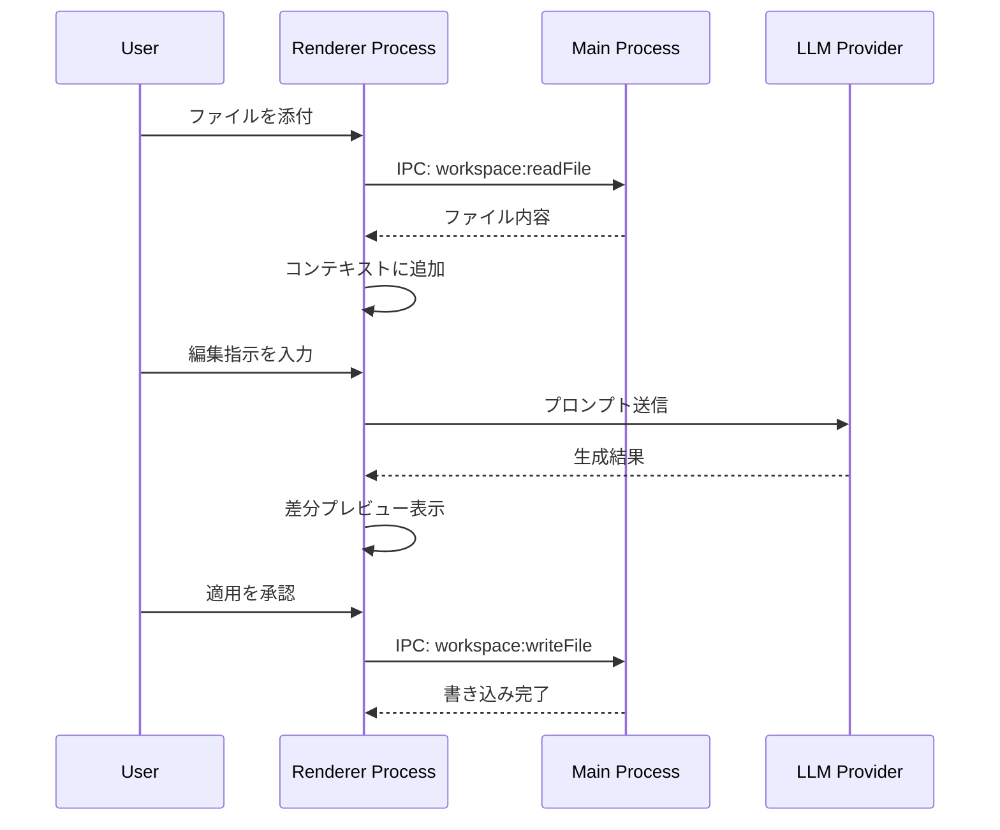

# Phase 1: 要件定義

## メタ情報

| 項目   | 値                  |
| ------ | ------------------- |
| Phase  | 1                   |
| 機能名 | workspace-chat-edit |
| 作成日 | 2026-01-23          |

## 目的

タスクの目的、スコープ、受け入れ基準を明文化する。ワークスペースファイルとチャット機能を連携させるための機能要件・非機能要件を抽出し、検証可能な受け入れ基準を定義する。

## 実行タスク

- **要件抽出**: ユーザー要求から機能要件・非機能要件を抽出
- **受け入れ基準作成**: 各要件に対して検証可能な受け入れ基準を定義
- **FR/NFR分類**: 機能要件と非機能要件を分類し優先度を設定

## 参照資料

| 資料名                     | パス                                                                             | 説明                   |
| -------------------------- | -------------------------------------------------------------------------------- | ---------------------- |
| システム要件               | `docs/00-requirements/*.md`                                                      | 既存システム要件       |
| ユーザー要求               | `docs/30-workflows/unassigned-task/task-workspace-chat-edit.md`                  | 元のユーザー要求       |
| UIコンポーネント設計       | `.claude/skills/aiworkflow-requirements/references/ui-ux-components.md`          | コンポーネント設計原則 |
| チャット履歴アーキテクチャ | `.claude/skills/aiworkflow-requirements/references/architecture-chat-history.md` | レイヤー構成・依存関係 |
| LLMインターフェース        | `.claude/skills/aiworkflow-requirements/references/interfaces-llm.md`            | LLMチャット関連型定義  |

### システム仕様（aiworkflow-requirements）

> 実装前に必ず以下のシステム仕様を確認し、既存設計との整合性を確保してください。

| 参照資料     | パス                                                                        | 内容                             |
| ------------ | --------------------------------------------------------------------------- | -------------------------------- |
| システム概要 | `.claude/skills/aiworkflow-requirements/references/overview.md`             | システムの目的・設計原則         |
| 品質要件     | `.claude/skills/aiworkflow-requirements/references/quality-requirements.md` | パフォーマンス・アクセシビリティ |

## 実行手順

### 1. 要件抽出

ユーザー要求から機能要件・非機能要件を抽出する。

#### 機能要件（FR）

| FR-ID  | 要件                     | 優先度 | 説明                                               |
| ------ | ------------------------ | ------ | -------------------------------------------------- |
| FR-001 | ファイルコンテキスト添付 | 高     | ワークスペースで開いているファイルをチャットに添付 |
| FR-002 | 選択範囲添付             | 高     | ファイルの選択範囲のみをコンテキストとして添付     |
| FR-003 | 複数ファイル同時添付     | 中     | 複数のファイルを同時にコンテキストとして添付       |
| FR-004 | 続きを書く機能           | 高     | 添付ファイルの続きをLLMに生成させる                |
| FR-005 | リファクタリング指示     | 高     | 選択範囲に対してリファクタリングを指示             |
| FR-006 | テスト生成指示           | 中     | 添付コードに対するテストを生成                     |
| FR-007 | コメント追加指示         | 中     | コードにコメントを追加                             |
| FR-008 | 生成結果プレビュー       | 高     | LLM生成結果を適用前にプレビュー表示                |
| FR-009 | 差分表示                 | 高     | 変更前/変更後を差分形式で表示                      |
| FR-010 | 承認/却下フロー          | 高     | 生成結果の適用を承認または却下                     |
| FR-011 | 部分適用                 | 中     | 生成結果の一部のみをファイルに適用                 |
| FR-012 | ドラッグ&ドロップ添付    | 高     | ファイルタブからチャットへD&Dで添付                |
| FR-013 | 右クリックメニュー       | 高     | 右クリックから「チャットで編集」を選択可能         |
| FR-014 | ショートカットキー       | 中     | キーボードショートカットで機能を呼び出し           |

#### 非機能要件（NFR）

| NFR-ID  | 要件               | 優先度 | 説明                                 |
| ------- | ------------------ | ------ | ------------------------------------ |
| NFR-001 | レスポンス時間     | 高     | ファイル添付は1秒以内に完了          |
| NFR-002 | 大規模ファイル対応 | 中     | 1MB以上のファイルでも正常に動作      |
| NFR-003 | メモリ効率         | 中     | 大量添付時もメモリ使用量を制御       |
| NFR-004 | アクセシビリティ   | 高     | WCAG 2.1 AA準拠                      |
| NFR-005 | キーボード操作     | 高     | 全機能をキーボードのみで操作可能     |
| NFR-006 | エラーハンドリング | 高     | ファイル読み取りエラー時の適切な通知 |
| NFR-007 | 状態管理の一貫性   | 高     | Zustandによる状態管理の統一          |

### 2. 受け入れ基準作成

各要件に対して検証可能な受け入れ基準を定義する。

| 要件ID | 受け入れ基準                                                                     |
| ------ | -------------------------------------------------------------------------------- |
| FR-001 | ワークスペースで開いているファイルが添付ボタンでチャットコンテキストに追加される |
| FR-002 | エディタで選択した範囲のみがコンテキストとして添付される                         |
| FR-003 | 3ファイル以上を同時に添付でき、各ファイルの内容が正しく含まれる                  |
| FR-004 | 「続きを書いて」コマンドでファイル末尾に追記される内容が生成される               |
| FR-005 | 選択範囲に対して「リファクタリングして」で改善コードが生成される                 |
| FR-008 | 生成結果が専用プレビューパネルに表示される                                       |
| FR-009 | Monaco Diff Editorで変更前/変更後が並列表示される                                |
| FR-010 | 「適用」ボタンでファイルに書き込み、「却下」で破棄される                         |
| FR-012 | ファイルタブをチャットエリアにドラッグで添付アイコンが表示され、ドロップで添付   |
| FR-013 | 右クリックメニューに「チャットで編集」が表示され、クリックで添付される           |

### 3. FR/NFR分類

機能要件と非機能要件を分類し、優先度を設定する。

#### 優先度定義

| 優先度 | 説明                | 対応タイミング        |
| ------ | ------------------- | --------------------- |
| 高     | MVP必須機能         | Phase 5で必ず実装     |
| 中     | 重要だがMVP後でも可 | Phase 5で実装を目指す |
| 低     | あれば便利          | 将来対応可            |

## 統合テスト連携【必須】

接続要件（IPC/状態管理/データフロー）を要件に明記する:

| 接続要件カテゴリ | 記載内容                                                                           |
| ---------------- | ---------------------------------------------------------------------------------- |
| IPC接続          | `workspace:readFile`, `workspace:writeFile`, `chat:sendWithContext`                |
| 状態管理         | Zustand workspaceSlice, chatSlice との連携                                         |
| データフロー     | Renderer → Main(ファイル読取) → Renderer(表示) → LLM → Renderer(差分) → Main(書込) |

### データフロー図



## 成果物

| 成果物       | パス                                         | 説明             |
| ------------ | -------------------------------------------- | ---------------- |
| 要件定義書   | `outputs/phase-1/requirements-definition.md` | 機能・非機能要件 |
| 受け入れ基準 | `outputs/phase-1/acceptance-criteria.md`     | AC定義           |
| スコープ定義 | `outputs/phase-1/scope-definition.md`        | 実装範囲         |

## 完了条件

- [ ] 全機能要件（FR-001〜FR-014）が抽出されている
- [ ] 全非機能要件（NFR-001〜NFR-007）が抽出されている
- [ ] 各要件に受け入れ基準がある
- [ ] FR/NFRが分類され優先度が設定されている
- [ ] 接続要件（IPC/状態管理/データフロー）が明記されている
- [ ] **本Phase内の全タスクを100%実行完了**

## サブタスク管理

Phase実行開始時に、TodoWriteツールで以下のサブタスクを作成すること:

1. 参照資料の確認
2. 機能要件の抽出
3. 非機能要件の抽出
4. 受け入れ基準の作成
5. 統合テスト連携の実施（IPC/状態管理/データフロー）
6. 成果物の作成・配置
7. 完了条件の検証

**重要**: 各サブタスクは実行完了後すぐにcompletedに更新すること。

## タスク100%実行確認【必須】

Phase完了前に以下を確認:

- [ ] 本Phase内の全タスクを100%実行完了
- [ ] 各タスクの成果物が生成されている
- [ ] artifacts.jsonが更新されている
- [ ] Phase末端で各タスクを100%完了し、完了を明記している

```bash
# Phase完了時の検証コマンド
node .claude/skills/task-specification-creator/scripts/validate-phase-output.js docs/30-workflows/workspace-chat-edit --phase 1
```

## 次のPhase

Phase 2: 設計
