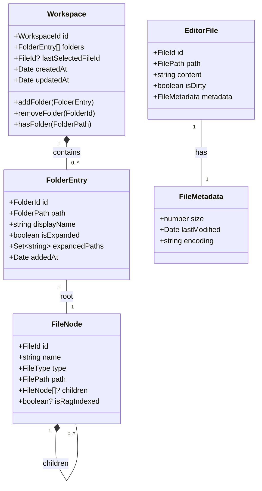

# ワークスペースマネージャー - データモデル設計書

## メタ情報

| 項目           | 内容                  |
| -------------- | --------------------- |
| ドキュメントID | DM-WS-001             |
| バージョン     | 1.0.0                 |
| 作成日         | 2025-12-11            |
| 作成者         | .claude/agents/domain-modeler.md       |
| ステータス     | ドラフト              |
| レビュー状態   | 未レビュー            |
| 関連文書       | FR-WS-001, NFR-WS-001 |

---

## 1. 概要

### 1.1 目的

ワークスペースマネージャー機能のドメインモデルをDDD原則に基づいて設計する。
状態管理（Zustand）とIPC通信で使用する型定義を明確化し、既存のFileNode型との関係を整理する。

### 1.2 設計原則

- **ユビキタス言語**: ドメイン用語をそのままコードに反映
- **型安全性**: TypeScript厳格モードでの型定義
- **不変性**: 値オブジェクトは不変に設計
- **単一責任**: 各型は明確な責務を持つ

### 1.3 ドメインモデル概要図



---

## 2. ドメイン概念の分類

### 2.1 Entity vs Value Object 分析

| 概念         | 分類         | 理由                                         |
| ------------ | ------------ | -------------------------------------------- |
| Workspace    | Entity       | ライフサイクルを持ち、IDで識別される         |
| FolderEntry  | Entity       | 追加/削除のライフサイクル、IDで識別          |
| FileNode     | Entity       | パスで一意に識別、ツリー構造のライフサイクル |
| EditorFile   | Entity       | 編集状態のライフサイクル、IDで識別           |
| FolderPath   | Value Object | パス文字列の値、不変、等価性は値で判断       |
| FilePath     | Value Object | パス文字列の値、不変                         |
| FileMetadata | Value Object | ファイルのメタ情報、不変のスナップショット   |

### 2.2 集約（Aggregate）設計

```
Workspace Aggregate
├── Workspace (Aggregate Root)
│   ├── WorkspaceId (Value Object)
│   └── FolderEntry[] (Entity)
│       ├── FolderId (Value Object)
│       ├── FolderPath (Value Object)
│       └── expandedPaths (Value Object)

Editor Aggregate
├── EditorFile (Aggregate Root)
│   ├── FileId (Value Object)
│   ├── FilePath (Value Object)
│   └── FileMetadata (Value Object)
```

---

## 3. 型定義

### 3.1 値オブジェクト（Value Objects）

#### 3.1.1 WorkspaceId

```typescript
/**
 * ワークスペースの一意識別子
 * @description 単一ワークスペースのため、固定値 "default" を使用
 */
export type WorkspaceId = "default";

export const DEFAULT_WORKSPACE_ID: WorkspaceId = "default";
```

#### 3.1.2 FolderId

```typescript
/**
 * フォルダエントリーの一意識別子
 * @description UUID v4形式、追加時に生成
 */
export type FolderId = string & { readonly __brand: "FolderId" };

export function createFolderId(): FolderId {
  return crypto.randomUUID() as FolderId;
}

export function isFolderId(value: string): value is FolderId {
  const uuidRegex =
    /^[0-9a-f]{8}-[0-9a-f]{4}-4[0-9a-f]{3}-[89ab][0-9a-f]{3}-[0-9a-f]{12}$/i;
  return uuidRegex.test(value);
}
```

#### 3.1.3 FolderPath

```typescript
/**
 * フォルダの絶対パス
 * @description macOSの絶対パス形式、正規化済み
 * @invariant "/" で始まる
 * @invariant 連続する "/" を含まない
 * @invariant パストラバーサル ("..") を含まない
 */
export type FolderPath = string & { readonly __brand: "FolderPath" };

export function createFolderPath(rawPath: string): FolderPath {
  const normalized = normalizePath(rawPath);
  validateFolderPath(normalized);
  return normalized as FolderPath;
}

function normalizePath(path: string): string {
  // パス正規化: 末尾スラッシュ除去、連続スラッシュ統一
  return path.replace(/\/+/g, "/").replace(/\/$/, "") || "/";
}

function validateFolderPath(path: string): void {
  if (!path.startsWith("/")) {
    throw new InvalidPathError(`パスは絶対パスである必要があります: ${path}`);
  }
  if (path.includes("..")) {
    throw new InvalidPathError(`パストラバーサルは許可されていません: ${path}`);
  }
}

export class InvalidPathError extends Error {
  constructor(message: string) {
    super(message);
    this.name = "InvalidPathError";
  }
}
```

#### 3.1.4 FilePath

```typescript
/**
 * ファイルの絶対パス
 * @description macOSの絶対パス形式
 */
export type FilePath = string & { readonly __brand: "FilePath" };

export function createFilePath(rawPath: string): FilePath {
  const normalized = normalizePath(rawPath);
  validateFilePath(normalized);
  return normalized as FilePath;
}

function validateFilePath(path: string): void {
  if (!path.startsWith("/")) {
    throw new InvalidPathError(
      `ファイルパスは絶対パスである必要があります: ${path}`,
    );
  }
  if (path.includes("..")) {
    throw new InvalidPathError(`パストラバーサルは許可されていません: ${path}`);
  }
}
```

#### 3.1.5 FileId

```typescript
/**
 * ファイルの一意識別子
 * @description ファイルの絶対パスをIDとして使用（既存FileNode互換）
 */
export type FileId = string & { readonly __brand: "FileId" };

export function createFileId(filePath: FilePath): FileId {
  return filePath as unknown as FileId;
}
```

#### 3.1.6 FileMetadata

```typescript
/**
 * ファイルのメタデータ
 * @description 不変のスナップショット
 */
export interface FileMetadata {
  readonly size: number;
  readonly lastModified: Date;
  readonly encoding: string;
}

export function createFileMetadata(
  size: number,
  lastModified: Date,
  encoding: string = "utf-8",
): FileMetadata {
  if (size < 0) {
    throw new Error("ファイルサイズは0以上である必要があります");
  }
  return Object.freeze({ size, lastModified, encoding });
}
```

---

### 3.2 エンティティ（Entities）

#### 3.2.1 FolderEntry

```typescript
/**
 * ワークスペースに追加されたフォルダのエントリー
 * @description フォルダの参照情報と表示状態を管理
 */
export interface FolderEntry {
  /** フォルダエントリーの一意識別子 */
  readonly id: FolderId;

  /** フォルダの絶対パス */
  readonly path: FolderPath;

  /** サイドバーに表示する名前（フォルダ名） */
  readonly displayName: string;

  /** フォルダが展開されているかどうか */
  isExpanded: boolean;

  /** 展開されているサブフォルダのパス一覧 */
  expandedPaths: Set<string>;

  /** ワークスペースへの追加日時 */
  readonly addedAt: Date;
}

export function createFolderEntry(path: FolderPath): FolderEntry {
  const displayName = path.split("/").pop() || path;
  return {
    id: createFolderId(),
    path,
    displayName,
    isExpanded: false,
    expandedPaths: new Set(),
    addedAt: new Date(),
  };
}
```

#### 3.2.2 FileNode（既存型の拡張）

```typescript
/**
 * ファイルツリーのノード
 * @description 既存のFileNode型を維持しつつ、ブランド型でより厳密に
 */
export type FileType = "file" | "folder";

export interface FileNode {
  /** ファイル/フォルダの一意識別子（パスベース） */
  readonly id: FileId;

  /** ファイル/フォルダ名 */
  readonly name: string;

  /** ノードの種類 */
  readonly type: FileType;

  /** 絶対パス */
  readonly path: FilePath;

  /** 子ノード（フォルダの場合のみ） */
  readonly children?: readonly FileNode[];

  /** RAGインデックス済みフラグ */
  readonly isRagIndexed?: boolean;
}
```

#### 3.2.3 EditorFile

```typescript
/**
 * エディターで開かれているファイル
 * @description 編集状態と内容を管理
 */
export interface EditorFile {
  /** ファイルID（パスベース） */
  readonly id: FileId;

  /** ファイルの絶対パス */
  readonly path: FilePath;

  /** ファイル内容 */
  content: string;

  /** 元の内容（比較用） */
  readonly originalContent: string;

  /** 未保存の変更があるか */
  readonly isDirty: boolean;

  /** ファイルメタデータ */
  readonly metadata: FileMetadata;
}

export function createEditorFile(
  path: FilePath,
  content: string,
  metadata: FileMetadata,
): EditorFile {
  return {
    id: createFileId(path),
    path,
    content,
    originalContent: content,
    isDirty: false,
    metadata,
  };
}

export function updateEditorContent(
  file: EditorFile,
  newContent: string,
): EditorFile {
  return {
    ...file,
    content: newContent,
    isDirty: newContent !== file.originalContent,
  };
}

export function markEditorAsSaved(file: EditorFile): EditorFile {
  return {
    ...file,
    originalContent: file.content,
    isDirty: false,
  };
}
```

---

### 3.3 集約（Aggregates）

#### 3.3.1 Workspace

```typescript
/**
 * ワークスペース集約
 * @description 複数のフォルダエントリーを管理する集約ルート
 * @invariant 同一パスのフォルダは重複して追加できない
 */
export interface Workspace {
  /** ワークスペースID（単一ワークスペースのため固定値） */
  readonly id: WorkspaceId;

  /** 追加されたフォルダ一覧 */
  readonly folders: readonly FolderEntry[];

  /** 最後に選択されていたファイルのID */
  readonly lastSelectedFileId: FileId | null;

  /** 作成日時 */
  readonly createdAt: Date;

  /** 更新日時 */
  readonly updatedAt: Date;
}

export function createWorkspace(): Workspace {
  const now = new Date();
  return {
    id: DEFAULT_WORKSPACE_ID,
    folders: [],
    lastSelectedFileId: null,
    createdAt: now,
    updatedAt: now,
  };
}

export function addFolderToWorkspace(
  workspace: Workspace,
  folderPath: FolderPath,
): Workspace {
  // 重複チェック
  if (workspace.folders.some((f) => f.path === folderPath)) {
    throw new DuplicateFolderError(folderPath);
  }

  const newEntry = createFolderEntry(folderPath);
  return {
    ...workspace,
    folders: [...workspace.folders, newEntry],
    updatedAt: new Date(),
  };
}

export function removeFolderFromWorkspace(
  workspace: Workspace,
  folderId: FolderId,
): Workspace {
  const filtered = workspace.folders.filter((f) => f.id !== folderId);
  if (filtered.length === workspace.folders.length) {
    throw new FolderNotFoundError(folderId);
  }

  return {
    ...workspace,
    folders: filtered,
    updatedAt: new Date(),
  };
}

export function updateFolderExpansion(
  workspace: Workspace,
  folderId: FolderId,
  isExpanded: boolean,
): Workspace {
  return {
    ...workspace,
    folders: workspace.folders.map((f) =>
      f.id === folderId ? { ...f, isExpanded } : f,
    ),
    updatedAt: new Date(),
  };
}

export function setLastSelectedFile(
  workspace: Workspace,
  fileId: FileId | null,
): Workspace {
  return {
    ...workspace,
    lastSelectedFileId: fileId,
    updatedAt: new Date(),
  };
}

// ドメインエラー
export class DuplicateFolderError extends Error {
  constructor(path: FolderPath) {
    super(`フォルダは既に追加されています: ${path}`);
    this.name = "DuplicateFolderError";
  }
}

export class FolderNotFoundError extends Error {
  constructor(id: FolderId) {
    super(`フォルダが見つかりません: ${id}`);
    this.name = "FolderNotFoundError";
  }
}
```

---

## 4. 永続化用シリアライズ形式

### 4.1 WorkspaceState（永続化用DTO）

```typescript
/**
 * ワークスペース状態の永続化形式
 * @description localStorage/electron-storeに保存する形式
 */
export interface PersistedWorkspaceState {
  /** スキーマバージョン（マイグレーション用） */
  version: 1;

  /** 追加されたフォルダ一覧 */
  folders: PersistedFolderEntry[];

  /** 最後に選択されていたファイルパス */
  lastSelectedFilePath: string | null;

  /** 最終更新日時 */
  updatedAt: string; // ISO 8601形式
}

export interface PersistedFolderEntry {
  /** フォルダID */
  id: string;

  /** フォルダの絶対パス */
  path: string;

  /** 表示名 */
  displayName: string;

  /** 展開状態 */
  isExpanded: boolean;

  /** 展開されているサブフォルダのパス一覧 */
  expandedPaths: string[];

  /** 追加日時 */
  addedAt: string; // ISO 8601形式
}
```

### 4.2 シリアライズ/デシリアライズ関数

```typescript
/**
 * Workspaceを永続化形式に変換
 */
export function serializeWorkspace(
  workspace: Workspace,
): PersistedWorkspaceState {
  return {
    version: 1,
    folders: workspace.folders.map((f) => ({
      id: f.id,
      path: f.path,
      displayName: f.displayName,
      isExpanded: f.isExpanded,
      expandedPaths: Array.from(f.expandedPaths),
      addedAt: f.addedAt.toISOString(),
    })),
    lastSelectedFilePath: workspace.lastSelectedFileId,
    updatedAt: workspace.updatedAt.toISOString(),
  };
}

/**
 * 永続化形式からWorkspaceを復元
 * @throws 存在しないパスは除外し、警告を返す
 */
export function deserializeWorkspace(persisted: PersistedWorkspaceState): {
  workspace: Workspace;
  warnings: string[];
} {
  const warnings: string[] = [];
  const folders: FolderEntry[] = [];

  for (const pf of persisted.folders) {
    try {
      const path = createFolderPath(pf.path);
      folders.push({
        id: pf.id as FolderId,
        path,
        displayName: pf.displayName,
        isExpanded: pf.isExpanded,
        expandedPaths: new Set(pf.expandedPaths),
        addedAt: new Date(pf.addedAt),
      });
    } catch (error) {
      warnings.push(`無効なパスをスキップしました: ${pf.path}`);
    }
  }

  const workspace: Workspace = {
    id: DEFAULT_WORKSPACE_ID,
    folders,
    lastSelectedFileId: persisted.lastSelectedFilePath as FileId | null,
    createdAt: new Date(),
    updatedAt: new Date(persisted.updatedAt),
  };

  return { workspace, warnings };
}
```

---

## 5. 既存型との関係

### 5.1 既存FileNode型との互換性

既存の`FileNode`型（`apps/desktop/src/preload/types.ts`）との互換性を維持:

```typescript
// 既存の型（preload/types.ts）
export interface FileNode {
  id: string;
  name: string;
  type: "file" | "folder";
  path: string;
  children?: FileNode[];
  isRagIndexed?: boolean;
}

// 新しいドメイン型との変換
export function toFileNode(domainNode: DomainFileNode): FileNode {
  return {
    id: domainNode.id,
    name: domainNode.name,
    type: domainNode.type,
    path: domainNode.path,
    children: domainNode.children?.map(toFileNode),
    isRagIndexed: domainNode.isRagIndexed,
  };
}

export function fromFileNode(node: FileNode): DomainFileNode {
  return {
    id: node.id as FileId,
    name: node.name,
    type: node.type,
    path: node.path as FilePath,
    children: node.children?.map(fromFileNode),
    isRagIndexed: node.isRagIndexed,
  };
}
```

### 5.2 EditorSliceとの関係

既存の`EditorSlice`を拡張してワークスペース機能を追加:

```typescript
// 既存のEditorSlice状態
interface EditorSlice {
  selectedFile: FileNode | null;
  fileTree: FileNode[];
  expandedFolders: Set<string>;
  editorContent: string;
  hasUnsavedChanges: boolean;
}

// 新しいWorkspaceSlice
interface WorkspaceSlice {
  // ワークスペース状態
  workspace: Workspace;
  isLoading: boolean;
  error: string | null;

  // アクション
  addFolder: (path: string) => Promise<void>;
  removeFolder: (folderId: FolderId) => void;
  toggleFolderExpansion: (folderId: FolderId) => void;
  loadWorkspace: () => Promise<void>;
  saveWorkspace: () => Promise<void>;
}
```

---

## 6. 用語集（ユビキタス言語）

| 用語               | 定義                                                           | コード表現                |
| ------------------ | -------------------------------------------------------------- | ------------------------- |
| ワークスペース     | 複数のフォルダをまとめて管理する論理的なコンテナ               | `Workspace`               |
| フォルダエントリー | ワークスペースに追加されたフォルダの参照情報                   | `FolderEntry`             |
| ファイルツリー     | フォルダの階層構造を表すツリーデータ                           | `FileNode[]`              |
| 展開状態           | フォルダが開いているか閉じているかの状態                       | `isExpanded`              |
| 未保存状態         | ファイルが編集されているが保存されていない状態                 | `isDirty`                 |
| 永続化             | アプリ再起動後も状態を復元できるようにストレージに保存すること | `PersistedWorkspaceState` |

---

## 7. 設計判断記録（ADR）

### ADR-001: 単一ワークスペース設計

**コンテキスト**: 複数ワークスペースの切り替えを実装するか、単一ワークスペースにするか

**決定**: 単一ワークスペース（`WorkspaceId = "default"`）

**理由**:

- ユーザー要件では複数ワークスペースの管理は不要
- 実装の複雑さを軽減
- 将来的に複数ワークスペースに拡張可能な設計は維持

### ADR-002: FileIdにパスを使用

**コンテキスト**: ファイルのIDをUUIDにするか、パスをそのまま使うか

**決定**: ファイルパスをIDとして使用（既存FileNode互換）

**理由**:

- 既存のfileHandlersとの互換性維持
- IPCでパスを渡す既存パターンに適合
- ファイルの同一性はパスで十分に識別可能

### ADR-003: ブランド型の採用

**コンテキスト**: 文字列のパスをそのまま使うか、ブランド型で厳密化するか

**決定**: ブランド型（`FolderPath`, `FilePath`）を採用

**理由**:

- 型レベルでの安全性向上
- パスバリデーションの強制
- 誤った型の混在を防止

---

## 8. 次フェーズへの引き継ぎ

### 8.1 T-01-2 (IPC API設計) への入力

- `Workspace`, `FolderEntry`, `FileNode` の型定義
- `PersistedWorkspaceState` のシリアライズ形式
- ドメインエラー型（`DuplicateFolderError`, `FolderNotFoundError`）

### 8.2 T-01-3 (UI設計) への入力

- `WorkspaceSlice` の状態とアクション定義
- `FolderEntry` の展開状態管理
- `EditorFile` の未保存状態管理

### 8.3 実装時の注意点

1. ブランド型のバリデーションはファクトリ関数で必ず実行
2. 永続化データの読み込み時は必ず`deserializeWorkspace`を使用
3. 存在しないパスへの対応（警告を表示して除外）を実装

---

## 変更履歴

| バージョン | 日付       | 変更者          | 変更内容                                      |
| ---------- | ---------- | --------------- | --------------------------------------------- |
| 1.0.0      | 2025-12-11 | .claude/agents/domain-modeler.md | 初版作成（DDD原則に基づくドメインモデル設計） |
