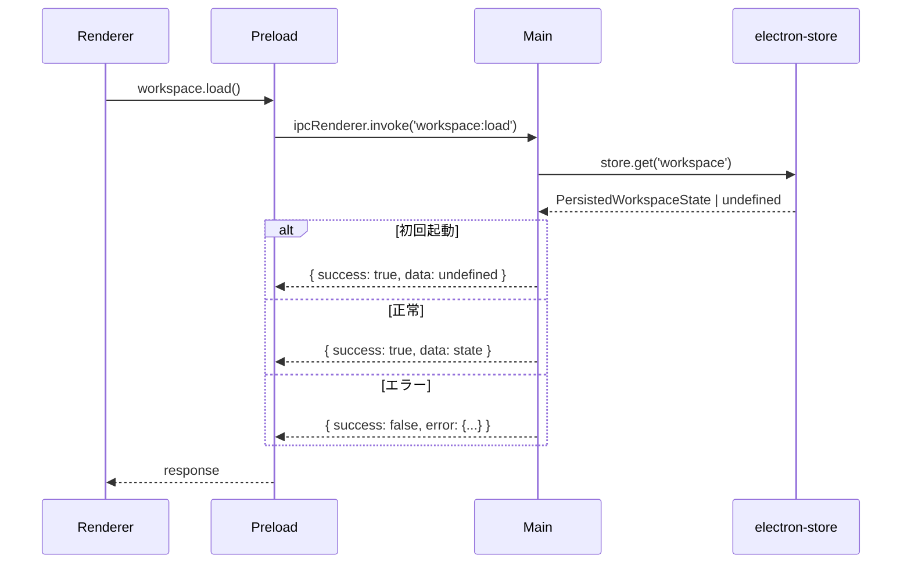
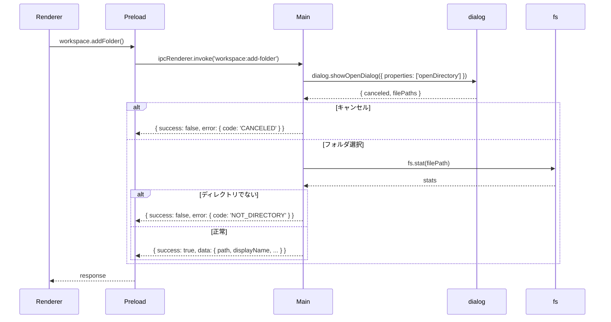
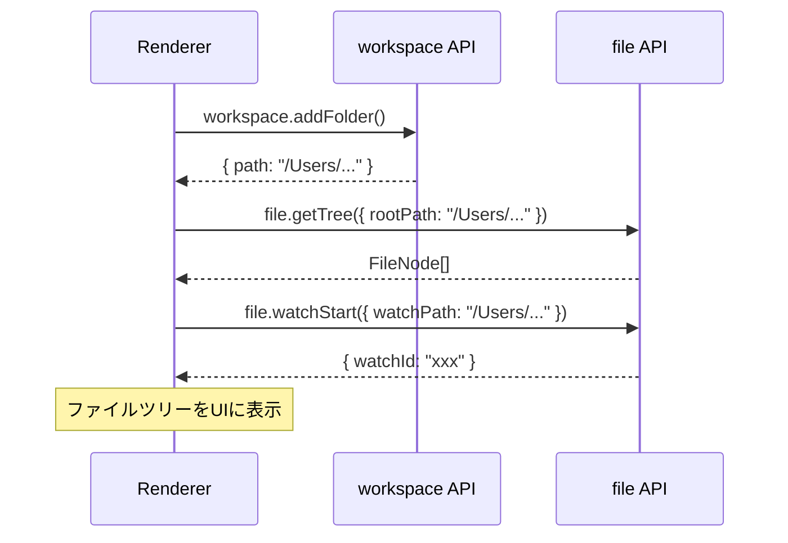

# ワークスペースマネージャー - IPC API設計書

## メタ情報

| 項目           | 内容                  |
| -------------- | --------------------- |
| ドキュメントID | IPC-WS-001            |
| バージョン     | 1.0.0                 |
| 作成日         | 2025-12-11            |
| 作成者         | .claude/agents/electron-architect.md   |
| ステータス     | ドラフト              |
| レビュー状態   | 未レビュー            |
| 関連文書       | DM-WS-001, NFR-WS-001 |

---

## 1. 概要

### 1.1 目的

ワークスペースマネージャー機能のMain-Renderer間IPC通信APIを設計する。
Electronのセキュリティベストプラクティスに従い、contextBridgeを通じたセキュアなAPIを定義する。

### 1.2 設計原則

- **contextIsolation**: `true` を維持
- **nodeIntegration**: `false` を維持
- **最小権限**: 必要最小限のAPIのみ公開
- **型安全**: TypeScriptによる厳密な型定義
- **統一パターン**: 既存のIPCパターンに従う

### 1.3 IPC通信アーキテクチャ

```
┌─────────────────────────────────────────────────────────────┐
│                    Renderer Process                          │
│  ┌─────────────────────────────────────────────────────────┐ │
│  │ WorkspaceSlice (Zustand)                                │ │
│  │   - workspace state                                      │ │
│  │   - addFolder() → window.electronAPI.workspace.addFolder │ │
│  └─────────────────────────────────────────────────────────┘ │
└─────────────────────────────────────────────────────────────┘
                              │
                    contextBridge API
                              │
┌─────────────────────────────────────────────────────────────┐
│                    Preload Script                            │
│  exposeInMainWorld('electronAPI', {                         │
│    workspace: {                                              │
│      load: () => invoke('workspace:load'),                   │
│      save: (state) => invoke('workspace:save', state),       │
│      addFolder: () => invoke('workspace:add-folder'),        │
│      ...                                                     │
│    }                                                         │
│  })                                                          │
└─────────────────────────────────────────────────────────────┘
                              │
                         IPC Channel
                              │
┌─────────────────────────────────────────────────────────────┐
│                    Main Process                              │
│  ┌─────────────────────────────────────────────────────────┐ │
│  │ workspaceHandlers.ts                                    │ │
│  │   - ipcMain.handle('workspace:load', ...)               │ │
│  │   - ipcMain.handle('workspace:save', ...)               │ │
│  │   - ipcMain.handle('workspace:add-folder', ...)         │ │
│  └─────────────────────────────────────────────────────────┘ │
│                              │                               │
│  ┌─────────────────────────────────────────────────────────┐ │
│  │ Infrastructure                                          │ │
│  │   - electron-store (永続化)                             │ │
│  │   - fs (ファイルシステム)                               │ │
│  │   - dialog (フォルダ選択)                               │ │
│  └─────────────────────────────────────────────────────────┘ │
└─────────────────────────────────────────────────────────────┘
```

---

## 2. IPCチャネル定義

### 2.1 チャネル一覧

```typescript
// 追加するチャネル定義
export const WORKSPACE_CHANNELS = {
  // ワークスペース操作
  WORKSPACE_LOAD: "workspace:load",
  WORKSPACE_SAVE: "workspace:save",
  WORKSPACE_ADD_FOLDER: "workspace:add-folder",
  WORKSPACE_REMOVE_FOLDER: "workspace:remove-folder",
  WORKSPACE_VALIDATE_PATHS: "workspace:validate-paths",

  // イベント（Main → Renderer）
  WORKSPACE_FOLDER_CHANGED: "workspace:folder-changed",
} as const;
```

### 2.2 チャネル詳細

| チャネル名                 | 方向            | 説明                                 |
| -------------------------- | --------------- | ------------------------------------ |
| `workspace:load`           | Renderer → Main | 永続化されたワークスペースを読み込む |
| `workspace:save`           | Renderer → Main | ワークスペース状態を永続化する       |
| `workspace:add-folder`     | Renderer → Main | フォルダ選択ダイアログを表示し追加   |
| `workspace:remove-folder`  | Renderer → Main | フォルダをワークスペースから削除     |
| `workspace:validate-paths` | Renderer → Main | パスの存在確認を行う                 |
| `workspace:folder-changed` | Main → Renderer | フォルダの外部変更を通知             |

---

## 3. API仕様

### 3.1 workspace:load

ワークスペース状態を永続化ストレージから読み込む。

#### リクエスト

```typescript
// リクエストペイロード: なし
type WorkspaceLoadRequest = void;
```

#### レスポンス

```typescript
interface WorkspaceLoadResponse {
  success: boolean;
  data?: PersistedWorkspaceState;
  error?: {
    code: "STORAGE_ERROR" | "PARSE_ERROR" | "UNKNOWN_ERROR";
    message: string;
  };
}
```

#### シーケンス図



---

### 3.2 workspace:save

ワークスペース状態を永続化ストレージに保存する。

#### リクエスト

```typescript
interface WorkspaceSaveRequest {
  state: PersistedWorkspaceState;
}
```

#### レスポンス

```typescript
interface WorkspaceSaveResponse {
  success: boolean;
  error?: {
    code: "VALIDATION_ERROR" | "STORAGE_ERROR" | "UNKNOWN_ERROR";
    message: string;
  };
}
```

#### バリデーション

- `state.version` が有効な数値であること
- `state.folders` が配列であること
- 各フォルダの `path` が有効な絶対パスであること

---

### 3.3 workspace:add-folder

ネイティブフォルダ選択ダイアログを表示し、選択されたフォルダを返す。

#### リクエスト

```typescript
// リクエストペイロード: なし
type WorkspaceAddFolderRequest = void;
```

#### レスポンス

```typescript
interface WorkspaceAddFolderResponse {
  success: boolean;
  data?: {
    path: string;
    displayName: string;
    exists: boolean;
    isDirectory: boolean;
  };
  error?: {
    code: "CANCELED" | "ACCESS_DENIED" | "NOT_DIRECTORY" | "UNKNOWN_ERROR";
    message: string;
  };
}
```

#### シーケンス図



---

### 3.4 workspace:remove-folder

ワークスペースからフォルダを削除する（ファイルシステムには影響しない）。

#### リクエスト

```typescript
interface WorkspaceRemoveFolderRequest {
  folderId: string;
}
```

#### レスポンス

```typescript
interface WorkspaceRemoveFolderResponse {
  success: boolean;
  error?: {
    code: "NOT_FOUND" | "UNKNOWN_ERROR";
    message: string;
  };
}
```

---

### 3.5 workspace:validate-paths

指定されたパスの存在確認を行う。アプリ起動時の復元で使用。

#### リクエスト

```typescript
interface WorkspaceValidatePathsRequest {
  paths: string[];
}
```

#### レスポンス

```typescript
interface WorkspaceValidatePathsResponse {
  success: boolean;
  data?: {
    validPaths: string[];
    invalidPaths: Array<{
      path: string;
      reason: "NOT_FOUND" | "NOT_DIRECTORY" | "ACCESS_DENIED";
    }>;
  };
  error?: {
    code: "UNKNOWN_ERROR";
    message: string;
  };
}
```

---

### 3.6 workspace:folder-changed（イベント）

ファイルシステムの変更を監視し、Rendererに通知する。

#### イベントペイロード

```typescript
interface WorkspaceFolderChangedEvent {
  folderId: string;
  eventType: "add" | "change" | "unlink" | "addDir" | "unlinkDir";
  filePath: string;
  timestamp: Date;
}
```

---

## 4. 型定義

### 4.1 preload/types.ts への追加

```typescript
// ===== Workspace operations =====

export interface WorkspaceLoadResponse {
  success: boolean;
  data?: PersistedWorkspaceState;
  error?: {
    code: "STORAGE_ERROR" | "PARSE_ERROR" | "UNKNOWN_ERROR";
    message: string;
  };
}

export interface WorkspaceSaveRequest {
  state: PersistedWorkspaceState;
}

export interface WorkspaceSaveResponse {
  success: boolean;
  error?: {
    code: "VALIDATION_ERROR" | "STORAGE_ERROR" | "UNKNOWN_ERROR";
    message: string;
  };
}

export interface WorkspaceAddFolderResponse {
  success: boolean;
  data?: {
    path: string;
    displayName: string;
    exists: boolean;
    isDirectory: boolean;
  };
  error?: {
    code: "CANCELED" | "ACCESS_DENIED" | "NOT_DIRECTORY" | "UNKNOWN_ERROR";
    message: string;
  };
}

export interface WorkspaceRemoveFolderRequest {
  folderId: string;
}

export interface WorkspaceRemoveFolderResponse {
  success: boolean;
  error?: {
    code: "NOT_FOUND" | "UNKNOWN_ERROR";
    message: string;
  };
}

export interface WorkspaceValidatePathsRequest {
  paths: string[];
}

export interface WorkspaceValidatePathsResponse {
  success: boolean;
  data?: {
    validPaths: string[];
    invalidPaths: Array<{
      path: string;
      reason: "NOT_FOUND" | "NOT_DIRECTORY" | "ACCESS_DENIED";
    }>;
  };
  error?: {
    code: "UNKNOWN_ERROR";
    message: string;
  };
}

export interface WorkspaceFolderChangedEvent {
  folderId: string;
  eventType: "add" | "change" | "unlink" | "addDir" | "unlinkDir";
  filePath: string;
  timestamp: Date;
}

export interface PersistedWorkspaceState {
  version: 1;
  folders: PersistedFolderEntry[];
  lastSelectedFilePath: string | null;
  updatedAt: string;
}

export interface PersistedFolderEntry {
  id: string;
  path: string;
  displayName: string;
  isExpanded: boolean;
  expandedPaths: string[];
  addedAt: string;
}
```

### 4.2 ElectronAPI への追加

```typescript
export interface ElectronAPI {
  // ... existing APIs ...

  workspace: {
    load: () => Promise<WorkspaceLoadResponse>;
    save: (request: WorkspaceSaveRequest) => Promise<WorkspaceSaveResponse>;
    addFolder: () => Promise<WorkspaceAddFolderResponse>;
    removeFolder: (
      request: WorkspaceRemoveFolderRequest,
    ) => Promise<WorkspaceRemoveFolderResponse>;
    validatePaths: (
      request: WorkspaceValidatePathsRequest,
    ) => Promise<WorkspaceValidatePathsResponse>;
    onFolderChanged: (
      callback: (event: WorkspaceFolderChangedEvent) => void,
    ) => () => void;
  };
}
```

---

## 5. preload/channels.ts への追加

```typescript
export const IPC_CHANNELS = {
  // ... existing channels ...

  // Workspace operations
  WORKSPACE_LOAD: "workspace:load",
  WORKSPACE_SAVE: "workspace:save",
  WORKSPACE_ADD_FOLDER: "workspace:add-folder",
  WORKSPACE_REMOVE_FOLDER: "workspace:remove-folder",
  WORKSPACE_VALIDATE_PATHS: "workspace:validate-paths",
  WORKSPACE_FOLDER_CHANGED: "workspace:folder-changed",
} as const;

// ALLOWED_INVOKE_CHANNELS への追加
export const ALLOWED_INVOKE_CHANNELS: readonly string[] = [
  // ... existing channels ...
  IPC_CHANNELS.WORKSPACE_LOAD,
  IPC_CHANNELS.WORKSPACE_SAVE,
  IPC_CHANNELS.WORKSPACE_ADD_FOLDER,
  IPC_CHANNELS.WORKSPACE_REMOVE_FOLDER,
  IPC_CHANNELS.WORKSPACE_VALIDATE_PATHS,
];

// ALLOWED_ON_CHANNELS への追加
export const ALLOWED_ON_CHANNELS: readonly string[] = [
  // ... existing channels ...
  IPC_CHANNELS.WORKSPACE_FOLDER_CHANGED,
];
```

---

## 6. エラーハンドリング

### 6.1 エラーコード体系

| カテゴリ         | エラーコード       | 説明                       |
| ---------------- | ------------------ | -------------------------- |
| ユーザー操作     | `CANCELED`         | ユーザーが操作をキャンセル |
| ファイルシステム | `NOT_FOUND`        | パスが存在しない           |
| ファイルシステム | `NOT_DIRECTORY`    | パスがディレクトリでない   |
| ファイルシステム | `ACCESS_DENIED`    | アクセス権限がない         |
| ストレージ       | `STORAGE_ERROR`    | 永続化ストレージのエラー   |
| バリデーション   | `VALIDATION_ERROR` | 入力データの検証エラー     |
| パース           | `PARSE_ERROR`      | データのパースエラー       |
| その他           | `UNKNOWN_ERROR`    | 予期しないエラー           |

### 6.2 エラーレスポンス例

```typescript
// キャンセル
{
  success: false,
  error: {
    code: "CANCELED",
    message: "フォルダ選択がキャンセルされました"
  }
}

// パスが存在しない
{
  success: false,
  error: {
    code: "NOT_FOUND",
    message: "指定されたパスが見つかりません: /Users/user/deleted-folder"
  }
}

// バリデーションエラー
{
  success: false,
  error: {
    code: "VALIDATION_ERROR",
    message: "無効なワークスペース状態: version が不正です"
  }
}
```

---

## 7. セキュリティ検証

### 7.1 入力バリデーション

#### パスバリデーション

```typescript
function validatePath(path: string): ValidationResult {
  // 空文字チェック
  if (!path || path.trim() === "") {
    return { valid: false, error: "パスが空です" };
  }

  // 絶対パスチェック
  if (!path.startsWith("/")) {
    return { valid: false, error: "絶対パスである必要があります" };
  }

  // パストラバーサルチェック
  if (path.includes("..")) {
    return { valid: false, error: "パストラバーサルは許可されていません" };
  }

  // NULL文字チェック
  if (path.includes("\0")) {
    return { valid: false, error: "無効な文字が含まれています" };
  }

  return { valid: true };
}
```

#### ワークスペース状態バリデーション

```typescript
function validateWorkspaceState(state: unknown): ValidationResult {
  if (!state || typeof state !== "object") {
    return { valid: false, error: "無効なオブジェクト" };
  }

  const ws = state as PersistedWorkspaceState;

  // バージョンチェック
  if (ws.version !== 1) {
    return { valid: false, error: "無効なバージョン" };
  }

  // フォルダ配列チェック
  if (!Array.isArray(ws.folders)) {
    return { valid: false, error: "folders は配列である必要があります" };
  }

  // 各フォルダのバリデーション
  for (const folder of ws.folders) {
    const pathResult = validatePath(folder.path);
    if (!pathResult.valid) {
      return pathResult;
    }
  }

  return { valid: true };
}
```

### 7.2 アクセス制御

```typescript
// ワークスペースに登録されたパス以下のみアクセス可能
function isPathAccessible(
  targetPath: string,
  workspaceFolders: string[],
): boolean {
  const normalizedTarget = path.normalize(targetPath);

  return workspaceFolders.some((folderPath) => {
    const normalizedFolder = path.normalize(folderPath);
    return (
      normalizedTarget === normalizedFolder ||
      normalizedTarget.startsWith(normalizedFolder + path.sep)
    );
  });
}
```

---

## 8. 実装ガイド

### 8.1 ファイル構成

```
apps/desktop/src/
├── main/
│   └── ipc/
│       └── workspaceHandlers.ts    # 新規作成
├── preload/
│   ├── channels.ts                 # 追加
│   ├── types.ts                    # 追加
│   └── index.ts                    # 追加
└── renderer/
    └── store/
        └── slices/
            └── workspaceSlice.ts   # 新規作成
```

### 8.2 workspaceHandlers.ts の雛形

```typescript
import { ipcMain, dialog } from "electron";
import * as fs from "fs/promises";
import * as path from "path";
import Store from "electron-store";
import { IPC_CHANNELS } from "../../preload/channels";
import type {
  WorkspaceSaveRequest,
  WorkspaceRemoveFolderRequest,
  WorkspaceValidatePathsRequest,
  PersistedWorkspaceState,
} from "../../preload/types";

const store = new Store<{ workspace: PersistedWorkspaceState }>();

export function registerWorkspaceHandlers(): void {
  // workspace:load
  ipcMain.handle(IPC_CHANNELS.WORKSPACE_LOAD, async () => {
    try {
      const state = store.get("workspace");
      return { success: true, data: state };
    } catch (error) {
      return {
        success: false,
        error: {
          code: "STORAGE_ERROR",
          message: error instanceof Error ? error.message : "Unknown error",
        },
      };
    }
  });

  // workspace:save
  ipcMain.handle(
    IPC_CHANNELS.WORKSPACE_SAVE,
    async (_event, request: WorkspaceSaveRequest) => {
      // バリデーション
      const validation = validateWorkspaceState(request.state);
      if (!validation.valid) {
        return {
          success: false,
          error: { code: "VALIDATION_ERROR", message: validation.error },
        };
      }

      try {
        store.set("workspace", request.state);
        return { success: true };
      } catch (error) {
        return {
          success: false,
          error: {
            code: "STORAGE_ERROR",
            message: error instanceof Error ? error.message : "Unknown error",
          },
        };
      }
    },
  );

  // workspace:add-folder
  ipcMain.handle(IPC_CHANNELS.WORKSPACE_ADD_FOLDER, async () => {
    try {
      const result = await dialog.showOpenDialog({
        properties: ["openDirectory"],
        title: "フォルダを選択",
      });

      if (result.canceled || result.filePaths.length === 0) {
        return {
          success: false,
          error: {
            code: "CANCELED",
            message: "フォルダ選択がキャンセルされました",
          },
        };
      }

      const folderPath = result.filePaths[0];
      const stats = await fs.stat(folderPath);

      if (!stats.isDirectory()) {
        return {
          success: false,
          error: {
            code: "NOT_DIRECTORY",
            message: "選択されたパスはディレクトリではありません",
          },
        };
      }

      return {
        success: true,
        data: {
          path: folderPath,
          displayName: path.basename(folderPath),
          exists: true,
          isDirectory: true,
        },
      };
    } catch (error) {
      if ((error as NodeJS.ErrnoException).code === "EACCES") {
        return {
          success: false,
          error: {
            code: "ACCESS_DENIED",
            message: "アクセス権限がありません",
          },
        };
      }
      return {
        success: false,
        error: {
          code: "UNKNOWN_ERROR",
          message: error instanceof Error ? error.message : "Unknown error",
        },
      };
    }
  });

  // workspace:validate-paths
  ipcMain.handle(
    IPC_CHANNELS.WORKSPACE_VALIDATE_PATHS,
    async (_event, request: WorkspaceValidatePathsRequest) => {
      const validPaths: string[] = [];
      const invalidPaths: Array<{
        path: string;
        reason: "NOT_FOUND" | "NOT_DIRECTORY" | "ACCESS_DENIED";
      }> = [];

      for (const p of request.paths) {
        try {
          const stats = await fs.stat(p);
          if (stats.isDirectory()) {
            validPaths.push(p);
          } else {
            invalidPaths.push({ path: p, reason: "NOT_DIRECTORY" });
          }
        } catch (error) {
          const code = (error as NodeJS.ErrnoException).code;
          if (code === "ENOENT") {
            invalidPaths.push({ path: p, reason: "NOT_FOUND" });
          } else if (code === "EACCES") {
            invalidPaths.push({ path: p, reason: "ACCESS_DENIED" });
          } else {
            invalidPaths.push({ path: p, reason: "NOT_FOUND" });
          }
        }
      }

      return { success: true, data: { validPaths, invalidPaths } };
    },
  );
}
```

### 8.3 preload/index.ts への追加

```typescript
workspace: {
  load: () => ipcRenderer.invoke(IPC_CHANNELS.WORKSPACE_LOAD),
  save: (request: WorkspaceSaveRequest) =>
    ipcRenderer.invoke(IPC_CHANNELS.WORKSPACE_SAVE, request),
  addFolder: () => ipcRenderer.invoke(IPC_CHANNELS.WORKSPACE_ADD_FOLDER),
  removeFolder: (request: WorkspaceRemoveFolderRequest) =>
    ipcRenderer.invoke(IPC_CHANNELS.WORKSPACE_REMOVE_FOLDER, request),
  validatePaths: (request: WorkspaceValidatePathsRequest) =>
    ipcRenderer.invoke(IPC_CHANNELS.WORKSPACE_VALIDATE_PATHS, request),
  onFolderChanged: (callback: (event: WorkspaceFolderChangedEvent) => void) => {
    const handler = (_event: IpcRendererEvent, data: WorkspaceFolderChangedEvent) => {
      callback(data);
    };
    ipcRenderer.on(IPC_CHANNELS.WORKSPACE_FOLDER_CHANGED, handler);
    return () => ipcRenderer.removeListener(IPC_CHANNELS.WORKSPACE_FOLDER_CHANGED, handler);
  },
},
```

---

## 9. 既存APIとの統合

### 9.1 既存file APIとの関係

| 既存API            | 用途                 | ワークスペースとの関係        |
| ------------------ | -------------------- | ----------------------------- |
| `file:get-tree`    | フォルダのツリー取得 | 各FolderEntryに対して呼び出す |
| `file:read`        | ファイル読み込み     | 変更なし、そのまま使用        |
| `file:write`       | ファイル書き込み     | 変更なし、そのまま使用        |
| `file:watch-start` | ファイル監視開始     | FolderEntry追加時に呼び出す   |
| `file:watch-stop`  | ファイル監視停止     | FolderEntry削除時に呼び出す   |

### 9.2 統合フロー



---

## 10. 次フェーズへの引き継ぎ

### 10.1 T-01-3 (UI設計) への入力

- `ElectronAPI.workspace` のAPI仕様
- レスポンス型定義
- エラーハンドリングパターン

### 10.2 T-03 (TDD実装) への入力

- IPCハンドラーの実装雛形
- バリデーション関数の仕様
- テストケースの観点（正常系、異常系、セキュリティ）

### 10.3 実装時の注意点

1. `registerWorkspaceHandlers()` は `main/ipc/index.ts` から呼び出す
2. electron-storeのスキーマ定義を適切に設定する
3. パスバリデーションは必ず実行する
4. エラーレスポンスは統一フォーマットに従う

---

## 変更履歴

| バージョン | 日付       | 変更者              | 変更内容                                       |
| ---------- | ---------- | ------------------- | ---------------------------------------------- |
| 1.0.0      | 2025-12-11 | .claude/agents/electron-architect.md | 初版作成（6つのIPCチャネル、セキュリティ設計） |
