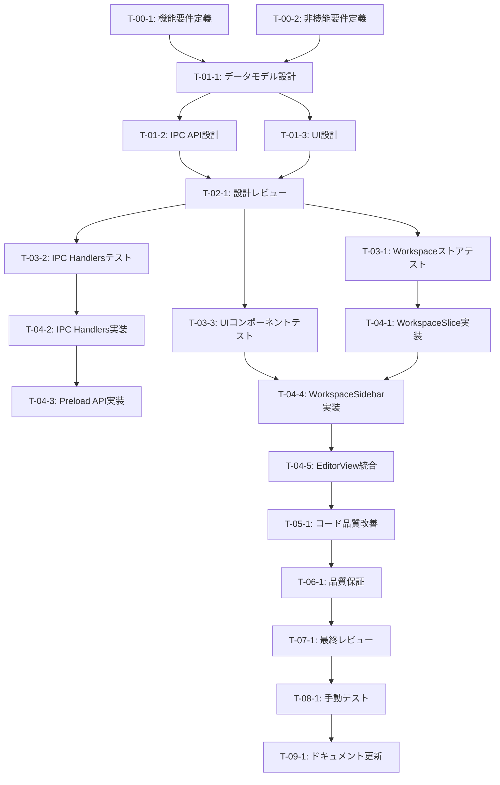

# ワークスペースマネージャー - タスク実行仕様書

## ユーザーからの元の指示

```
Mac上にある指定のフォルダを参照すると、その指定のフォルダを開いて、このシステム上で開けるようなものにしたい。
いわゆるエディターのような役割の形にしたい。

このアプリ上であくまでも指定のフォルダを開きに行くだけであって、このシステム上で保存をしているわけではない。
ただし、このアプリを閉じたとしても再度同じようなフォルダを開いている状態の状態保存、状態維持はするようにしてほしい。

かつ、全然関係のない依存関係のないフォルダも開けるようにしたい。
現状、指定したフォルダに関してはそれの階層の全てのフォルダをここで見れるようにする。
かつ、それとはプラスアルファでさらに指定のフォルダやディレクトリも開けるような形で管理したい。

このシステムではRAGのデータを保存して、ここのやり取り、このシステム上でその保存した情報と合わせてやり取りをする成果物を生成するというようなシステムを構築したい。
なので、一つのフォルダ配下にある情報だけではなく、複数のフォルダを対象にしたい。

複数のフォルダに保存されているものもあるので、そこも参照できるようにしたい。
ただし、これはあくまでも開くエディターであって、ここでシステム上に保存するわけではない。
```

## メタ情報

| 項目             | 内容                                                  |
| ---------------- | ----------------------------------------------------- |
| タスクID         | TASK-WS-001                                           |
| タスク名         | ワークスペースマネージャー機能                        |
| 分類             | 新規機能                                              |
| 対象機能         | Electronデスクトップアプリ - ファイルエクスプローラー |
| 優先度           | 高                                                    |
| 見積もり規模     | 中規模                                                |
| ステータス       | 未実施                                                |
| 発見元           | ユーザー要望                                          |
| 発見日           | 2025-12-11                                            |
| 発見エージェント | -                                                     |

---

## タスク概要

### 目的

Mac上の任意のフォルダを複数同時に開き、ファイルツリーとして表示・編集できる「ワークスペースマネージャー」機能を実装する。
VSCodeのマルチルートワークスペースに類似した機能で、複数の独立したフォルダを単一のワークスペースで管理できるようにする。

### 背景

現在のシステムでは単一のフォルダしか開けない。RAGデータと連携して複数のフォルダからの情報を活用した成果物生成が必要なため、複数フォルダの同時参照・編集機能が求められている。

### 最終ゴール

1. 複数の独立したフォルダを単一ワークスペースに追加可能
2. 各フォルダの階層構造をサイドバーで表示
3. ファイルの閲覧・編集・保存が可能（元のファイルシステムに保存）
4. アプリ再起動後もワークスペース状態を復元
5. 将来的なRAG連携の基盤となる

### 成果物一覧

| 種別         | 成果物                             | 配置先                                          |
| ------------ | ---------------------------------- | ----------------------------------------------- |
| 機能         | WorkspaceSlice（状態管理）         | apps/desktop/src/renderer/store/slices/         |
| 機能         | WorkspaceSidebar（コンポーネント） | apps/desktop/src/renderer/components/organisms/ |
| 機能         | IPC Handlers（メインプロセス）     | apps/desktop/src/main/ipc/                      |
| 機能         | Preload API定義                    | apps/desktop/src/preload/                       |
| ドキュメント | 要件定義書                         | docs/30-workflows/workspace-manager/            |
| 品質         | ユニットテスト                     | apps/desktop/src/test/                          |

---

## 参照ファイル

本仕様書のコマンド・エージェント・スキル選定は以下を参照：

- `docs/00-requirements/master_system_design.md` - システム要件
- `.claude/commands/ai/command_list.md` - /ai:コマンド定義
- `.claude/agents/agent_list.md` - エージェント定義
- `.claude/skills/skill_list.md` - スキル定義

---

## タスク分解サマリー

| ID     | フェーズ | サブタスク名           | 責務                                   | 依存                   |
| ------ | -------- | ---------------------- | -------------------------------------- | ---------------------- |
| T-00-1 | Phase 0  | 機能要件定義           | ワークスペース機能の機能要件を定義     | -                      |
| T-00-2 | Phase 0  | 非機能要件定義         | パフォーマンス・セキュリティ要件を定義 | -                      |
| T-01-1 | Phase 1  | データモデル設計       | Workspace/FolderEntry型の設計          | T-00-1, T-00-2         |
| T-01-2 | Phase 1  | IPC API設計            | Main-Renderer間のAPI設計               | T-01-1                 |
| T-01-3 | Phase 1  | UI設計                 | サイドバーUI/UX設計                    | T-01-1                 |
| T-02-1 | Phase 2  | 設計レビュー           | 全設計の妥当性検証                     | T-01-1, T-01-2, T-01-3 |
| T-03-1 | Phase 3  | Workspaceストアテスト  | WorkspaceSliceのテスト作成             | T-02-1                 |
| T-03-2 | Phase 3  | IPC Handlersテスト     | IPCハンドラーのテスト作成              | T-02-1                 |
| T-03-3 | Phase 3  | UIコンポーネントテスト | WorkspaceSidebarのテスト作成           | T-02-1                 |
| T-04-1 | Phase 4  | WorkspaceSlice実装     | Zustand状態管理の実装                  | T-03-1                 |
| T-04-2 | Phase 4  | IPC Handlers実装       | ファイルシステムAPI実装                | T-03-2                 |
| T-04-3 | Phase 4  | Preload API実装        | contextBridge設定                      | T-04-2                 |
| T-04-4 | Phase 4  | WorkspaceSidebar実装   | UIコンポーネント実装                   | T-03-3, T-04-1         |
| T-04-5 | Phase 4  | EditorView統合         | 既存EditorViewへの統合                 | T-04-4                 |
| T-05-1 | Phase 5  | コード品質改善         | リファクタリング                       | T-04-5                 |
| T-06-1 | Phase 6  | 品質保証               | テスト実行・Lint・型チェック           | T-05-1                 |
| T-07-1 | Phase 7  | 最終レビュー           | コード・アーキテクチャレビュー         | T-06-1                 |
| T-08-1 | Phase 8  | 手動テスト             | UI/UX手動検証                          | T-07-1                 |
| T-09-1 | Phase 9  | ドキュメント更新       | システムドキュメント反映               | T-08-1                 |

**総サブタスク数**: 18個

---

## 実行フロー図



---

## Phase 0: 要件定義

### T-00-1: 機能要件定義

#### 目的

ワークスペースマネージャー機能の機能要件を明確に定義する。

#### 背景

ユーザーの要望を具体的な機能要件に変換し、実装可能な形にする必要がある。

#### 責務（単一責務）

機能要件の定義と文書化

#### Claude Code スラッシュコマンド

> ⚠️ 以下はターミナルコマンドではなく、Claude Code内で実行するスラッシュコマンドです

```
/ai:gather-requirements workspace-manager
```

- **参照**: `.claude/commands/ai/command_list.md`

#### 使用エージェント

- **エージェント**: @req-analyst
- **選定理由**: 要求工学の専門家として、曖昧な要望を検証可能な要件に変換する
- **参照**: `.claude/agents/agent_list.md`

#### 活用スキル

| スキル名                    | 活用方法                                |
| --------------------------- | --------------------------------------- |
| requirements-engineering    | MoSCoW優先度による要件分類              |
| use-case-modeling           | ユースケースシナリオの作成              |
| acceptance-criteria-writing | Given-When-Then形式での受け入れ基準定義 |

- **参照**: `.claude/skills/skill_list.md`

#### 成果物

| 成果物     | パス                                                                         | 内容         |
| ---------- | ---------------------------------------------------------------------------- | ------------ |
| 機能要件書 | docs/30-workflows/workspace-manager/task-step00-1-functional-requirements.md | 機能要件一覧 |

#### 完了条件

- [ ] ワークスペース管理の機能要件が定義されている
- [ ] フォルダ追加/削除のユースケースが定義されている
- [ ] ファイル操作（閲覧/編集/保存）の要件が定義されている
- [ ] 状態永続化の要件が定義されている
- [ ] 受け入れ基準がGiven-When-Then形式で記載されている

#### 依存関係

- **前提**: なし
- **後続**: T-01-1

---

### T-00-2: 非機能要件定義

#### 目的

パフォーマンス・セキュリティ・ユーザビリティの非機能要件を定義する。

#### 背景

ファイルシステムアクセスを伴う機能のため、セキュリティとパフォーマンスの要件を明確にする必要がある。

#### 責務（単一責務）

非機能要件の定義と文書化

#### Claude Code スラッシュコマンド

> ⚠️ 以下はターミナルコマンドではなく、Claude Code内で実行するスラッシュコマンドです

```
/ai:gather-requirements workspace-manager-nfr
```

- **参照**: `.claude/commands/ai/command_list.md`

#### 使用エージェント

- **エージェント**: @req-analyst
- **選定理由**: 非機能要件の体系的な定義が可能
- **参照**: `.claude/agents/agent_list.md`

#### 活用スキル

| スキル名                               | 活用方法                 |
| -------------------------------------- | ------------------------ |
| functional-non-functional-requirements | FURPS+品質モデルでの分類 |

- **参照**: `.claude/skills/skill_list.md`

#### 成果物

| 成果物       | パス                                                                             | 内容           |
| ------------ | -------------------------------------------------------------------------------- | -------------- |
| 非機能要件書 | docs/30-workflows/workspace-manager/task-step00-2-non-functional-requirements.md | 非機能要件一覧 |

#### 完了条件

- [ ] パフォーマンス要件（ファイルツリー表示速度等）が定義されている
- [ ] セキュリティ要件（パストラバーサル防止等）が定義されている
- [ ] ユーザビリティ要件が定義されている
- [ ] 測定可能な目標値が設定されている

#### 依存関係

- **前提**: なし
- **後続**: T-01-1

---

## Phase 1: 設計

### T-01-1: データモデル設計

#### 目的

ワークスペースとフォルダエントリーのデータモデルを設計する。

#### 背景

状態管理とIPCで使用する型定義が必要。既存のFileNode型を活用しつつ拡張する。

#### 責務（単一責務）

TypeScript型定義とデータ構造の設計

#### Claude Code スラッシュコマンド

> ⚠️ 以下はターミナルコマンドではなく、Claude Code内で実行するスラッシュコマンドです

```
/ai:design-domain-model workspace
```

- **参照**: `.claude/commands/ai/command_list.md`

#### 使用エージェント

- **エージェント**: @domain-modeler
- **選定理由**: DDD原則に基づくドメインモデル設計の専門家
- **参照**: `.claude/agents/agent_list.md`

#### 活用スキル

| スキル名             | 活用方法                           |
| -------------------- | ---------------------------------- |
| domain-driven-design | エンティティと値オブジェクトの設計 |
| type-safety-patterns | TypeScript厳格モードでの型定義     |

- **参照**: `.claude/skills/skill_list.md`

#### 成果物

| 成果物             | パス                                                            | 内容             |
| ------------------ | --------------------------------------------------------------- | ---------------- |
| データモデル設計書 | docs/30-workflows/workspace-manager/task-step01-1-data-model.md | 型定義と設計理由 |

#### 完了条件

- [ ] Workspace型が定義されている
- [ ] FolderEntry型が定義されている
- [ ] 既存FileNode型との関係が明確化されている
- [ ] 永続化用のシリアライズ形式が定義されている

#### 依存関係

- **前提**: T-00-1, T-00-2
- **後続**: T-01-2, T-01-3

---

### T-01-2: IPC API設計

#### 目的

Main-Renderer間のIPC通信APIを設計する。

#### 背景

Electronのセキュリティベストプラクティスに従い、contextBridgeを通じたセキュアなAPIが必要。

#### 責務（単一責務）

IPCチャネルとAPI仕様の設計

#### Claude Code スラッシュコマンド

> ⚠️ 以下はターミナルコマンドではなく、Claude Code内で実行するスラッシュコマンドです

```
/ai:design-api workspace-ipc
```

- **参照**: `.claude/commands/ai/command_list.md`

#### 使用エージェント

- **エージェント**: @electron-architect
- **選定理由**: ElectronのIPC設計に精通
- **参照**: `.claude/agents/agent_list.md`

#### 活用スキル

| スキル名                         | 活用方法                         |
| -------------------------------- | -------------------------------- |
| electron-architecture            | IPC通信パターン（invoke/handle） |
| api-documentation-best-practices | API仕様の明確な文書化            |

- **参照**: `.claude/skills/skill_list.md`

#### 成果物

| 成果物        | パス                                                         | 内容            |
| ------------- | ------------------------------------------------------------ | --------------- |
| IPC API設計書 | docs/30-workflows/workspace-manager/task-step01-2-ipc-api.md | IPCチャネル仕様 |

#### 完了条件

- [ ] IPCチャネル名が定義されている
- [ ] 各APIのリクエスト/レスポンス型が定義されている
- [ ] エラーハンドリング仕様が定義されている
- [ ] セキュリティ検証方法が定義されている

#### 依存関係

- **前提**: T-01-1
- **後続**: T-02-1

---

### T-01-3: UI設計

#### 目的

ワークスペースサイドバーのUI/UXを設計する。

#### 背景

既存のSidebarコンポーネントを拡張し、複数フォルダ対応にする必要がある。

#### 責務（単一責務）

UIコンポーネントとインタラクションの設計

#### Claude Code スラッシュコマンド

> ⚠️ 以下はターミナルコマンドではなく、Claude Code内で実行するスラッシュコマンドです

```
/ai:create-component WorkspaceSidebar organism
```

- **参照**: `.claude/commands/ai/command_list.md`

#### 使用エージェント

- **エージェント**: @ui-designer
- **選定理由**: モジュラー設計原則に基づくUI設計の専門家
- **参照**: `.claude/agents/agent_list.md`

#### 活用スキル

| スキル名                       | 活用方法                         |
| ------------------------------ | -------------------------------- |
| component-composition-patterns | Compound Componentパターンの適用 |
| accessibility-wcag             | WCAG準拠のアクセシビリティ設計   |
| tailwind-css-patterns          | Tailwind CSSでのスタイリング     |

- **参照**: `.claude/skills/skill_list.md`

#### 成果物

| 成果物   | パス                                                           | 内容                 |
| -------- | -------------------------------------------------------------- | -------------------- |
| UI設計書 | docs/30-workflows/workspace-manager/task-step01-3-ui-design.md | UIモックアップと仕様 |

#### 完了条件

- [ ] コンポーネント階層が設計されている
- [ ] インタラクションフローが定義されている
- [ ] アクセシビリティ要件が満たされている
- [ ] 既存コンポーネントとの統合方法が明確化されている

#### 依存関係

- **前提**: T-01-1
- **後続**: T-02-1

---

## Phase 2: 設計レビューゲート

### T-02-1: 設計レビュー

#### 目的

実装開始前に要件・設計の妥当性を複数エージェントで検証する。

#### 背景

設計ミスが実装後に発見されると修正コストが大幅に増加するため、早期検出が重要。

#### レビュー参加エージェント

| エージェント       | レビュー観点         | 選定理由                                       |
| ------------------ | -------------------- | ---------------------------------------------- |
| @req-analyst       | 要件充足性           | 要件が明確かつ検証可能か確認                   |
| @arch-police       | アーキテクチャ整合性 | Clean Architectureレイヤー違反がないか確認     |
| @electron-security | セキュリティ設計     | Electronセキュリティベストプラクティス準拠確認 |
| @ui-designer       | UI/UX設計            | ユーザビリティとアクセシビリティ確認           |

- **参照**: `.claude/agents/agent_list.md`

#### レビューチェックリスト

**要件充足性** (@req-analyst)

- [ ] 要件が明確かつ検証可能か
- [ ] スコープが適切に定義されているか
- [ ] 受け入れ基準が具体的か

**アーキテクチャ整合性** (@arch-police)

- [ ] クリーンアーキテクチャのレイヤー違反がないか
- [ ] 依存関係逆転の原則(DIP)が守られているか
- [ ] 既存設計との整合性があるか

**セキュリティ設計** (@electron-security)

- [ ] パストラバーサル攻撃対策が設計されているか
- [ ] IPC通信のセキュリティが確保されているか
- [ ] contextIsolationが維持されているか

**UI/UX設計** (@ui-designer)

- [ ] アクセシビリティ（WCAG）準拠か
- [ ] 既存UIとの一貫性があるか
- [ ] エラーフィードバックが適切か

#### レビュー結果

- **判定**: (レビュー実施後に記入)
- **指摘事項**: (レビュー実施後に記入)
- **対応方針**: (レビュー実施後に記入)

#### 戻り先決定（MAJORの場合）

| 問題の種類 | 戻り先                    |
| ---------- | ------------------------- |
| 要件の問題 | Phase 0（要件定義）へ戻る |
| 設計の問題 | Phase 1（設計）へ戻る     |
| 両方の問題 | Phase 0（要件定義）へ戻る |

#### 完了条件

- [ ] 全レビュー観点でPASSまたはMINOR判定
- [ ] MINOR指摘事項への対応完了
- [ ] 次フェーズへの進行承認

#### 依存関係

- **前提**: T-01-1, T-01-2, T-01-3
- **後続**: T-03-1, T-03-2, T-03-3

---

## Phase 3: テスト作成 (TDD: Red)

### T-03-1: Workspaceストアテスト

#### 目的

WorkspaceSliceの期待動作を検証するテストを作成する。

#### 背景

TDD原則に従い、実装前にテストを作成することで仕様を明確化する。

#### 責務（単一責務）

WorkspaceSliceのユニットテスト作成

#### Claude Code スラッシュコマンド

> ⚠️ 以下はターミナルコマンドではなく、Claude Code内で実行するスラッシュコマンドです

```
/ai:generate-unit-tests apps/desktop/src/renderer/store/slices/workspaceSlice.ts
```

- **参照**: `.claude/commands/ai/command_list.md`

#### 使用エージェント

- **エージェント**: @unit-tester
- **選定理由**: TDD原則に基づくテスト作成の専門家
- **参照**: `.claude/agents/agent_list.md`

#### 活用スキル

| スキル名                | 活用方法                   |
| ----------------------- | -------------------------- |
| tdd-principles          | Red-Green-Refactorサイクル |
| boundary-value-analysis | 境界値テストケース設計     |
| test-doubles            | Zustandストアのモック      |

- **参照**: `.claude/skills/skill_list.md`

#### 成果物

| 成果物         | パス                                               | 内容                   |
| -------------- | -------------------------------------------------- | ---------------------- |
| テストファイル | apps/desktop/src/test/store/workspaceSlice.test.ts | ストアのユニットテスト |

#### TDD検証: Red状態確認

```bash
pnpm --filter @repo/desktop test:run -- workspaceSlice
```

- [ ] テストが失敗することを確認（Red状態）

#### 完了条件

- [ ] フォルダ追加のテストケースが作成されている
- [ ] フォルダ削除のテストケースが作成されている
- [ ] 状態永続化のテストケースが作成されている
- [ ] テストがRed状態（失敗）であることを確認

#### 依存関係

- **前提**: T-02-1
- **後続**: T-04-1

---

### T-03-2: IPC Handlersテスト

#### 目的

IPCハンドラーの期待動作を検証するテストを作成する。

#### 背景

ファイルシステム操作のセキュリティと正確性を保証するテストが必要。

#### 責務（単一責務）

IPCハンドラーのユニットテスト作成

#### Claude Code スラッシュコマンド

> ⚠️ 以下はターミナルコマンドではなく、Claude Code内で実行するスラッシュコマンドです

```
/ai:generate-unit-tests apps/desktop/src/main/ipc/workspaceHandlers.ts
```

- **参照**: `.claude/commands/ai/command_list.md`

#### 使用エージェント

- **エージェント**: @unit-tester
- **選定理由**: ファイルシステム操作のテスト設計に精通
- **参照**: `.claude/agents/agent_list.md`

#### 活用スキル

| スキル名                | 活用方法                 |
| ----------------------- | ------------------------ |
| test-doubles            | ファイルシステムのモック |
| boundary-value-analysis | パス検証の境界値テスト   |

- **参照**: `.claude/skills/skill_list.md`

#### 成果物

| 成果物         | パス                                                 | 内容                  |
| -------------- | ---------------------------------------------------- | --------------------- |
| テストファイル | apps/desktop/src/test/main/workspaceHandlers.test.ts | IPCハンドラーのテスト |

#### TDD検証: Red状態確認

```bash
pnpm --filter @repo/desktop test:run -- workspaceHandlers
```

- [ ] テストが失敗することを確認（Red状態）

#### 完了条件

- [ ] フォルダ選択ダイアログのテストが作成されている
- [ ] ファイルツリー取得のテストが作成されている
- [ ] セキュリティ検証（パストラバーサル防止）のテストが作成されている
- [ ] テストがRed状態（失敗）であることを確認

#### 依存関係

- **前提**: T-02-1
- **後続**: T-04-2

---

### T-03-3: UIコンポーネントテスト

#### 目的

WorkspaceSidebarコンポーネントの期待動作を検証するテストを作成する。

#### 背景

UIコンポーネントの正しいレンダリングとインタラクションを保証する。

#### 責務（単一責務）

WorkspaceSidebarのコンポーネントテスト作成

#### Claude Code スラッシュコマンド

> ⚠️ 以下はターミナルコマンドではなく、Claude Code内で実行するスラッシュコマンドです

```
/ai:generate-component-tests apps/desktop/src/renderer/components/organisms/WorkspaceSidebar
```

- **参照**: `.claude/commands/ai/command_list.md`

#### 使用エージェント

- **エージェント**: @frontend-tester
- **選定理由**: React Testing Libraryによるコンポーネントテストの専門家
- **参照**: `.claude/agents/agent_list.md`

#### 活用スキル

| スキル名        | 活用方法                       |
| --------------- | ------------------------------ |
| vitest-advanced | Vitestでのコンポーネントテスト |
| test-doubles    | IPC APIのモック                |

- **参照**: `.claude/skills/skill_list.md`

#### 成果物

| 成果物         | パス                                                       | 内容                 |
| -------------- | ---------------------------------------------------------- | -------------------- |
| テストファイル | apps/desktop/src/test/components/WorkspaceSidebar.test.tsx | コンポーネントテスト |

#### TDD検証: Red状態確認

```bash
pnpm --filter @repo/desktop test:run -- WorkspaceSidebar
```

- [ ] テストが失敗することを確認（Red状態）

#### 完了条件

- [ ] フォルダリストのレンダリングテストが作成されている
- [ ] フォルダ追加ボタンのインタラクションテストが作成されている
- [ ] アクセシビリティテストが作成されている
- [ ] テストがRed状態（失敗）であることを確認

#### 依存関係

- **前提**: T-02-1
- **後続**: T-04-4

---

## Phase 4: 実装 (TDD: Green)

### T-04-1: WorkspaceSlice実装

#### 目的

Zustandを使用したワークスペース状態管理を実装する。

#### 背景

複数フォルダの状態管理と永続化が必要。既存のEditorSliceパターンを参考にする。

#### 責務（単一責務）

WorkspaceSliceの実装

#### Claude Code スラッシュコマンド

> ⚠️ 以下はターミナルコマンドではなく、Claude Code内で実行するスラッシュコマンドです

```
/ai:setup-state-management workspace
```

- **参照**: `.claude/commands/ai/command_list.md`

#### 使用エージェント

- **エージェント**: @state-manager
- **選定理由**: React状態管理の専門家
- **参照**: `.claude/agents/agent_list.md`

#### 活用スキル

| スキル名                 | 活用方法                   |
| ------------------------ | -------------------------- |
| data-fetching-strategies | 非同期データフェッチの管理 |
| custom-hooks-patterns    | ロジックの再利用           |

- **参照**: `.claude/skills/skill_list.md`

#### 成果物

| 成果物       | パス                                                     | 内容              |
| ------------ | -------------------------------------------------------- | ----------------- |
| 実装ファイル | apps/desktop/src/renderer/store/slices/workspaceSlice.ts | Workspaceスライス |

#### TDD検証: Green状態確認

```bash
pnpm --filter @repo/desktop test:run -- workspaceSlice
```

- [ ] テストが成功することを確認（Green状態）

#### 完了条件

- [ ] フォルダ追加機能が実装されている
- [ ] フォルダ削除機能が実装されている
- [ ] 状態永続化（localStorage）が実装されている
- [ ] テストがGreen状態（成功）であることを確認

#### 依存関係

- **前提**: T-03-1
- **後続**: T-04-4

---

### T-04-2: IPC Handlers実装

#### 目的

ファイルシステム操作のIPCハンドラーを実装する。

#### 背景

セキュアなファイルシステムアクセスをMainプロセスで提供する必要がある。

#### 責務（単一責務）

IPCハンドラーの実装

#### Claude Code スラッシュコマンド

> ⚠️ 以下はターミナルコマンドではなく、Claude Code内で実行するスラッシュコマンドです

```
/ai:implement-business-logic workspace-ipc-handlers
```

- **参照**: `.claude/commands/ai/command_list.md`

#### 使用エージェント

- **エージェント**: @electron-architect
- **選定理由**: Electron Main/Renderer間通信の専門家
- **参照**: `.claude/agents/agent_list.md`

#### 活用スキル

| スキル名              | 活用方法             |
| --------------------- | -------------------- |
| electron-architecture | IPC通信パターン      |
| input-sanitization    | パス検証とサニタイズ |

- **参照**: `.claude/skills/skill_list.md`

#### 成果物

| 成果物       | パス                                           | 内容          |
| ------------ | ---------------------------------------------- | ------------- |
| 実装ファイル | apps/desktop/src/main/ipc/workspaceHandlers.ts | IPCハンドラー |

#### TDD検証: Green状態確認

```bash
pnpm --filter @repo/desktop test:run -- workspaceHandlers
```

- [ ] テストが成功することを確認（Green状態）

#### 完了条件

- [ ] フォルダ選択ダイアログAPIが実装されている
- [ ] ファイルツリー取得APIが実装されている
- [ ] ワークスペース状態永続化APIが実装されている
- [ ] パストラバーサル防止が実装されている
- [ ] テストがGreen状態（成功）であることを確認

#### 依存関係

- **前提**: T-03-2
- **後続**: T-04-3

---

### T-04-3: Preload API実装

#### 目的

contextBridgeを通じたセキュアなAPI公開を実装する。

#### 背景

RendererプロセスからMainプロセスAPIへの安全なアクセスを提供する。

#### 責務（単一責務）

Preload APIの実装

#### Claude Code スラッシュコマンド

> ⚠️ 以下はターミナルコマンドではなく、Claude Code内で実行するスラッシュコマンドです

```
/ai:secure-electron-app ipc
```

- **参照**: `.claude/commands/ai/command_list.md`

#### 使用エージェント

- **エージェント**: @electron-security
- **選定理由**: Electronセキュリティ強化の専門家
- **参照**: `.claude/agents/agent_list.md`

#### 活用スキル

| スキル名                    | 活用方法          |
| --------------------------- | ----------------- |
| electron-security-hardening | contextBridge設定 |

- **参照**: `.claude/skills/skill_list.md`

#### 成果物

| 成果物       | パス                                  | 内容        |
| ------------ | ------------------------------------- | ----------- |
| 実装ファイル | apps/desktop/src/preload/workspace.ts | Preload API |

#### 完了条件

- [ ] workspace.selectFolder APIが公開されている
- [ ] workspace.getState / workspace.setState APIが公開されている
- [ ] 型定義が更新されている

#### 依存関係

- **前提**: T-04-2
- **後続**: T-04-4

---

### T-04-4: WorkspaceSidebar実装

#### 目的

複数フォルダを表示するサイドバーUIを実装する。

#### 背景

既存のSidebarコンポーネントを拡張し、マルチルートワークスペースに対応させる。

#### 責務（単一責務）

WorkspaceSidebarコンポーネントの実装

#### Claude Code スラッシュコマンド

> ⚠️ 以下はターミナルコマンドではなく、Claude Code内で実行するスラッシュコマンドです

```
/ai:create-component WorkspaceSidebar organism
```

- **参照**: `.claude/commands/ai/command_list.md`

#### 使用エージェント

- **エージェント**: @ui-designer
- **選定理由**: モジュラーUIコンポーネント設計の専門家
- **参照**: `.claude/agents/agent_list.md`

#### 活用スキル

| スキル名                       | 活用方法                   |
| ------------------------------ | -------------------------- |
| component-composition-patterns | Compound Componentパターン |
| accessibility-wcag             | ARIA属性の適用             |
| tailwind-css-patterns          | スタイリング               |

- **参照**: `.claude/skills/skill_list.md`

#### 成果物

| 成果物       | パス                                                                      | 内容             |
| ------------ | ------------------------------------------------------------------------- | ---------------- |
| 実装ファイル | apps/desktop/src/renderer/components/organisms/WorkspaceSidebar/index.tsx | UIコンポーネント |

#### TDD検証: Green状態確認

```bash
pnpm --filter @repo/desktop test:run -- WorkspaceSidebar
```

- [ ] テストが成功することを確認（Green状態）

#### 完了条件

- [ ] フォルダリストが表示される
- [ ] フォルダ追加ボタンが機能する
- [ ] フォルダの展開/折りたたみが機能する
- [ ] ファイル選択が機能する
- [ ] アクセシビリティ（キーボード操作）が機能する
- [ ] テストがGreen状態（成功）であることを確認

#### 依存関係

- **前提**: T-03-3, T-04-1
- **後続**: T-04-5

---

### T-04-5: EditorView統合

#### 目的

WorkspaceSidebarを既存のEditorViewに統合する。

#### 背景

既存のUIフローに自然に組み込む必要がある。

#### 責務（単一責務）

EditorViewへの統合

#### Claude Code スラッシュコマンド

> ⚠️ 以下はターミナルコマンドではなく、Claude Code内で実行するスラッシュコマンドです

```
/ai:refactor apps/desktop/src/renderer/views/EditorView/index.tsx
```

- **参照**: `.claude/commands/ai/command_list.md`

#### 使用エージェント

- **エージェント**: @router-dev
- **選定理由**: ページ/レイアウト実装の専門家
- **参照**: `.claude/agents/agent_list.md`

#### 活用スキル

| スキル名             | 活用方法         |
| -------------------- | ---------------- |
| clean-code-practices | 既存コードの拡張 |

- **参照**: `.claude/skills/skill_list.md`

#### 成果物

| 成果物       | パス                                                 | 内容               |
| ------------ | ---------------------------------------------------- | ------------------ |
| 更新ファイル | apps/desktop/src/renderer/views/EditorView/index.tsx | 統合済みEditorView |

#### 完了条件

- [ ] WorkspaceSidebarがEditorViewに統合されている
- [ ] 既存のSidebarが置き換えられている
- [ ] ファイル選択時にエディターが更新される
- [ ] レスポンシブレイアウトが維持されている

#### 依存関係

- **前提**: T-04-4
- **後続**: T-05-1

---

## Phase 5: リファクタリング (TDD: Refactor)

### T-05-1: コード品質改善

#### 目的

動作を変えずにコード品質を改善する。

#### 背景

TDDのRefactorフェーズとして、コードの可読性と保守性を向上させる。

#### 責務（単一責務）

コード品質の改善

#### Claude Code スラッシュコマンド

> ⚠️ 以下はターミナルコマンドではなく、Claude Code内で実行するスラッシュコマンドです

```
/ai:analyze-code-quality apps/desktop/src
```

- **参照**: `.claude/commands/ai/command_list.md`

#### 使用エージェント

- **エージェント**: @code-quality
- **選定理由**: コード品質管理の専門家
- **参照**: `.claude/agents/agent_list.md`

#### 活用スキル

| スキル名               | 活用方法                 |
| ---------------------- | ------------------------ |
| refactoring-techniques | Extract Method、命名改善 |
| clean-code-practices   | 可読性向上               |

- **参照**: `.claude/skills/skill_list.md`

#### 成果物

| 成果物                     | パス              | 内容               |
| -------------------------- | ----------------- | ------------------ |
| リファクタリング済みコード | apps/desktop/src/ | 品質改善済みソース |

#### TDD検証: 継続Green確認

```bash
pnpm --filter @repo/desktop test:run
```

- [ ] リファクタリング後もテストが成功することを確認

#### 完了条件

- [ ] 重複コードが排除されている
- [ ] 関数/変数名が明確である
- [ ] 複雑度が適切なレベルに保たれている
- [ ] テストが継続して成功している

#### 依存関係

- **前提**: T-04-5
- **後続**: T-06-1

---

## Phase 6: 品質保証

### T-06-1: 品質保証

#### 目的

定義された品質基準をすべて満たすことを検証する。

#### 背景

本番リリース前に品質ゲートをクリアする必要がある。

#### 責務（単一責務）

品質基準の検証

#### Claude Code スラッシュコマンド

> ⚠️ 以下はターミナルコマンドではなく、Claude Code内で実行するスラッシュコマンドです

```
/ai:run-all-tests --coverage
```

- **参照**: `.claude/commands/ai/command_list.md`

#### 使用エージェント

- **エージェント**: @code-quality
- **選定理由**: 品質検証の専門家
- **参照**: `.claude/agents/agent_list.md`

#### 活用スキル

| スキル名             | 活用方法             |
| -------------------- | -------------------- |
| static-analysis      | 複雑度メトリクス評価 |
| eslint-configuration | Lintルール適用       |

- **参照**: `.claude/skills/skill_list.md`

#### 成果物

| 成果物       | パス                                                              | 内容         |
| ------------ | ----------------------------------------------------------------- | ------------ |
| 品質レポート | docs/30-workflows/workspace-manager/task-step06-quality-report.md | 品質検証結果 |

#### 完了条件

- [ ] 全ユニットテスト成功
- [ ] Lintエラーなし
- [ ] 型エラーなし
- [ ] コードフォーマット適用済み
- [ ] カバレッジ基準達成（80%以上）

#### 依存関係

- **前提**: T-05-1
- **後続**: T-07-1

---

## 品質ゲートチェックリスト

### 機能検証

- [ ] 全ユニットテスト成功
- [ ] 全統合テスト成功
- [ ] 全E2Eテスト成功

### コード品質

- [ ] Lintエラーなし
- [ ] 型エラーなし
- [ ] コードフォーマット適用済み

### テスト網羅性

- [ ] カバレッジ基準達成（80%以上）

### セキュリティ

- [ ] パストラバーサル防止が検証済み
- [ ] IPC通信のセキュリティが検証済み

---

## Phase 7: 最終レビューゲート

### T-07-1: 最終レビュー

#### 目的

実装完了後、ドキュメント更新前に全体的な品質・整合性を検証する。

#### 背景

Phase 6の自動検証だけでは検出できない設計判断やベストプラクティス違反を確認する。

#### レビュー参加エージェント

| エージェント       | レビュー観点       | 選定理由                     |
| ------------------ | ------------------ | ---------------------------- |
| @code-quality      | コード品質         | コーディング規約準拠確認     |
| @arch-police       | アーキテクチャ遵守 | レイヤー依存関係確認         |
| @unit-tester       | テスト品質         | テストカバレッジ・設計確認   |
| @electron-security | セキュリティ       | Electronセキュリティ設定確認 |

- **参照**: `.claude/agents/agent_list.md`

#### レビューチェックリスト

**コード品質** (@code-quality)

- [ ] コーディング規約への準拠
- [ ] 可読性・保守性の確保
- [ ] 適切なエラーハンドリング
- [ ] 過度な複雑性の有無

**アーキテクチャ遵守** (@arch-police)

- [ ] 実装がアーキテクチャ設計に従っているか
- [ ] レイヤー間の依存関係が適切か
- [ ] SOLID原則への準拠

**テスト品質** (@unit-tester)

- [ ] テストカバレッジが十分か
- [ ] テストケースが適切に設計されているか
- [ ] 境界値・異常系のテストがあるか

**セキュリティ** (@electron-security)

- [ ] IPC通信のセキュリティ
- [ ] contextIsolationの維持
- [ ] パストラバーサル対策

#### レビュー結果

- **判定**: (レビュー実施後に記入)
- **指摘事項**: (レビュー実施後に記入)
- **対応方針**: (レビュー実施後に記入)
- **未完了タスク数**: (レビュー実施後に記入)

#### 戻り先決定（MAJOR/CRITICALの場合）

| 問題の種類       | 戻り先                            |
| ---------------- | --------------------------------- |
| 要件の問題       | Phase 0（要件定義）へ戻る         |
| 設計の問題       | Phase 1（設計）へ戻る             |
| テスト設計の問題 | Phase 3（テスト作成）へ戻る       |
| 実装の問題       | Phase 4（実装）へ戻る             |
| コード品質の問題 | Phase 5（リファクタリング）へ戻る |

#### エスカレーション条件

- 戻り先の判断が困難な場合
- 複数フェーズにまたがる問題の場合
- 要件自体の見直しが必要な場合

#### 完了条件

- [ ] 全レビュー観点でPASSまたはMINOR判定
- [ ] MINOR指摘事項への対応完了
- [ ] 次フェーズへの進行承認

#### 依存関係

- **前提**: T-06-1
- **後続**: T-08-1

---

## Phase 8: 手動テスト検証

### T-08-1: 手動テスト

#### 目的

自動テストでは検証できないユーザー体験・UI/UXを手動で確認する。

#### 背景

実際のユーザー視点での品質を担保する。

#### テスト分類

機能テスト、UI/UXテスト

#### 使用エージェント

- **エージェント**: @e2e-tester
- **選定理由**: E2Eテスト/手動テストの専門家
- **参照**: `.claude/agents/agent_list.md`

#### 手動テストケース

| No  | カテゴリ | テスト項目     | 前提条件           | 操作手順                                                                   | 期待結果                             | 実行結果 | 備考 |
| --- | -------- | -------------- | ------------------ | -------------------------------------------------------------------------- | ------------------------------------ | -------- | ---- |
| 1   | 機能     | フォルダ追加   | アプリ起動済み     | 1.「フォルダを追加」ボタンをクリック 2.フォルダを選択 3.「開く」をクリック | フォルダがサイドバーに追加される     |          |      |
| 2   | 機能     | フォルダ削除   | フォルダが追加済み | 1.フォルダ名を右クリック 2.「削除」を選択                                  | フォルダがサイドバーから削除される   |          |      |
| 3   | 機能     | ファイル表示   | フォルダが追加済み | 1.フォルダを展開 2.ファイルをクリック                                      | ファイル内容がエディターに表示される |          |      |
| 4   | 機能     | ファイル編集   | ファイルが表示済み | 1.エディターで内容を編集 2.保存（Cmd+S）                                   | ファイルが保存される                 |          |      |
| 5   | 機能     | 状態復元       | フォルダが追加済み | 1.アプリを終了 2.アプリを再起動                                            | 同じフォルダが開いた状態で復元される |          |      |
| 6   | UI/UX    | キーボード操作 | フォルダが追加済み | 1.Tab/矢印キーで移動 2.Enterで選択/展開                                    | キーボードのみで操作可能             |          |      |
| 7   | UI/UX    | レスポンシブ   | フォルダが追加済み | 1.ウィンドウサイズを変更                                                   | レイアウトが適切に調整される         |          |      |
| 8   | 異常系   | 無効パス       | なし               | 1.存在しないパスを直接指定                                                 | エラーメッセージが表示される         |          |      |

#### 成果物

| 成果物         | パス                                                           | 内容           |
| -------------- | -------------------------------------------------------------- | -------------- |
| 手動テスト結果 | docs/30-workflows/workspace-manager/task-step08-manual-test.md | テスト実行結果 |

#### 完了条件

- [ ] すべての手動テストケースが実行済み
- [ ] すべてのテストケースがPASS
- [ ] 発見された不具合が修正済みまたは記録済み

#### 依存関係

- **前提**: T-07-1
- **後続**: T-09-1

---

## Phase 9: ドキュメント更新・未完了タスク記録

### T-09-1: ドキュメント更新

#### 目的

実装した内容をシステム要件ドキュメントに反映する。

#### 前提条件

- [ ] Phase 6の品質ゲートをすべて通過
- [ ] Phase 7の最終レビューゲートを通過
- [ ] Phase 8の手動テストが完了
- [ ] すべてのテストが成功

---

#### サブタスク 9.1: システムドキュメント更新

##### 更新対象ドキュメント

- `docs/00-requirements/04-directory-structure.md` - 新規ファイル追加
- `docs/00-requirements/05-architecture.md` - WorkspaceSlice追加
- `docs/00-requirements/06-core-interfaces.md` - Workspace型追加

##### Claude Code スラッシュコマンド

> ⚠️ 以下はターミナルコマンドではなく、Claude Code内で実行するスラッシュコマンドです

```
/ai:update-all-docs
```

- **参照**: `.claude/commands/ai/command_list.md`

##### 使用エージェント

- **エージェント**: @spec-writer
- **選定理由**: テクニカルドキュメント作成の専門家
- **参照**: `.claude/agents/agent_list.md`

##### 更新原則

- 概要のみ記載（詳細な実装説明は不要）
- システム構築に必要十分な情報のみ追記
- 既存ドキュメントの構造・フォーマットを維持
- Single Source of Truth原則を遵守

---

#### サブタスク 9.2: 未完了タスク・追加タスク記録

##### 出力先

`docs/30-workflows/unassigned-task/`

##### 記録対象タスク一覧

(レビューで発見された場合に記録)

##### ファイル命名規則

- 要件系: `requirements-{{機能領域}}.md`
- 改善系: `task-{{改善領域}}-improvements.md`

---

#### 完了条件

- [ ] 関連ドキュメントが更新されている
- [ ] 未完了タスクが記録されている
- [ ] 変更がコミットされている

---

## リスクと対策

| リスク                             | 影響度 | 発生確率 | 対策                                     | 対応サブタスク |
| ---------------------------------- | ------ | -------- | ---------------------------------------- | -------------- |
| パストラバーサル攻撃               | 高     | 中       | パス検証の厳格化、サンドボックス         | T-04-2         |
| 大量ファイルでのパフォーマンス低下 | 中     | 高       | 遅延読み込み、仮想スクロール             | T-04-4         |
| 状態永続化の破損                   | 中     | 低       | スキーマバージョニング、マイグレーション | T-04-1         |
| 既存UIとの統合問題                 | 低     | 中       | 段階的統合、フィーチャーフラグ           | T-04-5         |

---

## 前提条件

- Electronデスクトップアプリが動作可能な状態
- 既存のEditorView、Sidebarコンポーネントが存在
- Zustandストアが設定済み
- ファイルシステムIPC（FILE_GET_TREE等）が実装済み

---

## 備考

### 技術的制約

- macOS対応が優先（Windows/Linuxは将来対応）
- node_modules等の大規模ディレクトリは除外
- ファイルサイズ上限は10MB（既存制約を維持）

### 参考資料

- VSCode Multi-root Workspaces: https://code.visualstudio.com/docs/editor/multi-root-workspaces
- Electron Security Guidelines: https://www.electronjs.org/docs/latest/tutorial/security
