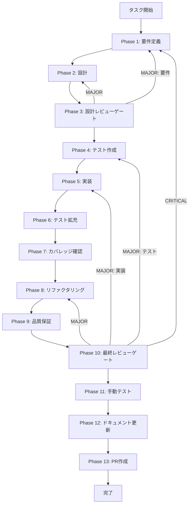

# database-optimization - タスク実行仕様書

## ユーザーからの元の指示

```
チャット履歴データベーススキーマの最適化を行い、インデックス追加、
CASCADE動作の明示、CHECK制約追加、messageCountの扱い判断、
パフォーマンスベンチマークの実施までを行う。
```

## メタ情報

| 項目         | 内容                                |
| ------------ | ----------------------------------- |
| タスクID     | DB-001                              |
| タスク名     | database-optimization               |
| 分類         | パフォーマンス                      |
| 対象機能     | chat-history（データベース層）      |
| 優先度       | 高                                  |
| 見積もり規模 | 小規模（1週間）                     |
| ステータス   | 未実施                              |
| 作成日       | 2026-01-18                          |
| 発見元       | Phase 7（最終レビューゲート）       |
| 依存タスク   | chat-history-persistence（Phase 7） |

---

## タスク概要

### 目的

チャット履歴のデータベーススキーマを最適化し、クエリ性能とデータ整合性を同時に向上させる。

### 背景

最終レビューで、chat_messagesの外部キーインデックス不足、CASCADE動作未定義、message_countの冗長保持が確認された。データ量増加時の性能劣化と整合性リスクを抑えるため、スキーマとマイグレーションの再設計が必要になった。

### 最終ゴール

- 外部キーインデックスが追加され、クエリプランでIndex Scanが確認できる
- onDelete動作が明文化され、削除時の整合性が保証される
- role等のCHECK制約方針が決定され、実装またはアプリケーション層で担保される
- message_countの保持/削除判断がベンチマーク結果と一緒に記録される
- ベンチマーク結果で性能改善が確認される

### スコープ

#### 含むもの

- chat_sessions / chat_messages のインデックス追加
- onDelete動作の設計と実装方針決定
- CHECK制約（role等）の設計と担保
- 論理削除対応の部分インデックス
- message_countの削除可否の判断
- マイグレーション計画とロールバック方針
- パフォーマンスベンチマーク

#### 含まないもの

- テーブル構造の大幅変更
- 新規テーブルの追加
- FTS導入や検索アルゴリズムの変更
- レプリケーション設定変更

### 成果物一覧

| 種別             | 成果物                    | 配置先                                |
| ---------------- | ------------------------- | ------------------------------------- |
| マイグレーション | スキーマ最適化SQL         | `packages/shared/drizzle/migrations/` |
| テスト           | スキーマ最適化テスト      | `packages/shared/src/db/__tests__/`   |
| ドキュメント     | ベンチマーク結果/判断記録 | `outputs/phase-7/`                    |
| ドキュメント     | 実装ガイド/変更履歴       | `outputs/phase-12/`                   |

---

## 参照資料

### システム仕様（aiworkflow-requirements）

| 参照資料                     | パス                                                                           | 内容                               |
| ---------------------------- | ------------------------------------------------------------------------------ | ---------------------------------- |
| データベースアーキテクチャ   | `.claude/skills/aiworkflow-requirements/references/database-architecture.md`   | DB接続、マイグレーション、構成指針 |
| データベーススキーマ設計     | `.claude/skills/aiworkflow-requirements/references/database-schema.md`         | chat_sessions/chat_messages定義    |
| チャット履歴インターフェース | `.claude/skills/aiworkflow-requirements/references/interfaces-chat-history.md` | 主要テーブルとリポジトリ仕様       |
| データベース実装             | `.claude/skills/aiworkflow-requirements/references/database-implementation.md` | Drizzle実装・リポジトリ運用        |
| 非機能要件                   | `.claude/skills/aiworkflow-requirements/references/quality-requirements.md`    | パフォーマンス/テスト基準          |

### 参照ファイル

| 参照資料             | パス                                                              | 説明                     |
| -------------------- | ----------------------------------------------------------------- | ------------------------ |
| 未タスク指示書       | `docs/30-workflows/unassigned-task/task-database-optimization.md` | 仕様起点となるタスク指示 |
| チャット履歴スキーマ | `packages/shared/src/db/schema/chat-history.ts`                   | 現行スキーマ定義         |
| マイグレーション一覧 | `packages/shared/drizzle/migrations/`                             | 既存マイグレーション     |

---

## タスク分解サマリー

| ID     | フェーズ | サブタスク名       | 責務                                 | 依存   |
| ------ | -------- | ------------------ | ------------------------------------ | ------ |
| T-01-1 | Phase 1  | 要件定義           | 現状把握・要件・受け入れ基準の明文化 | -      |
| T-02-1 | Phase 2  | 設計               | インデックス/制約/移行設計の確定     | T-01-1 |
| T-03-1 | Phase 3  | 設計レビューゲート | 設計の妥当性検証                     | T-02-1 |
| T-04-1 | Phase 4  | テスト作成         | Redテストとベンチマーク計画の作成    | T-03-1 |
| T-05-1 | Phase 5  | 実装               | マイグレーション/スキーマ更新        | T-04-1 |
| T-06-1 | Phase 6  | テスト拡充         | 整合性・エッジケースの追加テスト     | T-05-1 |
| T-07-1 | Phase 7  | カバレッジ確認     | ベンチマークとカバレッジ達成判定     | T-06-1 |
| T-08-1 | Phase 8  | リファクタリング   | 実装の整理と最適化                   | T-07-1 |
| T-09-1 | Phase 9  | 品質保証           | 静的解析・型・テスト結果の確認       | T-08-1 |
| T-10-1 | Phase 10 | 最終レビューゲート | 要件・設計・品質の最終確認           | T-09-1 |
| T-11-1 | Phase 11 | 手動テスト         | 実環境相当での動作確認               | T-10-1 |
| T-12-1 | Phase 12 | ドキュメント更新   | 実装ガイド・更新履歴・未タスク検出   | T-11-1 |
| T-13-1 | Phase 13 | PR作成             | ローカル確認とPR作成                 | T-12-1 |

**総サブタスク数**: 13個

---

## 実行フロー図



---

## Phase一覧

| Phase | 名称               | 仕様書                                                 | ステータス |
| ----- | ------------------ | ------------------------------------------------------ | ---------- |
| 1     | 要件定義           | [phase-1-requirements.md](phase-1-requirements.md)     | 未実施     |
| 2     | 設計               | [phase-2-design.md](phase-2-design.md)                 | 未実施     |
| 3     | 設計レビューゲート | [phase-3-design-review.md](phase-3-design-review.md)   | 未実施     |
| 4     | テスト作成         | [phase-4-test-creation.md](phase-4-test-creation.md)   | 未実施     |
| 5     | 実装               | [phase-5-implementation.md](phase-5-implementation.md) | 未実施     |
| 6     | テスト拡充         | [phase-6-test-expansion.md](phase-6-test-expansion.md) | 未実施     |
| 7     | カバレッジ確認     | [phase-7-coverage-check.md](phase-7-coverage-check.md) | 未実施     |
| 8     | リファクタリング   | [phase-8-refactoring.md](phase-8-refactoring.md)       | 未実施     |
| 9     | 品質保証           | [phase-9-quality.md](phase-9-quality.md)               | 未実施     |
| 10    | 最終レビューゲート | [phase-10-final-review.md](phase-10-final-review.md)   | 未実施     |
| 11    | 手動テスト         | [phase-11-manual-test.md](phase-11-manual-test.md)     | 未実施     |
| 12    | ドキュメント更新   | [phase-12-documentation.md](phase-12-documentation.md) | 未実施     |
| 13    | PR作成             | [phase-13-pr-creation.md](phase-13-pr-creation.md)     | 未実施     |

---

## テストカバレッジ目標

### ユニットテスト

| 指標              | 最低基準 | 推奨基準 |
| ----------------- | -------- | -------- |
| Line Coverage     | 80%      | 90%      |
| Branch Coverage   | 60%      | 70%      |
| Function Coverage | 80%      | 90%      |

### 結合テスト

| 指標                         | 目標 |
| ---------------------------- | ---- |
| APIエンドポイント            | 100% |
| モジュール間インターフェース | 100% |
| 正常系シナリオ               | 100% |
| 異常系シナリオ               | 80%+ |
| 外部連携ポイント             | 100% |

---

## 統合テスト連携（Phase 1〜11で必須）

| Phase | 統合テスト連携アクション                                 |
| ----- | -------------------------------------------------------- |
| 1     | セッション削除・メッセージ取得の統合テスト要件を定義     |
| 2     | インデックス・制約が統合テスト観点に反映されているか確認 |
| 3     | 統合テスト観点で設計レビューを実施                       |
| 4     | 主要クエリのEXPLAINと制約検証テストを作成                |
| 5     | マイグレーション後の統合テスト実行条件を明記             |
| 6     | ロール/削除/孤立検知の追加テストを実装                   |
| 7     | ベンチマーク結果と統合テスト結果を再確認                 |
| 8     | リファクタ後の統合テスト継続成功を確認                   |
| 9     | 品質保証で統合テスト結果を確認                           |
| 10    | 最終レビューで統合テスト結果を確認                       |
| 11    | 手動で削除/復元/取得フローを検証                         |

---

## Phase完了時の必須アクション

**各Phase完了時に以下を必ず実行すること:**

1. Phase内タスクを100%実行
2. 成果物が生成されていることを確認
3. 実行記録を記載
4. artifacts.jsonを更新
5. Phase末端の完了確認を記載

---

## リスクと対策

| リスク                          | 影響度 | 発生確率 | 対策                                   |
| ------------------------------- | ------ | -------- | -------------------------------------- |
| マイグレーション失敗            | 高     | 低       | バックアップとロールバック手順を明記   |
| 既存データ整合性の破損          | 高     | 低       | テスト環境での先行検証                 |
| message_count削除による性能劣化 | 中     | 中       | ベンチマークで許容閾値を判定           |
| インデックス肥大化              | 中     | 低       | 不要インデックスの除外を設計段階で確認 |

---

## 出力ファイル構成

```
docs/30-workflows/database-optimization/
├── index.md
├── artifacts.json
├── phase-1-requirements.md
├── phase-2-design.md
├── phase-3-design-review.md
├── phase-4-test-creation.md
├── phase-5-implementation.md
├── phase-6-test-expansion.md
├── phase-7-coverage-check.md
├── phase-8-refactoring.md
├── phase-9-quality.md
├── phase-10-final-review.md
├── phase-11-manual-test.md
├── phase-12-documentation.md
├── phase-13-pr-creation.md
└── outputs/
    ├── phase-1/
    ├── phase-2/
    ├── phase-3/
    ├── phase-4/
    ├── phase-5/
    ├── phase-6/
    ├── phase-7/
    ├── phase-8/
    ├── phase-9/
    ├── phase-10/
    ├── phase-11/
    ├── phase-12/
    └── phase-13/
```
