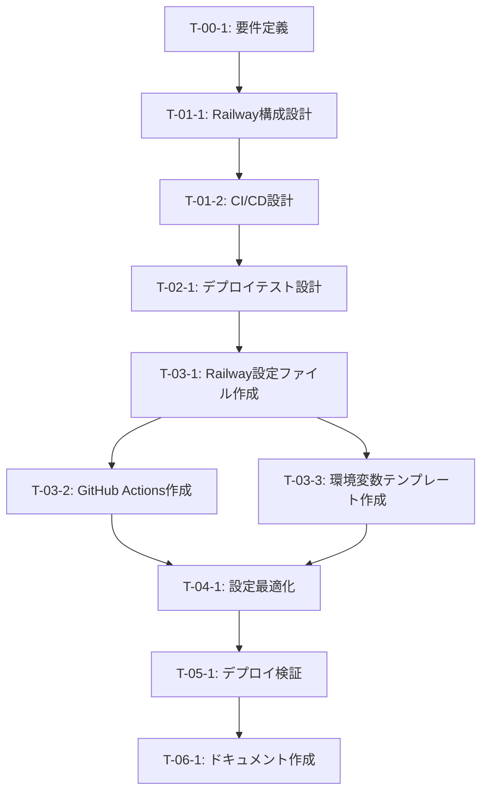

# Railwayバックエンドデプロイ - タスク実行仕様書

## ユーザーからの元の指示

```
railwayにバックエンドをデプロイしたいと思っています。そのための手順をまとめてください。
```

---

## タスク概要

### 目的

AIWorkflowOrchestratorのバックエンドサービスをRailwayプラットフォームにデプロイし、
本番環境で安定稼働させるための設定と手順を確立する。

### 背景

- 現在、本プロジェクトはpnpmモノレポ構成（apps/desktop、apps/web、packages/shared）
- バックエンドサービスを外部ホスティングプラットフォームでデプロイする必要がある
- Railwayは自動スケーリング、GitHub統合、使用量ベース課金を提供するモダンなPaaS

### 最終ゴール

- バックエンドサービスがRailway上で稼働している
- 自動デプロイ（GitHub push → 自動ビルド＆デプロイ）が設定されている
- 環境変数が適切に管理されている

> **注意**: 本プロジェクトはデスクトップアプリとしてSQLite（better-sqlite3）を使用しています。
> バックエンドをRailwayにデプロイする場合は、データベース戦略の検討が必要です：
>
> - オプション1: SQLiteを継続（永続ボリューム使用）
> - オプション2: PostgreSQLに移行（Railwayのマネージドサービス利用）
> - オプション3: デスクトップアプリのみでバックエンドなし

### 成果物一覧

| 種別         | 成果物               | 配置先                               |
| ------------ | -------------------- | ------------------------------------ |
| 設定         | Railway設定ファイル  | railway.toml                         |
| 設定         | 環境変数テンプレート | .env.railway.example                 |
| ドキュメント | デプロイ手順書       | docs/deployment/railway.md           |
| CI/CD        | GitHub Actions       | .github/workflows/deploy-railway.yml |

---

## 参照ファイル

本仕様書のコマンド・エージェント・スキル選定は以下を参照：

- `docs/00-requirements/master_system_design.md` - システム要件
- `.claude/commands/command_list.md` - コマンド定義
- `.claude/agents/agent_list.md` - エージェント定義
- `.claude/skills/skill_list.md` - スキル定義

---

## Railwayデプロイ手順（リサーチ結果）

### 1. Railwayアカウント準備

#### 1.1 アカウント作成・プラン選択

1. [Railway](https://railway.app/) にアクセス
2. GitHubアカウントでサインアップ
3. プランを選択：
   - **Trial**: $5の無料クレジット（お試し用）
   - **Pro**: $5/月〜 + 使用量ベース課金（本番推奨）

#### 1.2 Railway CLIインストール

```bash
# pnpm経由でグローバルインストール
pnpm add -g @railway/cli

# 認証
railway login

# プロジェクト初期化
railway init
```

### 2. プロジェクト構成

#### 2.1 モノレポ対応設定

**重要**: 本プロジェクトはpnpmモノレポ構成のため、以下の設定が必要：

```toml
# railway.toml（プロジェクトルートに作成）
[build]
builder = "nixpacks"
buildCommand = "pnpm install && pnpm --filter @repo/backend build"

[deploy]
startCommand = "pnpm --filter @repo/backend start"
healthcheckPath = "/health"
healthcheckTimeout = 100

[deploy.envs]
NODE_ENV = "production"
```

#### 2.2 サービス設定（Railway Dashboard）

| 設定項目       | 値                                      | 説明                         |
| -------------- | --------------------------------------- | ---------------------------- |
| Root Directory | `apps/backend`                          | バックエンドサービスのルート |
| Build Command  | `pnpm install && pnpm build`            | ビルドコマンド               |
| Start Command  | `pnpm start`                            | 起動コマンド                 |
| Watch Paths    | `apps/backend/**`, `packages/shared/**` | 変更監視対象                 |

### 3. データベース設定

> **現在のプロジェクト状況**: 本プロジェクトはSQLite（better-sqlite3）を使用しています。
> バックエンドデプロイ時にはデータベース戦略の選択が必要です。

#### 3.1 オプション1: SQLite継続（永続ボリューム）

Railwayでは永続ボリュームを使用してSQLiteファイルを保持可能：

```yaml
# railway.toml
[deploy]
volumes = ["/data"]

# アプリ内でDBパスを指定
# DATABASE_PATH=/data/app.db
```

**メリット**: 既存コードの変更不要
**デメリット**: スケールアウト不可、バックアップが複雑

#### 3.2 オプション2: PostgreSQLに移行

1. Railway Dashboard → **+ New** → **Database** → **PostgreSQL**
2. PostgreSQLが自動プロビジョニング
3. 環境変数が自動生成：
   - `DATABASE_URL`
   - `PGHOST`, `PGPORT`, `PGUSER`, `PGPASSWORD`, `PGDATABASE`

**必要な変更**:

```bash
# drizzle-ormのPostgreSQLドライバ追加
pnpm --filter @repo/shared add drizzle-orm pg

# スキーマファイルを sqliteTable → pgTable に変更
```

**メリット**: スケーラブル、バックアップ容易、Railwayとの統合が良好
**デメリット**: マイグレーション作業が必要

### 4. 環境変数管理

#### 4.1 必須環境変数

```bash
# .env.railway.example
NODE_ENV=production

# Database
# オプション1: SQLite（永続ボリューム使用時）
DATABASE_PATH=/data/app.db

# オプション2: PostgreSQL（Railwayが自動設定）
# DATABASE_URL=${{Postgres.DATABASE_URL}}

# Application
APP_SECRET=<your-secret-key>
JWT_SECRET=<your-jwt-secret>
```

#### 4.2 シークレット管理ベストプラクティス

- **Sealed Variables**: 機密性の高い値に使用
- **Reference Variables**: サービス間で共有する値に使用
- **Doppler/Infisical統合**: 高度なシークレット管理が必要な場合

### 5. デプロイ方法

#### 5.1 GitHub統合（推奨）

1. Railway Dashboard → **New Project**
2. **Deploy from GitHub repo** を選択
3. リポジトリを選択
4. 自動デプロイが有効化

#### 5.2 CLI経由

```bash
# 手動デプロイ
railway up

# プロジェクトダッシュボードを開く
railway open

# ログ確認
railway logs
```

#### 5.3 GitHub Actions（CI/CD）

```yaml
# .github/workflows/deploy-railway.yml
name: Deploy to Railway

on:
  push:
    branches: [main]
    paths:
      - "apps/backend/**"
      - "packages/shared/**"

jobs:
  deploy:
    runs-on: ubuntu-latest
    steps:
      - uses: actions/checkout@v4

      - name: Setup Node.js
        uses: actions/setup-node@v4
        with:
          node-version: "22"

      - name: Setup pnpm
        uses: pnpm/action-setup@v3
        with:
          version: 10

      - name: Install Railway CLI
        run: pnpm add -g @railway/cli

      - name: Deploy to Railway
        env:
          RAILWAY_TOKEN: ${{ secrets.RAILWAY_TOKEN }}
        run: railway up --detach
```

### 6. 本番運用設定

#### 6.1 ヘルスチェック

```typescript
// apps/backend/src/routes/health.ts
export const healthCheck = async (req, res) => {
  const dbStatus = await checkDatabase();
  res.status(dbStatus ? 200 : 503).json({
    status: dbStatus ? "healthy" : "unhealthy",
    timestamp: new Date().toISOString(),
  });
};
```

#### 6.2 ログ設定

```typescript
// 本番環境でのログ設定
import log from "electron-log";

log.transports.console.level =
  process.env.NODE_ENV === "production" ? "info" : "debug";
```

#### 6.3 スケーリング

- Railwayは自動スケーリング対応
- 使用量ベース課金（プロビジョニングではなく実使用量）
- 設定でリソース制限可能

---

## タスク分解サマリー

| ID     | フェーズ         | サブタスク名                 | 責務               | 依存   |
| ------ | ---------------- | ---------------------------- | ------------------ | ------ |
| T-00-1 | 要件定義         | バックエンドサービス要件定義 | デプロイ対象の特定 | なし   |
| T-01-1 | 設計             | Railway構成設計              | インフラ設計       | T-00-1 |
| T-01-2 | 設計             | CI/CD設計                    | 自動化設計         | T-01-1 |
| T-02-1 | テスト作成       | デプロイテスト設計           | 検証計画           | T-01-2 |
| T-03-1 | 実装             | Railway設定ファイル作成      | 設定実装           | T-02-1 |
| T-03-2 | 実装             | GitHub Actions作成           | CI/CD実装          | T-03-1 |
| T-03-3 | 実装             | 環境変数テンプレート作成     | 設定実装           | T-03-1 |
| T-04-1 | リファクタリング | 設定最適化                   | 品質改善           | T-03-3 |
| T-05-1 | 品質保証         | デプロイ検証                 | 動作確認           | T-04-1 |
| T-06-1 | ドキュメント     | デプロイ手順書作成           | 文書化             | T-05-1 |

**総サブタスク数**: 10個

---

## 実行フロー図



---

## Phase 0: 要件定義

### T-00-1: バックエンドサービス要件定義

#### 目的

Railwayにデプロイするバックエンドサービスの範囲と要件を明確化する。

#### 背景

現在のモノレポ構成では`apps/backend`（将来的に作成）がバックエンドサービスの対象となる。

#### 責務（単一責務）

デプロイ対象となるバックエンドサービスの特定と要件整理

#### 実行コマンド

```bash
/sc:brainstorm バックエンドサービスの要件
```

#### 使用エージェント

- **エージェント**: requirements-analyst
- **選定理由**: 要件抽出と構造化分析に特化
- **参照**: `.claude/agents/agent_list.md`

#### 成果物

| 成果物     | パス                                         | 内容                     |
| ---------- | -------------------------------------------- | ------------------------ |
| 要件定義書 | docs/30-workflows/deployment/requirements.md | バックエンドサービス要件 |

#### 完了条件

- [ ] デプロイ対象サービスが特定されている
- [ ] 必要なリソース（DB、キャッシュ等）が列挙されている
- [ ] 非機能要件（スケーラビリティ、可用性）が定義されている

---

## Phase 1: 設計

### T-01-1: Railway構成設計

#### 目的

Railwayプラットフォーム上でのインフラ構成を設計する。

#### 責務（単一責務）

Railway上のサービス構成とリソース設計

#### 実行コマンド

```bash
/sc:design Railway構成
```

#### 使用エージェント

- **エージェント**: devops-architect
- **選定理由**: インフラと配備プロセスの自動化に特化
- **参照**: `.claude/agents/agent_list.md`

#### 成果物

| 成果物     | パス                                                 | 内容            |
| ---------- | ---------------------------------------------------- | --------------- |
| 構成設計書 | docs/30-workflows/deployment/railway-architecture.md | Railway構成設計 |

#### 完了条件

- [ ] サービス構成が図示されている
- [ ] データベース接続方式が定義されている
- [ ] スケーリング戦略が記述されている

---

## Phase 3: 実装

### T-03-1: Railway設定ファイル作成

#### 目的

Railway用の設定ファイルを作成する。

#### 責務（単一責務）

railway.tomlの作成

#### 実行コマンド

```bash
/ai:setup-docker backend
```

#### 成果物

| 成果物       | パス                 | 内容                 |
| ------------ | -------------------- | -------------------- |
| 設定ファイル | railway.toml         | Railway設定          |
| 環境変数     | .env.railway.example | 環境変数テンプレート |

#### 完了条件

- [ ] railway.tomlが作成されている
- [ ] ビルドコマンドが正しく設定されている
- [ ] スタートコマンドが正しく設定されている

### T-03-2: GitHub Actions作成

#### 目的

Railway自動デプロイ用のGitHub Actionsワークフローを作成する。

#### 責務（単一責務）

CI/CDワークフローの実装

#### 実行コマンド

```bash
/ai:create-cd-workflow production
```

#### 成果物

| 成果物       | パス                                 | 内容                 |
| ------------ | ------------------------------------ | -------------------- |
| ワークフロー | .github/workflows/deploy-railway.yml | デプロイワークフロー |

#### 完了条件

- [ ] ワークフローファイルが作成されている
- [ ] RAILWAY_TOKENシークレットの使用が設定されている
- [ ] 適切なトリガー条件が設定されている

---

## 品質ゲートチェックリスト

### 機能検証

- [ ] Railway CLIでデプロイ可能
- [ ] GitHub push時に自動デプロイが動作
- [ ] ヘルスチェックが応答

### 設定品質

- [ ] 環境変数が適切に設定されている
- [ ] シークレットが適切に管理されている
- [ ] ログが適切に出力されている

### セキュリティ

- [ ] 機密情報がコードにハードコードされていない
- [ ] HTTPS接続が有効
- [ ] 適切なアクセス制御が設定されている

---

## 前提条件

- Railwayアカウントが作成済み
- GitHubリポジトリが存在
- バックエンドサービスコードが実装済み（apps/backend）
- pnpmモノレポ構成が維持されている

---

## 備考

### 料金の目安（2025年時点）

| プラン     | 基本料金             | 特徴                           |
| ---------- | -------------------- | ------------------------------ |
| Trial      | 無料（$5クレジット） | お試し用、クレジット消費後停止 |
| Pro        | $5/月〜              | 使用量ベース課金、本番向け     |
| Enterprise | 要相談               | SLA、コンプライアンス対応      |

### 参考資料

- [Railway Quick Start](https://docs.railway.com/quick-start)
- [Deploying a Monorepo | Railway Docs](https://docs.railway.com/guides/monorepo)
- [PostgreSQL | Railway Docs](https://docs.railway.com/guides/postgresql)
- [Using Variables | Railway Docs](https://docs.railway.com/guides/variables)
