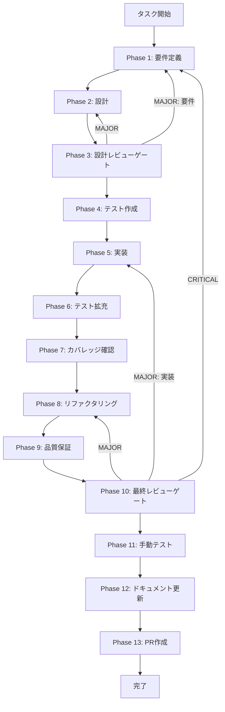

# Late Chunking実装 - タスク実行仕様書

## ユーザーからの元の指示

```
/task-specification-creator タスク仕様書作成skill（@.claude/skills/task-specification-creator/）に従ってディレクトリを作成して各タスク仕様書を作成して。各タスクごとの最適なタスク仕様書を確実に作成して。まずは、適切なブランチを切ってから、タスク仕様書を作成してください。そして、システムの仕様書スキルの内容も反映させること。
システム仕様書スキル：/aiworkflow-requirements （@.claude/skills/aiworkflow-requirements/）
スクの実行は現状不要です。仕様書を作成することに専念すること。
次のタスクのタスク仕様書を作成して。 docs/30-workflows/unassigned-task/task-embedding-late-chunking.md
```

## メタ情報

| 項目         | 内容                          |
| ------------ | ----------------------------- |
| タスクID     | UNASSIGNED-EMB-005            |
| タスク名     | embedding-late-chunking       |
| 分類         | 要件                          |
| 対象機能     | embedding-generation-pipeline |
| 優先度       | 高                            |
| 見積もり規模 | 大規模                        |
| ステータス   | 未実施                        |
| 作成日       | 2026-01-18                    |

---

## タスク概要

### 目的

Late Chunkingを実装し、チャンク境界での文脈損失を抑制して検索品質を向上させる。

### 背景

従来のチャンキング手法では、チャンク境界で文脈が途切れやすく、検索結果の精度が低下することが判明した。Phase 8手動テストで改善候補としてLate Chunkingが挙がっており、Embedding Generation Pipelineに統合する必要がある。

### 最終ゴール

- 文書全体のトークン埋め込みからチャンク埋め込みを生成できる
- mean/max/clsの3種類のプーリング戦略を選択可能
- EmbeddingPipelineでLate Chunkingの有効/無効を切り替え可能
- ベンチマークで検索品質向上を検証できる

### スコープ

#### 含むもの

- トークンレベル埋め込み用の型定義
- チャンク境界検出器
- Late Chunkingサービス
- EmbeddingPipelineへの統合
- ベンチマーク用の測定スクリプト

#### 含まないもの

- 全プロバイダーへの対応（BGE-M3等の対応モデルのみ）
- UI/UXでのLate Chunking選択機能
- 自動的な最適戦略選択

### 成果物一覧

| 種別         | 成果物                              | 配置先                                              |
| ------------ | ----------------------------------- | --------------------------------------------------- |
| 機能         | Late Chunking実装                   | `packages/shared/src/services/embedding/`           |
| 機能         | チャンク境界検出器                  | `packages/shared/src/services/chunking/`            |
| テスト       | Late Chunkingテスト                 | `packages/shared/src/services/**/__tests__/`        |
| ドキュメント | フェーズ成果物                      | `outputs/phase-*/`                                  |
| ベンチマーク | Late Chunkingベンチマークスクリプト | `packages/shared/src/services/embedding/benchmark/` |
| PR           | GitHub Pull Request                 | GitHub UI                                           |

---

## 参照ファイル

本仕様書の前提・コマンド選定は以下を参照:

- `docs/00-requirements/master_system_design.md` - システム要件
- `.claude/skills/aiworkflow-requirements/references/` - システム仕様

---

## 参照資料

### システム仕様（aiworkflow-requirements）

| 参照資料                                    | パス                                                                                   | 内容                                          |
| ------------------------------------------- | -------------------------------------------------------------------------------------- | --------------------------------------------- |
| Embedding Generation Pipelineアーキテクチャ | `.claude/skills/aiworkflow-requirements/references/architecture-embedding-pipeline.md` | パイプライン構成とチャンキング/埋め込みの責務 |
| Embedding Generation API                    | `.claude/skills/aiworkflow-requirements/references/api-internal-embedding.md`          | EmbeddingPipeline/ChunkingServiceのAPI仕様    |
| チャンク・埋め込み型定義                    | `.claude/skills/aiworkflow-requirements/references/interfaces-rag-chunk-embedding.md`  | チャンク/埋め込みエンティティと設定値         |

---

## タスク分解サマリー

| ID     | フェーズ | サブタスク名       | 責務                                      | 依存   |
| ------ | -------- | ------------------ | ----------------------------------------- | ------ |
| T-01-1 | Phase 1  | 要件定義           | Late Chunkingの要件と受け入れ基準の明文化 | -      |
| T-02-1 | Phase 2  | 設計               | 境界検出/プーリング/パイプライン統合設計  | T-01-1 |
| T-03-1 | Phase 3  | 設計レビュー       | 仕様準拠と整合性の確認                    | T-02-1 |
| T-04-1 | Phase 4  | テスト作成         | 境界検出/プーリング/統合テスト作成        | T-03-1 |
| T-05-1 | Phase 5  | 実装               | Late ChunkingとPipeline統合の実装         | T-04-1 |
| T-06-1 | Phase 6  | テスト拡充         | エッジケース/性能/統合テストの追加        | T-05-1 |
| T-07-1 | Phase 7  | カバレッジ確認     | カバレッジと統合テスト結果の確認          | T-06-1 |
| T-08-1 | Phase 8  | リファクタリング   | コード整理と性能最適化                    | T-07-1 |
| T-09-1 | Phase 9  | 品質保証           | Lint/型/セキュリティ/テストの確認         | T-08-1 |
| T-10-1 | Phase 10 | 最終レビューゲート | 要件・設計・品質の最終確認                | T-09-1 |
| T-11-1 | Phase 11 | 手動テスト         | ベンチマークと手動確認                    | T-10-1 |
| T-12-1 | Phase 12 | ドキュメント更新   | 実装ガイド/仕様更新/未タスク検出          | T-11-1 |
| T-13-1 | Phase 13 | PR作成             | ローカル確認とPR作成                      | T-12-1 |

**総サブタスク数**: 13個

---

## 実行フロー図



---

## Phase一覧

| Phase | 名称               | 仕様書                                                 | ステータス |
| ----- | ------------------ | ------------------------------------------------------ | ---------- |
| 1     | 要件定義           | [phase-1-requirements.md](phase-1-requirements.md)     | 未実施     |
| 2     | 設計               | [phase-2-design.md](phase-2-design.md)                 | 未実施     |
| 3     | 設計レビューゲート | [phase-3-design-review.md](phase-3-design-review.md)   | 未実施     |
| 4     | テスト作成         | [phase-4-test-creation.md](phase-4-test-creation.md)   | 未実施     |
| 5     | 実装               | [phase-5-implementation.md](phase-5-implementation.md) | 未実施     |
| 6     | テスト拡充         | [phase-6-test-expansion.md](phase-6-test-expansion.md) | 未実施     |
| 7     | カバレッジ確認     | [phase-7-coverage-check.md](phase-7-coverage-check.md) | 未実施     |
| 8     | リファクタリング   | [phase-8-refactoring.md](phase-8-refactoring.md)       | 未実施     |
| 9     | 品質保証           | [phase-9-quality.md](phase-9-quality.md)               | 未実施     |
| 10    | 最終レビューゲート | [phase-10-final-review.md](phase-10-final-review.md)   | 未実施     |
| 11    | 手動テスト         | [phase-11-manual-test.md](phase-11-manual-test.md)     | 未実施     |
| 12    | ドキュメント更新   | [phase-12-documentation.md](phase-12-documentation.md) | 未実施     |
| 13    | PR作成             | [phase-13-pr-creation.md](phase-13-pr-creation.md)     | 未実施     |

---

## テストカバレッジ目標

### ユニットテスト

| 指標              | 最低基準 | 推奨基準 |
| ----------------- | -------- | -------- |
| Line Coverage     | 80%      | 90%      |
| Branch Coverage   | 60%      | 70%      |
| Function Coverage | 80%      | 90%      |

### 結合テスト

| 指標                         | 目標 |
| ---------------------------- | ---- |
| APIエンドポイント            | 100% |
| モジュール間インターフェース | 100% |
| 正常系シナリオ               | 100% |
| 異常系シナリオ               | 80%+ |
| 外部連携ポイント             | 100% |

---

## 統合テスト連携（Phase 1〜11で必須）

| Phase | 統合テスト連携アクション                                           |
| ----- | ------------------------------------------------------------------ |
| 1     | Late Chunking有効時のデータフロー要件を明記                        |
| 2     | EmbeddingPipeline/ChunkingService/EmbeddingServiceの契約設計を反映 |
| 3     | 統合テスト観点で設計レビューを実施                                 |
| 4     | パイプライン統合テストシナリオを作成                               |
| 5     | 実装後にPipeline統合テストを実行できる状態にする                   |
| 6     | エッジケース/性能の統合テストを拡充                                |
| 7     | 統合テスト結果の再確認とゲート判定                                 |
| 8     | リファクタ後も統合テストが継続成功することを確認                   |
| 9     | 品質保証で統合テスト結果を確認                                     |
| 10    | 最終レビューで統合テスト結果を確認                                 |
| 11    | 手動でLate Chunking動作と品質を確認                                |

---

## Phase完了時の必須アクション

**各Phase完了時に以下を必ず実行すること:**

1. **タスク100%実行**: Phase内で指定された全タスクを完全に実行
2. **成果物確認**: 全ての必須成果物が生成されていることを検証
3. **実行記録**: 実行タスクの結果を記録
4. **artifacts.json更新**: Phase完了ステータスを更新
5. **Phase末端の実行確認**: 各タスクを100%実行し、各タスクを完遂した旨を必ず明記

```bash
# Phase完了時の検証コマンド
node .claude/skills/task-specification-creator/scripts/validate-phase-output.js docs/30-workflows/embedding-late-chunking --phase {{PHASE_NUMBER}}

# Phase完了・成果物登録
node .claude/skills/task-specification-creator/scripts/complete-phase.js \
  --workflow docs/30-workflows/embedding-late-chunking --phase {{PHASE_NUMBER}} --artifacts "..."
```

---

## リスクと対策

| リスク             | 影響度 | 発生確率 | 対策                               |
| ------------------ | ------ | -------- | ---------------------------------- |
| 処理時間の増加     | 中     | 高       | ベンチマークで測定し許容範囲を定義 |
| メモリ使用量の増加 | 中     | 高       | 大規模文書向けに注意事項を明記     |
| 対応モデルの制限   | 中     | 中       | 対応モデル一覧と制約を明記         |

---

## 使用方法

1. ユーザー要求を分析しタスクID・タスク名を確定
2. `docs/30-workflows/embedding-late-chunking/` に仕様書一式を配置
3. Phase 1から順に仕様書に従って実行
4. 各Phase完了時に `complete-phase.js` で成果物登録
5. Phase 13でユーザー許可のもとPR作成

---

## 出力ファイル構成

```
docs/30-workflows/embedding-late-chunking/
├── index.md
├── artifacts.json
├── phase-1-requirements.md
├── phase-2-design.md
├── phase-3-design-review.md
├── phase-4-test-creation.md
├── phase-5-implementation.md
├── phase-6-test-expansion.md
├── phase-7-coverage-check.md
├── phase-8-refactoring.md
├── phase-9-quality.md
├── phase-10-final-review.md
├── phase-11-manual-test.md
├── phase-12-documentation.md
├── phase-13-pr-creation.md
└── outputs/
    ├── phase-1/
    ├── phase-2/
    ├── phase-3/
    ├── phase-4/
    ├── phase-5/
    ├── phase-6/
    ├── phase-7/
    ├── phase-8/
    ├── phase-9/
    ├── phase-10/
    ├── phase-11/
    ├── phase-12/
    └── phase-13/
```
