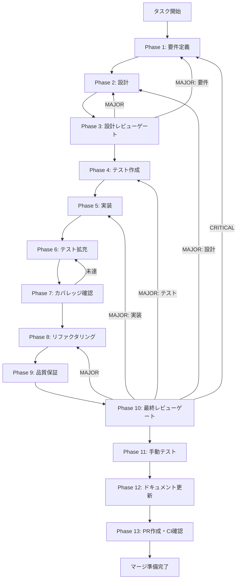

# file-selector-accessibility-improvements - タスク実行仕様書

## ユーザーからの元の指示

```
/task-specification-creator タスク仕様書作成skill（@.claude/skills/task-specification-creator/）に従ってディレクトリを作成して各タスク仕様書を作成して。各タスクごとの最適なタスク仕様書を確実に作成して。まずは、適切なブランチを切ってから、タスク仕様書を作成してください。そして、システムの仕様書スキルの内容も反映させること。
システム仕様書スキル：/aiworkflow-requirements （@.claude/skills/aiworkflow-requirements/）
スクの実行は現状不要です。仕様書を作成することに専念すること。
次のタスクのタスク仕様書を作成して。 @docs/30-workflows/unassigned-task/task-file-selector-accessibility-improvements.md
```

## メタ情報

| 項目         | 内容                                              |
| ------------ | ------------------------------------------------- |
| タスクID     | TASK-A11Y-001                                     |
| タスク名     | file-selector-accessibility-improvements          |
| 分類         | 改善                                              |
| 対象機能     | FileSelector コンポーネント（external/workspace） |
| 優先度       | 高                                                |
| 見積もり規模 | 中規模                                            |
| ステータス   | 未実施                                            |
| 作成日       | 2026-01-18                                        |

---

## タスク概要

### 目的

FileSelector の external/workspace 両モードにおけるフォーカス管理と ARIA 属性を WCAG 2.1 AA に合わせて改善し、キーボードとスクリーンリーダーでの操作性を保証する。

### 背景

Phase 7-2 のアクセシビリティレビューで FileSelectorTrigger / FileSelectorModal / ファイル一覧表示に複数の WCAG 違反が検出されたため、実際の構成に合わせて修正計画と検証計画を作成する。

### 最終ゴール

- モーダル表示時にフォーカスが移動し、モーダル内で循環する
- モーダル終了時にトリガーへフォーカスが復帰する
- ARIA 属性と role が WCAG 2.1 AA の要件を満たす
- external/workspace 両モードで一覧表示が適切に読み上げられる
- スクリーンリーダーの読み上げが意図した内容になる
- 自動テストと手動テストの結果が記録される

### 成果物一覧

| 種別         | 成果物                                                                   | 配置先                                                                                                                                                                  |
| ------------ | ------------------------------------------------------------------------ | ----------------------------------------------------------------------------------------------------------------------------------------------------------------------- |
| 機能         | FileSelectorTrigger / FileSelectorModal のアクセシビリティ改善           | `apps/desktop/src/renderer/components/organisms/FileSelectorTrigger/`, `apps/desktop/src/renderer/components/organisms/FileSelectorModal/`                              |
| 機能         | FileSelector / WorkspaceFileSelector / SelectedFilesPanel の一覧表示改善 | `apps/desktop/src/renderer/components/organisms/FileSelector/`, `apps/desktop/src/renderer/components/organisms/WorkspaceFileSelector/`                                 |
| 機能         | フォーカストラップ Hook                                                  | `apps/desktop/src/renderer/hooks/useFocusTrap.ts`                                                                                                                       |
| テスト       | FileSelector 関連アクセシビリティテスト                                  | `apps/desktop/src/renderer/components/organisms/**/FileSelector*.a11y.test.tsx`, `apps/desktop/src/renderer/components/organisms/WorkspaceFileSelector/*.a11y.test.tsx` |
| ドキュメント | Phase 成果物                                                             | `docs/30-workflows/file-selector-accessibility-improvements/outputs/phase-*`                                                                                            |
| PR           | GitHub Pull Request                                                      | GitHub UI                                                                                                                                                               |

---

## 参照ファイル

本仕様書のコマンド選定は以下を参照：

- `docs/00-requirements/16-ui-ux-guidelines.md`
- `.claude/skills/aiworkflow-requirements/references/ui-ux-file-selector.md`
- `.claude/skills/aiworkflow-requirements/references/ui-ux-components.md`
- `.claude/skills/aiworkflow-requirements/references/quality-requirements.md`
- `.claude/skills/aiworkflow-requirements/references/ui-ux-design-system.md`
- `.claude/skills/aiworkflow-requirements/references/interfaces-rag-file-selection.md`
- `docs/30-workflows/unassigned-task/task-file-selector-accessibility-improvements.md`

---

## タスク分解サマリー

| ID     | フェーズ | サブタスク名               | 責務                       | 依存 |
| ------ | -------- | -------------------------- | -------------------------- | ---- |
| T-01-1 | Phase 1  | 要件整理と受け入れ基準定義 | WCAG違反とスコープを確定   | -    |
| T-02-1 | Phase 2  | アクセシビリティ設計       | フォーカス管理と ARIA 設計 | T-01 |
| T-03-1 | Phase 3  | 設計レビュー               | 仕様整合性とレビュー判定   | T-02 |
| T-04-1 | Phase 4  | テスト作成                 | a11y テスト作成            | T-03 |
| T-05-1 | Phase 5  | 実装                       | フォーカス管理と ARIA 実装 | T-04 |
| T-06-1 | Phase 6  | テスト拡充                 | 追加ケースと安定化         | T-05 |
| T-07-1 | Phase 7  | カバレッジ確認             | カバレッジ達成             | T-06 |
| T-08-1 | Phase 8  | リファクタリング           | 実装の整理と再テスト       | T-07 |
| T-09-1 | Phase 9  | 品質保証                   | 品質チェックと検証         | T-08 |
| T-10-1 | Phase 10 | 最終レビュー               | 完了判定                   | T-09 |
| T-11-1 | Phase 11 | 手動テスト                 | 手動アクセシビリティ検証   | T-10 |
| T-12-1 | Phase 12 | ドキュメント更新           | 実装ガイドと未タスク整理   | T-11 |
| T-13-1 | Phase 13 | PR準備                     | PR 作成準備                | T-12 |

**総サブタスク数**: 24個

---

## 実行フロー図



---

## Phase一覧

| Phase | 名称               | 仕様書                                                 | ステータス |
| ----- | ------------------ | ------------------------------------------------------ | ---------- |
| 1     | 要件定義           | [phase-1-requirements.md](phase-1-requirements.md)     | 未実施     |
| 2     | 設計               | [phase-2-design.md](phase-2-design.md)                 | 未実施     |
| 3     | 設計レビューゲート | [phase-3-design-review.md](phase-3-design-review.md)   | 未実施     |
| 4     | テスト作成         | [phase-4-test-creation.md](phase-4-test-creation.md)   | 未実施     |
| 5     | 実装               | [phase-5-implementation.md](phase-5-implementation.md) | 未実施     |
| 6     | テスト拡充         | [phase-6-test-expansion.md](phase-6-test-expansion.md) | 未実施     |
| 7     | カバレッジ確認     | [phase-7-coverage-check.md](phase-7-coverage-check.md) | 未実施     |
| 8     | リファクタリング   | [phase-8-refactoring.md](phase-8-refactoring.md)       | 未実施     |
| 9     | 品質保証           | [phase-9-quality.md](phase-9-quality.md)               | 未実施     |
| 10    | 最終レビューゲート | [phase-10-final-review.md](phase-10-final-review.md)   | 未実施     |
| 11    | 手動テスト検証     | [phase-11-manual-test.md](phase-11-manual-test.md)     | 未実施     |
| 12    | ドキュメント更新   | [phase-12-documentation.md](phase-12-documentation.md) | 未実施     |
| 13    | PR作成             | [phase-13-pr-creation.md](phase-13-pr-creation.md)     | 未実施     |

---

## テストカバレッジ目標

### ユニットテスト

| 指標              | 最低基準 | 推奨基準 |
| ----------------- | -------- | -------- |
| Line Coverage     | 80%      | 90%      |
| Branch Coverage   | 60%      | 70%      |
| Function Coverage | 80%      | 90%      |

### 結合テスト

| 指標                         | 目標 |
| ---------------------------- | ---- |
| APIエンドポイント            | 100% |
| モジュール間インターフェース | 100% |
| 正常系シナリオ               | 100% |
| 異常系シナリオ               | 80%+ |
| 外部連携ポイント             | 100% |

---

## 統合テスト連携（Phase 1〜11で必須）

各Phaseで以下の統合テスト連携アクションを実施すること:

| Phase | 統合テスト連携アクション                        |
| ----- | ----------------------------------------------- |
| 1     | 接続要件（API/認証/データフロー）を要件に明記   |
| 2     | 統合ポイント/契約（API・スキーマ）を設計に反映  |
| 3     | 統合テスト観点のレビューゲートを実施            |
| 4     | 統合テストシナリオを全カテゴリで作成            |
| 5     | フロント/バック接続の実装とテスト支援コード整備 |
| 6     | 統合テストの拡充（全カテゴリのカバレッジ向上）  |
| 7     | 統合テストの再実行とゲート判定                  |
| 8     | リファクタ後の統合テスト継続成功を確認          |
| 9     | 品質保証で統合テスト結果を確認                  |
| 10    | 最終レビューで統合テスト結果を確認              |
| 11    | 手動統合テスト（UI/API接続）を確認              |

---

## Phase完了時の必須アクション

**各Phase完了時に以下を必ず実行すること:**

1. **タスク100%実行**: Phase内で指定された全タスクを完全に実行
2. **成果物確認**: 全ての必須成果物が生成されていることを検証
3. **実行記録**: 実行タスクの結果を記録
4. **artifacts.json更新**: Phase完了ステータスを更新
5. **Phase末端の実行確認**: 各タスクを100%実行し、各タスクを完遂した旨を必ず明記

```bash
# Phase完了時の検証コマンド
node .claude/skills/task-specification-creator/scripts/validate-phase-output.js docs/30-workflows/file-selector-accessibility-improvements --phase {PHASE_NUMBER}

# Phase完了・成果物登録
node .claude/skills/task-specification-creator/scripts/complete-phase.js   --workflow docs/30-workflows/file-selector-accessibility-improvements --phase {PHASE_NUMBER} --artifacts "..."
```
