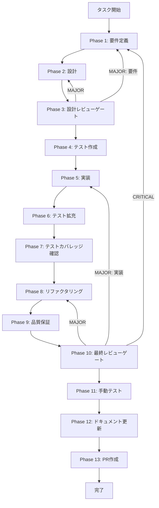

# FR011 ファイルタイプアイコン表示 - タスク実行仕様書

## ユーザーからの元の指示

```
ワークスペースのファイルツリーで拡張子ごとにアイコンを表示し、フォルダは展開状態でアイコンが切り替わるようにしてほしい。
未対応拡張子は汎用アイコンにすること。
```

## メタ情報

| 項目         | 内容                                            |
| ------------ | ----------------------------------------------- |
| タスクID     | TASK-WS-FR011                                   |
| タスク名     | fr011-file-type-icons                           |
| 分類         | 改善                                            |
| 対象機能     | ワークスペースマネージャー / ファイルツリー表示 |
| 優先度       | 高                                              |
| 見積もり規模 | 小規模                                          |
| ステータス   | 未実施                                          |
| 作成日       | 2026-01-18                                      |

---

## タスク概要

### 目的

ワークスペースのファイルツリーにファイルタイプごとのアイコンを表示し、視認性と操作効率を向上させる。

### 背景

現在のファイルツリーはフォルダとファイルの汎用アイコンのみで構成されており、拡張子の違いが視覚的に識別できない。UI/UX仕様ではLucide Iconsの採用とアイコンサイズ基準が定義されており、それに沿ったファイルタイプ表現が必要となる。

### 最終ゴール

- 対象拡張子に対応するファイルタイプアイコンが表示される
- フォルダは展開状態でアイコンが切り替わる
- 未対応拡張子は汎用ファイルアイコンを表示する
- アイコンサイズと色はUI/UX設計の基準を満たす

### スコープ

#### 含むもの

- 拡張子とアイコンのマッピング定義
- FileTypeIconコンポーネントの新規追加
- FileTreeItemとSelectableFileTreeItemへの組み込み
- Lucide Iconsの追加と型定義更新
- ファイルツリー表示に関するテスト追加

#### 含まないもの

- アイコンテーマ切り替え機能
- 画像ファイルのサムネイル表示
- 拡張子登録のユーザー設定機能

### 成果物一覧

| 種別         | 成果物                           | 配置先                                                                                                 |
| ------------ | -------------------------------- | ------------------------------------------------------------------------------------------------------ |
| UI           | FileTypeIconコンポーネント       | `apps/desktop/src/renderer/components/atoms/FileTypeIcon/index.tsx`                                    |
| UI           | FileTreeItem更新                 | `apps/desktop/src/renderer/components/molecules/FileTreeItem/index.tsx`                                |
| UI           | SelectableFileTreeItem更新       | `apps/desktop/src/renderer/components/organisms/WorkspaceFileSelector/SelectableFileTreeItem.tsx`      |
| ロジック     | 拡張子アイコンマッピング         | `apps/desktop/src/renderer/utils/fileTypeIconMap.ts`                                                   |
| UI基盤       | Iconコンポーネントの拡張         | `apps/desktop/src/renderer/components/atoms/Icon/index.tsx`                                            |
| テスト       | FileTreeItemテスト更新           | `apps/desktop/src/renderer/components/molecules/FileTreeItem/FileTreeItem.test.tsx`                    |
| テスト       | SelectableFileTreeItemテスト更新 | `apps/desktop/src/renderer/components/organisms/WorkspaceFileSelector/SelectableFileTreeItem.test.tsx` |
| ドキュメント | フェーズ成果物                   | `outputs/phase-*/`                                                                                     |

---

## 参照資料

### システム仕様（aiworkflow-requirements）

> 実装前に必ず以下のシステム仕様を確認し、既存設計との整合性を確保してください。

| 参照資料                 | パス                                                                       | 内容                                    |
| ------------------------ | -------------------------------------------------------------------------- | --------------------------------------- |
| ファイルセレクターUI設計 | `.claude/skills/aiworkflow-requirements/references/ui-ux-file-selector.md` | ファイルツリー表示とWorkspaceモード仕様 |
| パネル・セレクターUI/UX  | `.claude/skills/aiworkflow-requirements/references/ui-ux-panels.md`        | アイコンライブラリ選定とサイズ規則      |
| UI/UXデザインシステム    | `.claude/skills/aiworkflow-requirements/references/ui-ux-design-system.md` | 色設計と視認性要件                      |
| ディレクトリ構造         | `.claude/skills/aiworkflow-requirements/references/directory-structure.md` | 実装パスと構成の基準                    |

---

## 参照ファイル

本仕様書のコマンド選定は以下を参照：

- `docs/00-requirements/master_system_design.md` - システム要件
- `.claude/skills/aiworkflow-requirements/references/` - システム仕様

---

## タスク分解サマリー

| ID     | フェーズ | サブタスク名         | 責務                                   | 依存   |
| ------ | -------- | -------------------- | -------------------------------------- | ------ |
| T-01-1 | Phase 1  | 要件定義             | アイコン表示要件と受け入れ基準の明文化 | -      |
| T-02-1 | Phase 2  | 設計                 | アイコンマッピングと統合設計           | T-01-1 |
| T-03-1 | Phase 3  | 設計レビューゲート   | 要件と設計の整合性確認                 | T-02-1 |
| T-04-1 | Phase 4  | テスト作成           | 失敗するテストの作成                   | T-03-1 |
| T-05-1 | Phase 5  | 実装                 | アイコン表示の実装                     | T-04-1 |
| T-06-1 | Phase 6  | テスト拡充           | カバレッジ目標達成のための追加テスト   | T-05-1 |
| T-07-1 | Phase 7  | テストカバレッジ確認 | カバレッジ基準の検証                   | T-06-1 |
| T-08-1 | Phase 8  | リファクタリング     | 仕様準拠の整理                         | T-07-1 |
| T-09-1 | Phase 9  | 品質保証             | Lint・型・テスト結果の確認             | T-08-1 |
| T-10-1 | Phase 10 | 最終レビューゲート   | 全体品質の検証                         | T-09-1 |
| T-11-1 | Phase 11 | 手動テスト           | UIの視覚確認と操作確認                 | T-10-1 |
| T-12-1 | Phase 12 | ドキュメント更新     | 実装ガイドと仕様反映                   | T-11-1 |
| T-13-1 | Phase 13 | PR作成               | 変更のまとめとPR作成                   | T-12-1 |

**総サブタスク数**: 13個

---

## 実行フロー図



---

## Phase一覧

| Phase | 名称                 | 仕様書                                                 | ステータス |
| ----- | -------------------- | ------------------------------------------------------ | ---------- |
| 1     | 要件定義             | [phase-1-requirements.md](phase-1-requirements.md)     | 未実施     |
| 2     | 設計                 | [phase-2-design.md](phase-2-design.md)                 | 未実施     |
| 3     | 設計レビューゲート   | [phase-3-design-review.md](phase-3-design-review.md)   | 未実施     |
| 4     | テスト作成           | [phase-4-test-creation.md](phase-4-test-creation.md)   | 未実施     |
| 5     | 実装                 | [phase-5-implementation.md](phase-5-implementation.md) | 未実施     |
| 6     | テスト拡充           | [phase-6-test-expansion.md](phase-6-test-expansion.md) | 未実施     |
| 7     | テストカバレッジ確認 | [phase-7-coverage-check.md](phase-7-coverage-check.md) | 未実施     |
| 8     | リファクタリング     | [phase-8-refactoring.md](phase-8-refactoring.md)       | 未実施     |
| 9     | 品質保証             | [phase-9-quality.md](phase-9-quality.md)               | 未実施     |
| 10    | 最終レビューゲート   | [phase-10-final-review.md](phase-10-final-review.md)   | 未実施     |
| 11    | 手動テスト           | [phase-11-manual-test.md](phase-11-manual-test.md)     | 未実施     |
| 12    | ドキュメント更新     | [phase-12-documentation.md](phase-12-documentation.md) | 未実施     |
| 13    | PR作成               | [phase-13-pr-creation.md](phase-13-pr-creation.md)     | 未実施     |

---

## テストカバレッジ目標

### ユニットテスト

| 指標              | 最低基準 | 推奨基準 |
| ----------------- | -------- | -------- |
| Line Coverage     | 80%      | 90%      |
| Branch Coverage   | 60%      | 70%      |
| Function Coverage | 80%      | 90%      |

### 結合テスト

| 指標                         | 目標 |
| ---------------------------- | ---- |
| APIエンドポイント            | 100% |
| モジュール間インターフェース | 100% |
| 正常系シナリオ               | 100% |
| 異常系シナリオ               | 80%  |
| 外部連携ポイント             | 100% |

---

## 統合テスト連携（Phase 1〜11で必須）

| Phase | 統合テスト連携アクション                                       |
| ----- | -------------------------------------------------------------- |
| 1     | ファイルツリー表示の既存UIテストに影響しない要件を明記         |
| 2     | FileTreeItemとSelectableFileTreeItemの統合ポイントを設計に反映 |
| 3     | アイコン表示が既存動線に影響しないことをレビューで確認         |
| 4     | ファイル拡張子ごとの表示テストシナリオを作成                   |
| 5     | ワークスペース画面とファイルセレクターの両方で表示確認         |
| 6     | 未対応拡張子とフォルダ展開状態のテストを追加                   |
| 7     | 統合テスト結果の再確認                                         |
| 8     | リファクタ後の統合テスト継続成功を確認                         |
| 9     | 品質保証で統合テスト結果を確認                                 |
| 10    | 最終レビューで統合テスト結果を確認                             |
| 11    | 手動テストで実表示の確認                                       |

---

## リスクと対策

| リスク                                         | 影響度 | 発生確率 | 対策                                                           |
| ---------------------------------------------- | ------ | -------- | -------------------------------------------------------------- |
| アイコン追加によりIconコンポーネントの型が破綻 | 中     | 低       | IconNameの追加範囲を設計で固定し、型チェックで検証             |
| 色のみで区別が伝わらない                       | 中     | 中       | 形状と色の組み合わせで識別し、テキストは既存のファイル名を維持 |
| レンダリング性能低下                           | 低     | 低       | マッピングを定数化し再計算を回避                               |

---

## Phase完了時の必須アクション

**各Phase完了時に以下を必ず実行すること:**

1. **タスク100%実行**: Phase内で指定された全タスクを完全に実行
2. **成果物確認**: 全ての必須成果物が生成されていることを検証
3. **実行記録**: 実行タスクの結果を記録
4. **artifacts.json更新**: Phase完了ステータスを更新
5. **Phase末端の実行確認**: 各タスクを100%実行し、各タスクを完遂した旨を必ず明記

```bash
node .claude/skills/task-specification-creator/scripts/validate-phase-output.js docs/30-workflows/fr011-file-type-icons --phase {{PHASE_NUMBER}}
```
