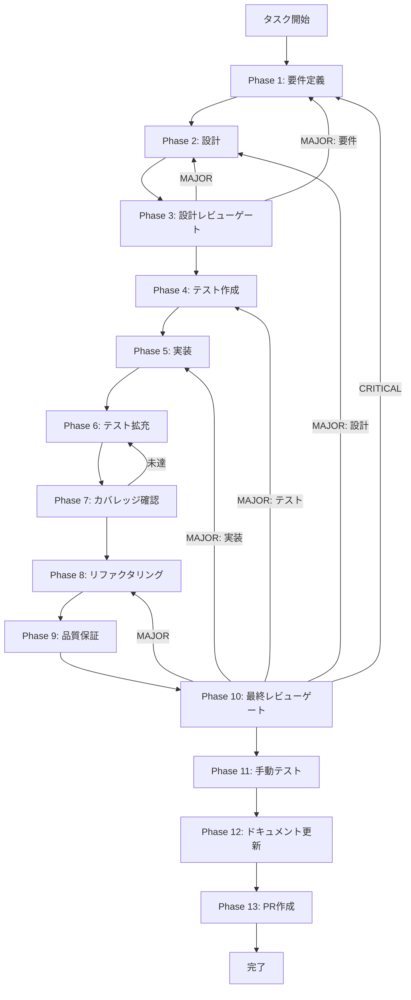

# グラフ検索パフォーマンス改善 - タスク実行仕様書

## ユーザーからの元の指示

```
GraphSearchStrategyのクエリ埋め込みをキャッシュし、同一クエリの埋め込み生成を再利用する。
maxSizeとttlMsを設定可能にし、キャッシュヒット率を取得する。
外部キャッシュや永続化は対象外とする。
```

## メタ情報

| 項目         | 内容                     |
| ------------ | ------------------------ |
| タスクID     | CONV-07-04-IMPROVE-002   |
| タスク名     | graph-search-performance |
| 分類         | パフォーマンス           |
| 対象機能     | GraphSearchStrategy      |
| 優先度       | 中                       |
| 見積もり規模 | 中規模                   |
| ステータス   | 未実施                   |
| 作成日       | 2026-01-18               |

---

## タスク概要

### 目的

GraphSearchStrategyにクエリ埋め込みキャッシュを導入し、同一クエリの再検索時に埋め込み生成の呼び出しを削減する。

### 背景

GraphSearchStrategyの品質保証レビューで、同一クエリの反復実行時に埋め込み生成APIが毎回呼び出される課題が記録された。APIコストと応答時間の変動を抑えるため、クエリ埋め込みのキャッシュを計画する。

### 最終ゴール

- 同一クエリの2回目以降はキャッシュから埋め込みを取得できる
- キャッシュヒット率を取得し、メトリクスとして追跡できる
- キャッシュの最大サイズとTTLを設定できる
- キャッシュ無効時の動作が現行仕様と一致する

### スコープ

#### 含むもの

- インメモリLRUキャッシュの実装
- クエリ埋め込みキャッシュの統合
- キャッシュ設定オプション（maxSize、ttlMs、enabled）
- キャッシュヒット率の取得と公開

#### 含まないもの

- Redis等の外部キャッシュ統合
- 永続化キャッシュ
- 他検索戦略への適用

### 成果物一覧

| 種別         | 成果物                   | 配置先                                                                    |
| ------------ | ------------------------ | ------------------------------------------------------------------------- |
| 機能         | クエリ埋め込みキャッシュ | `packages/shared/src/services/search/strategies/`                         |
| 実装         | GraphSearchStrategy更新  | `packages/shared/src/services/search/strategies/graph-search-strategy.ts` |
| テスト       | キャッシュ挙動テスト     | `packages/shared/src/services/search/strategies/__tests__/`               |
| ドキュメント | フェーズ成果物           | `docs/30-workflows/graph-search-performance/outputs/phase-*`              |
| PR           | GitHub Pull Request      | GitHub UI                                                                 |

---

## 参照ファイル

- `docs/00-requirements/master_system_design.md` - システム要件
- `.claude/skills/aiworkflow-requirements/references/` - システム仕様

---

## 参照資料

**システム仕様（aiworkflow-requirements）**

| 参照資料                 | パス                                                                          | 内容                            |
| ------------------------ | ----------------------------------------------------------------------------- | ------------------------------- |
| 検索クエリ・結果型定義   | `.claude/skills/aiworkflow-requirements/references/interfaces-rag-search.md`  | GraphSearchStrategyと検索型定義 |
| RAG・Knowledge Graph設計 | `.claude/skills/aiworkflow-requirements/references/architecture-rag.md`       | GraphRAG構成とKnowledge Graph型 |
| Embedding Generation API | `.claude/skills/aiworkflow-requirements/references/api-internal-embedding.md` | 埋め込み生成APIとキャッシュ指標 |

**関連タスク**

| 参照資料       | パス                                                                 | 内容                 |
| -------------- | -------------------------------------------------------------------- | -------------------- |
| 未タスク指示書 | `docs/30-workflows/unassigned-task/task-graph-search-performance.md` | 背景と改善要求の原文 |

---

## タスク分解サマリー

| ID     | フェーズ | サブタスク名         | 責務                                       | 依存   |
| ------ | -------- | -------------------- | ------------------------------------------ | ------ |
| T-01-1 | Phase 1  | 要件定義             | キャッシュ要件と受け入れ基準の明文化       | -      |
| T-02-1 | Phase 2  | 設計                 | キャッシュ設計とAPI仕様の決定              | T-01-1 |
| T-03-1 | Phase 3  | 設計レビューゲート   | 仕様準拠と設計妥当性の確認                 | T-02-1 |
| T-04-1 | Phase 4  | テスト作成           | キャッシュテストの設計とRed状態作成        | T-03-1 |
| T-05-1 | Phase 5  | 実装                 | LRUキャッシュ実装とGraphSearchStrategy統合 | T-04-1 |
| T-06-1 | Phase 6  | テスト拡充           | TTL/最大サイズ/統合テストの拡充            | T-05-1 |
| T-07-1 | Phase 7  | テストカバレッジ確認 | カバレッジ基準と統合テストゲート判定       | T-06-1 |
| T-08-1 | Phase 8  | リファクタリング     | キャッシュ実装の整理と可読性向上           | T-07-1 |
| T-09-1 | Phase 9  | 品質保証             | Lint/型/性能テストの検証                   | T-08-1 |
| T-10-1 | Phase 10 | 最終レビューゲート   | 要件・設計・品質の最終確認                 | T-09-1 |
| T-11-1 | Phase 11 | 手動テスト           | 反復検索時の挙動とメトリクス確認           | T-10-1 |
| T-12-1 | Phase 12 | ドキュメント更新     | 実装ガイドと仕様更新、未タスク検出         | T-11-1 |
| T-13-1 | Phase 13 | PR作成               | 変更差分の整理とPR作成                     | T-12-1 |

**総サブタスク数**: 13個

---

## 実行フロー図



---

## Phase一覧

| Phase | 名称                 | 仕様書                                                       | ステータス |
| ----- | -------------------- | ------------------------------------------------------------ | ---------- |
| 1     | 要件定義             | [phase-1-requirements.md](phase-1-requirements.md)           | 未実施     |
| 2     | 設計                 | [phase-2-design.md](phase-2-design.md)                       | 未実施     |
| 3     | 設計レビューゲート   | [phase-3-design-review.md](phase-3-design-review.md)         | 未実施     |
| 4     | テスト作成           | [phase-4-test-creation.md](phase-4-test-creation.md)         | 未実施     |
| 5     | 実装                 | [phase-5-implementation.md](phase-5-implementation.md)       | 未実施     |
| 6     | テスト拡充           | [phase-6-test-expansion.md](phase-6-test-expansion.md)       | 未実施     |
| 7     | テストカバレッジ確認 | [phase-7-coverage-check.md](phase-7-coverage-check.md)       | 未実施     |
| 8     | リファクタリング     | [phase-8-refactoring.md](phase-8-refactoring.md)             | 未実施     |
| 9     | 品質保証             | [phase-9-quality-assurance.md](phase-9-quality-assurance.md) | 未実施     |
| 10    | 最終レビューゲート   | [phase-10-final-review.md](phase-10-final-review.md)         | 未実施     |
| 11    | 手動テスト           | [phase-11-manual-test.md](phase-11-manual-test.md)           | 未実施     |
| 12    | ドキュメント更新     | [phase-12-documentation.md](phase-12-documentation.md)       | 未実施     |
| 13    | PR作成               | [phase-13-pr-creation.md](phase-13-pr-creation.md)           | 未実施     |

---

## Phase完了時の必須アクション

**各Phase完了時に以下を必ず実行すること:**

1. **タスク100%実行**: Phase内で指定された全タスクを完全に実行
2. **成果物確認**: 全ての必須成果物が生成されていることを検証
3. **実行記録**: 実行タスクの結果を記録
4. **artifacts.json更新**: Phase完了ステータスを更新
5. **Phase末端の実行確認**: 各タスクを100%実行し、各タスクを完遂した旨を必ず明記

```bash
# Phase完了時の検証コマンド
node .claude/skills/task-specification-creator/scripts/validate-phase-output.js docs/30-workflows/graph-search-performance --phase {{PHASE_NUMBER}}

# Phase完了・成果物登録
node .claude/skills/task-specification-creator/scripts/complete-phase.js \
  --workflow docs/30-workflows/graph-search-performance --phase {{PHASE_NUMBER}} --artifacts "..."
```

---

## テストカバレッジ目標

### ユニットテスト

| 指標              | 最低基準 | 推奨基準 |
| ----------------- | -------- | -------- |
| Line Coverage     | 80%      | 90%      |
| Branch Coverage   | 60%      | 70%      |
| Function Coverage | 80%      | 90%      |

### 結合テスト

| 指標                         | 目標 |
| ---------------------------- | ---- |
| APIエンドポイント            | 100% |
| モジュール間インターフェース | 100% |
| 正常系シナリオ               | 100% |
| 異常系シナリオ               | 80%+ |
| 外部連携ポイント             | 100% |

---

## 統合テスト連携（Phase 1〜11で必須）

| Phase | 統合テスト連携アクション                                                   |
| ----- | -------------------------------------------------------------------------- |
| 1     | GraphSearchStrategy → EmbeddingProvider → GraphStoreの接続要件を要件に明記 |
| 2     | キャッシュ導入後の接続経路とAPI契約を設計に反映                            |
| 3     | 統合テスト観点で設計レビューを実施                                         |
| 4     | 統合テストシナリオを全カテゴリで作成                                       |
| 5     | キャッシュ有効時の検索フローを統合テストで確認                             |
| 6     | 統合テストの拡充と再実行                                                   |
| 7     | 統合テスト結果の再確認とゲート判定                                         |
| 8     | リファクタ後の統合テスト継続成功を確認                                     |
| 9     | 品質保証で統合テスト結果を確認                                             |
| 10    | 最終レビューで統合テスト結果を確認                                         |
| 11    | 手動統合テストで反復検索の挙動を確認                                       |

---

## リスクと対策

| リスク                         | 影響度 | 発生確率 | 対策                                   |
| ------------------------------ | ------ | -------- | -------------------------------------- |
| キャッシュ過多によるメモリ増加 | 中     | 中       | maxSizeとTTLで上限を設定する           |
| キャッシュが無効化できない     | 高     | 低       | デフォルト無効と明示的な設定を実装する |
| キャッシュ統計の不整合         | 中     | 低       | ヒット/ミス更新のテストを追加する      |
