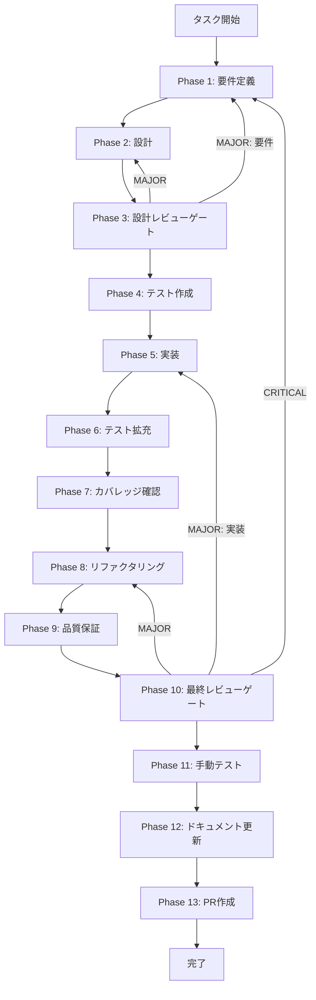

# グラフ検索信頼性改善 - タスク実行仕様書

## ユーザーからの元の指示

```
GraphSearchStrategyの外部API呼び出し（GraphStore, Embedding）にタイムアウト設定を追加し、エラーコード体系を導入して原因特定とフォールバックを可能にすること。
```

## メタ情報

| 項目         | 内容                                  |
| ------------ | ------------------------------------- |
| タスクID     | CONV-07-04-IMPROVE-001                |
| タスク名     | graph-search-reliability-improvements |
| 分類         | 改善                                  |
| 対象機能     | GraphSearchStrategy                   |
| 優先度       | 中                                    |
| 見積もり規模 | 中規模                                |
| ステータス   | 未実施                                |
| 作成日       | 2026-01-18                            |

---

## タスク概要

### 目的

GraphSearchStrategyの外部API呼び出しにタイムアウトを導入し、エラーコード体系を整備して原因特定と安全なフォールバックを可能にする。

### 背景

Phase 9品質保証レビューで、GraphSearchStrategyの外部API呼び出しにタイムアウトが無い点と、エラー種別を識別できない点が信頼性リスクとして指摘された。外部サービス障害時の無限待機や調査コスト増大を防ぐため、制御可能なタイムアウトと識別可能なエラーコードが必要である。

### 最終ゴール

- GraphStore/Embeddingの外部API呼び出しにtimeoutMsを適用できる
- timeoutMsのデフォルト値が30000msである
- タイムアウト時にErrorCodes.TIMEOUTで原因を識別できる
- タイムアウト発生時にフォールバック動作が期待通りに実行される
- 既存のGraphSearchStrategy APIとの後方互換性を維持する

### スコープ

#### 含むもの

- GraphSearchOptionsへのtimeoutMs追加
- GraphStore/Embedding呼び出しのタイムアウト実装
- エラーコード体系の整備（RAGエラーコードとの整合）
- タイムアウトエラーのハンドリング
- ユニット/統合テストの追加
- ドキュメント更新

#### 含まないもの

- 他の検索戦略（Keyword/Vector）への適用
- リトライ機構の実装
- サーキットブレーカーの実装

### 成果物一覧

| 種別         | 成果物                              | 配置先                                                                    |
| ------------ | ----------------------------------- | ------------------------------------------------------------------------- |
| 機能         | GraphSearchStrategyタイムアウト対応 | `packages/shared/src/services/search/strategies/graph-search-strategy.ts` |
| 機能         | タイムアウトユーティリティ          | `packages/shared/src/services/search/strategies/timeout-utils.ts`         |
| 機能         | RAGエラーコード拡張                 | `packages/shared/src/types/rag/errors.ts`                                 |
| テスト       | タイムアウト/エラーコード関連テスト | `packages/shared/src/services/search/strategies/__tests__/`               |
| ドキュメント | フェーズ成果物                      | `outputs/phase-*/`                                                        |

---

## 参照ファイル

- `docs/00-requirements/master_system_design.md` - システム要件
- `.claude/skills/aiworkflow-requirements/references/` - システム仕様

---

## 参照資料

### システム仕様（aiworkflow-requirements）

| 参照資料                  | パス                                                                                        | 内容                                    |
| ------------------------- | ------------------------------------------------------------------------------------------- | --------------------------------------- |
| GraphSearchStrategy仕様   | `.claude/skills/aiworkflow-requirements/references/interfaces-rag-search.md`                | GraphSearchOptions/インターフェース仕様 |
| Knowledge Graph Store仕様 | `.claude/skills/aiworkflow-requirements/references/interfaces-rag-knowledge-graph-store.md` | GraphStoreインターフェースとエラー処理  |
| Embedding API仕様         | `.claude/skills/aiworkflow-requirements/references/api-internal-embedding.md`               | 埋め込み生成のタイムアウト設定          |
| エラーハンドリング仕様    | `.claude/skills/aiworkflow-requirements/references/error-handling.md`                       | エラーコード体系と分類                  |
| RAGアーキテクチャ         | `.claude/skills/aiworkflow-requirements/references/architecture-rag.md`                     | 検索パイプライン全体像                  |

### 関連ドキュメント

| 参照資料     | パス                                                                              | 内容                   |
| ------------ | --------------------------------------------------------------------------------- | ---------------------- |
| タスク指示書 | `docs/30-workflows/unassigned-task/task-graph-search-reliability-improvements.md` | 改善指示書（元タスク） |

---

## タスク分解サマリー

| ID     | フェーズ | サブタスク名       | 責務                                       | 依存   |
| ------ | -------- | ------------------ | ------------------------------------------ | ------ |
| T-01-1 | Phase 1  | 要件定義           | タイムアウトとエラーコードの要件整理       | -      |
| T-02-1 | Phase 2  | 設計               | timeoutMs/エラーコードの設計確定           | T-01-1 |
| T-03-1 | Phase 3  | 設計レビューゲート | 仕様準拠と後方互換性のレビュー             | T-02-1 |
| T-04-1 | Phase 4  | テスト作成         | タイムアウト/エラーコードのテスト作成      | T-03-1 |
| T-05-1 | Phase 5  | 実装               | GraphSearchStrategyへのタイムアウト実装    | T-04-1 |
| T-06-1 | Phase 6  | テスト拡充         | 追加ケース/フォールバックの拡充            | T-05-1 |
| T-07-1 | Phase 7  | カバレッジ確認     | 目標カバレッジ達成確認                     | T-06-1 |
| T-08-1 | Phase 8  | リファクタリング   | タイムアウト処理の重複排除と読みやすさ改善 | T-07-1 |
| T-09-1 | Phase 9  | 品質保証           | Lint/型/テストの最終品質確認               | T-08-1 |
| T-10-1 | Phase 10 | 最終レビューゲート | 要件・設計・品質の最終確認                 | T-09-1 |
| T-11-1 | Phase 11 | 手動テスト         | 実環境想定でのタイムアウト挙動確認         | T-10-1 |
| T-12-1 | Phase 12 | ドキュメント更新   | 実装ガイド/変更履歴/仕様更新判断           | T-11-1 |
| T-13-1 | Phase 13 | PR作成             | ローカル確認とPR作成準備                   | T-12-1 |

**総サブタスク数**: 13個

---

## 実行フロー図



---

## Phase一覧

| Phase | 名称               | 仕様書                                                 | ステータス |
| ----- | ------------------ | ------------------------------------------------------ | ---------- |
| 1     | 要件定義           | [phase-1-requirements.md](phase-1-requirements.md)     | 未実施     |
| 2     | 設計               | [phase-2-design.md](phase-2-design.md)                 | 未実施     |
| 3     | 設計レビューゲート | [phase-3-design-review.md](phase-3-design-review.md)   | 未実施     |
| 4     | テスト作成         | [phase-4-test-creation.md](phase-4-test-creation.md)   | 未実施     |
| 5     | 実装               | [phase-5-implementation.md](phase-5-implementation.md) | 未実施     |
| 6     | テスト拡充         | [phase-6-test-expansion.md](phase-6-test-expansion.md) | 未実施     |
| 7     | カバレッジ確認     | [phase-7-coverage-check.md](phase-7-coverage-check.md) | 未実施     |
| 8     | リファクタリング   | [phase-8-refactoring.md](phase-8-refactoring.md)       | 未実施     |
| 9     | 品質保証           | [phase-9-quality.md](phase-9-quality.md)               | 未実施     |
| 10    | 最終レビューゲート | [phase-10-final-review.md](phase-10-final-review.md)   | 未実施     |
| 11    | 手動テスト         | [phase-11-manual-test.md](phase-11-manual-test.md)     | 未実施     |
| 12    | ドキュメント更新   | [phase-12-documentation.md](phase-12-documentation.md) | 未実施     |
| 13    | PR作成             | [phase-13-pr-creation.md](phase-13-pr-creation.md)     | 未実施     |

---

## テストカバレッジ目標

### ユニットテスト

| 指標              | 最低基準 | 推奨基準 |
| ----------------- | -------- | -------- |
| Line Coverage     | 80%      | 90%      |
| Branch Coverage   | 60%      | 70%      |
| Function Coverage | 80%      | 90%      |

### 結合テスト

| 指標                         | 目標 |
| ---------------------------- | ---- |
| APIエンドポイント            | 100% |
| モジュール間インターフェース | 100% |
| 正常系シナリオ               | 100% |
| 異常系シナリオ               | 80%+ |
| 外部連携ポイント             | 100% |

---

## 統合テスト連携（Phase 1〜11で必須）

| Phase | 統合テスト連携アクション                                      |
| ----- | ------------------------------------------------------------- |
| 1     | GraphSearchタイムアウト時にHybridRAGが継続動作する要件を明記  |
| 2     | GraphSearchOptionsのtimeoutMsが統合設定に影響しない設計を明記 |
| 3     | タイムアウト/エラーコードの統合テスト観点をレビューで確認     |
| 4     | GraphSearchタイムアウトの統合テストシナリオを作成             |
| 5     | HybridRAG統合テストを実行しフォールバックを確認               |
| 6     | エラー種別別の統合テストを追加                                |
| 7     | 統合テストの再実行とゲート判定                                |
| 8     | リファクタ後も統合テストが成功することを確認                  |
| 9     | 品質保証で統合テスト結果を確認                                |
| 10    | 最終レビューで統合テスト結果を確認                            |
| 11    | 実機同等のテスト環境でタイムアウト挙動を確認                  |

---

## リスクと対策

| リスク                             | 影響度 | 発生確率 | 対策                                            |
| ---------------------------------- | ------ | -------- | ----------------------------------------------- |
| GraphSearchOptionsの後方互換性崩れ | 高     | 低       | timeoutMsはオプション追加としデフォルト値を設定 |
| タイムアウト値の誤設定             | 中     | 中       | デフォルト値と上限値を明記しテストで検証        |
| エラーコードの不整合               | 中     | 中       | error-handling.mdに準拠し設計レビューで確認     |
