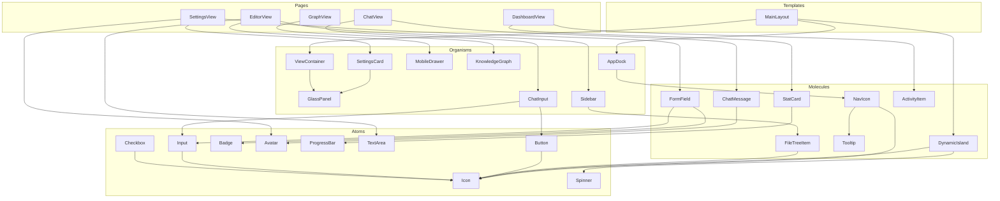

# Knowledge Studio - コンポーネント設計書

> **ドキュメントID**: DESIGN-KS-COMP-001
> **バージョン**: 1.0.0
> **作成日**: 2024-12-08
> **ステータス**: Draft

---

## 1. 概要

### 1.1 目的

本ドキュメントは、Knowledge StudioのUIコンポーネントをAtomic Designに基づいて分解し、再利用性と変更容易性の高いコンポーネント構造を定義する。

### 1.2 Atomic Design原則

| 階層          | 説明                              | 例                        |
| ------------- | --------------------------------- | ------------------------- |
| **Atoms**     | 最小単位のUI要素                  | Button, Input, Icon       |
| **Molecules** | Atomsを組み合わせた機能単位       | NavIcon, FormField        |
| **Organisms** | Moleculesを組み合わせた複雑な構造 | AppDock, Sidebar          |
| **Templates** | ページのレイアウト構造            | MainLayout                |
| **Pages**     | 具体的なコンテンツを持つ画面      | DashboardView, EditorView |

### 1.3 参照ドキュメント

- [UI機能要件定義書](./requirements-ui-functions.md) (REQ-KS-UI-001)
- [状態管理要件定義書](./requirements-state-management.md) (REQ-KS-STATE-001)
- [UI/UXガイドライン](../../00-requirements/16-ui-ux-guidelines.md)

### 1.4 ディレクトリ構造

```
apps/desktop/src/renderer/
├── components/
│   ├── atoms/           # 基本コンポーネント
│   │   ├── Button/
│   │   ├── Input/
│   │   ├── Icon/
│   │   └── ...
│   ├── molecules/       # 複合コンポーネント
│   │   ├── NavIcon/
│   │   ├── DynamicIsland/
│   │   └── ...
│   └── organisms/       # 大規模コンポーネント
│       ├── AppDock/
│       ├── ViewContainer/
│       └── ...
├── layouts/             # レイアウトコンポーネント
│   └── MainLayout/
└── pages/               # ページコンポーネント
    ├── DashboardView/
    ├── EditorView/
    └── ...
```

---

## 2. Atoms（基本コンポーネント）

### 2.1 Button

#### ATOM-001: Button

| 項目         | 内容                                  |
| ------------ | ------------------------------------- |
| **目的**     | ユーザーインタラクションのトリガー    |
| **関連要件** | FR-CHAT-002, FR-SET-004, FR-GRAPH-006 |
| **依存**     | Icon（オプション）                    |

#### Props定義

```typescript
interface ButtonProps {
  /** ボタンのバリアント */
  variant: "primary" | "secondary" | "ghost" | "danger";
  /** ボタンのサイズ */
  size: "sm" | "md" | "lg";
  /** 無効化状態 */
  disabled?: boolean;
  /** ローディング状態 */
  loading?: boolean;
  /** 左アイコン */
  leftIcon?: IconName;
  /** 右アイコン */
  rightIcon?: IconName;
  /** フル幅表示 */
  fullWidth?: boolean;
  /** クリックハンドラー */
  onClick?: () => void;
  /** ボタンタイプ */
  type?: "button" | "submit" | "reset";
  /** 子要素 */
  children: React.ReactNode;
}
```

#### スタイルバリアント

| Variant   | 背景色                           | テキスト色 | ホバー効果                        |
| --------- | -------------------------------- | ---------- | --------------------------------- |
| primary   | accent-blue (#0a84ff)            | white      | opacity 0.9                       |
| secondary | glass-bg (rgba(255,255,255,0.1)) | white      | background lighten                |
| ghost     | transparent                      | white      | background rgba(255,255,255,0.05) |
| danger    | red-500                          | white      | opacity 0.9                       |

---

### 2.2 Input

#### ATOM-002: Input

| 項目         | 内容                    |
| ------------ | ----------------------- |
| **目的**     | テキスト入力フィールド  |
| **関連要件** | FR-CHAT-002, FR-SET-002 |
| **依存**     | Icon（オプション）      |

#### Props定義

```typescript
interface InputProps {
  /** 入力タイプ */
  type: "text" | "password" | "email" | "search";
  /** プレースホルダー */
  placeholder?: string;
  /** 値 */
  value: string;
  /** 値変更ハンドラー */
  onChange: (value: string) => void;
  /** 無効化状態 */
  disabled?: boolean;
  /** エラー状態 */
  error?: boolean;
  /** 左アイコン */
  leftIcon?: IconName;
  /** 右アイコン */
  rightIcon?: IconName;
  /** Enterキーハンドラー */
  onEnter?: () => void;
  /** フォーカスハンドラー */
  onFocus?: () => void;
  /** ブラーハンドラー */
  onBlur?: () => void;
}
```

---

### 2.3 Icon

#### ATOM-003: Icon

| 項目         | 内容                                 |
| ------------ | ------------------------------------ |
| **目的**     | Lucide Iconsのラッパーコンポーネント |
| **関連要件** | 全UI要件                             |
| **依存**     | lucide-react                         |

#### Props定義

```typescript
type IconName =
  | "layout-grid"
  | "folder-tree"
  | "message-circle"
  | "network"
  | "aperture"
  | "user"
  | "folder"
  | "folder-open"
  | "file-text"
  | "sparkles"
  | "menu"
  | "x"
  | "check"
  | "loader-2"
  | "send"
  | "refresh-cw"
  | "settings"
  | "chevron-right"
  | "chevron-down";

interface IconProps {
  /** アイコン名 */
  name: IconName;
  /** サイズ（px） */
  size?: number;
  /** カラー */
  color?: string;
  /** 追加クラス */
  className?: string;
  /** スピンアニメーション */
  spin?: boolean;
}
```

---

### 2.4 Badge

#### ATOM-004: Badge

| 項目         | 内容                     |
| ------------ | ------------------------ |
| **目的**     | ステータスやラベルの表示 |
| **関連要件** | FR-SET-001, FR-DASH-002  |
| **依存**     | なし                     |

#### Props定義

```typescript
interface BadgeProps {
  /** バリアント */
  variant: "default" | "success" | "warning" | "error" | "info";
  /** サイズ */
  size: "sm" | "md";
  /** 子要素 */
  children: React.ReactNode;
}
```

---

### 2.5 Spinner

#### ATOM-005: Spinner

| 項目         | 内容                       |
| ------------ | -------------------------- |
| **目的**     | ローディング表示           |
| **関連要件** | FR-ISLAND-002, FR-CHAT-004 |
| **依存**     | Icon                       |

#### Props定義

```typescript
interface SpinnerProps {
  /** サイズ */
  size: "sm" | "md" | "lg";
  /** カラー */
  color?: string;
}
```

---

### 2.6 Avatar

#### ATOM-006: Avatar

| 項目         | 内容                 |
| ------------ | -------------------- |
| **目的**     | ユーザーアバター表示 |
| **関連要件** | FR-SET-001           |
| **依存**     | なし                 |

#### Props定義

```typescript
interface AvatarProps {
  /** 画像URL */
  src?: string;
  /** 代替テキスト */
  alt: string;
  /** サイズ */
  size: "sm" | "md" | "lg" | "xl";
  /** フォールバックイニシャル */
  fallback?: string;
}
```

---

### 2.7 ProgressBar

#### ATOM-007: ProgressBar

| 項目         | 内容                   |
| ------------ | ---------------------- |
| **目的**     | 進捗表示               |
| **関連要件** | FR-DASH-002（Storage） |
| **依存**     | なし                   |

#### Props定義

```typescript
interface ProgressBarProps {
  /** 進捗値（0-100） */
  value: number;
  /** 最大値 */
  max?: number;
  /** カラー */
  color?: "default" | "success" | "warning" | "error";
  /** ラベル表示 */
  showLabel?: boolean;
}
```

---

### 2.8 TextArea

#### ATOM-008: TextArea

| 項目         | 内容               |
| ------------ | ------------------ |
| **目的**     | 複数行テキスト入力 |
| **関連要件** | FR-EDIT-004        |
| **依存**     | なし               |

#### Props定義

```typescript
interface TextAreaProps {
  /** 値 */
  value: string;
  /** 値変更ハンドラー */
  onChange: (value: string) => void;
  /** プレースホルダー */
  placeholder?: string;
  /** 行数 */
  rows?: number;
  /** リサイズ可否 */
  resize?: "none" | "vertical" | "horizontal" | "both";
  /** 無効化状態 */
  disabled?: boolean;
  /** フォント */
  fontFamily?: "sans" | "mono";
}
```

---

### 2.9 Checkbox

#### ATOM-009: Checkbox

| 項目         | 内容                 |
| ------------ | -------------------- |
| **目的**     | チェックボックス入力 |
| **関連要件** | FR-SET-003           |
| **依存**     | Icon                 |

#### Props定義

```typescript
interface CheckboxProps {
  /** チェック状態 */
  checked: boolean;
  /** 変更ハンドラー */
  onChange: (checked: boolean) => void;
  /** ラベル */
  label?: string;
  /** 無効化状態 */
  disabled?: boolean;
}
```

---

## 3. Molecules（複合コンポーネント）

### 3.1 NavIcon

#### MOL-001: NavIcon

| 項目         | 内容                                 |
| ------------ | ------------------------------------ |
| **目的**     | ナビゲーションアイコンとツールチップ |
| **関連要件** | FR-DOCK-001, FR-DOCK-003             |
| **依存**     | Icon, Tooltip                        |

#### Props定義

```typescript
interface NavIconProps {
  /** アイコン名 */
  icon: IconName;
  /** ツールチップテキスト */
  tooltip: string;
  /** アクティブ状態 */
  active?: boolean;
  /** クリックハンドラー */
  onClick: () => void;
  /** キーボードショートカット */
  shortcut?: string;
}
```

#### 構造

```
NavIcon
├── Icon (アイコン表示)
└── Tooltip (ホバー時表示)
```

---

### 3.2 DynamicIsland

#### MOL-002: DynamicIsland

| 項目         | 内容                         |
| ------------ | ---------------------------- |
| **目的**     | 処理ステータスの通知表示     |
| **関連要件** | FR-ISLAND-001, FR-ISLAND-002 |
| **依存**     | Icon, Spinner                |

#### Props定義

```typescript
interface DynamicIslandProps {
  /** 表示状態 */
  visible: boolean;
  /** ステータス */
  status: "processing" | "completed";
  /** メッセージ */
  message: string;
}
```

#### 構造

```
DynamicIsland
├── Spinner (processing時)
├── Icon (completed時: check)
└── Text (メッセージ)
```

---

### 3.3 FormField

#### MOL-003: FormField

| 項目         | 内容                       |
| ------------ | -------------------------- |
| **目的**     | ラベル付き入力フィールド   |
| **関連要件** | FR-SET-002                 |
| **依存**     | Input, Badge（オプション） |

#### Props定義

```typescript
interface FormFieldProps {
  /** ラベル */
  label: string;
  /** 説明テキスト */
  description?: string;
  /** 必須フラグ */
  required?: boolean;
  /** エラーメッセージ */
  error?: string;
  /** 子要素（Input等） */
  children: React.ReactNode;
}
```

#### 構造

```
FormField
├── Label
├── Description (オプション)
├── Input/TextArea/Checkbox (children)
└── ErrorMessage (エラー時)
```

---

### 3.4 Tooltip

#### MOL-004: Tooltip

| 項目         | 内容                   |
| ------------ | ---------------------- |
| **目的**     | ホバー時の補足情報表示 |
| **関連要件** | FR-DOCK-003            |
| **依存**     | なし                   |

#### Props定義

```typescript
interface TooltipProps {
  /** ツールチップ内容 */
  content: string;
  /** 表示位置 */
  position?: "top" | "bottom" | "left" | "right";
  /** 遅延時間（ms） */
  delay?: number;
  /** 子要素 */
  children: React.ReactNode;
}
```

---

### 3.5 FileTreeItem

#### MOL-005: FileTreeItem

| 項目         | 内容                                  |
| ------------ | ------------------------------------- |
| **目的**     | ファイルツリーの単一項目              |
| **関連要件** | FR-EDIT-001, FR-EDIT-002, FR-EDIT-003 |
| **依存**     | Icon                                  |

#### Props定義

```typescript
interface FileTreeItemProps {
  /** ファイルノードデータ */
  node: FileNode;
  /** インデントレベル */
  level: number;
  /** 選択状態 */
  selected: boolean;
  /** 展開状態（フォルダのみ） */
  expanded?: boolean;
  /** クリックハンドラー */
  onClick: () => void;
  /** 展開切り替えハンドラー */
  onToggle?: () => void;
}
```

#### 構造

```
FileTreeItem
├── Indent (レベルに応じたパディング)
├── Icon (folder/folder-open/file-text)
└── Text (ファイル名)
```

---

### 3.6 ChatMessage

#### MOL-006: ChatMessage

| 項目         | 内容                                  |
| ------------ | ------------------------------------- |
| **目的**     | チャットメッセージ表示                |
| **関連要件** | FR-CHAT-001, FR-CHAT-003, FR-CHAT-004 |
| **依存**     | Avatar（オプション）                  |

#### Props定義

```typescript
interface ChatMessageProps {
  /** ロール */
  role: "user" | "assistant";
  /** メッセージ内容 */
  content: string;
  /** タイムスタンプ */
  timestamp?: Date;
  /** ローディング状態 */
  loading?: boolean;
}
```

#### 構造

```
ChatMessage
├── Avatar (assistant時)
├── MessageBubble
│   ├── Content (テキスト)
│   └── Timestamp (オプション)
└── LoadingIndicator (loading時)
```

---

### 3.7 StatCard

#### MOL-007: StatCard

| 項目         | 内容                            |
| ------------ | ------------------------------- |
| **目的**     | 統計カード表示                  |
| **関連要件** | FR-DASH-002                     |
| **依存**     | Icon, ProgressBar（オプション） |

#### Props定義

```typescript
interface StatCardProps {
  /** タイトル */
  title: string;
  /** 値 */
  value: string | number;
  /** アイコン */
  icon?: IconName;
  /** カラー */
  color?: "default" | "success" | "warning" | "error";
  /** プログレスバー */
  progress?: {
    value: number;
    max: number;
  };
}
```

#### 構造

```
StatCard
├── Icon (オプション)
├── Title
├── Value
└── ProgressBar (オプション)
```

---

### 3.8 ActivityItem

#### MOL-008: ActivityItem

| 項目         | 内容                       |
| ------------ | -------------------------- |
| **目的**     | アクティビティフィード項目 |
| **関連要件** | FR-DASH-003                |
| **依存**     | なし                       |

#### Props定義

```typescript
interface ActivityItemProps {
  /** メッセージ */
  message: string;
  /** 時刻 */
  time: string;
  /** タイプ */
  type: "info" | "success" | "warning" | "error";
}
```

#### 構造

```
ActivityItem
├── DotIndicator (タイプに応じた色)
├── Message
└── Time
```

---

## 4. Organisms（大規模コンポーネント）

### 4.1 AppDock

#### ORG-001: AppDock

| 項目         | 内容                               |
| ------------ | ---------------------------------- |
| **目的**     | メインナビゲーションコンポーネント |
| **関連要件** | FR-DOCK-001〜004                   |
| **依存**     | NavIcon, Icon                      |

#### Props定義

```typescript
interface AppDockProps {
  /** 現在のビュー */
  currentView: ViewType;
  /** ビュー変更ハンドラー */
  onViewChange: (view: ViewType) => void;
  /** レスポンシブモード */
  mode: "desktop" | "mobile";
}
```

#### 構造

```
AppDock
├── Logo (desktop時のみ)
├── NavIcon × 5
│   ├── Dashboard (layout-grid)
│   ├── Editor (folder-tree)
│   ├── Chat (message-circle)
│   ├── Graph (network)
│   └── Settings (user)
└── Container (縦/横配置切り替え)
```

---

### 4.2 ViewContainer

#### ORG-002: ViewContainer

| 項目         | 内容                   |
| ------------ | ---------------------- |
| **目的**     | ビューのメインコンテナ |
| **関連要件** | FR-GLASS-001           |
| **依存**     | GlassPanel             |

#### Props定義

```typescript
interface ViewContainerProps {
  /** 子要素 */
  children: React.ReactNode;
  /** パディング */
  padding?: "none" | "sm" | "md" | "lg";
  /** スクロール設定 */
  scroll?: "none" | "vertical" | "horizontal" | "both";
}
```

#### 構造

```
ViewContainer
└── GlassPanel
    └── Content (children)
```

---

### 4.3 GlassPanel

#### ORG-003: GlassPanel

| 項目         | 内容                            |
| ------------ | ------------------------------- |
| **目的**     | Spatial Design Systemのコンテナ |
| **関連要件** | FR-GLASS-001                    |
| **依存**     | なし                            |

#### Props定義

```typescript
interface GlassPanelProps {
  /** 子要素 */
  children: React.ReactNode;
  /** 角丸 */
  radius?: "none" | "sm" | "md" | "lg";
  /** ブラー強度 */
  blur?: "none" | "sm" | "md" | "lg";
  /** 追加クラス */
  className?: string;
}
```

---

### 4.4 Sidebar

#### ORG-004: Sidebar

| 項目         | 内容                                   |
| ------------ | -------------------------------------- |
| **目的**     | Editorビューのファイルツリーサイドバー |
| **関連要件** | FR-EDIT-001, FR-EDIT-007               |
| **依存**     | FileTreeItem, Icon                     |

#### Props定義

```typescript
interface SidebarProps {
  /** ファイルツリーデータ */
  fileTree: FileNode[];
  /** 選択中ファイル */
  selectedFile: FileNode | null;
  /** 展開済みフォルダ */
  expandedFolders: Set<string>;
  /** ファイル選択ハンドラー */
  onFileSelect: (file: FileNode) => void;
  /** フォルダ展開切り替えハンドラー */
  onFolderToggle: (folderId: string) => void;
}
```

#### 構造

```
Sidebar
├── Header
│   └── Title ("Files")
└── FileTree
    └── FileTreeItem × N (再帰的)
```

---

### 4.5 MobileDrawer

#### ORG-005: MobileDrawer

| 項目         | 内容                                 |
| ------------ | ------------------------------------ |
| **目的**     | モバイル表示時のスライドインドロワー |
| **関連要件** | FR-EDIT-007, FR-EDIT-008             |
| **依存**     | Sidebar, Icon                        |

#### Props定義

```typescript
interface MobileDrawerProps {
  /** 開閉状態 */
  open: boolean;
  /** 閉じるハンドラー */
  onClose: () => void;
  /** 子要素 */
  children: React.ReactNode;
}
```

#### 構造

```
MobileDrawer
├── Overlay (クリックで閉じる)
└── DrawerPanel
    ├── CloseButton
    └── Content (children)
```

---

### 4.6 ChatInput

#### ORG-006: ChatInput

| 項目         | 内容                     |
| ------------ | ------------------------ |
| **目的**     | チャット入力エリア       |
| **関連要件** | FR-CHAT-002, FR-CHAT-007 |
| **依存**     | Input, Button, Icon      |

#### Props定義

```typescript
interface ChatInputProps {
  /** 入力値 */
  value: string;
  /** 値変更ハンドラー */
  onChange: (value: string) => void;
  /** 送信ハンドラー */
  onSend: () => void;
  /** 送信中状態 */
  sending?: boolean;
  /** 無効化状態 */
  disabled?: boolean;
}
```

#### 構造

```
ChatInput
├── Input (テキスト入力)
└── Button (送信ボタン、send アイコン)
```

---

### 4.7 KnowledgeGraph

#### ORG-007: KnowledgeGraph

| 項目         | 内容                         |
| ------------ | ---------------------------- |
| **目的**     | Canvas上のナレッジグラフ描画 |
| **関連要件** | FR-GRAPH-001〜006            |
| **依存**     | なし（HTML Canvas API使用）  |

#### Props定義

```typescript
interface KnowledgeGraphProps {
  /** ノードデータ */
  nodes: GraphNode[];
  /** リンクデータ */
  links: GraphLink[];
  /** アニメーション有効 */
  animate?: boolean;
  /** リフレッシュハンドラー */
  onRefresh?: () => void;
}
```

#### 構造

```
KnowledgeGraph
├── Canvas (グラフ描画)
├── TitleOverlay ("Graph")
└── RefreshButton
```

---

### 4.8 SettingsCard

#### ORG-008: SettingsCard

| 項目         | 内容                           |
| ------------ | ------------------------------ |
| **目的**     | 設定セクションのカードコンテナ |
| **関連要件** | FR-SET-001〜004                |
| **依存**     | GlassPanel                     |

#### Props定義

```typescript
interface SettingsCardProps {
  /** タイトル */
  title: string;
  /** 説明 */
  description?: string;
  /** 子要素 */
  children: React.ReactNode;
}
```

#### 構造

```
SettingsCard
└── GlassPanel
    ├── Header
    │   ├── Title
    │   └── Description (オプション)
    └── Content (children)
```

---

## 5. Templates（レイアウト）

### 5.1 MainLayout

#### TMPL-001: MainLayout

| 項目         | 内容                                  |
| ------------ | ------------------------------------- |
| **目的**     | アプリケーション全体のレイアウト      |
| **関連要件** | FR-DOCK-002, FR-RESPONSIVE-001〜002   |
| **依存**     | AppDock, ViewContainer, DynamicIsland |

#### Props定義

```typescript
interface MainLayoutProps {
  /** 現在のビュー */
  currentView: ViewType;
  /** ビュー変更ハンドラー */
  onViewChange: (view: ViewType) => void;
  /** Dynamic Island状態 */
  dynamicIsland: DynamicIslandState;
  /** レスポンシブモード */
  responsiveMode: "mobile" | "tablet" | "desktop";
  /** 子要素（ビューコンテンツ） */
  children: React.ReactNode;
}
```

#### 構造

```
MainLayout
├── DynamicIsland (画面上部中央)
├── AppDock (左サイドバー/下部バー)
└── ViewContainer
    └── Content (children)
```

---

## 6. Pages（ビュー）

### 6.1 DashboardView

#### PAGE-001: DashboardView

| 項目         | 内容                           |
| ------------ | ------------------------------ |
| **目的**     | ダッシュボード画面             |
| **関連要件** | FR-DASH-001〜004               |
| **依存**     | StatCard, ActivityItem, Button |

#### 構造

```
DashboardView
├── Header
│   ├── Title ("Dashboard")
│   └── Subtitle ("システム稼働状況とRAGステータス")
├── StatsGrid
│   └── StatCard × 4
└── ActivityFeed
    └── ActivityItem × N
```

---

### 6.2 EditorView

#### PAGE-002: EditorView

| 項目         | 内容                            |
| ------------ | ------------------------------- |
| **目的**     | ファイル編集画面                |
| **関連要件** | FR-EDIT-001〜010                |
| **依存**     | Sidebar, TextArea, MobileDrawer |

#### 構造

```
EditorView
├── MobileDrawer (モバイル時)
│   └── Sidebar
├── Sidebar (デスクトップ時)
├── EditorArea
│   ├── Header
│   │   ├── FileIcon
│   │   ├── FileName
│   │   └── AIButton
│   └── TextArea
└── MenuButton (モバイル時)
```

---

### 6.3 ChatView

#### PAGE-003: ChatView

| 項目         | 内容                   |
| ------------ | ---------------------- |
| **目的**     | AIチャット画面         |
| **関連要件** | FR-CHAT-001〜007       |
| **依存**     | ChatMessage, ChatInput |

#### 構造

```
ChatView
├── Header
│   ├── ConnectionStatus (緑のドット)
│   └── Title ("AI Assistant")
├── MessageList
│   └── ChatMessage × N
└── ChatInput
```

---

### 6.4 GraphView

#### PAGE-004: GraphView

| 項目         | 内容                   |
| ------------ | ---------------------- |
| **目的**     | ナレッジグラフ表示画面 |
| **関連要件** | FR-GRAPH-001〜007      |
| **依存**     | KnowledgeGraph         |

#### 構造

```
GraphView
└── KnowledgeGraph
    ├── Canvas
    ├── TitleOverlay
    └── RefreshButton
```

---

### 6.5 SettingsView

#### PAGE-005: SettingsView

| 項目         | 内容                                    |
| ------------ | --------------------------------------- |
| **目的**     | 設定画面                                |
| **関連要件** | FR-SET-001〜004                         |
| **依存**     | SettingsCard, FormField, Avatar, Button |

#### 構造

```
SettingsView
├── Header
│   └── Title ("Settings")
├── ProfileCard
│   └── SettingsCard
│       ├── Avatar
│       ├── Name
│       ├── Email
│       └── PlanBadge
├── APIKeyCard
│   └── SettingsCard
│       └── FormField (password input)
├── SyncCard
│   └── SettingsCard
│       └── Checkbox
└── SaveButton
```

---

## 7. コンポーネント依存関係図



---

## 8. 検証チェックリスト

### 8.1 完了条件

- [x] Atoms一覧（Button, Input, Icon, Badge等）が定義されている
- [x] Molecules一覧（NavIcon, DynamicIsland, FormField等）が定義されている
- [x] Organisms一覧（AppDock, ViewContainer, Sidebar等）が定義されている
- [x] 各コンポーネントのProps型が定義されている

### 8.2 次フェーズへの引き継ぎ

- **T-02-1（Atoms/Moleculesテスト作成）**: Atoms/Molecules全コンポーネントのテスト作成
- **T-02-2（Organismsテスト作成）**: Organisms全コンポーネントのテスト作成
- **T-03-2〜5（実装）**: 本設計書に基づくコンポーネント実装

---

## 9. コンポーネント一覧サマリー

### 9.1 Atoms（9個）

| ID       | コンポーネント | 関連要件                   |
| -------- | -------------- | -------------------------- |
| ATOM-001 | Button         | FR-CHAT-002, FR-SET-004    |
| ATOM-002 | Input          | FR-CHAT-002, FR-SET-002    |
| ATOM-003 | Icon           | 全UI要件                   |
| ATOM-004 | Badge          | FR-SET-001, FR-DASH-002    |
| ATOM-005 | Spinner        | FR-ISLAND-002, FR-CHAT-004 |
| ATOM-006 | Avatar         | FR-SET-001                 |
| ATOM-007 | ProgressBar    | FR-DASH-002                |
| ATOM-008 | TextArea       | FR-EDIT-004                |
| ATOM-009 | Checkbox       | FR-SET-003                 |

### 9.2 Molecules（8個）

| ID      | コンポーネント | 関連要件                      |
| ------- | -------------- | ----------------------------- |
| MOL-001 | NavIcon        | FR-DOCK-001, FR-DOCK-003      |
| MOL-002 | DynamicIsland  | FR-ISLAND-001〜002            |
| MOL-003 | FormField      | FR-SET-002                    |
| MOL-004 | Tooltip        | FR-DOCK-003                   |
| MOL-005 | FileTreeItem   | FR-EDIT-001〜003              |
| MOL-006 | ChatMessage    | FR-CHAT-001, FR-CHAT-003〜004 |
| MOL-007 | StatCard       | FR-DASH-002                   |
| MOL-008 | ActivityItem   | FR-DASH-003                   |

### 9.3 Organisms（8個）

| ID      | コンポーネント | 関連要件                 |
| ------- | -------------- | ------------------------ |
| ORG-001 | AppDock        | FR-DOCK-001〜004         |
| ORG-002 | ViewContainer  | FR-GLASS-001             |
| ORG-003 | GlassPanel     | FR-GLASS-001             |
| ORG-004 | Sidebar        | FR-EDIT-001, FR-EDIT-007 |
| ORG-005 | MobileDrawer   | FR-EDIT-007〜008         |
| ORG-006 | ChatInput      | FR-CHAT-002, FR-CHAT-007 |
| ORG-007 | KnowledgeGraph | FR-GRAPH-001〜006        |
| ORG-008 | SettingsCard   | FR-SET-001〜004          |

### 9.4 Templates（1個）

| ID       | コンポーネント | 関連要件                            |
| -------- | -------------- | ----------------------------------- |
| TMPL-001 | MainLayout     | FR-DOCK-002, FR-RESPONSIVE-001〜002 |

### 9.5 Pages（5個）

| ID       | コンポーネント | 関連要件          |
| -------- | -------------- | ----------------- |
| PAGE-001 | DashboardView  | FR-DASH-001〜004  |
| PAGE-002 | EditorView     | FR-EDIT-001〜010  |
| PAGE-003 | ChatView       | FR-CHAT-001〜007  |
| PAGE-004 | GraphView      | FR-GRAPH-001〜007 |
| PAGE-005 | SettingsView   | FR-SET-001〜004   |

---

## 更新履歴

| バージョン | 日付       | 変更内容 | 担当         |
| ---------- | ---------- | -------- | ------------ |
| 1.0.0      | 2024-12-08 | 初版作成 | @ui-designer |
