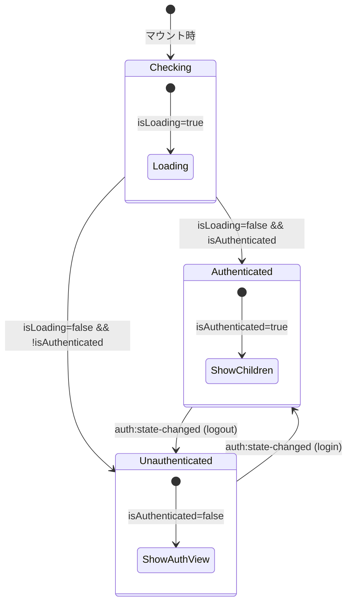
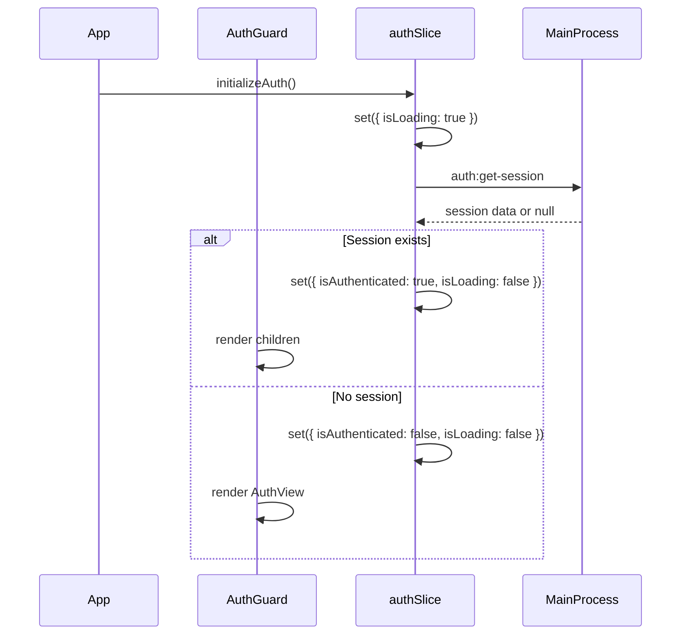

# AuthGuard 設計書

## コンポーネント概要

AuthGuardは、認証状態に基づいてアプリケーションへのアクセスを制御する高階コンポーネント（HOC）である。

## ファイル構成

```
apps/desktop/src/renderer/components/AuthGuard/
├── index.tsx           # メインコンポーネント
├── AuthGuard.test.tsx  # テストファイル
├── LoadingScreen.tsx   # ローディング画面コンポーネント
└── types.ts            # 型定義
```

## 型定義

```typescript
// types.ts
import { ReactNode } from "react";

/**
 * AuthGuardの内部状態
 */
export type AuthGuardState = "checking" | "authenticated" | "unauthenticated";

/**
 * AuthGuardのProps
 */
export interface AuthGuardProps {
  /** 認証済み時に表示する子コンポーネント */
  children: ReactNode;

  /** ローディング中に表示するカスタムコンポーネント（省略時はデフォルトローディング画面） */
  fallback?: ReactNode;
}
```

## コンポーネント実装設計

### index.tsx

```typescript
import React from "react";
import { useAppStore } from "../../store";
import { AuthView } from "../../views/AuthView";
import { LoadingScreen } from "./LoadingScreen";
import type { AuthGuardProps, AuthGuardState } from "./types";

/**
 * 認証ガードコンポーネント
 *
 * 認証状態に基づいて表示を制御する:
 * - checking: ローディング画面
 * - authenticated: 子コンポーネント
 * - unauthenticated: AuthView（ログイン画面）
 */
export const AuthGuard: React.FC<AuthGuardProps> = ({ children, fallback }) => {
  const isAuthenticated = useAppStore((state) => state.isAuthenticated);
  const isLoading = useAppStore((state) => state.isLoading);

  // 認証状態の判定
  const getAuthState = (): AuthGuardState => {
    if (isLoading) return "checking";
    if (isAuthenticated) return "authenticated";
    return "unauthenticated";
  };

  const authState = getAuthState();

  // 状態に応じたレンダリング
  switch (authState) {
    case "checking":
      return <>{fallback ?? <LoadingScreen />}</>;

    case "authenticated":
      return <>{children}</>;

    case "unauthenticated":
      return <AuthView />;
  }
};

AuthGuard.displayName = "AuthGuard";
```

### LoadingScreen.tsx

```typescript
import React from "react";
import { Spinner } from "../atoms/Spinner";
import { Icon } from "../atoms/Icon";

/**
 * 認証確認中のローディング画面
 */
export const LoadingScreen: React.FC = () => {
  return (
    <div
      className="h-screen w-screen flex flex-col items-center justify-center bg-[#0a0a0a]"
      role="status"
      aria-label="認証確認中"
    >
      {/* アプリロゴ */}
      <div className="mb-8">
        <Icon name="workflow" size={64} className="text-blue-400" />
      </div>

      {/* アプリ名 */}
      <h1 className="text-2xl font-bold text-white mb-8">
        AIWorkflowOrchestrator
      </h1>

      {/* スピナー */}
      <Spinner size="lg" className="text-blue-400" />

      {/* メッセージ */}
      <p className="mt-4 text-white/60 text-sm">読み込み中...</p>
    </div>
  );
};

LoadingScreen.displayName = "LoadingScreen";
```

## 状態遷移図



## App.tsx統合設計

```typescript
// App.tsx
import React, { useEffect } from "react";
import { useAppStore } from "./store";
import { AuthGuard } from "./components/AuthGuard";
import { AppDock } from "./components/organisms/AppDock";
// ... other imports

function App(): JSX.Element {
  // Initialize theme on app startup
  useThemeInitializer();

  // Initialize auth on app startup
  const initializeAuth = useAppStore((state) => state.initializeAuth);
  useEffect(() => {
    initializeAuth();
  }, [initializeAuth]);

  // ... existing code

  return (
    <AuthGuard>
      {/* 既存のアプリコンテンツ */}
      <div className="h-screen w-screen overflow-hidden bg-[#0a0a0a] text-white flex">
        {/* App Dock */}
        {isDesktop ? (
          <AppDock
            currentView={currentView}
            onViewChange={handleViewChange}
            mode="desktop"
          />
        ) : null}

        {/* Main Content Area */}
        <div className="flex-1 flex flex-col overflow-hidden">
          {/* Dynamic Island */}
          <div className="flex justify-center pt-4 pb-2">
            <DynamicIsland
              status={dynamicIsland.status}
              message={dynamicIsland.message}
              visible={dynamicIsland.visible}
            />
          </div>

          {/* View Content */}
          <main className="flex-1 overflow-auto p-6">{renderView()}</main>
        </div>

        {/* Mobile Bottom Navigation */}
        {!isDesktop ? (
          <div className="fixed bottom-0 left-0 right-0">
            <AppDock
              currentView={currentView}
              onViewChange={handleViewChange}
              mode="mobile"
            />
          </div>
        ) : null}
      </div>
    </AuthGuard>
  );
}
```

## 既存authSliceとの連携

### 使用する状態

| 状態              | 型        | 用途                   |
| ----------------- | --------- | ---------------------- |
| `isAuthenticated` | `boolean` | 認証状態の判定         |
| `isLoading`       | `boolean` | ローディング状態の判定 |

### 認証初期化フロー



### auth:state-changed イベント処理

`initializeAuth()`内で`onAuthStateChanged`リスナーが設定され、以下のケースで自動的に状態が更新される:

1. **OAuthコールバック完了時**: トークン取得 → セッション復元 → `isAuthenticated = true`
2. **ログアウト時**: `clearAuth()` → `isAuthenticated = false`
3. **セッション更新失敗時**: `clearAuth()` → `isAuthenticated = false`

AuthGuardはZustandの状態変更を自動的に検知し、再レンダリングされる。

## テスト設計

### テストケース

| テストID | シナリオ                      | 期待結果               |
| -------- | ----------------------------- | ---------------------- |
| AG-01    | isLoading=true                | LoadingScreen表示      |
| AG-02    | isLoading=false, isAuth=true  | children表示           |
| AG-03    | isLoading=false, isAuth=false | AuthView表示           |
| AG-04    | カスタムfallback指定          | 指定コンポーネント表示 |
| AG-05    | 認証状態変更（false→true）    | AuthView→children遷移  |
| AG-06    | 認証状態変更（true→false）    | children→AuthView遷移  |

### モック設計

```typescript
// テスト用モック
const mockUseAppStore = vi.fn();

vi.mock("../../store", () => ({
  useAppStore: (selector: (state: unknown) => unknown) =>
    selector(mockUseAppStore()),
}));

// テストケース例
describe("AuthGuard", () => {
  it("shows loading screen when isLoading is true", () => {
    mockUseAppStore.mockReturnValue({
      isAuthenticated: false,
      isLoading: true,
    });

    render(
      <AuthGuard>
        <div>Protected Content</div>
      </AuthGuard>
    );

    expect(screen.getByRole("status")).toBeInTheDocument();
    expect(screen.getByText("読み込み中...")).toBeInTheDocument();
  });
});
```

## 完了条件チェックリスト

- [x] AuthGuardのコンポーネントインターフェースが定義されている
- [x] 既存authSliceとの連携方法が設計されている
- [x] 認証状態によるレンダリング分岐が設計されている
- [x] auth:state-changedイベントのハンドリングが設計されている

## 参照

- `docs/30-workflows/login-only-auth/requirements-auth-guard.md` - 要件定義
- `apps/desktop/src/renderer/store/slices/authSlice.ts` - 認証状態管理
- `apps/desktop/src/renderer/App.tsx` - 統合先
