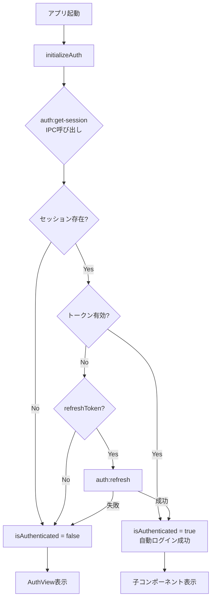
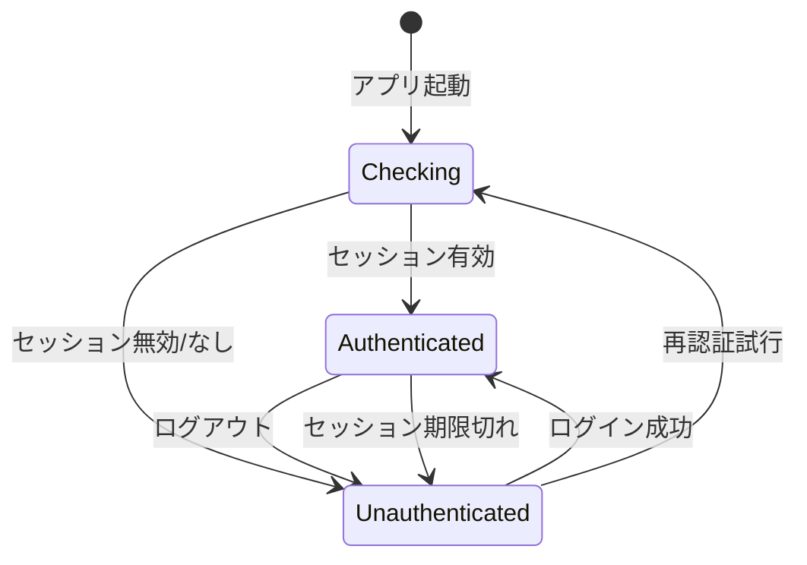

# AuthGuard 要件定義書

## 概要

AuthGuardは、認証状態に基づいてアプリケーションへのアクセスを制御するReactコンポーネントである。

## 機能要件

### FR-AG-01: 認証状態の判定

AuthGuardは以下の3つの状態を判定する:

| 状態              | 条件                                      | 表示内容                 |
| ----------------- | ----------------------------------------- | ------------------------ |
| `checking`        | `isLoading === true`                      | ローディング画面         |
| `authenticated`   | `isLoading === false && isAuthenticated`  | 子コンポーネント         |
| `unauthenticated` | `isLoading === false && !isAuthenticated` | AuthView（ログイン画面） |

### FR-AG-02: 既存authSliceとの連携

AuthGuardは既存の`authSlice`から以下の状態・アクションを使用する:

```typescript
// 使用する状態
const isAuthenticated = useAppStore((state) => state.isAuthenticated);
const isLoading = useAppStore((state) => state.isLoading);

// 使用するアクション
const initializeAuth = useAppStore((state) => state.initializeAuth);
```

### FR-AG-03: アプリ起動時のセッション確認

1. アプリ起動時に`initializeAuth()`を呼び出す
2. `initializeAuth()`は以下を実行する（既存実装）:
   - `auth:check-online`でオンライン状態を確認
   - `auth:get-session`でセッション情報を取得
   - セッションが有効な場合: `isAuthenticated = true`
   - セッションが無効/期限切れの場合: `isAuthenticated = false`
3. `auth:state-changed`イベントをサブスクライブする（既存実装）

### FR-AG-04: 自動ログイン判定ロジック

自動ログインは以下のフローで判定される（既存authSlice実装を活用）:



### FR-AG-05: 認証状態変更の監視

AuthGuardは`auth:state-changed`イベントを監視し、認証状態の変更を即座に反映する。

監視対象イベント:

- OAuthコールバック完了時
- ログアウト時
- セッション更新時

### FR-AG-06: ローディング状態の表示

`isLoading === true`の間、以下を表示する:

1. 全画面ローディング画面（AuthGuard専用）
2. アプリロゴ + スピナー
3. 「読み込み中...」テキスト

## 非機能要件

### NFR-AG-01: パフォーマンス

- セッション確認は500ms以内に完了すること
- ローディング画面の表示は即座に行うこと（白画面を見せない）

### NFR-AG-02: オフライン対応

- オフライン時でもローカルに保存されたセッション情報で認証状態を判定可能
- `isOffline === true`の場合でも、有効なリフレッシュトークンがあれば認証済みとして扱う

### NFR-AG-03: セキュリティ

- 認証状態は常にメインプロセス側で検証する
- レンダラー側の状態は表示制御のみに使用する

## インターフェース設計

### Props

```typescript
interface AuthGuardProps {
  /** 認証済み時に表示する子コンポーネント */
  children: React.ReactNode;

  /** ローディング中に表示するカスタムコンポーネント（省略可能） */
  fallback?: React.ReactNode;
}
```

### 使用例

```tsx
// App.tsx
import { AuthGuard } from "./components/AuthGuard";
import { AuthView } from "./views/AuthView";

const App: React.FC = () => {
  return (
    <AuthGuard fallback={<LoadingScreen />}>
      <MainContent />
    </AuthGuard>
  );
};
```

## 状態遷移図



## 既存実装との整合性

### 使用する既存コンポーネント

| コンポーネント | パス                       | 用途             |
| -------------- | -------------------------- | ---------------- |
| `Spinner`      | `components/atoms/Spinner` | ローディング表示 |
| `Icon`         | `components/atoms/Icon`    | アイコン表示     |

### 使用する既存状態管理

| 状態/アクション   | ソース      | 説明         |
| ----------------- | ----------- | ------------ |
| `isAuthenticated` | `authSlice` | 認証状態     |
| `isLoading`       | `authSlice` | 読み込み状態 |
| `initializeAuth`  | `authSlice` | 認証初期化   |

### 使用するIPCチャネル

| チャネル             | 用途             | 備考                   |
| -------------------- | ---------------- | ---------------------- |
| `auth:get-session`   | セッション取得   | initializeAuth内で使用 |
| `auth:refresh`       | トークン更新     | initializeAuth内で使用 |
| `auth:state-changed` | 認証状態変更通知 | イベントリスニング     |

## 完了条件チェックリスト

- [x] 既存authSliceとの連携方法が定義されている
- [x] 認証状態による画面遷移が明確に定義されている
- [x] 自動ログイン判定ロジックが定義されている
- [x] ローディング状態の扱いが定義されている

## 参照

- `apps/desktop/src/renderer/store/slices/authSlice.ts` - 認証状態管理
- `apps/desktop/src/preload/channels.ts` - IPCチャネル定義
- `packages/shared/types/auth.ts` - 認証型定義
