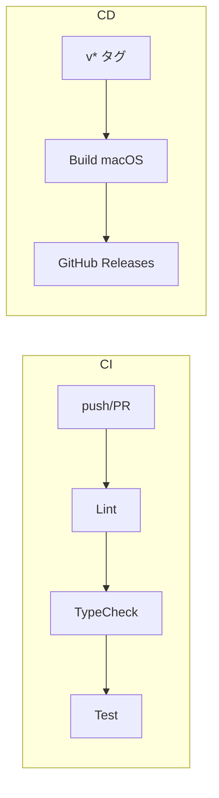

# CI/CD 設計書

## 概要

GitHub Actions による CI/CD パイプライン設計。
MVP では**無料枠のみ**を使用し、コストを $0 に抑える。

---

## コスト方針

| 項目 | 方針 | 理由 |
|------|------|------|
| ランナー | ubuntu-latest（CI）、macos-latest（CD） | 無料枠で利用可能 |
| ビルド対象 | macOS のみ | Windows/Linux は CI 時間消費 |
| コード署名 | なし | 有料証明書が必要 |
| E2E テスト | CI では実行しない | 時間消費が大きい |

### GitHub Actions 無料枠

| リポジトリ | 無料枠 |
|-----------|--------|
| Public | 無制限 |
| Private | 2,000分/月（macOS は 10x 消費） |

**推奨**: Public リポジトリで運用

---

## ワークフロー構成



---

## CI ワークフロー

### トリガー

| イベント | 対象 |
|---------|------|
| push | main ブランチ |
| pull_request | main ブランチへの PR |

### ジョブ構成

```yaml
# .github/workflows/ci.yml
name: CI

on:
  push:
    branches: [main]
  pull_request:
    branches: [main]

jobs:
  lint:
    runs-on: ubuntu-latest
    steps:
      - uses: actions/checkout@v4
      - uses: pnpm/action-setup@v4
      - uses: actions/setup-node@v4
        with:
          node-version: '22'
          cache: 'pnpm'
      - run: pnpm install
      - run: pnpm lint

  typecheck:
    runs-on: ubuntu-latest
    steps:
      - uses: actions/checkout@v4
      - uses: pnpm/action-setup@v4
      - uses: actions/setup-node@v4
        with:
          node-version: '22'
          cache: 'pnpm'
      - run: pnpm install
      - run: pnpm typecheck

  test:
    runs-on: ubuntu-latest
    steps:
      - uses: actions/checkout@v4
      - uses: pnpm/action-setup@v4
      - uses: actions/setup-node@v4
        with:
          node-version: '22'
          cache: 'pnpm'
      - run: pnpm install
      - run: pnpm test
```

### 実行時間目標

| ジョブ | 目標時間 |
|--------|---------|
| lint | 1分以内 |
| typecheck | 1分以内 |
| test | 3分以内 |
| **合計** | **5分以内** |

---

## CD ワークフロー

### トリガー

| イベント | 対象 |
|---------|------|
| push tags | v* パターン |
| workflow_dispatch | 手動実行 |

### ジョブ構成

```yaml
# .github/workflows/release-desktop.yml
name: Release Desktop

on:
  push:
    tags:
      - 'v*'
  workflow_dispatch:
    inputs:
      version:
        description: 'Version (e.g., 1.0.0)'
        required: true

jobs:
  build-macos:
    runs-on: macos-latest
    steps:
      - uses: actions/checkout@v4

      - uses: pnpm/action-setup@v4

      - uses: actions/setup-node@v4
        with:
          node-version: '22'
          cache: 'pnpm'

      - name: Install dependencies
        run: pnpm install

      - name: Build
        run: pnpm build
        env:
          # コード署名なし
          CSC_IDENTITY_AUTO_DISCOVERY: false

      - name: Package
        run: pnpm --filter @repo/desktop package:mac
        env:
          CSC_IDENTITY_AUTO_DISCOVERY: false

      - name: Upload artifact
        uses: actions/upload-artifact@v4
        with:
          name: desktop-macos
          path: apps/desktop/dist/*.dmg

  release:
    needs: build-macos
    runs-on: ubuntu-latest
    permissions:
      contents: write
    steps:
      - name: Download artifacts
        uses: actions/download-artifact@v4
        with:
          name: desktop-macos
          path: dist

      - name: Create Release
        uses: softprops/action-gh-release@v2
        with:
          files: dist/*
          generate_release_notes: true
          draft: false
          prerelease: ${{ contains(github.ref, 'alpha') || contains(github.ref, 'beta') }}
```

### ビルド設定

```yaml
# apps/desktop/electron-builder.yml
appId: com.example.workflow-orchestrator
productName: Workflow Orchestrator
directories:
  output: dist

mac:
  category: public.app-category.developer-tools
  target:
    - target: dmg
      arch:
        - universal  # Intel + Apple Silicon
  # コード署名なし（MVP）
  identity: null

# Windows/Linux は MVP では無効
# win:
#   target: nsis
# linux:
#   target: AppImage
```

---

## ブランチ保護ルール

| ルール | 設定 |
|--------|------|
| Require status checks | lint, typecheck, test |
| Require branches up to date | Yes |
| Require pull request | Yes（main への直接 push 禁止） |

---

## シークレット設定

MVP では不要（コード署名なし）。

### 将来（有料化後）

| シークレット | 用途 |
|-------------|------|
| APPLE_ID | Apple Developer アカウント |
| APPLE_PASSWORD | アプリ固有パスワード |
| APPLE_TEAM_ID | チーム ID |
| CSC_LINK | 証明書（Base64） |
| CSC_KEY_PASSWORD | 証明書パスワード |

---

## リリースフロー

### MVP（手動タグ）

```bash
# 1. バージョン更新
npm version patch  # or minor, major

# 2. タグをプッシュ
git push origin main --tags

# 3. GitHub Actions が自動実行
#    → macOS 向けビルド
#    → GitHub Releases にアップロード
```

### 将来（自動化）


---

## モニタリング

### GitHub Actions の監視項目

| 項目 | 閾値 |
|------|------|
| CI 成功率 | 90% 以上 |
| CI 実行時間 | 5分以内 |
| CD 実行時間 | 15分以内 |

### アラート

MVP ではなし（GitHub の通知機能で対応）。

---

## 将来の拡張

| 機能 | 優先度 | 備考 |
|------|--------|------|
| Windows ビルド | 中 | macos-latest → windows-latest 追加 |
| Linux ビルド | 低 | ubuntu-latest で AppImage |
| コード署名 | 中 | Apple/Microsoft 証明書 |
| 自動バージョニング | 低 | semantic-release |
| E2E テスト CI | 低 | Playwright ワークフロー追加 |
