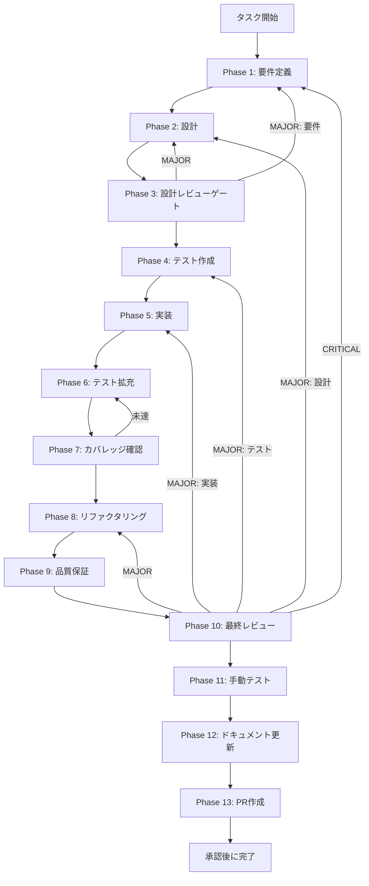

# TASK-SW-STREAM-001 - タスク実行仕様書

## ユーザーからの元の指示

```
SkillCreatorService.createSkill() にオプショナルなコールバック引数を追加し、
処理の各段階で進捗を通知できるようにする。
sendSkillCreatorProgress() は export されているが呼び出し元が存在しない問題を解消するため、
createSkill() 内部の処理節目でコールバックを呼び出す仕組みを実装する。
コールバックの接続（skillCreatorHandlers.ts 側）は別タスク（TASK-SW-STREAM-002）へ分離し、
本タスクは createSkill() へのコールバック引数追加と呼び出しのみを対象とする。
```

## メタ情報

| 項目         | 内容                                                               |
| ------------ | ------------------------------------------------------------------ |
| タスクID     | TASK-SW-STREAM-001                                                 |
| タスク名     | stream-001-add-progress-callback-to-create-skill                   |
| 分類         | 機能追加                                                           |
| 対象機能     | SkillCreatorService - createSkill にコールバック引数追加・進捗通知 |
| 優先度       | High                                                               |
| 見積もり規模 | 小規模                                                             |
| ステータス   | 未着手                                                             |
| 作成日       | 2026-04-16                                                         |
| depends_on   | なし                                                               |

---

## タスク概要

### 目的

`SkillCreatorService.createSkill()` にオプショナルなコールバック引数 `onProgress` を追加し、
処理の各段階（計画・SKILL.md生成・エージェント定義生成・検証・完了）でコールバックを呼び出す。

現状では `skillCreatorHandlers.ts:692` の `sendSkillCreatorProgress()` が export されているが
呼び出し元が存在しない。`createSkill()` は進捗データをコールバック経由で報告する仕組みを持っていないため、
フロント側の `useStreamingProgress` フックが IPC メッセージを受信できず、プログレスバーが常に初期状態のまま。

### 背景

`apps/desktop/src/main/ipc/skillCreatorHandlers.ts:692` の `sendSkillCreatorProgress` は
`mainWindow.webContents.send(IPC_CHANNELS.SKILL_CREATOR_PROGRESS, progress)` を呼び出す関数として
正しく実装されているが、`SKILL_CREATOR_CREATE` ハンドラー（:172-284）内では
`skillCreatorService.createSkill()` を呼ぶだけで進捗通知が一切送信されない。

フロント・Preload・メインの3層は接続設計として正しく定義されているが、
メインプロセス側からの実際の `send()` 呼び出しが欠落している状態である。

後続の `TASK-SW-STREAM-002` で `skillCreatorHandlers.ts` 側のコールバック接続を行うため、
本タスクで `createSkill()` のシグネチャに `onProgress` を追加し、処理節目での呼び出しを実装することが前提条件となる。

### 最終ゴール

- `createSkill()` に `onProgress?: (progress: { phase: string; percentage: number; message: string }) => void` 引数を追加する
- 処理の5節目でコールバックを呼び出す:
  - `runCreateWorkflow` 開始時: `{ phase: "planning", percentage: 10, message: "構造を計画しています" }`
  - SKILL.md 生成開始時: `{ phase: "generating-skill", percentage: 40, message: "SKILL.md を生成しています" }`
  - エージェント定義生成時: `{ phase: "generating-agents", percentage: 70, message: "エージェント定義を生成しています" }`
  - 検証開始時: `{ phase: "validating", percentage: 90, message: "スキルを検証しています" }`
  - 完了時: `{ phase: "done", percentage: 100, message: "完了しました" }`
- `onProgress` がオプショナルであるため、既存の呼び出し元への破壊的変更が発生しない
- 既存テストが全てパスし続ける

### 成果物一覧

| 種別         | 成果物                           | 配置先                                                                       |
| ------------ | -------------------------------- | ---------------------------------------------------------------------------- |
| 機能         | createSkill コールバック引数追加 | `apps/desktop/src/main/services/skill/SkillCreatorService.ts`                |
| テスト       | コールバック呼び出し検証テスト   | `apps/desktop/src/main/services/skill/__tests__/SkillCreatorService.test.ts` |
| ドキュメント | Phase 1-13 仕様・実行成果物      | `outputs/phase-1/ 〜 phase-13/`                                              |

---

## 参照ファイル

- `apps/desktop/src/main/services/skill/SkillCreatorService.ts` - 実装対象
- `apps/desktop/src/main/services/skill/__tests__/SkillCreatorService.test.ts` - テスト追加対象
- `apps/desktop/src/main/ipc/skillCreatorHandlers.ts` - 後続タスク TASK-SW-STREAM-002 の対象（参照のみ）
- `docs/30-workflows/skill-create-flow-gaps/00-task-spec-design-docs/phase-1-analysis.md` - 問題1の現状分析
- `docs/30-workflows/skill-create-flow-gaps/00-task-spec-design-docs/phase-2-solution.md` - 解決策設計（問題1 解決アプローチA）
- `docs/30-workflows/skill-create-flow-gaps/00-task-spec-design-docs/phase-3-review.md` - タスク粒度確認

---

## 受入条件

| ID   | 条件                                                                                                          |
| ---- | ------------------------------------------------------------------------------------------------------------- |
| AC-1 | `createSkill()` の第2引数に `onProgress?: (...) => void` が追加されている                                     |
| AC-2 | `runCreateWorkflow` 開始時に `onProgress` が `{ phase: "planning", percentage: 10, ... }` で呼び出される      |
| AC-3 | SKILL.md 生成開始時に `onProgress` が `{ phase: "generating-skill", percentage: 40, ... }` で呼び出される     |
| AC-4 | エージェント定義生成時に `onProgress` が `{ phase: "generating-agents", percentage: 70, ... }` で呼び出される |
| AC-5 | 検証開始時に `onProgress` が `{ phase: "validating", percentage: 90, ... }` で呼び出される                    |
| AC-6 | 完了時に `onProgress` が `{ phase: "done", percentage: 100, ... }` で呼び出される                             |
| AC-7 | `onProgress` が未指定の場合（`undefined`）でもエラーが発生しない（既存の呼び出し元は変更不要）                |
| AC-8 | 既存テスト（`collaborative` モード・`orchestrate` モード等）が全てパスし続ける                                |

---

## タスク分解サマリー

| ID     | フェーズ | サブタスク名       | 責務                                                     | 依存 |
| ------ | -------- | ------------------ | -------------------------------------------------------- | ---- |
| T-01-1 | Phase 1  | 要件定義           | 問題特定・受入条件策定・現状コード確認                   | -    |
| T-02-1 | Phase 2  | 設計               | createSkill コールバック引数追加の詳細設計               | T-01 |
| T-03-1 | Phase 3  | 設計レビューゲート | 設計の整合性・リスク検証                                 | T-02 |
| T-04-1 | Phase 4  | テスト作成         | TDD Red フェーズ用テストケース作成                       | T-03 |
| T-05-1 | Phase 5  | 実装               | createSkill にコールバック引数を追加する実装             | T-04 |
| T-06-1 | Phase 6  | テスト拡充         | 境界条件・コールバック未指定ケースの補強                 | T-05 |
| T-07-1 | Phase 7  | カバレッジ確認     | concern coverage と branch coverage の確認               | T-06 |
| T-08-1 | Phase 8  | リファクタリング   | 最小複雑性の再調整                                       | T-07 |
| T-09-1 | Phase 9  | 品質保証           | lint / typecheck / test の品質ゲート確認                 | T-08 |
| T-10-1 | Phase 10 | 最終レビュー       | AC・依存関係・4条件の最終判定                            | T-09 |
| T-11-1 | Phase 11 | 手動テスト         | create モード実フロー・コールバック呼び出し確認          | T-10 |
| T-12-1 | Phase 12 | ドキュメント更新   | 実装ガイド・未タスク・skill feedback・準拠チェックの固定 | T-11 |
| T-13-1 | Phase 13 | PR作成             | ユーザー承認後の変更要約と PR 作成                       | T-12 |

**総サブタスク数**: 13個

---

## 実行フロー図



---

## Phase一覧

| Phase | 名称               | 仕様書                                                       | ステータス |
| ----- | ------------------ | ------------------------------------------------------------ | ---------- |
| 1     | 要件定義           | [phase-1-requirements.md](phase-1-requirements.md)           | pending    |
| 2     | 設計               | [phase-2-design.md](phase-2-design.md)                       | pending    |
| 3     | 設計レビューゲート | [phase-3-design-review.md](phase-3-design-review.md)         | pending    |
| 4     | テスト作成         | [phase-4-test-creation.md](phase-4-test-creation.md)         | pending    |
| 5     | 実装               | [phase-5-implementation.md](phase-5-implementation.md)       | pending    |
| 6     | テスト拡充         | [phase-6-test-expansion.md](phase-6-test-expansion.md)       | pending    |
| 7     | カバレッジ確認     | [phase-7-coverage-check.md](phase-7-coverage-check.md)       | pending    |
| 8     | リファクタリング   | [phase-8-refactoring.md](phase-8-refactoring.md)             | pending    |
| 9     | 品質保証           | [phase-9-quality-assurance.md](phase-9-quality-assurance.md) | pending    |
| 10    | 最終レビューゲート | [phase-10-final-review.md](phase-10-final-review.md)         | pending    |
| 11    | 手動テスト         | [phase-11-manual-test.md](phase-11-manual-test.md)           | pending    |
| 12    | ドキュメント更新   | [phase-12-documentation.md](phase-12-documentation.md)       | pending    |
| 13    | PR作成             | [phase-13-pr-creation.md](phase-13-pr-creation.md)           | pending    |

---

## テストカバレッジ目標

### ユニットテスト

| 指標              | 最低基準 | 推奨基準 |
| ----------------- | -------- | -------- |
| Line Coverage     | 80%      | 90%      |
| Branch Coverage   | 60%      | 70%      |
| Function Coverage | 80%      | 90%      |

### 結合テスト

| 指標                         | 目標 |
| ---------------------------- | ---- |
| モジュール間インターフェース | 100% |
| 正常系シナリオ               | 100% |
| 異常系シナリオ               | 80%+ |

---

## 依存関係

- **depends_on**: なし（本タスクは独立して実施可能）
- **後続タスク**: TASK-SW-STREAM-002（本タスク完了後に着手 — `skillCreatorHandlers.ts` 側でコールバックを接続する）

---

## Phase完了時の必須アクション

1. **タスク100%実行**: Phase内で指定された全タスクを完全に実行
2. **成果物確認**: 全ての必須成果物が生成されていることを検証
3. **artifacts.json更新**: Phase完了ステータスを更新
4. **完了条件チェック**: 各タスクを完遂した旨を必ず明記

```bash
# Phase完了処理
node .claude/skills/task-specification-creator/scripts/complete-phase.js \
  --workflow docs/30-workflows/p02-par-STREAM-001 \
  --phase {{N}} \
  --artifacts "outputs/phase-{{N}}/{{FILE}}.md:{{DESCRIPTION}}"
```
