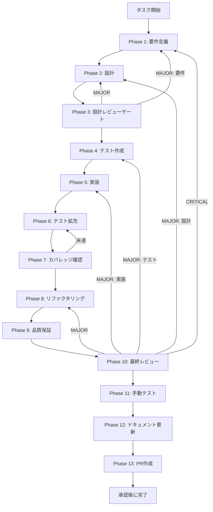

# TASK-SW-STREAM-002 - タスク実行仕様書

## ユーザーからの元の指示

```
skillCreatorHandlers.ts の SKILL_CREATOR_CREATE ハンドラーで、
skillCreatorService.createSkill() を呼び出す際に onProgress コールバックを接続し、
コールバック内で sendSkillCreatorProgress(mainWindow, progress) を呼び出す。
sendSkillCreatorProgress() は export されているが呼び出し元が存在しない問題を解消するため、
TASK-SW-STREAM-001 で追加した createSkill() の onProgress 引数に実際の IPC 送信処理を接続する。
```

## メタ情報

| 項目         | 内容                                                                       |
| ------------ | -------------------------------------------------------------------------- |
| タスクID     | TASK-SW-STREAM-002                                                         |
| タスク名     | stream-002-connect-progress-callback-to-handler                            |
| 分類         | 機能追加（接続）                                                           |
| 対象機能     | skillCreatorHandlers - SKILL_CREATOR_CREATE ハンドラーでコールバックを接続 |
| 優先度       | High                                                                       |
| 見積もり規模 | 極小                                                                       |
| ステータス   | 未着手                                                                     |
| 作成日       | 2026-04-16                                                                 |
| depends_on   | TASK-SW-STREAM-001                                                         |

---

## タスク概要

### 目的

`TASK-SW-STREAM-001` で `createSkill()` に追加した `onProgress` コールバック引数に、
`skillCreatorHandlers.ts` 内から `sendSkillCreatorProgress(mainWindow, progress)` を接続する。

現状では `sendSkillCreatorProgress()` は export されているが呼び出し元が存在しない。
`SKILL_CREATOR_CREATE` ハンドラー（:172-284）は `skillCreatorService.createSkill()` を
呼ぶだけで進捗通知を送らないため、フロント側の `useStreamingProgress` フックが
IPC メッセージを受信できず、プログレスバーが常に初期状態のまま。

### 背景

`apps/desktop/src/main/ipc/skillCreatorHandlers.ts:692` の `sendSkillCreatorProgress` は
`mainWindow.webContents.send(IPC_CHANNELS.SKILL_CREATOR_PROGRESS, progress)` を呼び出す関数として
正しく実装されているが、`SKILL_CREATOR_CREATE` ハンドラー（:172-284）内では呼び出されていない。

`TASK-SW-STREAM-001` によって `createSkill()` に `onProgress` 引数が追加されたため、
本タスクで `skillCreatorHandlers.ts` 側から接続することが可能になった。

また、`SkillCreateWizard.tsx` で `streaming.stage` / `streaming.percent` / `streaming.message` が
`GenerateStep` に渡されているかを確認し、接続されていなければ本タスクのスコープに追加する。

フロント側の `useStreamingProgress.ts` はすでに正しく実装済みであり、変更不要。

### 最終ゴール

- `skillCreatorHandlers.ts:276` の呼び出し箇所を以下のように変更する:

  ```typescript
  // 変更前
  const skillDir = await skillCreatorService.createSkill(validatedArgs);

  // 変更後
  const skillDir = await skillCreatorService.createSkill(
    validatedArgs,
    (progress) => {
      sendSkillCreatorProgress(mainWindow, progress);
    },
  );
  ```

- `sendSkillCreatorProgress` の呼び出し元を確立し、export されているのに呼ばれない状態を解消する
- スキル生成中にフロント側 `GenerateStep` のプログレスバーが更新されるようにする
- `useStreamingProgress` の `stage` が `idle` 以外に遷移するようにする
- 既存の `SKILL_CREATOR_CREATE` ハンドラーの正常系テストが全てパスし続ける

### 成果物一覧

| 種別         | 成果物                                            | 配置先                                              |
| ------------ | ------------------------------------------------- | --------------------------------------------------- |
| 機能         | SKILL_CREATOR_CREATE ハンドラーのコールバック接続 | `apps/desktop/src/main/ipc/skillCreatorHandlers.ts` |
| テスト       | コールバック接続検証テスト                        | 対象ハンドラーテストファイル（既存 or 新規）        |
| ドキュメント | Phase 1-13 仕様・実行成果物                       | `outputs/phase-1/ 〜 phase-13/`                     |

---

## 参照ファイル

- `apps/desktop/src/main/ipc/skillCreatorHandlers.ts` - 実装対象（:276 の呼び出し箇所・:692 の sendSkillCreatorProgress）
- `apps/desktop/src/main/services/skill/SkillCreatorService.ts` - TASK-SW-STREAM-001 で変更済み（onProgress 引数）
- `apps/desktop/src/renderer/components/skill-creator/steps/GenerateStep.tsx` - フロント側のプログレス表示確認対象
- `apps/desktop/src/renderer/components/skill-creator/SkillCreateWizard.tsx` - streaming prop 接続確認対象
- `apps/desktop/src/renderer/hooks/useStreamingProgress.ts` - フロント側（変更不要・参照のみ）
- `docs/30-workflows/skill-create-flow-gaps/00-task-spec-design-docs/phase-1-analysis.md` - 問題の現状分析
- `docs/30-workflows/skill-create-flow-gaps/00-task-spec-design-docs/phase-2-solution.md` - 解決策設計
- `docs/30-workflows/skill-create-flow-gaps/00-task-spec-design-docs/phase-3-review.md` - 追加確認事項

---

## 受入条件

| ID   | 条件                                                                                                 |
| ---- | ---------------------------------------------------------------------------------------------------- |
| AC-1 | `SKILL_CREATOR_CREATE` ハンドラーが `createSkill()` を `onProgress` コールバック付きで呼び出している |
| AC-2 | コールバック内で `sendSkillCreatorProgress(mainWindow, progress)` が呼ばれる                         |
| AC-3 | スキル生成中にフロント側 `GenerateStep` のプログレスバーが更新される                                 |
| AC-4 | `useStreamingProgress` の `stage` が `idle` 以外に遷移する                                           |
| AC-5 | 既存の `SKILL_CREATOR_CREATE` ハンドラーの正常系テストが全てパスし続ける                             |

---

## タスク分解サマリー

| ID     | フェーズ | サブタスク名       | 責務                                                     | 依存 |
| ------ | -------- | ------------------ | -------------------------------------------------------- | ---- |
| T-01-1 | Phase 1  | 要件定義           | 問題特定・受入条件策定・現状コード確認                   | -    |
| T-02-1 | Phase 2  | 設計               | ハンドラーへのコールバック接続の詳細設計・フロント確認   | T-01 |
| T-03-1 | Phase 3  | 設計レビューゲート | 設計の整合性・リスク検証                                 | T-02 |
| T-04-1 | Phase 4  | テスト作成         | TDD Red フェーズ用テストケース作成                       | T-03 |
| T-05-1 | Phase 5  | 実装               | ハンドラーのコールバック接続実装                         | T-04 |
| T-06-1 | Phase 6  | テスト拡充         | 境界条件・IPC 送信確認の補強                             | T-05 |
| T-07-1 | Phase 7  | カバレッジ確認     | concern coverage と branch coverage の確認               | T-06 |
| T-08-1 | Phase 8  | リファクタリング   | 最小複雑性の再調整                                       | T-07 |
| T-09-1 | Phase 9  | 品質保証           | lint / typecheck / test の品質ゲート確認                 | T-08 |
| T-10-1 | Phase 10 | 最終レビュー       | AC・依存関係・4条件の最終判定                            | T-09 |
| T-11-1 | Phase 11 | 手動テスト         | create モード実フロー・プログレスバー更新確認            | T-10 |
| T-12-1 | Phase 12 | ドキュメント更新   | 実装ガイド・未タスク・skill feedback・準拠チェックの固定 | T-11 |
| T-13-1 | Phase 13 | PR作成             | ユーザー承認後の変更要約と PR 作成                       | T-12 |

**総サブタスク数**: 13個

---

## 実行フロー図



---

## Phase一覧

| Phase | 名称               | 仕様書                                                       | ステータス |
| ----- | ------------------ | ------------------------------------------------------------ | ---------- |
| 1     | 要件定義           | [phase-1-requirements.md](phase-1-requirements.md)           | pending    |
| 2     | 設計               | [phase-2-design.md](phase-2-design.md)                       | pending    |
| 3     | 設計レビューゲート | [phase-3-design-review.md](phase-3-design-review.md)         | pending    |
| 4     | テスト作成         | [phase-4-test-creation.md](phase-4-test-creation.md)         | pending    |
| 5     | 実装               | [phase-5-implementation.md](phase-5-implementation.md)       | pending    |
| 6     | テスト拡充         | [phase-6-test-expansion.md](phase-6-test-expansion.md)       | pending    |
| 7     | カバレッジ確認     | [phase-7-coverage-check.md](phase-7-coverage-check.md)       | pending    |
| 8     | リファクタリング   | [phase-8-refactoring.md](phase-8-refactoring.md)             | pending    |
| 9     | 品質保証           | [phase-9-quality-assurance.md](phase-9-quality-assurance.md) | pending    |
| 10    | 最終レビューゲート | [phase-10-final-review.md](phase-10-final-review.md)         | pending    |
| 11    | 手動テスト         | [phase-11-manual-test.md](phase-11-manual-test.md)           | pending    |
| 12    | ドキュメント更新   | [phase-12-documentation.md](phase-12-documentation.md)       | pending    |
| 13    | PR作成             | [phase-13-pr-creation.md](phase-13-pr-creation.md)           | pending    |

---

## テストカバレッジ目標

### ユニットテスト

| 指標              | 最低基準 | 推奨基準 |
| ----------------- | -------- | -------- |
| Line Coverage     | 80%      | 90%      |
| Branch Coverage   | 60%      | 70%      |
| Function Coverage | 80%      | 90%      |

### 結合テスト

| 指標                         | 目標 |
| ---------------------------- | ---- |
| モジュール間インターフェース | 100% |
| 正常系シナリオ               | 100% |
| 異常系シナリオ               | 80%+ |

---

## 依存関係

- **depends_on**: TASK-SW-STREAM-001（`createSkill()` への `onProgress` 引数追加が前提）
- **後続タスク**: なし（本タスクをもってプログレス接続が完成する）

---

## Phase完了時の必須アクション

1. **タスク100%実行**: Phase内で指定された全タスクを完全に実行
2. **成果物確認**: 全ての必須成果物が生成されていることを検証
3. **artifacts.json更新**: Phase完了ステータスを更新
4. **完了条件チェック**: 各タスクを完遂した旨を必ず明記

```bash
# Phase完了処理
node .claude/skills/task-specification-creator/scripts/complete-phase.js \
  --workflow docs/30-workflows/p03-par-STREAM-002 \
  --phase {{N}} \
  --artifacts "outputs/phase-{{N}}/{{FILE}}.md:{{DESCRIPTION}}"
```
