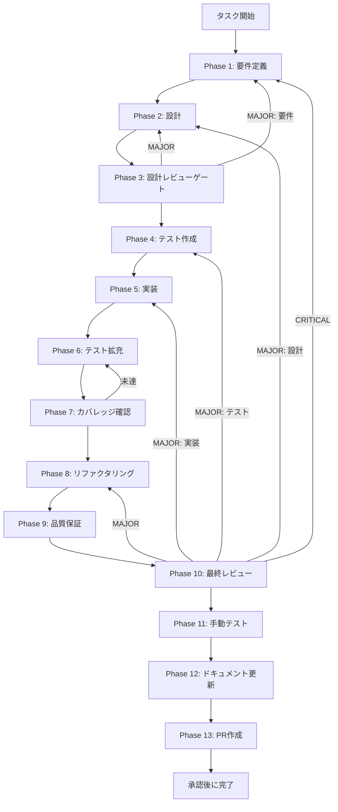

# TASK-SW-CANCEL-001 - タスク実行仕様書

## ユーザーからの元の指示

```
IPC チャンネル定数 SKILL_CREATOR_CANCEL を packages/shared/src/ipc/channels.ts の
SKILL_CREATOR_RUNTIME_CHANNELS に追加する。
キャンセル処理のIPC連携を実現するための最初のステップとして、
チャンネル定数の定義を行う。
```

## メタ情報

| 項目         | 内容                                                     |
| ------------ | -------------------------------------------------------- |
| タスクID     | TASK-SW-CANCEL-001                                       |
| タスク名     | cancel-001-add-skill-creator-cancel-channel              |
| 分類         | 機能追加                                                 |
| 対象機能     | IPC チャンネル - SKILL_CREATOR_CANCEL チャンネル定数追加 |
| 優先度       | High                                                     |
| 見積もり規模 | 極小（1行追加）                                          |
| ステータス   | 未着手                                                   |
| 作成日       | 2026-04-16                                               |
| depends_on   | なし                                                     |

---

## タスク概要

### 目的

`packages/shared/src/ipc/channels.ts` の `SKILL_CREATOR_RUNTIME_CHANNELS` に
`SKILL_CREATOR_CANCEL: "skill-creator:cancel"` を追加する。

現状では `skillCreatorHandlers.ts` に `SKILL_CREATOR_CANCEL` チャンネルの登録がなく、
`AbortSignal` を受け取るハンドラーも存在しない。`useCancelGeneration.ts:24-31` の
`cancelGeneration()` は renderer 内の `AbortController.abort()` を呼び出すだけで
IPC 経由の通知がない。

本タスクはキャンセル処理を IPC 経由でメインプロセスに伝達するための最初のステップとして、
チャンネル定数の定義のみを行う。

### 背景

`docs/30-workflows/skill-create-flow-gaps/00-task-spec-design-docs/phase-1-analysis.md` の
問題2「キャンセル処理の連動不明（useCancelGeneration）」で判明した未接続箇所への対応。

`cancelGeneration()` は renderer プロセス内の `AbortController.abort()` を呼び出すだけで、
IPC チャンネルを通じてメインプロセスに通知する仕組みが実装されていない。
コメントの「メインプロセス側も中断される」は将来の意図を記したメモであり、
現時点では実装されていない。

`apps/desktop/src/preload/channels.ts` 側は `SKILL_CREATOR_RUNTIME_CHANNELS` を
スプレッドしているため、本タスクでチャンネル定数を追加するだけで Preload 側は自動で有効になる。

### 最終ゴール

- `SKILL_CREATOR_RUNTIME_CHANNELS` に `SKILL_CREATOR_CANCEL: "skill-creator:cancel"` が追加されている
- TypeScript の型エラーがない
- Preload 側の channels.ts がスプレッドにより自動で有効になることを確認
- 既存テストが全てパスし続ける

### 成果物一覧

| 種別         | 成果物                                  | 配置先                                |
| ------------ | --------------------------------------- | ------------------------------------- |
| 機能         | SKILL_CREATOR_CANCEL チャンネル定数追加 | `packages/shared/src/ipc/channels.ts` |
| ドキュメント | Phase 1-13 仕様・実行成果物             | `outputs/phase-1/ 〜 phase-13/`       |

---

## 参照ファイル

- `packages/shared/src/ipc/channels.ts` - 実装対象（行 195-211 付近 SKILL_CREATOR_RUNTIME_CHANNELS）
- `apps/desktop/src/preload/channels.ts` - スプレッド確認対象
- `apps/desktop/src/renderer/hooks/useCancelGeneration.ts` - キャンセル処理フロント側
- `docs/30-workflows/skill-create-flow-gaps/00-task-spec-design-docs/phase-1-analysis.md` - 問題2の現状分析
- `docs/30-workflows/skill-create-flow-gaps/00-task-spec-design-docs/phase-2-solution.md` - 解決策設計（問題2 解決アプローチA）

---

## 受入条件

| ID   | 条件                                                                                                                 |
| ---- | -------------------------------------------------------------------------------------------------------------------- |
| AC-1 | `SKILL_CREATOR_CANCEL: "skill-creator:cancel"` が `channels.ts` の `SKILL_CREATOR_RUNTIME_CHANNELS` に追加されている |
| AC-2 | Preload 側の `channels.ts` が `SKILL_CREATOR_RUNTIME_CHANNELS` をスプレッドしているため、自動で有効になることを確認  |
| AC-3 | TypeScript の型エラーがない                                                                                          |
| AC-4 | 既存テストが全てパスし続ける                                                                                         |

---

## タスク分解サマリー

| ID     | フェーズ | サブタスク名       | 責務                                               | 依存 |
| ------ | -------- | ------------------ | -------------------------------------------------- | ---- |
| T-01-1 | Phase 1  | 要件定義           | 問題特定・受入条件策定・現状コード確認             | -    |
| T-02-1 | Phase 2  | 設計               | SKILL_CREATOR_CANCEL チャンネル追加の詳細設計      | T-01 |
| T-03-1 | Phase 3  | 設計レビューゲート | 設計の整合性・リスク検証                           | T-02 |
| T-04-1 | Phase 4  | テスト作成         | TDD Red フェーズ用テストケース作成                 | T-03 |
| T-05-1 | Phase 5  | 実装               | SKILL_CREATOR_CANCEL チャンネル定数追加            | T-04 |
| T-06-1 | Phase 6  | テスト拡充         | 境界条件・型確認の補強                             | T-05 |
| T-07-1 | Phase 7  | カバレッジ確認     | concern coverage と branch coverage の確認         | T-06 |
| T-08-1 | Phase 8  | リファクタリング   | 最小複雑性の再調整                                 | T-07 |
| T-09-1 | Phase 9  | 品質保証           | lint / typecheck / test の品質ゲート確認           | T-08 |
| T-10-1 | Phase 10 | 最終レビュー       | AC・依存関係・4条件の最終判定                      | T-09 |
| T-11-1 | Phase 11 | 手動テスト         | Preload 自動有効化・IPC チャンネル存在確認         | T-10 |
| T-12-1 | Phase 12 | ドキュメント更新   | 実装ガイド・未タスク・skill feedback・準拠チェック | T-11 |
| T-13-1 | Phase 13 | PR作成             | ユーザー承認後の変更要約と PR 作成                 | T-12 |

**総サブタスク数**: 13個

---

## 実行フロー図



---

## Phase一覧

| Phase | 名称               | 仕様書                                                       | ステータス |
| ----- | ------------------ | ------------------------------------------------------------ | ---------- |
| 1     | 要件定義           | [phase-1-requirements.md](phase-1-requirements.md)           | pending    |
| 2     | 設計               | [phase-2-design.md](phase-2-design.md)                       | pending    |
| 3     | 設計レビューゲート | [phase-3-design-review.md](phase-3-design-review.md)         | pending    |
| 4     | テスト作成         | [phase-4-test-creation.md](phase-4-test-creation.md)         | pending    |
| 5     | 実装               | [phase-5-implementation.md](phase-5-implementation.md)       | pending    |
| 6     | テスト拡充         | [phase-6-test-expansion.md](phase-6-test-expansion.md)       | pending    |
| 7     | カバレッジ確認     | [phase-7-coverage-check.md](phase-7-coverage-check.md)       | pending    |
| 8     | リファクタリング   | [phase-8-refactoring.md](phase-8-refactoring.md)             | pending    |
| 9     | 品質保証           | [phase-9-quality-assurance.md](phase-9-quality-assurance.md) | pending    |
| 10    | 最終レビューゲート | [phase-10-final-review.md](phase-10-final-review.md)         | pending    |
| 11    | 手動テスト         | [phase-11-manual-test.md](phase-11-manual-test.md)           | pending    |
| 12    | ドキュメント更新   | [phase-12-documentation.md](phase-12-documentation.md)       | pending    |
| 13    | PR作成             | [phase-13-pr-creation.md](phase-13-pr-creation.md)           | pending    |

---

## テストカバレッジ目標

### ユニットテスト

| 指標              | 最低基準 | 推奨基準 |
| ----------------- | -------- | -------- |
| Line Coverage     | 80%      | 90%      |
| Branch Coverage   | 60%      | 70%      |
| Function Coverage | 80%      | 90%      |

### 結合テスト

| 指標                         | 目標 |
| ---------------------------- | ---- |
| モジュール間インターフェース | 100% |
| 正常系シナリオ               | 100% |
| 異常系シナリオ               | 80%+ |

---

## 依存関係

- **depends_on**: なし（本タスクは独立して実施可能）
- **後続タスク**: TASK-SW-CANCEL-002（Preload API に cancelGeneration メソッド追加）

---

## Phase完了時の必須アクション

1. **タスク100%実行**: Phase内で指定された全タスクを完全に実行
2. **成果物確認**: 全ての必須成果物が生成されていることを検証
3. **artifacts.json更新**: Phase完了ステータスを更新
4. **完了条件チェック**: 各タスクを完遂した旨を必ず明記

```bash
# Phase完了処理
node .claude/skills/task-specification-creator/scripts/complete-phase.js \
  --workflow docs/30-workflows/p04-par-CANCEL-001 \
  --phase {{N}} \
  --artifacts "outputs/phase-{{N}}/{{FILE}}.md:{{DESCRIPTION}}"
```
