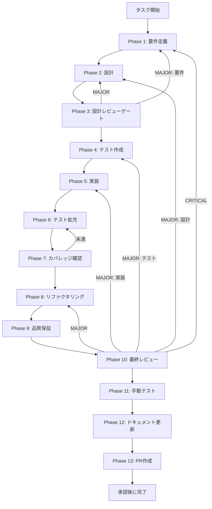

# TASK-SW-CANCEL-002 - タスク実行仕様書

## ユーザーからの元の指示

```
Preload skillCreatorAPI に cancelGeneration メソッドを追加する。
現在 Preload 側に cancelGeneration / cancel メソッドが存在しないため、
window.skillCreatorAPI.cancelGeneration() の呼び出しで型エラーが発生する。
safeInvoke(IPC_CHANNELS.SKILL_CREATOR_CANCEL) を使用した実装を追加し、
ALLOWED_INVOKE_CHANNELS への追加も合わせて行う。
```

## メタ情報

| 項目         | 内容                                                    |
| ------------ | ------------------------------------------------------- |
| タスクID     | TASK-SW-CANCEL-002                                      |
| タスク名     | cancel-002-add-preload-cancel-generation-method         |
| 分類         | 機能追加                                                |
| 対象機能     | Preload skillCreatorAPI - cancelGeneration メソッド追加 |
| 優先度       | High                                                    |
| 見積もり規模 | 小規模                                                  |
| ステータス   | 未着手                                                  |
| 作成日       | 2026-04-16                                              |
| depends_on   | TASK-SW-CANCEL-001                                      |

---

## タスク概要

### 目的

`apps/desktop/src/preload/skill-creator-api.ts` の `SkillCreatorAPI` インターフェースおよび実装に
`cancelGeneration: () => Promise<IpcResult<void>>` メソッドを追加する。
また `apps/desktop/src/preload/channels.ts` の `ALLOWED_INVOKE_CHANNELS` に
`SKILL_CREATOR_CANCEL` を追加することで、IPC 呼び出しを許可する。

### 背景

TASK-SW-CANCEL-001 で Main プロセス側（`SkillCreatorService`）にキャンセル処理が実装されたが、
Preload 側の `skillCreatorAPI` に `cancelGeneration` メソッドが存在しないため、
Renderer プロセスから `window.skillCreatorAPI.cancelGeneration()` を呼び出すと型エラーが発生する。

また、`ALLOWED_INVOKE_CHANNELS` に `SKILL_CREATOR_CANCEL` が含まれていないと、
`safeInvoke` によるセキュリティチェックが失敗する。

本タスクでは Preload 層の2ファイルを修正することで、
Renderer から Main のキャンセル処理を型安全に呼び出せるようにする。

### 最終ゴール

- `SkillCreatorAPI` インターフェースに `cancelGeneration: () => Promise<IpcResult<void>>` が追加されている
- `cancelGeneration` の実装が `safeInvoke(IPC_CHANNELS.SKILL_CREATOR_CANCEL)` を使用している
- `ALLOWED_INVOKE_CHANNELS` に `SKILL_CREATOR_CANCEL` が追加されている
- `window.skillCreatorAPI.cancelGeneration()` が型エラーなく呼び出せる
- 既存の Preload API テストが全てパスし続ける

### 成果物一覧

| 種別         | 成果物                           | 配置先                                          |
| ------------ | -------------------------------- | ----------------------------------------------- |
| 機能         | cancelGeneration メソッド追加    | `apps/desktop/src/preload/skill-creator-api.ts` |
| 機能         | ALLOWED_INVOKE_CHANNELS への追加 | `apps/desktop/src/preload/channels.ts`          |
| ドキュメント | Phase 1-13 仕様・実行成果物      | `outputs/phase-1/ 〜 phase-13/`                 |

---

## 参照ファイル

- `apps/desktop/src/preload/skill-creator-api.ts` - 実装対象（行 69-391）
- `apps/desktop/src/preload/channels.ts` - `ALLOWED_INVOKE_CHANNELS` 追加対象
- `apps/desktop/src/preload/types.ts` - 行 1865 で `skillCreatorAPI` 型定義あり（自動伝播確認用）
- `docs/30-workflows/skill-create-flow-gaps/00-task-spec-design-docs/phase-1-analysis.md` - 問題の現状分析
- `docs/30-workflows/skill-create-flow-gaps/00-task-spec-design-docs/phase-2-solution.md` - 解決策設計
- `docs/30-workflows/skill-create-flow-gaps/00-task-spec-design-docs/phase-3-review.md` - タスク粒度確認

---

## 受入条件

| ID   | 条件                                                                                                     |
| ---- | -------------------------------------------------------------------------------------------------------- |
| AC-1 | `SkillCreatorAPI` インターフェースに `cancelGeneration: () => Promise<IpcResult<void>>` が追加されている |
| AC-2 | `cancelGeneration` の実装が `safeInvoke(IPC_CHANNELS.SKILL_CREATOR_CANCEL)` を使用している               |
| AC-3 | `ALLOWED_INVOKE_CHANNELS` に `SKILL_CREATOR_CANCEL` が追加されている                                     |
| AC-4 | `window.skillCreatorAPI.cancelGeneration()` が型エラーなく呼び出せる                                     |
| AC-5 | 既存のPreload APIテストが全てパスし続ける                                                                |

---

## タスク分解サマリー

| ID     | フェーズ | サブタスク名       | 責務                                                                  | 依存 |
| ------ | -------- | ------------------ | --------------------------------------------------------------------- | ---- |
| T-01-1 | Phase 1  | 要件定義           | 問題特定・受入条件策定・現状コード確認                                | -    |
| T-02-1 | Phase 2  | 設計               | cancelGeneration 追加の詳細設計                                       | T-01 |
| T-03-1 | Phase 3  | 設計レビューゲート | 設計の整合性・リスク検証                                              | T-02 |
| T-04-1 | Phase 4  | テスト作成         | TDD Red フェーズ用テストケース作成                                    | T-03 |
| T-05-1 | Phase 5  | 実装               | cancelGeneration メソッド追加と channels.ts 修正                      | T-04 |
| T-06-1 | Phase 6  | テスト拡充         | 境界条件・型整合性の補強                                              | T-05 |
| T-07-1 | Phase 7  | カバレッジ確認     | concern coverage と branch coverage の確認                            | T-06 |
| T-08-1 | Phase 8  | リファクタリング   | 最小複雑性の再調整                                                    | T-07 |
| T-09-1 | Phase 9  | 品質保証           | lint / typecheck / test の品質ゲート確認                              | T-08 |
| T-10-1 | Phase 10 | 最終レビュー       | AC・依存関係・4条件の最終判定                                         | T-09 |
| T-11-1 | Phase 11 | 手動テスト         | cancelGeneration 呼び出しの実フロー確認                               | T-10 |
| T-12-1 | Phase 12 | ドキュメント更新   | 実装ガイド・system spec・未タスク・skill feedback・準拠チェックの固定 | T-11 |
| T-13-1 | Phase 13 | PR作成             | ユーザー承認後の変更要約と PR 作成                                    | T-12 |

**総サブタスク数**: 13個

---

## 実行フロー図



---

## Phase一覧

| Phase | 名称               | 仕様書                                                       | ステータス |
| ----- | ------------------ | ------------------------------------------------------------ | ---------- |
| 1     | 要件定義           | [phase-1-requirements.md](phase-1-requirements.md)           | pending    |
| 2     | 設計               | [phase-2-design.md](phase-2-design.md)                       | pending    |
| 3     | 設計レビューゲート | [phase-3-design-review.md](phase-3-design-review.md)         | pending    |
| 4     | テスト作成         | [phase-4-test-creation.md](phase-4-test-creation.md)         | pending    |
| 5     | 実装               | [phase-5-implementation.md](phase-5-implementation.md)       | pending    |
| 6     | テスト拡充         | [phase-6-test-expansion.md](phase-6-test-expansion.md)       | pending    |
| 7     | カバレッジ確認     | [phase-7-coverage-check.md](phase-7-coverage-check.md)       | pending    |
| 8     | リファクタリング   | [phase-8-refactoring.md](phase-8-refactoring.md)             | pending    |
| 9     | 品質保証           | [phase-9-quality-assurance.md](phase-9-quality-assurance.md) | pending    |
| 10    | 最終レビューゲート | [phase-10-final-review.md](phase-10-final-review.md)         | pending    |
| 11    | 手動テスト         | [phase-11-manual-test.md](phase-11-manual-test.md)           | pending    |
| 12    | ドキュメント更新   | [phase-12-documentation.md](phase-12-documentation.md)       | pending    |
| 13    | PR作成             | [phase-13-pr-creation.md](phase-13-pr-creation.md)           | pending    |

---

## テストカバレッジ目標

### ユニットテスト

| 指標              | 最低基準 | 推奨基準 |
| ----------------- | -------- | -------- |
| Line Coverage     | 80%      | 90%      |
| Branch Coverage   | 60%      | 70%      |
| Function Coverage | 80%      | 90%      |

### 結合テスト

| 指標                         | 目標 |
| ---------------------------- | ---- |
| モジュール間インターフェース | 100% |
| 正常系シナリオ               | 100% |
| 異常系シナリオ               | 80%+ |

---

## 依存関係

- **depends_on**: TASK-SW-CANCEL-001（Main プロセス側のキャンセル処理実装）
- **後続タスク**: Renderer 側 UI からのキャンセル呼び出し実装（別タスク）

---

## Phase完了時の必須アクション

1. **タスク100%実行**: Phase内で指定された全タスクを完全に実行
2. **成果物確認**: 全ての必須成果物が生成されていることを検証
3. **artifacts.json更新**: Phase完了ステータスを更新
4. **完了条件チェック**: 各タスクを完遂した旨を必ず明記

```bash
# Phase完了処理
node .claude/skills/task-specification-creator/scripts/complete-phase.js \
  --workflow docs/30-workflows/p05-par-CANCEL-002 \
  --phase {{N}} \
  --artifacts "outputs/phase-{{N}}/{{FILE}}.md:{{DESCRIPTION}}"
```
