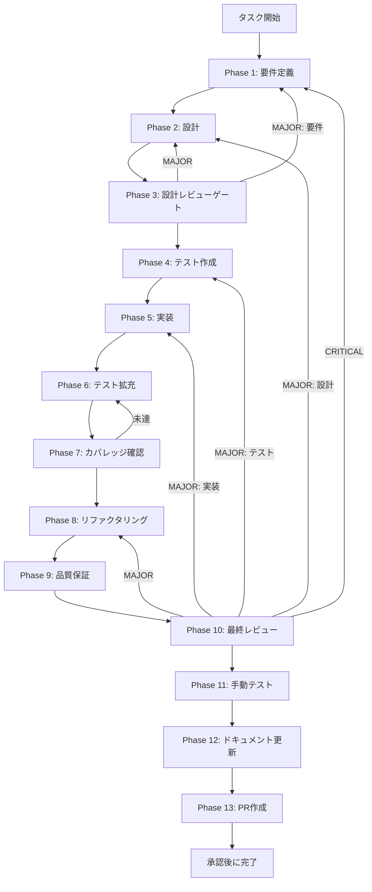

# TASK-SW-STRUCT-002 - タスク実行仕様書

## ユーザーからの元の指示

```
SkillCreatorService の void structurePlan を削除し、SKILL.md 生成に structurePlan を接続する。
TASK-SW-STRUCT-001 で修正された structurePlan の内容（purpose / agents）を
generate_skill_md.js に渡して SKILL.md を生成するよう接続する。
structurePlan が null の場合のフォールバック処理も合わせて実装する。
```

## メタ情報

| 項目         | 内容                                                                                |
| ------------ | ----------------------------------------------------------------------------------- |
| タスクID     | TASK-SW-STRUCT-002                                                                  |
| タスク名     | struct-002-connect-structure-plan-to-generate-skill-md                              |
| 分類         | バグ修正・機能追加                                                                  |
| 対象機能     | SkillCreatorService - void structurePlan 削除、SKILL.md 生成に structurePlan を接続 |
| 優先度       | High                                                                                |
| 見積もり規模 | 小規模                                                                              |
| ステータス   | 完了（Phase 13 blocked）                                                            |
| 作成日       | 2026-04-16                                                                          |
| depends_on   | TASK-SW-STRUCT-001                                                                  |

---

## タスク概要

### 目的

`SkillCreatorService` の `:126` に残されていた `void structurePlan;`（意図的な未実装プレースホルダー）を削除し、
`generateSkillMd(skillDir, structurePlan)` プライベートメソッドを新規実装して、
`runCreateWorkflow` が返す `StructurePlanJson` を SKILL.md 生成に接続する。

TASK-SW-STRUCT-001 によって `structurePlan` の各フィールドが意味的に正しい値を持つようになったため、
本タスクでその内容を実際の SKILL.md 生成（`generate_skill_md.js` スクリプト）に渡す接続を実現する。

### 背景

`SkillCreatorService.ts:126` には以下のコードが存在していた。

```typescript
void structurePlan; // 将来 generateSkillMd へ渡す（タスクA完了後に接続）
```

これは TASK-SW-STRUCT-001（タスクA）完了後に接続することが明記された意図的な未実装プレースホルダーであった。
また SKILL.md 生成（`:173-218`）は `structurePlan` と無関係な固定の `plan` オブジェクトを使用しており、
`structurePlan` の内容が SKILL.md に反映されていなかった。

TASK-SW-STRUCT-001 の完了により、`structurePlan.purpose` / `structurePlan.agents` が
正しい値を持つことが保証されたため、本タスクで接続を行う。

### 最終ゴール

- `:126` の `void structurePlan;` を削除する
- `generateSkillMd(skillDir, structurePlan)` プライベートメソッドを新規実装する
- SKILL.md 生成時に `structurePlan` の内容（`purpose` / `skillName` 等）を使用する
- `structurePlan` が null の場合は `ensureSkillMdExists` へフォールバックする
- create モードで生成された SKILL.md に `structurePlan` の内容が反映されている
- 既存の collaborative / orchestrate モードのテストが全てパスし続ける

### 成果物一覧

| 種別         | 成果物                         | 配置先                                                                       |
| ------------ | ------------------------------ | ---------------------------------------------------------------------------- |
| 機能         | generateSkillMd 実装・接続     | `apps/desktop/src/main/services/skill/SkillCreatorService.ts`                |
| テスト       | generateSkillMd 関連テスト追加 | `apps/desktop/src/main/services/skill/__tests__/SkillCreatorService.test.ts` |
| ドキュメント | Phase 1-13 仕様・実行成果物    | `outputs/phase-1/ 〜 phase-13/`                                              |

---

## 参照ファイル

- `apps/desktop/src/main/services/skill/SkillCreatorService.ts` - 実装対象
- `apps/desktop/src/main/services/skill/__tests__/SkillCreatorService.test.ts` - テスト追加対象
- `docs/30-workflows/skill-create-flow-gaps/00-task-spec-design-docs/phase-1-analysis.md` - 問題背景分析
- `docs/30-workflows/skill-create-flow-gaps/00-task-spec-design-docs/phase-2-solution.md` - 解決策設計
- `docs/30-workflows/p01-par-STRUCT-001/` - depends_on タスク仕様書

---

## 受入条件

| ID   | 条件                                                                                            |
| ---- | ----------------------------------------------------------------------------------------------- |
| AC-1 | `:126` の `void structurePlan` が削除されている                                                 |
| AC-2 | SKILL.md 生成の `plan` オブジェクトが `structurePlan` の内容を使用している                      |
| AC-3 | `structurePlan` が null の場合のフォールバック処理がある                                        |
| AC-4 | 既存の collaborative / orchestrate モードのテストが全てパスし続ける                             |
| AC-5 | create モードで生成された SKILL.md が `structurePlan` の `purpose` / `skillName` を反映している |

---

## タスク分解サマリー

| ID     | フェーズ | サブタスク名       | 責務                                                                  | 依存 |
| ------ | -------- | ------------------ | --------------------------------------------------------------------- | ---- |
| T-01-1 | Phase 1  | 要件定義           | 問題特定・受入条件策定・現状コード確認                                | -    |
| T-02-1 | Phase 2  | 設計               | generateSkillMd 実装・接続の詳細設計                                  | T-01 |
| T-03-1 | Phase 3  | 設計レビューゲート | 設計の整合性・リスク検証                                              | T-02 |
| T-04-1 | Phase 4  | テスト作成         | TDD Red フェーズ用テストケース作成                                    | T-03 |
| T-05-1 | Phase 5  | 実装               | void structurePlan 削除・generateSkillMd 実装                         | T-04 |
| T-06-1 | Phase 6  | テスト拡充         | フォールバック・structurePlan null ケースの境界条件補強               | T-05 |
| T-07-1 | Phase 7  | カバレッジ確認     | concern coverage と branch coverage の確認                            | T-06 |
| T-08-1 | Phase 8  | リファクタリング   | generateSkillMd の命名・フォールバック構造の整理                      | T-07 |
| T-09-1 | Phase 9  | 品質保証           | lint / typecheck / test の品質ゲート確認                              | T-08 |
| T-10-1 | Phase 10 | 最終レビュー       | AC・依存関係・4条件の最終判定                                         | T-09 |
| T-11-1 | Phase 11 | 手動テスト         | create モード実フロー・SKILL.md の structurePlan 内容確認             | T-10 |
| T-12-1 | Phase 12 | ドキュメント更新   | 実装ガイド・system spec・未タスク・skill feedback・準拠チェックの固定 | T-11 |
| T-13-1 | Phase 13 | PR作成             | ユーザー承認後の変更要約と PR 作成                                    | T-12 |

**総サブタスク数**: 13個

---

## 実行フロー図



---

## Phase一覧

| Phase | 名称               | 仕様書                                                       | ステータス |
| ----- | ------------------ | ------------------------------------------------------------ | ---------- |
| 1     | 要件定義           | [phase-1-requirements.md](phase-1-requirements.md)           | completed  |
| 2     | 設計               | [phase-2-design.md](phase-2-design.md)                       | completed  |
| 3     | 設計レビューゲート | [phase-3-design-review.md](phase-3-design-review.md)         | completed  |
| 4     | テスト作成         | [phase-4-test-creation.md](phase-4-test-creation.md)         | completed  |
| 5     | 実装               | [phase-5-implementation.md](phase-5-implementation.md)       | completed  |
| 6     | テスト拡充         | [phase-6-test-expansion.md](phase-6-test-expansion.md)       | completed  |
| 7     | カバレッジ確認     | [phase-7-coverage-check.md](phase-7-coverage-check.md)       | completed  |
| 8     | リファクタリング   | [phase-8-refactoring.md](phase-8-refactoring.md)             | completed  |
| 9     | 品質保証           | [phase-9-quality-assurance.md](phase-9-quality-assurance.md) | completed  |
| 10    | 最終レビューゲート | [phase-10-final-review.md](phase-10-final-review.md)         | completed  |
| 11    | 手動テスト         | [phase-11-manual-test.md](phase-11-manual-test.md)           | completed  |
| 12    | ドキュメント更新   | [phase-12-documentation.md](phase-12-documentation.md)       | completed  |
| 13    | PR作成             | [phase-13-pr-creation.md](phase-13-pr-creation.md)           | blocked    |

---

## テストカバレッジ目標

### ユニットテスト

| 指標              | 最低基準 | 推奨基準 |
| ----------------- | -------- | -------- |
| Line Coverage     | 80%      | 90%      |
| Branch Coverage   | 60%      | 70%      |
| Function Coverage | 80%      | 90%      |

### 結合テスト

| 指標                         | 目標 |
| ---------------------------- | ---- |
| モジュール間インターフェース | 100% |
| 正常系シナリオ               | 100% |
| 異常系シナリオ               | 80%+ |

---

## 依存関係

- **depends_on**: TASK-SW-STRUCT-001（本タスクの前提条件。structurePlan の内容が正しいことが必要）
- **後続タスク**: LLM 統合タスク（structurePlan.purpose の LLM 生成）

---

## Phase完了時の必須アクション

1. **タスク100%実行**: Phase内で指定された全タスクを完全に実行
2. **成果物確認**: 全ての必須成果物が生成されていることを検証
3. **artifacts.json更新**: Phase完了ステータスを更新
4. **完了条件チェック**: 各タスクを完遂した旨を必ず明記

```bash
# Phase完了処理
node .claude/skills/task-specification-creator/scripts/complete-phase.js \
  --workflow docs/30-workflows/p08-par-STRUCT-002 \
  --phase {{N}} \
  --artifacts "outputs/phase-{{N}}/{{FILE}}.md:{{DESCRIPTION}}"
```
