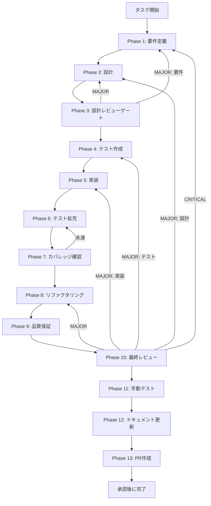

# TASK-SW-TODO-001 - タスク実行仕様書

## ユーザーからの元の指示

```
ConversationRoundStep.tsx の主ツールバッジ TODOコメントを整理する。
TODOのトリガー条件「resolveExternalIntegration の主ツール参照ロジック変更」の
完了状況を確認し、TODOコメントを削除または明確化する。
コードの機能的変更は最小限にとどめ、コメント整理のみを対象とする。
```

## メタ情報

| 項目         | 内容                                                   |
| ------------ | ------------------------------------------------------ |
| タスクID     | TASK-SW-TODO-001                                       |
| タスク名     | todo-001-cleanup-main-tool-badge-todo-comment          |
| 分類         | クリーンアップ / コメント整理                          |
| 対象機能     | ConversationRoundStep - 主ツールバッジTODOコメント整理 |
| 優先度       | Low                                                    |
| 見積もり規模 | 極小                                                   |
| ステータス   | 未着手                                                 |
| 作成日       | 2026-04-16                                             |
| depends_on   | なし                                                   |

---

## タスク概要

### 目的

`ConversationRoundStep.tsx` の行 456-489 に存在するTODOコメントを整理する。
TODOの参照先タスク `UT-SKILL-WIZARD-MSO-RESOLVE-EXTERNAL-001` の完了状況を確認し、
バッジを恒久的に維持するか将来の変更に向けてコメントを明確化するかを決定する。

### 背景

`ConversationRoundStep.tsx:456-489` に以下のTODOコメントが存在する。

```typescript
// TODO(UT-SKILL-WIZARD-MSO-RESOLVE-EXTERNAL-001): 主ツールバッジ - resolveExternalIntegration の主ツール参照ロジック変更後に削除
```

TODOのトリガー条件「`resolveExternalIntegration` の主ツール参照ロジック変更」が現時点で未実施のため、
バッジ削除のタイミングが来ていない。ただしTODOの対象タスク `UT-SKILL-WIZARD-MSO-RESOLVE-EXTERNAL-001`
の完了状況が不明であり、以下2つの対応方針がある。

**オプション A（推奨）**: `UT-SKILL-WIZARD-MSO-RESOLVE-EXTERNAL-001` の完了状況を確認し、
変更が不要と判断されたならTODOコメントを削除してバッジを恒久的に維持する。
加えて `MAIN_TOOL_BADGE_ENABLED = true`（行:116）フラグを削除して直接 `true` を埋め込む。

**オプション B**: 将来の変更を前提にTODOを整理する。
TODOコメントを具体的な条件に書き換えてトレーサビリティを確保する。

### 最終ゴール

- `UT-SKILL-WIZARD-MSO-RESOLVE-EXTERNAL-001` の完了状況が確認・記録されている
- TODOコメントが整理されている（削除または明確化）
- `shouldShowMainToolBadge` の動作が変わらない（UIの機能は維持）
- TypeScriptの型エラーがない

### 成果物一覧

| 種別         | 成果物                                 | 配置先                                                                        |
| ------------ | -------------------------------------- | ----------------------------------------------------------------------------- |
| 機能         | TODOコメント整理（削除または書き換え） | `apps/desktop/src/renderer/components/skill/wizard/ConversationRoundStep.tsx` |
| テスト       | バッジ動作確認テスト（必要な場合）     | テストファイル（別途確認）                                                    |
| ドキュメント | Phase 1-13 仕様・実行成果物            | `outputs/phase-1/ 〜 phase-13/`                                               |

---

## 参照ファイル

- `apps/desktop/src/renderer/components/skill/wizard/ConversationRoundStep.tsx` - 対象ファイル（行 456-489、行 116）
- `docs/30-workflows/skill-create-flow-gaps/00-task-spec-design-docs/phase-1-analysis.md` - 問題の現状分析
- `docs/30-workflows/skill-create-flow-gaps/00-task-spec-design-docs/phase-2-solution.md` - 解決策設計（オプションA/B）

---

## 受入条件

| ID   | 条件                                                                        |
| ---- | --------------------------------------------------------------------------- |
| AC-1 | `UT-SKILL-WIZARD-MSO-RESOLVE-EXTERNAL-001` の完了状況が確認・記録されている |
| AC-2 | TODOコメントが整理されている（削除または明確化）                            |
| AC-3 | `shouldShowMainToolBadge` の動作が変わらない（UIの機能は維持）              |
| AC-4 | TypeScriptの型エラーがない                                                  |

---

## タスク分解サマリー

| ID     | フェーズ | サブタスク名       | 責務                                                     | 依存 |
| ------ | -------- | ------------------ | -------------------------------------------------------- | ---- |
| T-01-1 | Phase 1  | 要件定義           | 問題特定・受入条件策定・現状コード確認                   | -    |
| T-02-1 | Phase 2  | 設計               | オプションA/B の選択とコメント整理の詳細設計             | T-01 |
| T-03-1 | Phase 3  | 設計レビューゲート | 設計の整合性・リスク検証                                 | T-02 |
| T-04-1 | Phase 4  | テスト作成         | TDD Red フェーズ用テストケース作成（必要な場合）         | T-03 |
| T-05-1 | Phase 5  | 実装               | TODOコメント整理の実装                                   | T-04 |
| T-06-1 | Phase 6  | テスト拡充         | 動作確認テストの補強                                     | T-05 |
| T-07-1 | Phase 7  | カバレッジ確認     | concern coverage と branch coverage の確認               | T-06 |
| T-08-1 | Phase 8  | リファクタリング   | 最小複雑性の再調整                                       | T-07 |
| T-09-1 | Phase 9  | 品質保証           | lint / typecheck / test の品質ゲート確認                 | T-08 |
| T-10-1 | Phase 10 | 最終レビュー       | AC・依存関係・4条件の最終判定                            | T-09 |
| T-11-1 | Phase 11 | 手動テスト         | UI上のバッジ表示・動作確認                               | T-10 |
| T-12-1 | Phase 12 | ドキュメント更新   | 実装ガイド・未タスク・skill feedback・準拠チェックの固定 | T-11 |
| T-13-1 | Phase 13 | PR作成             | ユーザー承認後の変更要約と PR 作成                       | T-12 |

**総サブタスク数**: 13個

---

## 実行フロー図



---

## Phase一覧

| Phase | 名称               | 仕様書                                                       | ステータス |
| ----- | ------------------ | ------------------------------------------------------------ | ---------- |
| 1     | 要件定義           | [phase-1-requirements.md](phase-1-requirements.md)           | pending    |
| 2     | 設計               | [phase-2-design.md](phase-2-design.md)                       | pending    |
| 3     | 設計レビューゲート | [phase-3-design-review.md](phase-3-design-review.md)         | pending    |
| 4     | テスト作成         | [phase-4-test-creation.md](phase-4-test-creation.md)         | pending    |
| 5     | 実装               | [phase-5-implementation.md](phase-5-implementation.md)       | pending    |
| 6     | テスト拡充         | [phase-6-test-expansion.md](phase-6-test-expansion.md)       | pending    |
| 7     | カバレッジ確認     | [phase-7-coverage-check.md](phase-7-coverage-check.md)       | pending    |
| 8     | リファクタリング   | [phase-8-refactoring.md](phase-8-refactoring.md)             | pending    |
| 9     | 品質保証           | [phase-9-quality-assurance.md](phase-9-quality-assurance.md) | pending    |
| 10    | 最終レビューゲート | [phase-10-final-review.md](phase-10-final-review.md)         | pending    |
| 11    | 手動テスト         | [phase-11-manual-test.md](phase-11-manual-test.md)           | pending    |
| 12    | ドキュメント更新   | [phase-12-documentation.md](phase-12-documentation.md)       | pending    |
| 13    | PR作成             | [phase-13-pr-creation.md](phase-13-pr-creation.md)           | pending    |

---

## テストカバレッジ目標

### ユニットテスト

| 指標              | 最低基準 | 推奨基準 |
| ----------------- | -------- | -------- |
| Line Coverage     | 80%      | 90%      |
| Branch Coverage   | 60%      | 70%      |
| Function Coverage | 80%      | 90%      |

### 結合テスト

| 指標                         | 目標 |
| ---------------------------- | ---- |
| モジュール間インターフェース | 100% |
| 正常系シナリオ               | 100% |
| 異常系シナリオ               | 80%+ |

---

## 依存関係

- **depends_on**: なし（本タスクは独立して実施可能）
- **後続タスク**: なし

---

## Phase完了時の必須アクション

1. **タスク100%実行**: Phase内で指定された全タスクを完全に実行
2. **成果物確認**: 全ての必須成果物が生成されていることを検証
3. **artifacts.json更新**: Phase完了ステータスを更新
4. **完了条件チェック**: 各タスクを完遂した旨を必ず明記

```bash
# Phase完了処理
node .claude/skills/task-specification-creator/scripts/complete-phase.js \
  --workflow docs/30-workflows/p09-par-TODO-001 \
  --phase {{N}} \
  --artifacts "outputs/phase-{{N}}/{{FILE}}.md:{{DESCRIPTION}}"
```
