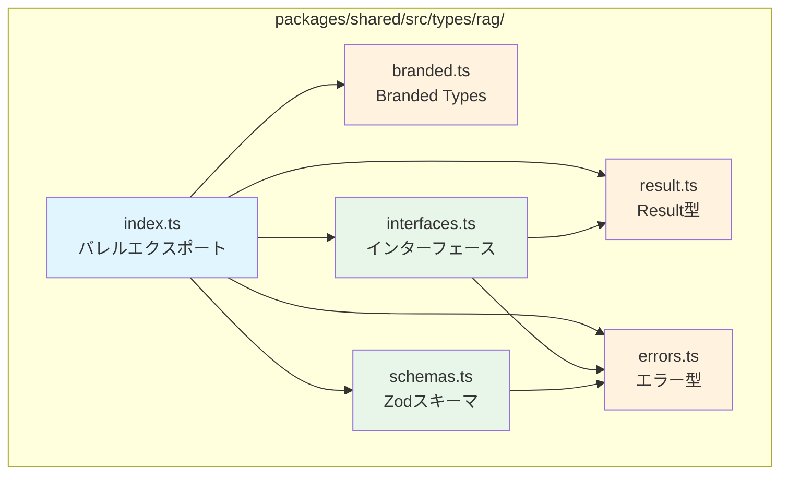
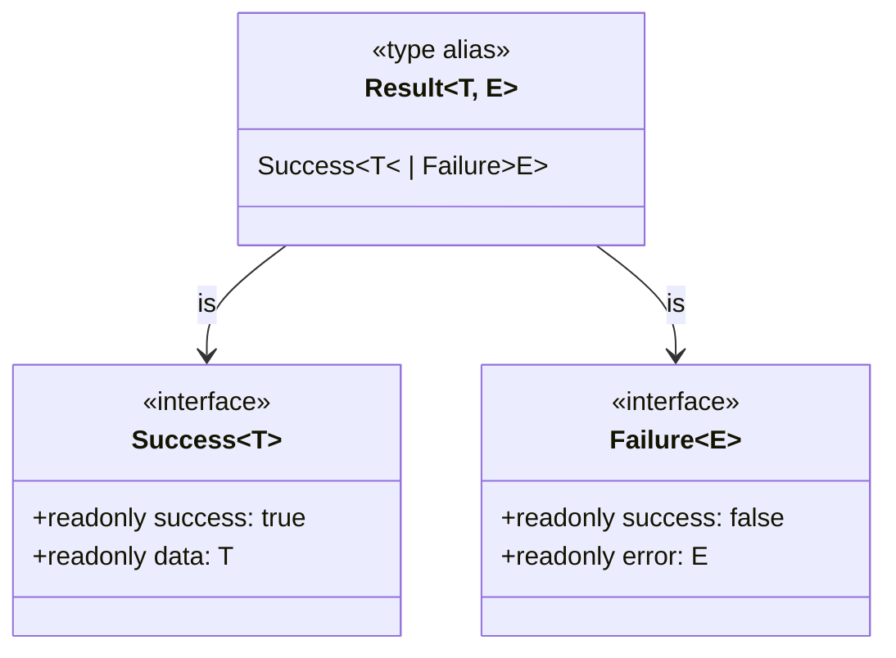
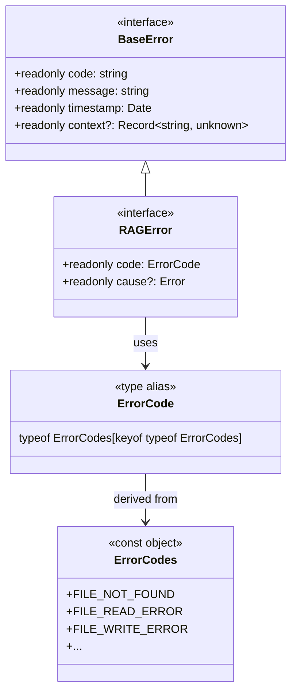
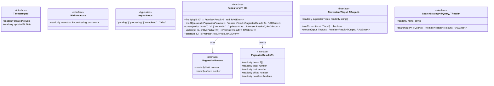
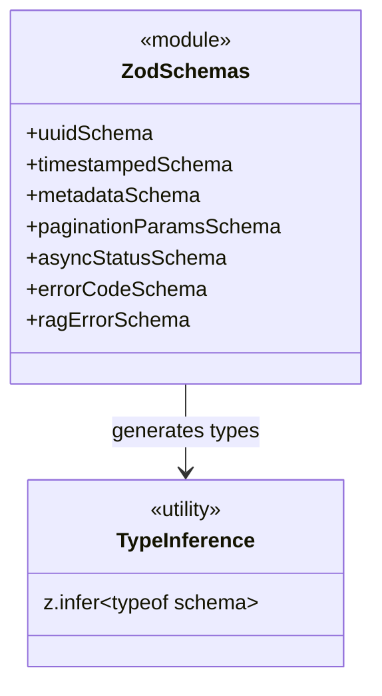

# RAG基本型・共通インターフェース - 型システム設計書

**タスクID**: CONV-03-01
**作成日**: 2025-12-16
**Phase**: 1（設計）
**サブタスク**: T-01-1

---

## 1. 設計概要

### 1.1 目的

HybridRAGパイプライン全体で使用する基本型システムの詳細設計を行う。
TypeScriptの型システムを最大限活用し、コンパイル時の型安全性とランタイムの検証を統合する。

### 1.2 設計原則

| 原則                    | 説明                                       | 適用箇所               |
| ----------------------- | ------------------------------------------ | ---------------------- |
| **イミュータブル設計**  | すべての型は`readonly`修飾子で不変性を保証 | 全型定義               |
| **Discriminated Union** | 判別子フィールドによる型の安全な絞り込み   | Result型               |
| **名目的型付け**        | Branded Typesによる構造的等価性の回避      | ID型                   |
| **関数型パターン**      | モナド的操作による合成可能な設計           | Result型ユーティリティ |
| **型推論との統合**      | Zodスキーマからの型生成                    | Zodスキーマ            |

### 1.3 ファイル構成

```
packages/shared/src/types/rag/
├── index.ts          # バレルエクスポート（依存なし）
├── result.ts         # Result型（依存なし）
├── branded.ts        # Branded Types（依存なし）
├── errors.ts         # エラー型（依存なし）
├── interfaces.ts     # 共通インターフェース（result.ts, errors.ts に依存）
└── schemas.ts        # Zodスキーマ（errors.ts に依存）
```

---

## 2. 依存関係図

### 2.1 モジュール依存関係



### 2.2 依存関係の説明

| ファイル        | 依存先                   | 依存理由                         |
| --------------- | ------------------------ | -------------------------------- |
| `result.ts`     | なし                     | 基盤型として独立                 |
| `branded.ts`    | なし                     | 基盤型として独立                 |
| `errors.ts`     | なし                     | 基盤型として独立                 |
| `interfaces.ts` | `result.ts`, `errors.ts` | Repository等の戻り値型として使用 |
| `schemas.ts`    | `errors.ts`              | ErrorCode列挙の参照              |
| `index.ts`      | 全ファイル               | 再エクスポート                   |

---

## 3. Result型設計

### 3.1 型構造



### 3.2 詳細設計

#### 3.2.1 型定義

```typescript
/**
 * 成功を表す型
 * @template T 成功値の型
 */
export interface Success<T> {
  /** 判別子 - 常にtrue */
  readonly success: true;
  /** 成功値 */
  readonly data: T;
}

/**
 * 失敗を表す型
 * @template E エラーの型
 */
export interface Failure<E> {
  /** 判別子 - 常にfalse */
  readonly success: false;
  /** エラー値 */
  readonly error: E;
}

/**
 * 成功または失敗を表す型（Discriminated Union）
 * @template T 成功値の型
 * @template E エラーの型（デフォルト: Error）
 */
export type Result<T, E = Error> = Success<T> | Failure<E>;
```

#### 3.2.2 コンストラクタ関数

```typescript
/**
 * 成功値を生成する
 * @template T 成功値の型
 * @param data 成功値
 * @returns Success<T>
 * @example
 * const result = ok(42); // Success<number>
 */
export const ok = <T>(data: T): Success<T> => ({
  success: true,
  data,
});

/**
 * エラー値を生成する
 * @template E エラーの型
 * @param error エラー値
 * @returns Failure<E>
 * @example
 * const result = err(new Error("Failed")); // Failure<Error>
 */
export const err = <E>(error: E): Failure<E> => ({
  success: false,
  error,
});
```

#### 3.2.3 型ガード関数

```typescript
/**
 * 結果が成功かどうかを判定する型ガード
 * @template T 成功値の型
 * @template E エラーの型
 * @param result 判定対象
 * @returns resultがSuccess<T>ならtrue
 */
export const isOk = <T, E>(result: Result<T, E>): result is Success<T> =>
  result.success === true;

/**
 * 結果が失敗かどうかを判定する型ガード
 * @template T 成功値の型
 * @template E エラーの型
 * @param result 判定対象
 * @returns resultがFailure<E>ならtrue
 */
export const isErr = <T, E>(result: Result<T, E>): result is Failure<E> =>
  result.success === false;
```

#### 3.2.4 モナド的操作

```typescript
/**
 * 成功値に関数を適用する（Functor map）
 * @template T 元の成功値の型
 * @template U 変換後の成功値の型
 * @template E エラーの型
 * @param result 対象のResult
 * @param fn 変換関数
 * @returns 変換後のResult
 * @example
 * map(ok(2), x => x * 2) // ok(4)
 * map(err("fail"), x => x * 2) // err("fail")
 */
export const map = <T, U, E>(
  result: Result<T, E>,
  fn: (value: T) => U,
): Result<U, E> => (isOk(result) ? ok(fn(result.data)) : result);

/**
 * 成功値にResult返却関数を適用する（Monad bind/flatMap）
 * @template T 元の成功値の型
 * @template U 変換後の成功値の型
 * @template E エラーの型
 * @param result 対象のResult
 * @param fn Result返却の変換関数
 * @returns 変換後のResult（ネストなし）
 * @example
 * flatMap(ok(2), x => x > 0 ? ok(x * 2) : err("negative"))
 */
export const flatMap = <T, U, E>(
  result: Result<T, E>,
  fn: (value: T) => Result<U, E>,
): Result<U, E> => (isOk(result) ? fn(result.data) : result);

/**
 * エラー値に関数を適用する
 * @template T 成功値の型
 * @template E 元のエラーの型
 * @template F 変換後のエラーの型
 * @param result 対象のResult
 * @param fn エラー変換関数
 * @returns エラー変換後のResult
 */
export const mapErr = <T, E, F>(
  result: Result<T, E>,
  fn: (error: E) => F,
): Result<T, F> => (isErr(result) ? err(fn(result.error)) : result);

/**
 * 複数のResultを統合する
 * @template T 成功値の型
 * @template E エラーの型
 * @param results Resultの配列
 * @returns 全成功なら成功値の配列、1つでも失敗なら最初のエラー
 * @example
 * all([ok(1), ok(2), ok(3)]) // ok([1, 2, 3])
 * all([ok(1), err("fail"), ok(3)]) // err("fail")
 */
export const all = <T, E>(results: Result<T, E>[]): Result<T[], E> => {
  const values: T[] = [];
  for (const result of results) {
    if (isErr(result)) return result;
    values.push(result.data);
  }
  return ok(values);
};
```

### 3.3 設計判断

| 判断事項           | 決定               | 理由                               |
| ------------------ | ------------------ | ---------------------------------- |
| 判別子フィールド名 | `success`          | 直感的で可読性が高い               |
| デフォルトエラー型 | `Error`            | JavaScriptの標準エラー型との親和性 |
| モナド操作の命名   | `map`, `flatMap`   | 関数型プログラミングの標準的な命名 |
| `all` の失敗時挙動 | 最初のエラーを返す | シンプルで予測可能                 |

---

## 4. Branded Types設計

### 4.1 型構造

```mermaid
classDiagram
    class Brand~T, B~ {
        <<type alias>>
        T & { readonly [brand]: B }
    }

    class FileId {
        <<type alias>>
        Brand~string, "FileId"~
    }

    class ChunkId {
        <<type alias>>
        Brand~string, "ChunkId"~
    }

    class ConversionId {
        <<type alias>>
        Brand~string, "ConversionId"~
    }

    class EntityId {
        <<type alias>>
        Brand~string, "EntityId"~
    }

    class RelationId {
        <<type alias>>
        Brand~string, "RelationId"~
    }

    class CommunityId {
        <<type alias>>
        Brand~string, "CommunityId"~
    }

    class EmbeddingId {
        <<type alias>>
        Brand~string, "EmbeddingId"~
    }

    Brand <|-- FileId
    Brand <|-- ChunkId
    Brand <|-- ConversionId
    Brand <|-- EntityId
    Brand <|-- RelationId
    Brand <|-- CommunityId
    Brand <|-- EmbeddingId
```

### 4.2 詳細設計

#### 4.2.1 Brand型基盤

```typescript
/**
 * ブランド用のユニークシンボル
 * 実行時には存在しない（型レベルのみ）
 */
declare const brand: unique symbol;

/**
 * Branded Type - プリミティブ型に名目的な型情報を付与
 * @template T ベースとなる型（通常はstring）
 * @template B ブランド名（文字列リテラル）
 * @example
 * type UserId = Brand<string, "UserId">;
 */
export type Brand<T, B extends string> = T & { readonly [brand]: B };
```

#### 4.2.2 ID型定義

```typescript
/** ファイルを一意に識別するID */
export type FileId = Brand<string, "FileId">;

/** チャンク（分割されたテキスト）を一意に識別するID */
export type ChunkId = Brand<string, "ChunkId">;

/** 変換プロセスを一意に識別するID */
export type ConversionId = Brand<string, "ConversionId">;

/** エンティティ（知識グラフのノード）を一意に識別するID */
export type EntityId = Brand<string, "EntityId">;

/** 関係（知識グラフのエッジ）を一意に識別するID */
export type RelationId = Brand<string, "RelationId">;

/** コミュニティ（エンティティのクラスタ）を一意に識別するID */
export type CommunityId = Brand<string, "CommunityId">;

/** 埋め込みベクトルを一意に識別するID */
export type EmbeddingId = Brand<string, "EmbeddingId">;
```

#### 4.2.3 ID生成関数

```typescript
// ========================================
// 型キャスト関数（既存文字列 → ID型）
// ========================================

/** 文字列をFileIdに変換 */
export const createFileId = (id: string): FileId => id as FileId;

/** 文字列をChunkIdに変換 */
export const createChunkId = (id: string): ChunkId => id as ChunkId;

/** 文字列をConversionIdに変換 */
export const createConversionId = (id: string): ConversionId =>
  id as ConversionId;

/** 文字列をEntityIdに変換 */
export const createEntityId = (id: string): EntityId => id as EntityId;

/** 文字列をRelationIdに変換 */
export const createRelationId = (id: string): RelationId => id as RelationId;

/** 文字列をCommunityIdに変換 */
export const createCommunityId = (id: string): CommunityId => id as CommunityId;

/** 文字列をEmbeddingIdに変換 */
export const createEmbeddingId = (id: string): EmbeddingId => id as EmbeddingId;

// ========================================
// UUID生成関数（新規ID生成）
// ========================================

/** UUID v4を生成 */
export const generateUUID = (): string => crypto.randomUUID();

/** 新規FileIdを生成 */
export const generateFileId = (): FileId => createFileId(generateUUID());

/** 新規ChunkIdを生成 */
export const generateChunkId = (): ChunkId => createChunkId(generateUUID());

/** 新規ConversionIdを生成 */
export const generateConversionId = (): ConversionId =>
  createConversionId(generateUUID());

/** 新規EntityIdを生成 */
export const generateEntityId = (): EntityId => createEntityId(generateUUID());

/** 新規RelationIdを生成 */
export const generateRelationId = (): RelationId =>
  createRelationId(generateUUID());

/** 新規CommunityIdを生成 */
export const generateCommunityId = (): CommunityId =>
  createCommunityId(generateUUID());

/** 新規EmbeddingIdを生成 */
export const generateEmbeddingId = (): EmbeddingId =>
  createEmbeddingId(generateUUID());
```

### 4.3 設計判断

| 判断事項         | 決定                            | 理由                                   |
| ---------------- | ------------------------------- | -------------------------------------- |
| ブランドシンボル | `unique symbol`                 | TypeScriptの名目的型付けの標準パターン |
| ベース型         | `string`                        | UUIDはすべて文字列表現                 |
| ID生成方式       | `crypto.randomUUID()`           | Node.js標準API、暗号学的に安全         |
| 関数命名規則     | `createXxxId` / `generateXxxId` | 既存変換 vs 新規生成の区別             |

---

## 5. エラー型設計

### 5.1 型構造



### 5.2 詳細設計

#### 5.2.1 エラーコード定数

```typescript
/**
 * RAGパイプライン用エラーコード一覧
 * カテゴリごとに整理された定数オブジェクト
 */
export const ErrorCodes = {
  // ========================================
  // ファイル関連エラー
  // ========================================
  /** ファイルが見つからない */
  FILE_NOT_FOUND: "FILE_NOT_FOUND",
  /** ファイル読み取りエラー */
  FILE_READ_ERROR: "FILE_READ_ERROR",
  /** ファイル書き込みエラー */
  FILE_WRITE_ERROR: "FILE_WRITE_ERROR",
  /** サポートされていないファイルタイプ */
  UNSUPPORTED_FILE_TYPE: "UNSUPPORTED_FILE_TYPE",

  // ========================================
  // 変換関連エラー
  // ========================================
  /** 変換処理失敗 */
  CONVERSION_FAILED: "CONVERSION_FAILED",
  /** 対応するコンバーターが見つからない */
  CONVERTER_NOT_FOUND: "CONVERTER_NOT_FOUND",

  // ========================================
  // データベース関連エラー
  // ========================================
  /** データベース接続エラー */
  DB_CONNECTION_ERROR: "DB_CONNECTION_ERROR",
  /** クエリ実行エラー */
  DB_QUERY_ERROR: "DB_QUERY_ERROR",
  /** トランザクションエラー */
  DB_TRANSACTION_ERROR: "DB_TRANSACTION_ERROR",
  /** レコードが見つからない */
  RECORD_NOT_FOUND: "RECORD_NOT_FOUND",

  // ========================================
  // 埋め込み関連エラー
  // ========================================
  /** 埋め込み生成エラー */
  EMBEDDING_GENERATION_ERROR: "EMBEDDING_GENERATION_ERROR",
  /** 埋め込みプロバイダーエラー */
  EMBEDDING_PROVIDER_ERROR: "EMBEDDING_PROVIDER_ERROR",

  // ========================================
  // 検索関連エラー
  // ========================================
  /** 検索処理エラー */
  SEARCH_ERROR: "SEARCH_ERROR",
  /** クエリ解析エラー */
  QUERY_PARSE_ERROR: "QUERY_PARSE_ERROR",

  // ========================================
  // グラフ関連エラー
  // ========================================
  /** エンティティ抽出エラー */
  ENTITY_EXTRACTION_ERROR: "ENTITY_EXTRACTION_ERROR",
  /** 関係抽出エラー */
  RELATION_EXTRACTION_ERROR: "RELATION_EXTRACTION_ERROR",
  /** コミュニティ検出エラー */
  COMMUNITY_DETECTION_ERROR: "COMMUNITY_DETECTION_ERROR",

  // ========================================
  // 汎用エラー
  // ========================================
  /** バリデーションエラー */
  VALIDATION_ERROR: "VALIDATION_ERROR",
  /** 内部エラー */
  INTERNAL_ERROR: "INTERNAL_ERROR",
} as const;

/**
 * エラーコード型（ErrorCodes定数から導出）
 */
export type ErrorCode = (typeof ErrorCodes)[keyof typeof ErrorCodes];
```

#### 5.2.2 エラーインターフェース

```typescript
/**
 * 基本エラーインターフェース
 */
export interface BaseError {
  /** エラー識別コード */
  readonly code: string;
  /** エラーメッセージ（人間が読める形式） */
  readonly message: string;
  /** エラー発生時刻 */
  readonly timestamp: Date;
  /** 追加のコンテキスト情報 */
  readonly context?: Record<string, unknown>;
}

/**
 * RAGパイプライン用エラー型
 * BaseErrorを拡張し、型安全なエラーコードと原因追跡をサポート
 */
export interface RAGError extends BaseError {
  /** 型安全なエラーコード */
  readonly code: ErrorCode;
  /** 元の例外（Error chain） */
  readonly cause?: Error;
}
```

#### 5.2.3 エラー生成関数

```typescript
/**
 * RAGErrorを生成する
 * @param code エラーコード
 * @param message エラーメッセージ
 * @param context 追加のコンテキスト情報
 * @param cause 元の例外
 * @returns RAGError
 * @example
 * createRAGError(ErrorCodes.FILE_NOT_FOUND, "File not found: input.pdf")
 */
export const createRAGError = (
  code: ErrorCode,
  message: string,
  context?: Record<string, unknown>,
  cause?: Error,
): RAGError => ({
  code,
  message,
  timestamp: new Date(),
  context,
  cause,
});
```

### 5.3 設計判断

| 判断事項         | 決定                      | 理由                                      |
| ---------------- | ------------------------- | ----------------------------------------- |
| エラーコード形式 | UPPER_SNAKE_CASE          | 定数の慣例に従い可読性を確保              |
| エラーカテゴリ   | 6カテゴリ                 | RAGパイプラインの主要コンポーネントに対応 |
| `cause`の型      | `Error \| undefined`      | JavaScript標準エラーとの互換性            |
| `context`の型    | `Record<string, unknown>` | 柔軟性を確保しつつ型安全性を維持          |

---

## 6. インターフェース設計

### 6.1 型構造



### 6.2 詳細設計

#### 6.2.1 共通トレイト

```typescript
import type { Result } from "./result";
import type { RAGError } from "./errors";

/**
 * タイムスタンプ付きエンティティ
 * すべてのドメインエンティティに適用
 */
export interface Timestamped {
  /** 作成日時 */
  readonly createdAt: Date;
  /** 更新日時 */
  readonly updatedAt: Date;
}

/**
 * メタデータ付きエンティティ
 * 追加の任意情報を格納
 */
export interface WithMetadata {
  /** 追加のメタデータ */
  readonly metadata: Record<string, unknown>;
}
```

#### 6.2.2 ページネーション

```typescript
/**
 * ページネーションパラメータ
 */
export interface PaginationParams {
  /** 取得件数（1〜100） */
  readonly limit: number;
  /** スキップ件数（0〜） */
  readonly offset: number;
}

/**
 * ページネーション結果
 * @template T アイテムの型
 */
export interface PaginatedResult<T> {
  /** 取得したアイテム */
  readonly items: T[];
  /** 総件数 */
  readonly total: number;
  /** 取得件数 */
  readonly limit: number;
  /** スキップ件数 */
  readonly offset: number;
  /** 次ページの有無 */
  readonly hasMore: boolean;
}
```

#### 6.2.3 非同期状態

```typescript
/**
 * 非同期処理の状態
 * ファイル変換、埋め込み生成等で使用
 */
export type AsyncStatus = "pending" | "processing" | "completed" | "failed";
```

#### 6.2.4 Repositoryインターフェース

```typescript
/**
 * 汎用リポジトリインターフェース
 * CRUD操作の標準化された抽象
 * @template T エンティティの型
 * @template ID エンティティIDの型
 */
export interface Repository<T, ID> {
  /**
   * IDでエンティティを取得
   * @param id エンティティID
   * @returns 存在すればエンティティ、なければnull
   */
  findById(id: ID): Promise<Result<T | null, RAGError>>;

  /**
   * 全エンティティを取得（ページネーション対応）
   * @param params ページネーションパラメータ
   * @returns ページネーション結果
   */
  findAll(
    params?: PaginationParams,
  ): Promise<Result<PaginatedResult<T>, RAGError>>;

  /**
   * エンティティを作成
   * @param entity 作成するエンティティ（id, createdAt, updatedAt除く）
   * @returns 作成されたエンティティ
   */
  create(
    entity: Omit<T, "id" | "createdAt" | "updatedAt">,
  ): Promise<Result<T, RAGError>>;

  /**
   * エンティティを更新
   * @param id 更新対象のID
   * @param entity 更新内容（部分更新）
   * @returns 更新されたエンティティ
   */
  update(id: ID, entity: Partial<T>): Promise<Result<T, RAGError>>;

  /**
   * エンティティを削除
   * @param id 削除対象のID
   */
  delete(id: ID): Promise<Result<void, RAGError>>;
}
```

#### 6.2.5 Converterインターフェース

```typescript
/**
 * 変換器インターフェース
 * ファイル形式変換等の抽象
 * @template TInput 入力の型
 * @template TOutput 出力の型
 */
export interface Converter<TInput, TOutput> {
  /** サポートするファイル拡張子 */
  readonly supportedTypes: readonly string[];

  /**
   * 変換可能かを判定
   * @param input 入力データ
   * @returns 変換可能ならtrue
   */
  canConvert(input: TInput): boolean;

  /**
   * 変換を実行
   * @param input 入力データ
   * @returns 変換結果
   */
  convert(input: TInput): Promise<Result<TOutput, RAGError>>;
}
```

#### 6.2.6 SearchStrategyインターフェース

```typescript
/**
 * 検索戦略インターフェース
 * ベクトル検索、グラフ検索等の抽象
 * @template TQuery クエリの型
 * @template TResult 結果の型
 */
export interface SearchStrategy<TQuery, TResult> {
  /** 検索戦略の識別子 */
  readonly name: string;

  /**
   * 検索を実行
   * @param query 検索クエリ
   * @returns 検索結果の配列
   */
  search(query: TQuery): Promise<Result<TResult[], RAGError>>;
}
```

### 6.3 設計判断

| 判断事項                    | 決定                           | 理由                                 |
| --------------------------- | ------------------------------ | ------------------------------------ |
| Repository戻り値            | `Result<T, RAGError>`          | 一貫したエラーハンドリング           |
| findByIdのnull              | `Result<T \| null, RAGError>`  | 存在しない場合はnull、エラーはエラー |
| create除外フィールド        | `id`, `createdAt`, `updatedAt` | 自動生成フィールドを明示             |
| Converterの`supportedTypes` | `readonly string[]`            | 不変性保証、複数拡張子対応           |

---

## 7. Zodスキーマ設計

### 7.1 型構造



### 7.2 詳細設計

```typescript
import { z } from "zod";

// ========================================
// 基本スキーマ
// ========================================

/**
 * UUID v4形式のバリデーションスキーマ
 */
export const uuidSchema = z.string().uuid({
  message: "Invalid UUID format",
});

/**
 * タイムスタンプスキーマ
 * Date型またはISO 8601文字列を受け付け
 */
export const timestampedSchema = z.object({
  createdAt: z.coerce.date(),
  updatedAt: z.coerce.date(),
});

/**
 * メタデータスキーマ
 * 任意のキー・値のオブジェクト
 */
export const metadataSchema = z.record(z.unknown());

// ========================================
// ページネーションスキーマ
// ========================================

/**
 * ページネーションパラメータスキーマ
 * デフォルト値付き
 */
export const paginationParamsSchema = z.object({
  limit: z
    .number()
    .int({ message: "limit must be an integer" })
    .min(1, { message: "limit must be at least 1" })
    .max(100, { message: "limit must be at most 100" })
    .default(20),
  offset: z
    .number()
    .int({ message: "offset must be an integer" })
    .min(0, { message: "offset must be non-negative" })
    .default(0),
});

// ========================================
// 状態スキーマ
// ========================================

/**
 * 非同期処理状態スキーマ
 */
export const asyncStatusSchema = z.enum([
  "pending",
  "processing",
  "completed",
  "failed",
]);

// ========================================
// エラー関連スキーマ
// ========================================

/**
 * エラーコードスキーマ
 * ErrorCodes定数と完全に一致
 */
export const errorCodeSchema = z.enum([
  // ファイル関連
  "FILE_NOT_FOUND",
  "FILE_READ_ERROR",
  "FILE_WRITE_ERROR",
  "UNSUPPORTED_FILE_TYPE",
  // 変換関連
  "CONVERSION_FAILED",
  "CONVERTER_NOT_FOUND",
  // データベース関連
  "DB_CONNECTION_ERROR",
  "DB_QUERY_ERROR",
  "DB_TRANSACTION_ERROR",
  "RECORD_NOT_FOUND",
  // 埋め込み関連
  "EMBEDDING_GENERATION_ERROR",
  "EMBEDDING_PROVIDER_ERROR",
  // 検索関連
  "SEARCH_ERROR",
  "QUERY_PARSE_ERROR",
  // グラフ関連
  "ENTITY_EXTRACTION_ERROR",
  "RELATION_EXTRACTION_ERROR",
  "COMMUNITY_DETECTION_ERROR",
  // 汎用
  "VALIDATION_ERROR",
  "INTERNAL_ERROR",
]);

/**
 * RAGエラースキーマ
 * causeフィールドは含めない（循環参照回避）
 */
export const ragErrorSchema = z.object({
  code: errorCodeSchema,
  message: z.string().min(1, { message: "message is required" }),
  timestamp: z.coerce.date(),
  context: metadataSchema.optional(),
});

// ========================================
// 型エクスポート（z.inferによる型推論）
// ========================================

/** ページネーションパラメータ型 */
export type PaginationParamsSchema = z.infer<typeof paginationParamsSchema>;

/** 非同期状態型 */
export type AsyncStatusSchema = z.infer<typeof asyncStatusSchema>;

/** エラーコード型 */
export type ErrorCodeSchema = z.infer<typeof errorCodeSchema>;

/** RAGエラー型 */
export type RAGErrorSchema = z.infer<typeof ragErrorSchema>;
```

### 7.3 設計判断

| 判断事項         | 決定              | 理由                            |
| ---------------- | ----------------- | ------------------------------- |
| Date変換         | `z.coerce.date()` | ISO 8601文字列からの自動変換    |
| エラーメッセージ | カスタム          | デバッグ時の可読性向上          |
| `cause`の除外    | 含めない          | Error型の循環参照回避           |
| 型エクスポート   | `z.infer`使用     | DRY原則、型とスキーマの一致保証 |

---

## 8. バレルエクスポート設計

### 8.1 詳細設計

```typescript
// packages/shared/src/types/rag/index.ts

/**
 * RAG基本型・共通インターフェース
 * バレルエクスポート
 */

// Result型（モナド的エラーハンドリング）
export * from "./result";

// Branded Types（型安全なID）
export * from "./branded";

// エラー型
export * from "./errors";

// 共通インターフェース
export * from "./interfaces";

// Zodスキーマ
export * from "./schemas";
```

### 8.2 利用方法

```typescript
// すべての型を単一パスからインポート
import {
  // Result型
  Result,
  Success,
  Failure,
  ok,
  err,
  isOk,
  isErr,
  map,
  flatMap,
  mapErr,
  all,

  // Branded Types
  FileId,
  ChunkId,
  ConversionId,
  EntityId,
  RelationId,
  CommunityId,
  EmbeddingId,
  createFileId,
  createChunkId,
  generateFileId,
  generateChunkId,

  // エラー型
  ErrorCodes,
  ErrorCode,
  BaseError,
  RAGError,
  createRAGError,

  // インターフェース
  Timestamped,
  WithMetadata,
  PaginationParams,
  PaginatedResult,
  AsyncStatus,
  Repository,
  Converter,
  SearchStrategy,

  // Zodスキーマ
  uuidSchema,
  timestampedSchema,
  paginationParamsSchema,
  asyncStatusSchema,
  errorCodeSchema,
  ragErrorSchema,
} from "@repo/shared/types/rag";
```

---

## 9. 実装ファイル一覧

| ファイル        | 行数目安   | エクスポート数 | 説明                                                                                                             |
| --------------- | ---------- | -------------- | ---------------------------------------------------------------------------------------------------------------- |
| `result.ts`     | ~80行      | 10             | Result型、コンストラクタ、ユーティリティ                                                                         |
| `branded.ts`    | ~60行      | 16             | Brand型、ID型7種、生成関数14個                                                                                   |
| `errors.ts`     | ~70行      | 5              | ErrorCodes、ErrorCode、BaseError、RAGError、createRAGError                                                       |
| `interfaces.ts` | ~80行      | 8              | Timestamped、WithMetadata、PaginationParams、PaginatedResult、AsyncStatus、Repository、Converter、SearchStrategy |
| `schemas.ts`    | ~90行      | 11             | Zodスキーマ7種、推論型4種                                                                                        |
| `index.ts`      | ~10行      | -              | 再エクスポート                                                                                                   |
| **合計**        | **~390行** | **~50**        |                                                                                                                  |

---

## 10. テスト設計方針

### 10.1 テストファイル構成

```
packages/shared/src/types/rag/__tests__/
├── result.test.ts      # Result型テスト
├── branded.test.ts     # Branded Typesテスト
├── errors.test.ts      # エラー型テスト
├── interfaces.test.ts  # インターフェーステスト
└── schemas.test.ts     # Zodスキーマテスト
```

### 10.2 テストケース概要

| テストファイル       | テストケース数目安 | 主要テスト内容                               |
| -------------------- | ------------------ | -------------------------------------------- |
| `result.test.ts`     | 15-20              | ok/err生成、型ガード、map/flatMap/mapErr/all |
| `branded.test.ts`    | 10-15              | ID生成、型の区別（コンパイル時チェック）     |
| `errors.test.ts`     | 8-10               | createRAGError、全エラーコードの存在         |
| `interfaces.test.ts` | 5-8                | インターフェース型制約（型テスト）           |
| `schemas.test.ts`    | 15-20              | 各スキーマのparse/safeParse、エラーケース    |

---

## 11. 設計レビューチェックリスト

### 11.1 完了条件確認

- [x] Result型の設計（Success/Failure判別、モナド操作）が完了
- [x] Branded Types設計（unique symbol使用、ID型階層）が完了
- [x] エラー型設計（エラーコード体系、型階層）が完了
- [x] インターフェース設計（ジェネリック型パラメータ）が完了
- [x] Zodスキーマ設計（型推論との連携）が完了
- [x] ファイル間の依存関係が明確化されている

### 11.2 設計品質確認

- [x] すべての型に`readonly`修飾子が適用されている
- [x] Discriminated Unionが正しく設計されている
- [x] ジェネリック型パラメータが適切に制約されている
- [x] Zodスキーマが TypeScript型と一致している
- [x] 循環依存がない

---

**レビュー日**: （未実施）
**承認者**: （未定）
**次のフェーズ**: Phase 2 - 設計レビュー（T-02-1）
