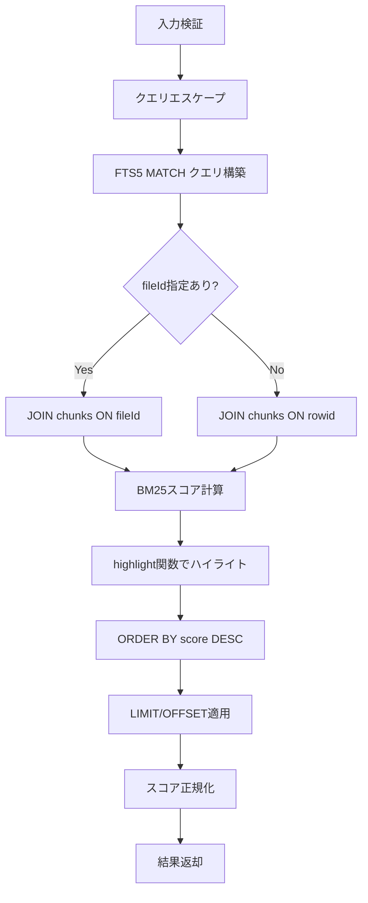

# chunks 検索クエリビルダー設計書

**作成日**: 2025-12-26
**対象**: RAG変換システム - 全文検索クエリビルダー
**参照**: `design-chunks-fts5.md`, `requirements-chunks-fts5.md`

---

## 1. 概要

本設計書は、`chunks_fts` FTS5仮想テーブルに対する検索クエリを構築し、結果を整形する関数群の詳細設計を定義します。

### 1.1 設計目標

| 目標                     | 説明                                          |
| ------------------------ | --------------------------------------------- |
| 型安全性                 | Zodスキーマによる入力検証                     |
| FTS5インジェクション防御 | 特殊文字エスケープとクエリサニタイゼーション  |
| BM25スコア正規化         | シグモイド関数による0-1範囲への変換           |
| ハイライト抽出           | SQLiteのhighlight関数を活用した一致箇所の強調 |

---

## 2. 型定義

### 2.1 Zodスキーマ

```typescript
import { z } from "zod";

/**
 * 検索オプションのスキーマ
 */
export const SearchOptionsSchema = z.object({
  /**
   * 検索クエリ文字列
   */
  query: z.string().min(1, "検索クエリは必須です"),

  /**
   * 最大返却件数
   * @default 10
   */
  limit: z.number().int().positive().max(100).default(10),

  /**
   * オフセット（ページネーション）
   * @default 0
   */
  offset: z.number().int().nonnegative().default(0),

  /**
   * 特定ファイルに検索を限定
   */
  fileId: z.string().uuid().optional(),

  /**
   * ハイライトタグ
   * @default ["<mark>", "</mark>"]
   */
  highlightTags: z
    .tuple([z.string(), z.string()])
    .default(["<mark>", "</mark>"]),

  /**
   * BM25スケールファクター（スコア正規化用）
   * @default 0.5
   */
  bm25ScaleFactor: z.number().positive().default(0.5),
});

export type SearchOptions = z.infer<typeof SearchOptionsSchema>;

/**
 * NEAR検索オプションのスキーマ
 */
export const NearSearchOptionsSchema = SearchOptionsSchema.extend({
  /**
   * NEAR演算子の距離
   * @description 単語間の最大距離（トークン数）
   * @default 5
   */
  nearDistance: z.number().int().positive().max(50).default(5),
});

export type NearSearchOptions = z.infer<typeof NearSearchOptionsSchema>;

/**
 * FTS5検索結果の型
 */
export const FtsSearchResultSchema = z.object({
  /**
   * チャンクID
   */
  id: z.string().uuid(),

  /**
   * ファイルID
   */
  fileId: z.string().uuid(),

  /**
   * チャンク本文
   */
  content: z.string(),

  /**
   * コンテキスト付きテキスト
   */
  contextualContent: z.string().nullable(),

  /**
   * 親見出し
   */
  parentHeader: z.string().nullable(),

  /**
   * 正規化されたBM25スコア（0-1）
   */
  score: z.number().min(0).max(1),

  /**
   * ハイライト付きコンテンツ
   */
  highlightedContent: z.string(),

  /**
   * チャンク順序
   */
  chunkIndex: z.number().int().nonnegative(),
});

export type FtsSearchResult = z.infer<typeof FtsSearchResultSchema>;

/**
 * 検索レスポンスの型
 */
export const SearchResponseSchema = z.object({
  /**
   * 検索結果の配列
   */
  results: z.array(FtsSearchResultSchema),

  /**
   * 総件数
   */
  totalCount: z.number().int().nonnegative(),

  /**
   * 検索に使用したクエリ
   */
  query: z.string(),

  /**
   * ページネーション情報
   */
  pagination: z.object({
    limit: z.number().int().positive(),
    offset: z.number().int().nonnegative(),
    hasMore: z.boolean(),
  }),
});

export type SearchResponse = z.infer<typeof SearchResponseSchema>;
```

---

## 3. ユーティリティ関数

### 3.1 FTS5クエリエスケープ

#### 3.1.1 関数仕様

````typescript
/**
 * FTS5クエリの特殊文字をエスケープ
 *
 * @description
 * FTS5インジェクション攻撃を防ぐため、以下の処理を実行:
 * 1. FTS5特殊文字のエスケープ
 * 2. FTS5予約語のクォート
 *
 * @param query - ユーザー入力文字列
 * @returns エスケープ済みクエリ
 *
 * @example
 * ```typescript
 * escapeFts5Query('hello "world"')
 * // => 'hello \\"world\\"'
 *
 * escapeFts5Query('TypeScript AND React')
 * // => 'TypeScript "AND" React'
 * ```
 */
export function escapeFts5Query(query: string): string;
````

#### 3.1.2 実装詳細

**エスケープ対象文字**:

| 文字 | 意味                 | エスケープ方法 |
| ---- | -------------------- | -------------- |
| `"`  | フレーズ検索         | `\"`           |
| `*`  | プレフィックス検索   | `\*`           |
| `^`  | カラム指定           | `\^`           |
| `(`  | グループ開始         | `\(`           |
| `)`  | グループ終了         | `\)`           |
| `-`  | NOT演算子            | `\-`           |
| `+`  | 強制マッチ（非推奨） | `\+`           |
| `:`  | カラム指定（NEAR前） | `\:`           |
| `{`  | NEARグループ開始     | `\{`           |
| `}`  | NEARグループ終了     | `\}`           |

**予約語のクォート**:

```typescript
const RESERVED_KEYWORDS = ["AND", "OR", "NOT", "NEAR"];
```

#### 3.1.3 実装例

```typescript
export function escapeFts5Query(query: string): string {
  // 1. 特殊文字をエスケープ
  let escaped = query.replace(/["*^()\-+:{}]/g, "\\$&");

  // 2. 予約語をクォート（大文字小文字不問）
  const reservedPattern = /\b(AND|OR|NOT|NEAR)\b/gi;
  escaped = escaped.replace(reservedPattern, '"$1"');

  return escaped;
}
```

---

### 3.2 BM25スコア正規化

#### 3.2.1 関数仕様

````typescript
/**
 * BM25スコアをシグモイド関数で0-1範囲に正規化
 *
 * @description
 * FTS5の`bm25()`関数は負の値を返す（小さいほど関連性が高い）
 * シグモイド関数で0-1に変換し、1が最も関連性が高いスコアとする
 *
 * @param rawScore - FTS5の`bm25()`生スコア（負の値）
 * @param scaleFactor - スケールファクター（デフォルト: 0.5）
 * @returns 正規化されたスコア（0-1、1が最高）
 *
 * @example
 * ```typescript
 * normalizeBm25Score(-2.5, 0.5)
 * // => 0.7773 (sigmoid変換後)
 *
 * normalizeBm25Score(-10.0, 0.5)
 * // => 0.9933 (非常に関連性が高い)
 *
 * normalizeBm25Score(-0.1, 0.5)
 * // => 0.5250 (やや関連性が低い)
 * ```
 */
export function normalizeBm25Score(
  rawScore: number,
  scaleFactor: number = 0.5,
): number;
````

#### 3.2.2 数学的定義

**シグモイド関数**:

```
score = 1 / (1 + e^(rawScore * scaleFactor))
```

**特性**:

| rawScore | scaleFactor=0.5 | scaleFactor=1.0 | 説明             |
| -------- | --------------- | --------------- | ---------------- |
| 0        | 0.5000          | 0.5000          | ニュートラル     |
| -1       | 0.6225          | 0.7311          | やや関連         |
| -2.5     | 0.7773          | 0.9241          | 関連性が高い     |
| -5       | 0.9241          | 0.9933          | 非常に関連性高い |
| -10      | 0.9933          | 0.9999          | 完全一致に近い   |

#### 3.2.3 実装例

```typescript
export function normalizeBm25Score(
  rawScore: number,
  scaleFactor: number = 0.5,
): number {
  // rawScoreは負の値（小さいほど関連性が高い）
  // シグモイド関数で0-1に変換
  const normalizedScore = 1 / (1 + Math.exp(rawScore * scaleFactor));

  // 小数点4桁で丸める
  return Math.round(normalizedScore * 10000) / 10000;
}
```

---

### 3.3 ハイライト抽出

#### 3.3.1 関数仕様

````typescript
/**
 * SQLiteのhighlight()関数を使用してハイライトを抽出
 *
 * @description
 * この関数はSQL内で使用され、一致箇所をタグで囲む
 *
 * @param tags - [開始タグ, 終了タグ]
 * @returns SQLite highlight()関数呼び出し文字列
 *
 * @example
 * ```typescript
 * // SQL内での使用
 * SELECT
 *   highlight(chunks_fts, 0, '<mark>', '</mark>') as highlighted_content
 * FROM chunks_fts
 * WHERE chunks_fts MATCH 'TypeScript';
 *
 * // 結果例:
 * // "This is a <mark>TypeScript</mark> tutorial"
 * ```
 */
export function extractHighlights(tags: [string, string]): string;
````

#### 3.3.2 実装例

```typescript
export function extractHighlights(tags: [string, string]): string {
  const [startTag, endTag] = tags;
  // SQLiteのhighlight()関数
  // highlight(table, column_index, start_tag, end_tag)
  return `highlight(chunks_fts, 0, '${startTag}', '${endTag}')`;
}
```

---

## 4. 検索関数

### 4.1 キーワード検索

#### 4.1.1 関数仕様

````typescript
/**
 * キーワード検索（OR検索）
 *
 * @description
 * 複数のキーワードをスペース区切りで指定し、いずれかに一致するチャンクを取得
 *
 * @param db - Drizzle ORMデータベースインスタンス
 * @param options - 検索オプション
 * @returns 検索結果
 *
 * @throws {ZodError} 入力検証エラー
 *
 * @example
 * ```typescript
 * const results = await searchChunksByKeyword(db, {
 *   query: "TypeScript React",
 *   limit: 20,
 *   fileId: "abc-123",
 * });
 *
 * // 結果:
 * // - "TypeScript" または "React" を含むチャンク
 * // - 最大20件
 * // - ファイル "abc-123" に限定
 * ```
 */
export async function searchChunksByKeyword(
  db: LibSQLDatabase,
  options: SearchOptions,
): Promise<SearchResponse>;
````

#### 4.1.2 内部処理フロー



#### 4.1.3 SQL実装例

```typescript
export async function searchChunksByKeyword(
  db: LibSQLDatabase,
  options: SearchOptions,
): Promise<SearchResponse> {
  // 入力検証
  const validated = SearchOptionsSchema.parse(options);
  const { query, limit, offset, fileId, highlightTags, bm25ScaleFactor } =
    validated;

  // クエリエスケープ
  const escapedQuery = escapeFts5Query(query);

  // ハイライト関数
  const highlightSql = extractHighlights(highlightTags);

  // 総件数取得
  const countResult = await db
    .select({ count: sql<number>`COUNT(*)` })
    .from(sql`chunks_fts`)
    .where(sql`chunks_fts MATCH ${escapedQuery}`)
    .execute();

  const totalCount = countResult[0]?.count ?? 0;

  // 検索実行
  const rawResults = await db
    .select({
      id: sql<string>`chunks.id`,
      fileId: sql<string>`chunks.file_id`,
      content: sql<string>`chunks.content`,
      contextualContent: sql<string | null>`chunks.contextual_content`,
      parentHeader: sql<string | null>`chunks.parent_header`,
      chunkIndex: sql<number>`chunks.chunk_index`,
      rawScore: sql<number>`bm25(chunks_fts)`,
      highlightedContent: sql<string>`${sql.raw(highlightSql)}`,
    })
    .from(sql`chunks_fts`)
    .innerJoin(
      sql`chunks`,
      fileId
        ? sql`chunks.rowid = chunks_fts.rowid AND chunks.file_id = ${fileId}`
        : sql`chunks.rowid = chunks_fts.rowid`,
    )
    .where(sql`chunks_fts MATCH ${escapedQuery}`)
    .orderBy(sql`bm25(chunks_fts)`) // 昇順（負の値が小さいほど関連性高い）
    .limit(limit)
    .offset(offset)
    .execute();

  // スコア正規化
  const results: FtsSearchResult[] = rawResults.map((row) => ({
    ...row,
    score: normalizeBm25Score(row.rawScore, bm25ScaleFactor),
  }));

  return {
    results,
    totalCount,
    query: escapedQuery,
    pagination: {
      limit,
      offset,
      hasMore: offset + limit < totalCount,
    },
  };
}
```

---

### 4.2 フレーズ検索

#### 4.2.1 関数仕様

````typescript
/**
 * フレーズ検索（完全一致）
 *
 * @description
 * クエリ文字列を完全一致で検索（単語の順序も一致）
 *
 * @param db - Drizzle ORMデータベースインスタンス
 * @param options - 検索オプション
 * @returns 検索結果
 *
 * @example
 * ```typescript
 * const results = await searchChunksByPhrase(db, {
 *   query: "full text search",
 *   limit: 10,
 * });
 *
 * // 結果:
 * // - "full text search" という完全なフレーズを含むチャンク
 * // - "full search text" は一致しない（順序が異なる）
 * ```
 */
export async function searchChunksByPhrase(
  db: LibSQLDatabase,
  options: SearchOptions,
): Promise<SearchResponse>;
````

#### 4.2.2 実装例

```typescript
export async function searchChunksByPhrase(
  db: LibSQLDatabase,
  options: SearchOptions,
): Promise<SearchResponse> {
  const validated = SearchOptionsSchema.parse(options);
  const { query, ...rest } = validated;

  // クエリを二重引用符で囲んでフレーズ検索に変換
  const escapedQuery = `"${escapeFts5Query(query)}"`;

  return searchChunksByKeyword(db, {
    ...rest,
    query: escapedQuery,
  });
}
```

---

### 4.3 NEAR検索

#### 4.3.1 関数仕様

````typescript
/**
 * NEAR検索（近接検索）
 *
 * @description
 * 複数のキーワードが指定された距離内に出現するチャンクを検索
 *
 * @param db - Drizzle ORMデータベースインスタンス
 * @param terms - 検索キーワードの配列（2つ以上）
 * @param options - 検索オプション（nearDistance含む）
 * @returns 検索結果
 *
 * @throws {Error} キーワードが2つ未満の場合
 *
 * @example
 * ```typescript
 * const results = await searchChunksByNear(db, ["TypeScript", "interface"], {
 *   nearDistance: 5,
 *   limit: 10,
 * });
 *
 * // 結果:
 * // - "TypeScript" と "interface" が5トークン以内に出現するチャンク
 * // 例: "TypeScript provides a powerful interface system"
 * ```
 */
export async function searchChunksByNear(
  db: LibSQLDatabase,
  terms: string[],
  options: NearSearchOptions,
): Promise<SearchResponse>;
````

#### 4.3.2 NEAR演算子の仕様

**FTS5 NEAR構文**:

```sql
-- 基本形
NEAR(term1 term2, distance)

-- 例: "TypeScript" と "React" が10トークン以内
NEAR("TypeScript" "React", 10)
```

**距離の定義**:

| 距離 | 意味                           | 例                                              |
| ---- | ------------------------------ | ----------------------------------------------- |
| 1    | 隣接                           | "TypeScript React"                              |
| 5    | 5トークン以内                  | "TypeScript is a superset of React"             |
| 10   | 10トークン以内                 | "TypeScript provides type safety for React app" |
| 50   | 50トークン以内（同一段落程度） | 長い段落内での出現                              |

#### 4.3.3 実装例

```typescript
export async function searchChunksByNear(
  db: LibSQLDatabase,
  terms: string[],
  options: NearSearchOptions,
): Promise<SearchResponse> {
  // 入力検証
  if (terms.length < 2) {
    throw new Error("NEAR検索には2つ以上のキーワードが必要です");
  }

  const validated = NearSearchOptionsSchema.parse(options);
  const { nearDistance, ...searchOptions } = validated;

  // 各キーワードをエスケープして二重引用符で囲む
  const escapedTerms = terms.map((term) => `"${escapeFts5Query(term)}"`);

  // NEAR演算子クエリ構築
  const nearQuery = `NEAR(${escapedTerms.join(" ")}, ${nearDistance})`;

  return searchChunksByKeyword(db, {
    ...searchOptions,
    query: nearQuery,
  });
}
```

---

## 5. テストケース

### 5.1 escapeFts5Query

```typescript
describe("escapeFts5Query", () => {
  it("特殊文字をエスケープする", () => {
    expect(escapeFts5Query('hello "world"')).toBe('hello \\"world\\"');
    expect(escapeFts5Query("prefix*")).toBe("prefix\\*");
    expect(escapeFts5Query("column^field")).toBe("column\\^field");
    expect(escapeFts5Query("(group)")).toBe("\\(group\\)");
    expect(escapeFts5Query("NOT-this")).toBe('"NOT"\\-this');
  });

  it("予約語をクォートする", () => {
    expect(escapeFts5Query("TypeScript AND React")).toBe(
      'TypeScript "AND" React',
    );
    expect(escapeFts5Query("Vue OR Angular")).toBe('Vue "OR" Angular');
    expect(escapeFts5Query("NOT empty")).toBe('"NOT" empty');
    expect(escapeFts5Query("NEAR search")).toBe('"NEAR" search');
  });

  it("大文字小文字を区別しない予約語クォート", () => {
    expect(escapeFts5Query("TypeScript and React")).toBe(
      'TypeScript "and" React',
    );
    expect(escapeFts5Query("Vue or Angular")).toBe('Vue "or" Angular');
  });
});
```

### 5.2 normalizeBm25Score

```typescript
describe("normalizeBm25Score", () => {
  it("負のスコアを0-1に正規化する", () => {
    expect(normalizeBm25Score(-2.5, 0.5)).toBeCloseTo(0.7773, 4);
    expect(normalizeBm25Score(-5, 0.5)).toBeCloseTo(0.9241, 4);
    expect(normalizeBm25Score(-10, 0.5)).toBeCloseTo(0.9933, 4);
  });

  it("0は0.5になる", () => {
    expect(normalizeBm25Score(0, 0.5)).toBe(0.5);
  });

  it("スケールファクターで調整できる", () => {
    expect(normalizeBm25Score(-2.5, 1.0)).toBeCloseTo(0.9241, 4);
    expect(normalizeBm25Score(-2.5, 0.25)).toBeCloseTo(0.6555, 4);
  });
});
```

### 5.3 searchChunksByKeyword

```typescript
describe("searchChunksByKeyword", () => {
  let db: LibSQLDatabase;

  beforeEach(async () => {
    db = await setupTestDb();
    await seedTestData(db);
  });

  it("キーワード検索が動作する", async () => {
    const result = await searchChunksByKeyword(db, {
      query: "TypeScript",
      limit: 10,
    });

    expect(result.results.length).toBeGreaterThan(0);
    expect(result.results[0].content).toContain("TypeScript");
    expect(result.results[0].score).toBeGreaterThan(0);
    expect(result.results[0].score).toBeLessThanOrEqual(1);
  });

  it("OR検索が動作する", async () => {
    const result = await searchChunksByKeyword(db, {
      query: "TypeScript React",
      limit: 10,
    });

    const hasTypeScript = result.results.some((r) =>
      r.content.includes("TypeScript"),
    );
    const hasReact = result.results.some((r) => r.content.includes("React"));

    expect(hasTypeScript || hasReact).toBe(true);
  });

  it("fileIdでフィルタできる", async () => {
    const fileId = "test-file-id";
    const result = await searchChunksByKeyword(db, {
      query: "test",
      fileId,
      limit: 10,
    });

    expect(result.results.every((r) => r.fileId === fileId)).toBe(true);
  });

  it("ハイライトが適用される", async () => {
    const result = await searchChunksByKeyword(db, {
      query: "TypeScript",
      highlightTags: ["<em>", "</em>"],
      limit: 1,
    });

    expect(result.results[0].highlightedContent).toContain("<em>");
    expect(result.results[0].highlightedContent).toContain("</em>");
  });

  it("ページネーションが動作する", async () => {
    const page1 = await searchChunksByKeyword(db, {
      query: "test",
      limit: 5,
      offset: 0,
    });

    const page2 = await searchChunksByKeyword(db, {
      query: "test",
      limit: 5,
      offset: 5,
    });

    expect(page1.results[0].id).not.toBe(page2.results[0].id);
    expect(page1.pagination.hasMore).toBe(true);
  });
});
```

### 5.4 searchChunksByPhrase

```typescript
describe("searchChunksByPhrase", () => {
  let db: LibSQLDatabase;

  beforeEach(async () => {
    db = await setupTestDb();
    await seedTestData(db);
  });

  it("完全一致フレーズを検索する", async () => {
    const result = await searchChunksByPhrase(db, {
      query: "full text search",
      limit: 10,
    });

    expect(result.results.length).toBeGreaterThan(0);
    expect(result.results[0].content).toContain("full text search");
  });

  it("順序が異なる場合は一致しない", async () => {
    const phrase = await searchChunksByPhrase(db, {
      query: "full text search",
      limit: 10,
    });

    const keyword = await searchChunksByKeyword(db, {
      query: "search text full",
      limit: 10,
    });

    // フレーズ検索の方が結果が少ない（より厳密）
    expect(phrase.totalCount).toBeLessThanOrEqual(keyword.totalCount);
  });
});
```

### 5.5 searchChunksByNear

```typescript
describe("searchChunksByNear", () => {
  let db: LibSQLDatabase;

  beforeEach(async () => {
    db = await setupTestDb();
    await seedTestData(db);
  });

  it("NEAR検索が動作する", async () => {
    const result = await searchChunksByNear(db, ["TypeScript", "interface"], {
      nearDistance: 10,
      limit: 10,
    });

    expect(result.results.length).toBeGreaterThan(0);
    expect(result.results[0].content).toContain("TypeScript");
    expect(result.results[0].content).toContain("interface");
  });

  it("距離が近いほどスコアが高い", async () => {
    const near5 = await searchChunksByNear(db, ["TypeScript", "React"], {
      nearDistance: 5,
      limit: 1,
    });

    const near50 = await searchChunksByNear(db, ["TypeScript", "React"], {
      nearDistance: 50,
      limit: 1,
    });

    // near5の方が厳密な条件なので、一致した場合はスコアが高いはず
    if (near5.results.length > 0 && near50.results.length > 0) {
      expect(near5.results[0].score).toBeGreaterThanOrEqual(
        near50.results[0].score,
      );
    }
  });

  it("2つ未満のキーワードでエラー", async () => {
    await expect(
      searchChunksByNear(db, ["TypeScript"], {
        nearDistance: 5,
        limit: 10,
      }),
    ).rejects.toThrow("2つ以上のキーワードが必要です");
  });
});
```

---

## 6. パフォーマンス考慮事項

### 6.1 インデックス活用

| 操作           | 使用インデックス | 効率                    |
| -------------- | ---------------- | ----------------------- |
| MATCH検索      | FTS5インデックス | ⭕ O(log n)             |
| BM25スコア計算 | FTS5内部         | ⭕ 最適化済み           |
| fileIdフィルタ | chunks.fileId    | ⭕ B-Treeインデックス   |
| LIMIT/OFFSET   | -                | ⚠️ 大きなOFFSETは非効率 |

### 6.2 最適化推奨事項

#### 6.2.1 大量結果のページネーション

```typescript
// 悪い例: 大きなOFFSETは遅い
const page100 = await searchChunksByKeyword(db, {
  query: "test",
  limit: 10,
  offset: 1000, // ❌ 1000件スキップするのは非効率
});

// 良い例: カーソルベースのページネーション（将来実装）
const page100 = await searchChunksByKeywordCursor(db, {
  query: "test",
  limit: 10,
  afterScore: lastScore, // ⭕ スコアベースのカーソル
  afterId: lastId,
});
```

#### 6.2.2 FTS5 OPTIMIZE実行

```typescript
// 定期的にFTS5インデックスを最適化
await db.run(sql`INSERT INTO chunks_fts(chunks_fts) VALUES('optimize')`);
```

---

## 7. セキュリティ考慮事項

### 7.1 FTS5インジェクション防御

**脆弱な実装例**:

```typescript
// ❌ 危険: ユーザー入力を直接SQLに埋め込み
const query = userInput; // 例: 'test" OR 1=1 --'
await db.execute(
  sql`SELECT * FROM chunks_fts WHERE chunks_fts MATCH '${query}'`,
);
```

**安全な実装**:

```typescript
// ⭕ 安全: escapeFts5Query でサニタイズ
const escapedQuery = escapeFts5Query(userInput);
await db.execute(
  sql`SELECT * FROM chunks_fts WHERE chunks_fts MATCH ${escapedQuery}`,
);
```

### 7.2 Zodバリデーション

```typescript
// 入力検証により不正なパラメータを事前に拒否
try {
  const validated = SearchOptionsSchema.parse(userInput);
  // validated は型安全に使用可能
} catch (error) {
  if (error instanceof ZodError) {
    // バリデーションエラーを適切に処理
    console.error("Invalid input:", error.errors);
  }
}
```

---

## 8. エクスポート構成

### 8.1 ファイル構成

```
packages/shared/src/services/search/
├── index.ts                  # エクスポート統合
├── types.ts                  # Zodスキーマと型定義
├── utils/
│   ├── escape-fts5.ts        # escapeFts5Query
│   ├── normalize-score.ts    # normalizeBm25Score
│   └── extract-highlights.ts # extractHighlights
└── queries/
    ├── keyword-search.ts     # searchChunksByKeyword
    ├── phrase-search.ts      # searchChunksByPhrase
    └── near-search.ts        # searchChunksByNear
```

### 8.2 index.tsエクスポート

```typescript
// packages/shared/src/services/search/index.ts

export * from "./types.js";
export * from "./utils/escape-fts5.js";
export * from "./utils/normalize-score.js";
export * from "./utils/extract-highlights.js";
export * from "./queries/keyword-search.js";
export * from "./queries/phrase-search.js";
export * from "./queries/near-search.js";
```

---

## 9. 使用例

### 9.1 基本的なキーワード検索

```typescript
import { searchChunksByKeyword } from "@repo/shared/services/search";

const results = await searchChunksByKeyword(db, {
  query: "TypeScript React",
  limit: 20,
  highlightTags: ["<mark>", "</mark>"],
});

console.log(`Found ${results.totalCount} results`);
results.results.forEach((result) => {
  console.log(`Score: ${result.score}`);
  console.log(`Content: ${result.highlightedContent}`);
});
```

### 9.2 ファイル内検索

```typescript
const results = await searchChunksByKeyword(db, {
  query: "authentication",
  fileId: "abc-def-123",
  limit: 10,
});
```

### 9.3 フレーズ検索

```typescript
const results = await searchChunksByPhrase(db, {
  query: "dependency injection pattern",
  limit: 10,
});
```

### 9.4 近接検索

```typescript
const results = await searchChunksByNear(
  db,
  ["machine", "learning", "algorithm"],
  {
    nearDistance: 10,
    limit: 15,
  },
);
```

---

## 10. 完了条件チェックリスト

- [x] Zodスキーマが定義されている（SearchOptions、NearSearchOptions、FtsSearchResult、SearchResponse）
- [x] escapeFts5Query関数が仕様化されている（特殊文字エスケープ + 予約語クォート）
- [x] normalizeBm25Score関数が仕様化されている（シグモイド関数による正規化）
- [x] extractHighlights関数が仕様化されている（SQLiteのhighlight関数活用）
- [x] searchChunksByKeyword関数が仕様化されている（キーワード検索）
- [x] searchChunksByPhrase関数が仕様化されている（フレーズ検索）
- [x] searchChunksByNear関数が仕様化されている（NEAR検索）
- [x] 全関数にテストケースが定義されている
- [x] セキュリティ考慮事項が明記されている（FTS5インジェクション防御）
- [x] パフォーマンス最適化が明記されている（インデックス活用、ページネーション）

---

## 11. 次のアクション

### Phase 2: 設計レビュー（T-02-1）

**依存関係**: Phase 1完了後に実行

**実施内容**:

1. 設計書レビュー（本ドキュメント含む）
2. アーキテクチャ整合性確認
3. セキュリティレビュー
4. パフォーマンス要件確認

---

## 変更履歴

| 日付       | 変更内容 | 担当        |
| ---------- | -------- | ----------- |
| 2025-12-26 | 初版作成 | spec-writer |
