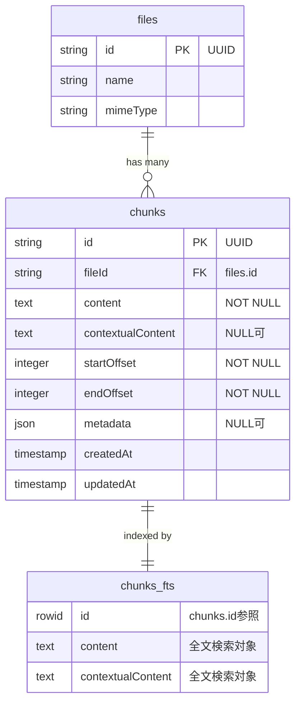
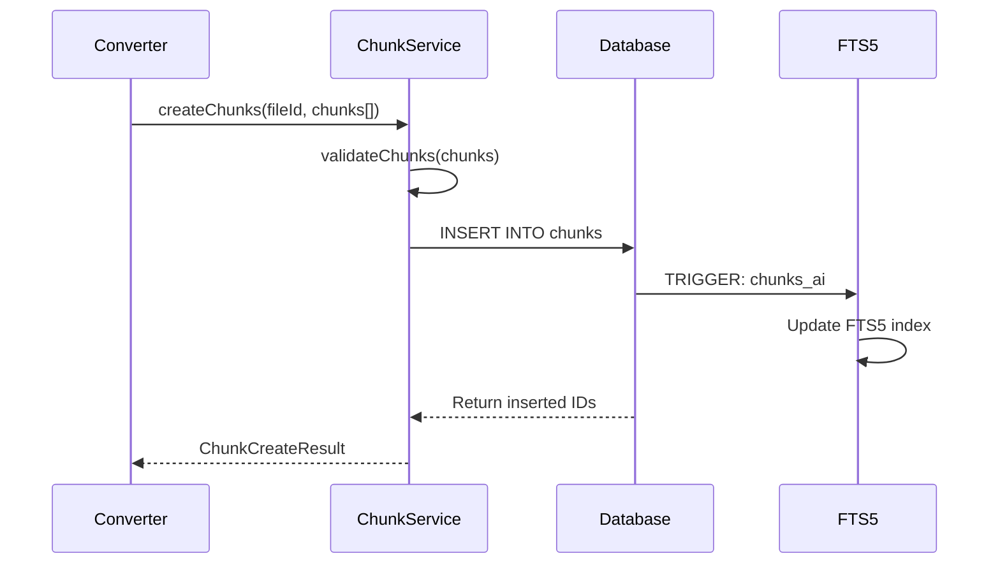
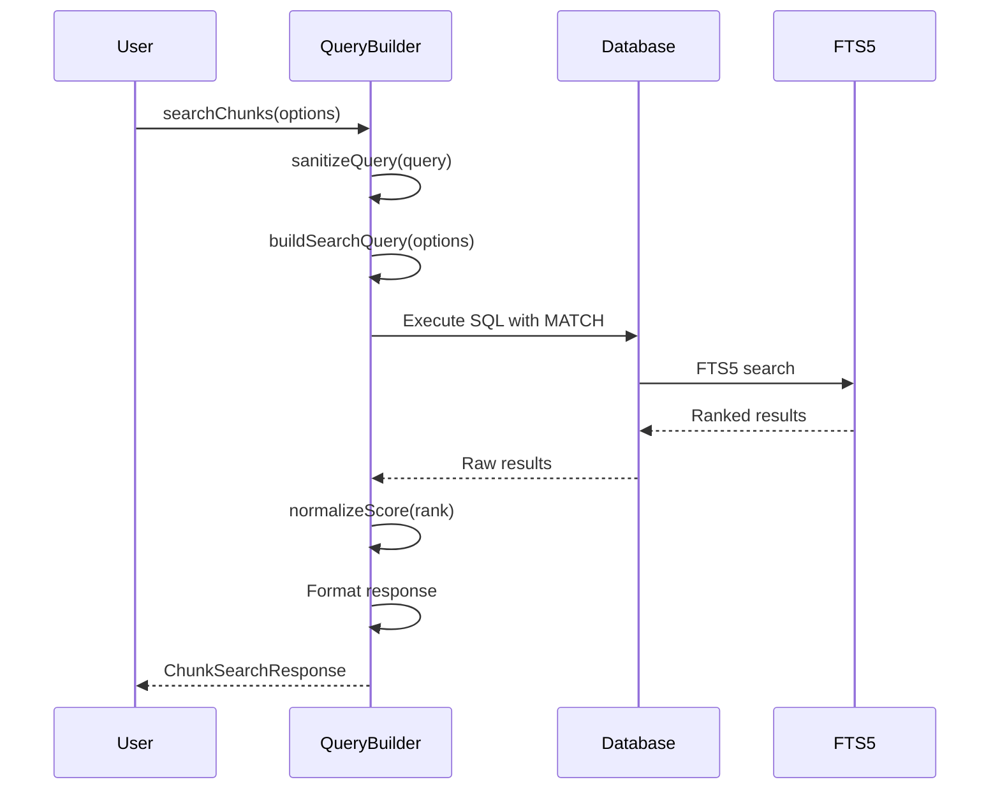

# chunks テーブルと FTS5 全文検索機能 詳細要件定義書

## 1. 概要

### 1.1 目的

RAG（Retrieval-Augmented Generation）システムのコアコンポーネントとして、ファイルコンテンツをチャンク単位で管理し、FTS5（Full-Text Search 5）による高速全文検索を実現する。

### 1.2 スコープ

| 対象                   | 内容                         |
| ---------------------- | ---------------------------- |
| chunksテーブル         | チャンク単位のコンテンツ管理 |
| chunks_fts仮想テーブル | FTS5全文検索インデックス     |
| トリガー               | FTS5インデックス同期         |
| 検索クエリビルダー     | TypeScript検索API            |

### 1.3 前提条件

- Drizzle ORM 0.39.x + libSQL/Turso
- SQLite FTS5拡張が有効化されていること
- `files` テーブルが既に存在すること

---

## 2. プロジェクト固有制約（master_system_design.md準拠）

### 2.1 TDD方針

| 項目                 | 値                                                |
| -------------------- | ------------------------------------------------- |
| テストファイルパス   | `packages/shared/src/db/__tests__/chunks.test.ts` |
| テスト作成タイミング | 実装前（RED-GREEN-REFACTOR）                      |
| カバレッジ目標       | 80%以上（DB操作は重要ロジック）                   |

### 2.2 ハイブリッド構造

```
packages/shared/src/db/
├── schema/
│   └── chunks.ts          # chunksテーブル定義
├── queries/
│   └── chunks.ts          # 検索クエリビルダー
├── migrations/
│   └── XXXX_chunks_fts5.sql  # FTS5マイグレーション
└── __tests__/
    └── chunks.test.ts     # テストファイル
```

### 2.3 技術スタック

- **ORM**: Drizzle ORM 0.39.x
- **データベース**: Turso (libSQL/SQLite)
- **バリデーション**: Zod 3.x
- **型定義**: TypeScript 5.x strict モード

---

## 3. データモデル

### 3.1 chunksテーブル定義

#### ER図



#### カラム仕様

| カラム名            | 型          | NULL | デフォルト    | 説明                           |
| ------------------- | ----------- | ---- | ------------- | ------------------------------ |
| `id`                | TEXT        | NO   | `uuid()`      | UUID主キー                     |
| `fileId`            | TEXT        | NO   | -             | files.idへの外部キー           |
| `content`           | TEXT        | NO   | -             | チャンク本文（元のテキスト）   |
| `contextualContent` | TEXT        | YES  | NULL          | LLM生成コンテキスト            |
| `startOffset`       | INTEGER     | NO   | -             | ファイル内開始位置（バイト）   |
| `endOffset`         | INTEGER     | NO   | -             | ファイル内終了位置（バイト）   |
| `metadata`          | TEXT (JSON) | YES  | NULL          | 追加メタデータ（JSON形式）     |
| `createdAt`         | INTEGER     | NO   | `unixepoch()` | 作成日時（UNIXタイムスタンプ） |
| `updatedAt`         | INTEGER     | NO   | `unixepoch()` | 更新日時（UNIXタイムスタンプ） |

#### 制約

| 制約名                      | 種類        | 定義                                            | 説明                           |
| --------------------------- | ----------- | ----------------------------------------------- | ------------------------------ |
| `chunks_pkey`               | PRIMARY KEY | `id`                                            | 主キー                         |
| `chunks_file_fkey`          | FOREIGN KEY | `fileId REFERENCES files(id) ON DELETE CASCADE` | ファイル削除時にチャンクも削除 |
| `chunks_offset_check`       | CHECK       | `startOffset < endOffset`                       | オフセット整合性               |
| `chunks_file_offset_unique` | UNIQUE      | `(fileId, startOffset, endOffset)`              | 同一ファイル内の重複防止       |

#### インデックス

| インデックス名           | カラム                  | 用途                       |
| ------------------------ | ----------------------- | -------------------------- |
| `idx_chunks_file_id`     | `fileId`                | ファイルIDによる検索高速化 |
| `idx_chunks_created_at`  | `createdAt`             | 作成日時によるソート高速化 |
| `idx_chunks_file_offset` | `(fileId, startOffset)` | オフセット範囲検索高速化   |

### 3.2 Drizzle スキーマ定義

```typescript
// packages/shared/src/db/schema/chunks.ts

import {
  sqliteTable,
  text,
  integer,
  index,
  uniqueIndex,
} from "drizzle-orm/sqlite-core";
import { sql } from "drizzle-orm";
import { files } from "./files";

export const chunks = sqliteTable(
  "chunks",
  {
    id: text("id")
      .primaryKey()
      .$defaultFn(() => crypto.randomUUID()),

    fileId: text("file_id")
      .notNull()
      .references(() => files.id, { onDelete: "cascade" }),

    content: text("content").notNull(),

    contextualContent: text("contextual_content"),

    startOffset: integer("start_offset").notNull(),

    endOffset: integer("end_offset").notNull(),

    metadata: text("metadata", { mode: "json" }).$type<ChunkMetadata>(),

    createdAt: integer("created_at", { mode: "timestamp" })
      .notNull()
      .default(sql`(unixepoch())`),

    updatedAt: integer("updated_at", { mode: "timestamp" })
      .notNull()
      .default(sql`(unixepoch())`),
  },
  (table) => ({
    fileIdIdx: index("idx_chunks_file_id").on(table.fileId),
    createdAtIdx: index("idx_chunks_created_at").on(table.createdAt),
    fileOffsetIdx: index("idx_chunks_file_offset").on(
      table.fileId,
      table.startOffset,
    ),
    fileOffsetUnique: uniqueIndex("chunks_file_offset_unique").on(
      table.fileId,
      table.startOffset,
      table.endOffset,
    ),
  }),
);

// CHECK制約はマイグレーションで追加
```

### 3.3 Zod スキーマ定義

```typescript
// packages/shared/src/db/schema/chunks.ts

import { z } from "zod";
import { createInsertSchema, createSelectSchema } from "drizzle-zod";
import { chunks } from "./chunks";

// メタデータスキーマ
export const chunkMetadataSchema = z
  .object({
    chunkIndex: z.number().int().nonnegative().optional(),
    totalChunks: z.number().int().positive().optional(),
    heading: z.string().optional(),
    language: z.string().optional(),
    sourceType: z
      .enum(["paragraph", "code", "table", "heading", "list"])
      .optional(),
  })
  .passthrough();

export type ChunkMetadata = z.infer<typeof chunkMetadataSchema>;

// 挿入スキーマ
export const insertChunkSchema = createInsertSchema(chunks, {
  content: z.string().min(1, "Content is required"),
  startOffset: z.number().int().nonnegative(),
  endOffset: z.number().int().positive(),
  metadata: chunkMetadataSchema.optional(),
}).refine((data) => data.startOffset < data.endOffset, {
  message: "startOffset must be less than endOffset",
});

// 選択スキーマ
export const selectChunkSchema = createSelectSchema(chunks);

// 型エクスポート
export type InsertChunk = z.infer<typeof insertChunkSchema>;
export type SelectChunk = z.infer<typeof selectChunkSchema>;
```

---

## 4. FTS5 仮想テーブル設定

### 4.1 FTS5 テーブル定義

```sql
-- FTS5仮想テーブル作成
CREATE VIRTUAL TABLE IF NOT EXISTS chunks_fts USING fts5(
  content,
  contextual_content,
  content='chunks',
  content_rowid='rowid',
  tokenize='porter unicode61 remove_diacritics 1'
);
```

#### FTS5 設定パラメータ

| パラメータ      | 値                                       | 説明               |
| --------------- | ---------------------------------------- | ------------------ |
| `content`       | `'chunks'`                               | ベーステーブル参照 |
| `content_rowid` | `'rowid'`                                | ROWIDマッピング    |
| `tokenize`      | `'porter unicode61 remove_diacritics 1'` | トークナイザー設定 |

#### トークナイザー設定の詳細

- **porter**: Porter Stemming アルゴリズム（英語の語幹抽出）
- **unicode61**: Unicode 6.1準拠のトークン化
- **remove_diacritics 1**: アクセント記号を無視（cafe = cafe）

### 4.2 同期トリガー

```sql
-- INSERT トリガー
CREATE TRIGGER IF NOT EXISTS chunks_ai AFTER INSERT ON chunks BEGIN
  INSERT INTO chunks_fts(rowid, content, contextual_content)
  VALUES (NEW.rowid, NEW.content, NEW.contextual_content);
END;

-- DELETE トリガー
CREATE TRIGGER IF NOT EXISTS chunks_ad AFTER DELETE ON chunks BEGIN
  INSERT INTO chunks_fts(chunks_fts, rowid, content, contextual_content)
  VALUES ('delete', OLD.rowid, OLD.content, OLD.contextual_content);
END;

-- UPDATE トリガー
CREATE TRIGGER IF NOT EXISTS chunks_au AFTER UPDATE ON chunks BEGIN
  INSERT INTO chunks_fts(chunks_fts, rowid, content, contextual_content)
  VALUES ('delete', OLD.rowid, OLD.content, OLD.contextual_content);
  INSERT INTO chunks_fts(rowid, content, contextual_content)
  VALUES (NEW.rowid, NEW.content, NEW.contextual_content);
END;
```

### 4.3 マイグレーションファイル

```sql
-- packages/shared/src/db/migrations/XXXX_chunks_fts5.sql

-- CHECK制約追加（Drizzleでは直接定義できない）
-- Note: SQLiteではALTER TABLE ADD CONSTRAINTがサポートされていないため、
--       テーブル作成時に定義する必要がある

-- FTS5仮想テーブル
CREATE VIRTUAL TABLE IF NOT EXISTS chunks_fts USING fts5(
  content,
  contextual_content,
  content='chunks',
  content_rowid='rowid',
  tokenize='porter unicode61 remove_diacritics 1'
);

-- INSERT トリガー
CREATE TRIGGER IF NOT EXISTS chunks_ai AFTER INSERT ON chunks BEGIN
  INSERT INTO chunks_fts(rowid, content, contextual_content)
  VALUES (NEW.rowid, NEW.content, NEW.contextual_content);
END;

-- DELETE トリガー
CREATE TRIGGER IF NOT EXISTS chunks_ad AFTER DELETE ON chunks BEGIN
  INSERT INTO chunks_fts(chunks_fts, rowid, content, contextual_content)
  VALUES ('delete', OLD.rowid, OLD.content, OLD.contextual_content);
END;

-- UPDATE トリガー
CREATE TRIGGER IF NOT EXISTS chunks_au AFTER UPDATE ON chunks BEGIN
  INSERT INTO chunks_fts(chunks_fts, rowid, content, contextual_content)
  VALUES ('delete', OLD.rowid, OLD.content, OLD.contextual_content);
  INSERT INTO chunks_fts(rowid, content, contextual_content)
  VALUES (NEW.rowid, NEW.content, NEW.contextual_content);
END;
```

---

## 5. 検索クエリビルダー要件

### 5.1 TypeScript 型定義

```typescript
// packages/shared/src/db/queries/chunks.ts

import { z } from "zod";

// 検索オプションスキーマ
export const chunkSearchOptionsSchema = z.object({
  query: z.string().min(1, "Query is required"),
  fileId: z.string().uuid().optional(),
  limit: z.number().int().positive().max(100).default(10),
  offset: z.number().int().nonnegative().default(0),
  searchColumn: z
    .enum(["content", "contextualContent", "both"])
    .default("both"),
  includeSnippet: z.boolean().default(true),
  snippetLength: z.number().int().positive().max(500).default(150),
});

export type ChunkSearchOptions = z.infer<typeof chunkSearchOptionsSchema>;

// 検索結果スキーマ
export const chunkSearchResultSchema = z.object({
  id: z.string().uuid(),
  fileId: z.string().uuid(),
  content: z.string(),
  contextualContent: z.string().nullable(),
  startOffset: z.number().int(),
  endOffset: z.number().int(),
  metadata: z.record(z.unknown()).nullable(),
  score: z.number().min(0).max(1),
  snippet: z.string().optional(),
  createdAt: z.date(),
  updatedAt: z.date(),
});

export type ChunkSearchResult = z.infer<typeof chunkSearchResultSchema>;

// 検索レスポンススキーマ
export const chunkSearchResponseSchema = z.object({
  results: z.array(chunkSearchResultSchema),
  total: z.number().int().nonnegative(),
  limit: z.number().int().positive(),
  offset: z.number().int().nonnegative(),
  hasMore: z.boolean(),
});

export type ChunkSearchResponse = z.infer<typeof chunkSearchResponseSchema>;
```

### 5.2 検索クエリ構文

#### 基本検索

| 構文            | 例                         | 説明                              |
| --------------- | -------------------------- | --------------------------------- |
| 単語検索        | `typescript`               | 単語を含むチャンクを検索          |
| 複数単語（AND） | `typescript react`         | 両方の単語を含む                  |
| フレーズ検索    | `"react hooks"`            | 完全一致フレーズ                  |
| OR検索          | `typescript OR javascript` | いずれかを含む                    |
| NOT検索         | `typescript NOT angular`   | typescriptを含みangularを含まない |
| ワイルドカード  | `type*`                    | typeで始まる単語                  |

#### 高度な検索

| 構文     | 例                     | 説明                     |
| -------- | ---------------------- | ------------------------ |
| 列指定   | `content:typescript`   | content列のみ検索        |
| NEAR検索 | `NEAR(react hooks, 5)` | 5単語以内に両方存在      |
| 前方一致 | `^typescript`          | 先頭がtypescriptで始まる |

### 5.3 検索クエリビルダー実装仕様

```typescript
// packages/shared/src/db/queries/chunks.ts

/**
 * FTS5検索クエリを構築する
 * @param options 検索オプション
 * @returns SQL クエリ文字列とパラメータ
 */
export function buildSearchQuery(options: ChunkSearchOptions): {
  sql: string;
  params: unknown[];
};

/**
 * チャンクを全文検索する
 * @param db Drizzle DBインスタンス
 * @param options 検索オプション
 * @returns 検索結果
 */
export async function searchChunks(
  db: DrizzleDb,
  options: ChunkSearchOptions,
): Promise<ChunkSearchResponse>;

/**
 * BM25スコアを0-1に正規化する
 * @param rawScore FTS5のrank値（負の値）
 * @returns 0-1の正規化スコア
 */
export function normalizeScore(rawScore: number): number;

/**
 * 検索クエリをサニタイズする
 * @param query ユーザー入力クエリ
 * @returns サニタイズ済みクエリ
 */
export function sanitizeQuery(query: string): string;
```

### 5.4 SQL クエリテンプレート

```sql
-- 基本検索クエリ
SELECT
  c.id,
  c.file_id,
  c.content,
  c.contextual_content,
  c.start_offset,
  c.end_offset,
  c.metadata,
  c.created_at,
  c.updated_at,
  bm25(chunks_fts) as rank,
  snippet(chunks_fts, 0, '<mark>', '</mark>', '...', 20) as snippet
FROM chunks_fts
JOIN chunks c ON chunks_fts.rowid = c.rowid
WHERE chunks_fts MATCH ?
ORDER BY rank
LIMIT ? OFFSET ?;

-- ファイルID絞り込み付き検索
SELECT
  c.id,
  c.file_id,
  c.content,
  c.contextual_content,
  c.start_offset,
  c.end_offset,
  c.metadata,
  c.created_at,
  c.updated_at,
  bm25(chunks_fts) as rank,
  snippet(chunks_fts, 0, '<mark>', '</mark>', '...', 20) as snippet
FROM chunks_fts
JOIN chunks c ON chunks_fts.rowid = c.rowid
WHERE chunks_fts MATCH ?
  AND c.file_id = ?
ORDER BY rank
LIMIT ? OFFSET ?;

-- 件数取得クエリ
SELECT COUNT(*) as total
FROM chunks_fts
JOIN chunks c ON chunks_fts.rowid = c.rowid
WHERE chunks_fts MATCH ?;
```

---

## 6. ワークフロー

### 6.1 チャンク作成フロー



### 6.2 全文検索フロー



---

## 7. エラーハンドリング

### 7.1 エラーコード

| コード      | 名前                | 説明                     | 対処法                       |
| ----------- | ------------------- | ------------------------ | ---------------------------- |
| `CHUNK_001` | `INVALID_OFFSET`    | startOffset >= endOffset | 入力値を検証                 |
| `CHUNK_002` | `FILE_NOT_FOUND`    | fileIdが存在しない       | ファイルの存在確認           |
| `CHUNK_003` | `DUPLICATE_CHUNK`   | 同一オフセットのチャンク | 既存チャンクを削除または更新 |
| `FTS_001`   | `INVALID_QUERY`     | FTS5クエリ構文エラー     | クエリをサニタイズ           |
| `FTS_002`   | `FTS_NOT_AVAILABLE` | FTS5が無効               | SQLite設定を確認             |

### 7.2 エラー型定義

```typescript
// packages/shared/src/db/errors/chunks.ts

export class ChunkError extends Error {
  constructor(
    public readonly code: string,
    message: string,
    public readonly cause?: unknown,
  ) {
    super(message);
    this.name = "ChunkError";
  }
}

export class FTS5Error extends Error {
  constructor(
    public readonly code: string,
    message: string,
    public readonly originalQuery?: string,
    public readonly cause?: unknown,
  ) {
    super(message);
    this.name = "FTS5Error";
  }
}
```

---

## 8. セキュリティ考慮事項

### 8.1 SQLインジェクション対策

- FTS5 MATCH句へのユーザー入力はサニタイズ必須
- 特殊文字（`"`, `*`, `^`, `NEAR`, `OR`, `NOT`）のエスケープ
- パラメータバインディングの使用

```typescript
// 危険な文字をエスケープ
function sanitizeQuery(query: string): string {
  // FTS5の特殊文字をエスケープ
  return query
    .replace(/"/g, '""') // ダブルクォートをエスケープ
    .replace(/[*^]/g, "") // ワイルドカードを削除（必要に応じて許可）
    .trim();
}
```

### 8.2 データアクセス制御

- chunksへのアクセスはfileIdを通じて制御
- ファイルへのアクセス権がないユーザーはチャンクも参照不可
- RLS（Row Level Security）相当の実装が必要な場合は別途設計

---

## 9. テストケース

### 9.1 テストファイル構成

```
packages/shared/src/db/__tests__/
├── chunks.test.ts           # 単体テスト
├── chunks.integration.test.ts # 統合テスト
└── fixtures/
    └── chunks.fixtures.ts   # テストデータ
```

### 9.2 テストケース一覧

#### chunksテーブル CRUD

| ID   | テストケース                                | 期待結果             |
| ---- | ------------------------------------------- | -------------------- |
| T-01 | チャンクを作成できる                        | INSERT成功、IDが返る |
| T-02 | 必須フィールド欠落で作成失敗                | バリデーションエラー |
| T-03 | startOffset >= endOffset で作成失敗         | CHECK制約エラー      |
| T-04 | 重複オフセットで作成失敗                    | UNIQUE制約エラー     |
| T-05 | ファイル削除時にチャンクがCASCADE削除される | 関連チャンクが削除   |
| T-06 | チャンクを更新できる                        | UPDATE成功           |
| T-07 | チャンクを削除できる                        | DELETE成功           |

#### FTS5 検索

| ID   | テストケース                   | 期待結果                 |
| ---- | ------------------------------ | ------------------------ |
| T-10 | 単語検索で結果が返る           | マッチしたチャンク配列   |
| T-11 | フレーズ検索で完全一致のみ返る | 完全一致のみ             |
| T-12 | OR検索で複数条件マッチ         | いずれかを含む結果       |
| T-13 | NOT検索で除外される            | 除外条件に合致しない結果 |
| T-14 | 存在しない単語で空配列         | 空配列                   |
| T-15 | fileId絞り込みが機能する       | 指定ファイルのみ         |
| T-16 | ページネーションが機能する     | limit/offsetに従った結果 |
| T-17 | スコアが0-1に正規化される      | 全スコアが0-1範囲        |
| T-18 | スニペットが生成される         | マッチ箇所がハイライト   |

#### 同期トリガー

| ID   | テストケース                 | 期待結果               |
| ---- | ---------------------------- | ---------------------- |
| T-20 | INSERT後にFTS5でヒットする   | 検索可能               |
| T-21 | UPDATE後に新内容でヒットする | 更新後の内容で検索可能 |
| T-22 | DELETE後にFTS5でヒットしない | 検索結果に含まれない   |

---

## 10. 次フェーズ連携情報

### 10.1 実装順序

1. **T-01-1**: Drizzle スキーマ定義（`chunks.ts`）
2. **T-01-2**: マイグレーション作成（FTS5、トリガー）
3. **T-01-3**: Zod スキーマ定義
4. **T-02-1**: 検索クエリビルダー実装
5. **T-02-2**: ユニットテスト作成

### 10.2 テスト作成指示

```bash
# テストファイル作成
touch packages/shared/src/db/__tests__/chunks.test.ts

# テスト実行
pnpm --filter @repo/shared test -- chunks.test.ts
```

### 10.3 依存関係

| 依存元             | 依存先 | 説明           |
| ------------------ | ------ | -------------- |
| chunks             | files  | fileId外部キー |
| chunks_fts         | chunks | content参照    |
| ChunkSearchOptions | Zod    | バリデーション |

### 10.4 後続タスクへの入力

このタスク完了後、以下が利用可能になる：

- `chunks` テーブル（Drizzle スキーマ）
- `searchChunks()` 関数
- `insertChunkSchema`, `selectChunkSchema` (Zod)
- `ChunkSearchOptions`, `ChunkSearchResult` 型

---

## 変更履歴

| バージョン | 日付       | 変更者       | 変更内容 |
| ---------- | ---------- | ------------ | -------- |
| 1.0.0      | 2025-12-26 | @spec-writer | 初版作成 |
