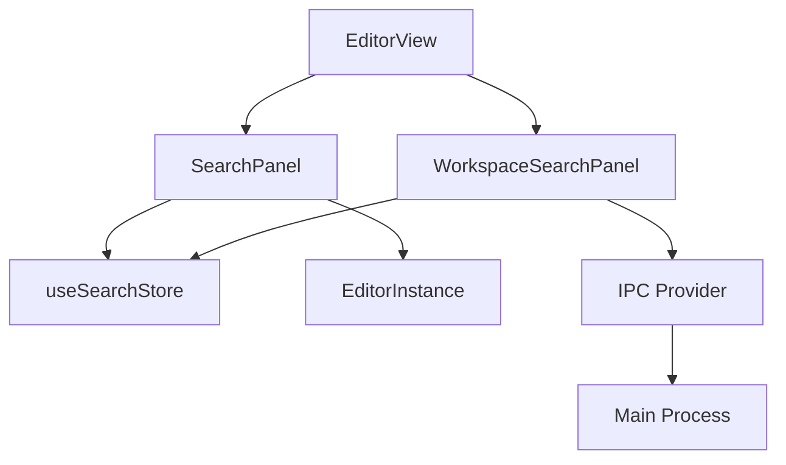

# Phase 12: ドキュメント作成

## メタ情報

| 項目      | 値                     |
| --------- | ---------------------- |
| Phase     | 12                     |
| 機能名    | search-replace-ui      |
| タスクID  | task-imp-search-ui-001 |
| 関連Issue | #366                   |
| 作成日    | 2026-02-04             |

## 目的

実装した機能のドキュメントを作成し、メンテナンス性を確保する。

## ドキュメント一覧

| ドキュメント     | 対象読者       | 内容                             |
| ---------------- | -------------- | -------------------------------- |
| APIドキュメント  | 開発者         | コンポーネントAPI、フック仕様    |
| ユーザーガイド   | エンドユーザー | 検索・置換機能の使い方           |
| アーキテクチャ図 | 開発者         | コンポーネント構成、データフロー |

## 実行タスク

### Task 12-1: APIドキュメント作成

既存のコンポーネントとフックのAPI仕様をドキュメント化する。

```markdown
## SearchPanel

### Props

| Prop           | Type           | Required | Description          |
| -------------- | -------------- | -------- | -------------------- |
| editorInstance | EditorInstance | Yes      | エディタインスタンス |
| onClose        | () => void     | No       | 閉じるコールバック   |

### 使用例

\`\`\`tsx
<SearchPanel
editorInstance={editorInstance}
onClose={() => setShowSearch(false)}
/>
\`\`\`
```

### Task 12-2: ユーザーガイド作成

ユーザー向けの操作ガイドを作成する。

```markdown
## 検索・置換機能

### ファイル内検索

- **Cmd+F** (macOS) / **Ctrl+F** (Windows): 検索パネルを開く
- 検索語を入力してEnterで次のマッチへ移動
- Escapeで検索パネルを閉じる

### ワークスペース検索

- **Cmd+Shift+F** (macOS) / **Ctrl+Shift+F** (Windows): ワークスペース検索パネルを開く
```

### Task 12-3: アーキテクチャドキュメント作成



### Task 12-4: 既存ドキュメントとの整合性確認

既存のUI/UX仕様書（`ui-ux-search-panel.md`）との整合性を確認する。

## ドキュメント構成

```
docs/
├── features/
│   └── search/
│       ├── api-reference.md      # APIリファレンス
│       ├── user-guide.md         # ユーザーガイド
│       └── architecture.md       # アーキテクチャ説明
```

## 成果物

| 成果物           | パス                                    | 説明     |
| ---------------- | --------------------------------------- | -------- |
| APIドキュメント  | `docs/features/search/api-reference.md` | API仕様  |
| ユーザーガイド   | `docs/features/search/user-guide.md`    | 操作説明 |
| アーキテクチャ図 | `docs/features/search/architecture.md`  | 構成図   |

## 完了条件

- [ ] APIドキュメントが作成されている
- [ ] ユーザーガイドが作成されている
- [ ] アーキテクチャドキュメントが作成されている
- [ ] 既存ドキュメントとの整合性が確認されている
- [ ] **本Phase内の全タスクを100%実行完了**

## 次のPhase

Phase 13: PR作成
