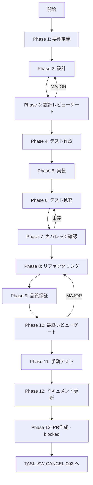

# TASK-SW-CANCEL-001: skill-creator-cancel-channel-constant

## メタ情報

| 項目       | 内容                                  |
| ---------- | ------------------------------------- |
| タスクID   | TASK-SW-CANCEL-001                    |
| タスク名   | skill-creator-cancel-channel-constant |
| 種別       | バグ修正                              |
| 優先度     | High                                  |
| スケール   | 小規模                                |
| 依存タスク | なし                                  |
| 後続タスク | TASK-SW-CANCEL-002                    |
| 作成日     | 2026-04-15                            |
| ステータス | pending                               |

## 概要

`packages/shared/src/ipc/channels.ts` の `SKILL_CREATOR_RUNTIME_CHANNELS` に `SKILL_CREATOR_CANCEL: "skill-creator:cancel"` チャンネル定数を追加する。これにより IPC 4層（shared定数 → Preload ホワイトリスト → Main ハンドラー → Preload API）のうち層1（定数定義）が完成する。

## 背景

`useCancelGeneration.ts:30` のコメント「`AbortController.abort()` でメインプロセス側の処理も中断される」は将来の意図を記したメモであり、現時点では IPC チャンネル自体が存在しない。`SKILL_CREATOR_CANCEL` チャンネルが `channels.ts` に存在しないため、後続の Preload API・Main ハンドラー・Renderer フック修正を行う前に、まず定数を追加する必要がある。

## 対象ファイル

| ファイル                              | 操作 | 説明                                        |
| ------------------------------------- | ---- | ------------------------------------------- |
| `packages/shared/src/ipc/channels.ts` | 修正 | `SKILL_CREATOR_CANCEL` チャンネル定数を追加 |

## 受け入れ基準

| ID   | 受け入れ基準                                                                                           |
| ---- | ------------------------------------------------------------------------------------------------------ |
| AC-1 | `SKILL_CREATOR_RUNTIME_CHANNELS.SKILL_CREATOR_CANCEL` が `"skill-creator:cancel"` として定義されている |
| AC-2 | `IPC_CHANNELS.SKILL_CREATOR_CANCEL` として型安全に参照できる                                           |
| AC-3 | `pnpm typecheck` が PASS する（型エラーなし）                                                          |

## スコープ

### 含む

- `SKILL_CREATOR_RUNTIME_CHANNELS` への `SKILL_CREATOR_CANCEL` 定数追加
- 既存の命名規則・フォーマットへの準拠確認

### 含まない

- Preload ホワイトリスト（`ALLOWED_INVOKE_CHANNELS`）への追加（TASK-SW-CANCEL-002）
- Preload API メソッド追加（TASK-SW-CANCEL-002）
- Main ハンドラー追加（TASK-SW-CANCEL-003）
- Renderer フック修正（TASK-SW-CANCEL-004）

## Phaseリスト

| Phase | 名前         | 概要                                                                   |
| ----- | ------------ | ---------------------------------------------------------------------- |
| 1     | 要件定義     | 対象ファイルの現状確認・命名規則確認・AC固定                           |
| 2     | 設計         | 追加位置・値・命名の設計                                               |
| 3     | 設計レビュー | 設計の矛盾・漏れチェック・IPC 4層整合性確認                            |
| 4     | テスト作成   | TDD Red段階: チャンネル定数存在確認テスト                              |
| 5     | 実装         | channels.ts への定数追加                                               |
| 6     | テスト拡充   | 型安全性・命名規則テスト追加                                           |
| 7     | カバレッジ   | カバレッジ計測・未到達分析                                             |
| 8     | リファクタ   | コード品質改善                                                         |
| 9     | 品質保証     | 静的解析・リスク評価                                                   |
| 10    | 最終レビュー | Phase 1-9 の成果物統合レビュー                                         |
| 11    | 手動テスト   | ビルド確認・型チェック                                                 |
| 12    | ドキュメント | 実装ガイド・仕様更新・更新履歴・未タスク・フィードバック・準拠チェック |
| 13    | PR作成       | blocked（本タスクでは実行しない）                                      |

## タスク分解サマリー

| ID     | フェーズ | サブタスク名         | 責務                                | 依存 |
| ------ | -------- | -------------------- | ----------------------------------- | ---- |
| T-01-1 | Phase 1  | 対象ファイル現状確認 | channels.ts の構造・命名規則確認    | -    |
| T-02-1 | Phase 2  | 定数追加設計         | 追加位置・値・命名の設計            | T-01 |
| T-03-1 | Phase 3  | 設計レビュー         | IPC 4層整合性・命名規則チェック     | T-02 |
| T-04-1 | Phase 4  | テスト作成           | チャンネル定数存在・値テスト（RED） | T-03 |
| T-05-1 | Phase 5  | channels.ts 実装     | SKILL_CREATOR_CANCEL 定数追加       | T-04 |
| T-06-1 | Phase 6  | テスト拡充           | 型安全性・命名規則テスト追加        | T-05 |
| T-07-1 | Phase 7  | カバレッジ確認       | カバレッジ計測・ゲート判定          | T-06 |
| T-08-1 | Phase 8  | リファクタリング     | コード品質改善                      | T-07 |
| T-09-1 | Phase 9  | 品質保証             | 静的解析・リスク評価                | T-08 |
| T-10-1 | Phase 10 | 最終レビュー         | Phase 1-9 成果物統合レビュー        | T-09 |
| T-11-1 | Phase 11 | 手動テスト           | ビルド・型チェック確認              | T-10 |
| T-12-1 | Phase 12 | ドキュメント更新     | 実装ガイド・仕様更新                | T-11 |
| T-13-1 | Phase 13 | PR作成               | blocked                             | T-12 |

**総サブタスク数**: 13個

## 実行フロー図

## Phase一覧

| Phase | 名称               | 仕様書                                                       | ステータス |
| ----- | ------------------ | ------------------------------------------------------------ | ---------- |
| 1     | 要件定義           | [phase-1-requirements.md](phase-1-requirements.md)           | pending    |
| 2     | 設計               | [phase-2-design.md](phase-2-design.md)                       | pending    |
| 3     | 設計レビューゲート | [phase-3-design-review.md](phase-3-design-review.md)         | pending    |
| 4     | テスト作成         | [phase-4-test-creation.md](phase-4-test-creation.md)         | pending    |
| 5     | 実装               | [phase-5-implementation.md](phase-5-implementation.md)       | pending    |
| 6     | テスト拡充         | [phase-6-test-expansion.md](phase-6-test-expansion.md)       | pending    |
| 7     | カバレッジ確認     | [phase-7-coverage-check.md](phase-7-coverage-check.md)       | pending    |
| 8     | リファクタリング   | [phase-8-refactoring.md](phase-8-refactoring.md)             | pending    |
| 9     | 品質保証           | [phase-9-quality-assurance.md](phase-9-quality-assurance.md) | pending    |
| 10    | 最終レビューゲート | [phase-10-final-review.md](phase-10-final-review.md)         | pending    |
| 11    | 手動テスト         | [phase-11-manual-test.md](phase-11-manual-test.md)           | pending    |
| 12    | ドキュメント更新   | [phase-12-documentation.md](phase-12-documentation.md)       | pending    |
| 13    | PR作成             | [phase-13-pr-creation.md](phase-13-pr-creation.md)           | blocked    |

## テストカバレッジ目標

| 指標              | 最低基準 | 推奨基準 |
| ----------------- | -------- | -------- |
| Line Coverage     | 80%      | 90%      |
| Branch Coverage   | 60%      | 70%      |
| Function Coverage | 80%      | 90%      |

## IPC 4層完全接続における本タスクの役割

| 層  | 担当                               | タスク             | 本タスク     |
| --- | ---------------------------------- | ------------------ | ------------ |
| 1   | 定数定義（shared channels.ts）     | TASK-SW-CANCEL-001 | **本タスク** |
| 2   | ホワイトリスト（preload channels） | TASK-SW-CANCEL-002 | -            |
| 3   | ハンドラー登録（main ipcMain）     | TASK-SW-CANCEL-003 | -            |
| 4   | Preload API（contextBridge）       | TASK-SW-CANCEL-002 | -            |
| 5   | Renderer 呼び出し（フック修正）    | TASK-SW-CANCEL-004 | -            |

## 関連

- 後続タスク: `docs/30-workflows/skill-create-flow-gaps/p02-seq-CANCEL-002/index.md`
- 設計根拠: `docs/30-workflows/skill-create-flow-gaps/00-task-spec-design-docs/phase-2-solution.md`（問題2 解決策A）
- 設計レビュー: `docs/30-workflows/skill-create-flow-gaps/00-task-spec-design-docs/phase-3-review.md`
