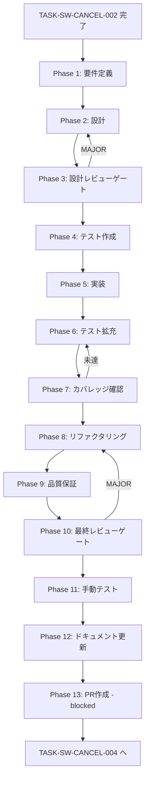

# TASK-SW-CANCEL-003: skill-creator-cancel-main-handler

## メタ情報

| 項目       | 内容                              |
| ---------- | --------------------------------- |
| タスクID   | TASK-SW-CANCEL-003                |
| タスク名   | skill-creator-cancel-main-handler |
| 種別       | バグ修正                          |
| 優先度     | High                              |
| スケール   | 中規模                            |
| 依存タスク | TASK-SW-CANCEL-002                |
| 後続タスク | TASK-SW-CANCEL-004                |
| 作成日     | 2026-04-15                        |
| ステータス | pending                           |

## 概要

`apps/desktop/src/main/services/skill/SkillCreatorService.ts` にキャンセルフラグ（`currentAbortController`）を追加し、`cancelCurrentOperation()` メソッドを実装する。さらに `apps/desktop/src/main/ipc/skillCreatorHandlers.ts` に `SKILL_CREATOR_CANCEL` IPC ハンドラーを追加し、`unregisterSkillCreatorHandlers()` にも対応する `removeHandler` を追加する。

加えて、`useCancelGeneration.startGeneration()` の戻り値（`AbortSignal`）の利用箇所を確認し、接続ロジックへの影響を評価する作業もスコープに含む。

## 背景

TASK-SW-CANCEL-002 で Preload 層に `cancelGeneration` メソッドが追加され、Renderer からメインプロセスへの invoke 経路が確立された。しかしメインプロセス側に `SKILL_CREATOR_CANCEL` ハンドラーが存在しないため、`cancelGeneration()` を呼び出してもメインプロセスは何も処理しない状態にある。本タスクでメインプロセス側のキャンセル処理を実装することで、IPC 4層のうち層3が完成する。

## 対象ファイル

| ファイル                                                      | 操作 | 説明                                                                           |
| ------------------------------------------------------------- | ---- | ------------------------------------------------------------------------------ |
| `apps/desktop/src/main/services/skill/SkillCreatorService.ts` | 修正 | `currentAbortController` プロパティ・`cancelCurrentOperation()` 追加           |
| `apps/desktop/src/main/ipc/skillCreatorHandlers.ts`           | 修正 | `SKILL_CREATOR_CANCEL` ハンドラー追加・`unregisterSkillCreatorHandlers()` 更新 |

## 受け入れ基準

| ID   | 受け入れ基準                                                                                                         |
| ---- | -------------------------------------------------------------------------------------------------------------------- |
| AC-1 | `SkillCreatorService` に `private currentAbortController: AbortController \| null = null` プロパティが存在する       |
| AC-2 | `SkillCreatorService.cancelCurrentOperation()` が `currentAbortController?.abort()` を呼び出し、フラグをリセットする |
| AC-3 | `skillCreatorHandlers.ts` に `SKILL_CREATOR_CANCEL` チャンネルの `ipcMain.handle()` が登録されている                 |
| AC-4 | `unregisterSkillCreatorHandlers()` に `SKILL_CREATOR_CANCEL` の `ipcMain.removeHandler()` が追加されている           |
| AC-5 | `useCancelGeneration.startGeneration()` の `AbortSignal` 利用箇所が確認・評価されている                              |
| AC-6 | `pnpm typecheck` が PASS する（型エラーなし）                                                                        |

## スコープ

### 含む

- `SkillCreatorService` へのキャンセルフラグ追加と `cancelCurrentOperation()` 実装
- `skillCreatorHandlers.ts` への `SKILL_CREATOR_CANCEL` ハンドラー追加
- `unregisterSkillCreatorHandlers()` への `removeHandler` 追加
- `useCancelGeneration.startGeneration()` の `AbortSignal` 利用箇所の調査・評価

### 含まない

- `useCancelGeneration.ts` 自体の修正（TASK-SW-CANCEL-004）
- キャンセル時の不完全スキルディレクトリのクリーンアップ（将来タスク）

## Phaseリスト

| Phase | 名前         | 概要                                                                   |
| ----- | ------------ | ---------------------------------------------------------------------- |
| 1     | 要件定義     | 対象ファイルの現状確認・AbortSignal 利用調査・AC固定                   |
| 2     | 設計         | キャンセルフラグ設計・ハンドラー設計・unregister 設計                  |
| 3     | 設計レビュー | 設計の矛盾・漏れチェック・IPC 4層整合性確認                            |
| 4     | テスト作成   | TDD Red段階: cancelCurrentOperation・ハンドラー登録テスト              |
| 5     | 実装         | SkillCreatorService 修正・skillCreatorHandlers 修正                    |
| 6     | テスト拡充   | エッジケース・状態整合性テスト追加                                     |
| 7     | カバレッジ   | カバレッジ計測・未到達分析                                             |
| 8     | リファクタ   | コード品質改善                                                         |
| 9     | 品質保証     | 静的解析・リスク評価（キャンセル中の状態整合性）                       |
| 10    | 最終レビュー | Phase 1-9 の成果物統合レビュー                                         |
| 11    | 手動テスト   | ビルド確認・型チェック・ハンドラー登録確認                             |
| 12    | ドキュメント | 実装ガイド・仕様更新・更新履歴・未タスク・フィードバック・準拠チェック |
| 13    | PR作成       | blocked（本タスクでは実行しない）                                      |

## タスク分解サマリー

| ID     | フェーズ | サブタスク名              | 責務                                                | 依存   |
| ------ | -------- | ------------------------- | --------------------------------------------------- | ------ |
| T-01-1 | Phase 1  | 対象ファイル現状確認      | SkillCreatorService・Handlers の構造確認            | -      |
| T-01-2 | Phase 1  | AbortSignal 利用箇所調査  | startGeneration() 戻り値の利用箇所確認              | -      |
| T-02-1 | Phase 2  | キャンセルフラグ設計      | currentAbortController・cancelCurrentOperation 設計 | T-01   |
| T-02-2 | Phase 2  | ハンドラー設計            | SKILL_CREATOR_CANCEL ハンドラー・unregister 設計    | T-01   |
| T-03-1 | Phase 3  | 設計レビュー              | IPC 4層整合性・状態整合性チェック                   | T-02   |
| T-04-1 | Phase 4  | テスト作成                | cancelCurrentOperation・ハンドラーテスト（RED）     | T-03   |
| T-05-1 | Phase 5  | SkillCreatorService 実装  | キャンセルフラグ・メソッド追加                      | T-04   |
| T-05-2 | Phase 5  | skillCreatorHandlers 実装 | ハンドラー追加・unregister 更新                     | T-05-1 |
| T-06-1 | Phase 6  | テスト拡充                | エッジケース・状態整合性テスト追加                  | T-05   |
| T-07-1 | Phase 7  | カバレッジ確認            | カバレッジ計測・ゲート判定                          | T-06   |
| T-08-1 | Phase 8  | リファクタリング          | コード品質改善                                      | T-07   |
| T-09-1 | Phase 9  | 品質保証                  | 静的解析・リスク評価                                | T-08   |
| T-10-1 | Phase 10 | 最終レビュー              | Phase 1-9 成果物統合レビュー                        | T-09   |
| T-11-1 | Phase 11 | 手動テスト                | ビルド・型チェック・ハンドラー確認                  | T-10   |
| T-12-1 | Phase 12 | ドキュメント更新          | 実装ガイド・仕様更新                                | T-11   |
| T-13-1 | Phase 13 | PR作成                    | blocked                                             | T-12   |

**総サブタスク数**: 16個

## 実行フロー図

## Phase一覧

| Phase | 名称               | 仕様書                                                       | ステータス |
| ----- | ------------------ | ------------------------------------------------------------ | ---------- |
| 1     | 要件定義           | [phase-1-requirements.md](phase-1-requirements.md)           | pending    |
| 2     | 設計               | [phase-2-design.md](phase-2-design.md)                       | pending    |
| 3     | 設計レビューゲート | [phase-3-design-review.md](phase-3-design-review.md)         | pending    |
| 4     | テスト作成         | [phase-4-test-creation.md](phase-4-test-creation.md)         | pending    |
| 5     | 実装               | [phase-5-implementation.md](phase-5-implementation.md)       | pending    |
| 6     | テスト拡充         | [phase-6-test-expansion.md](phase-6-test-expansion.md)       | pending    |
| 7     | カバレッジ確認     | [phase-7-coverage-check.md](phase-7-coverage-check.md)       | pending    |
| 8     | リファクタリング   | [phase-8-refactoring.md](phase-8-refactoring.md)             | pending    |
| 9     | 品質保証           | [phase-9-quality-assurance.md](phase-9-quality-assurance.md) | pending    |
| 10    | 最終レビューゲート | [phase-10-final-review.md](phase-10-final-review.md)         | pending    |
| 11    | 手動テスト         | [phase-11-manual-test.md](phase-11-manual-test.md)           | pending    |
| 12    | ドキュメント更新   | [phase-12-documentation.md](phase-12-documentation.md)       | pending    |
| 13    | PR作成             | [phase-13-pr-creation.md](phase-13-pr-creation.md)           | blocked    |

## テストカバレッジ目標

| 指標              | 最低基準 | 推奨基準 |
| ----------------- | -------- | -------- |
| Line Coverage     | 80%      | 90%      |
| Branch Coverage   | 60%      | 70%      |
| Function Coverage | 80%      | 90%      |

## 関連

- 前提タスク: `docs/30-workflows/skill-create-flow-gaps/p02-seq-CANCEL-002/index.md`
- 後続タスク: `docs/30-workflows/skill-create-flow-gaps/p04-seq-CANCEL-004/index.md`
- 設計根拠: `docs/30-workflows/00-task-spec-design-docs/phase-2-solution.md`
- 設計レビュー: `docs/30-workflows/00-task-spec-design-docs/phase-3-review.md`（3.2・3.3節）
