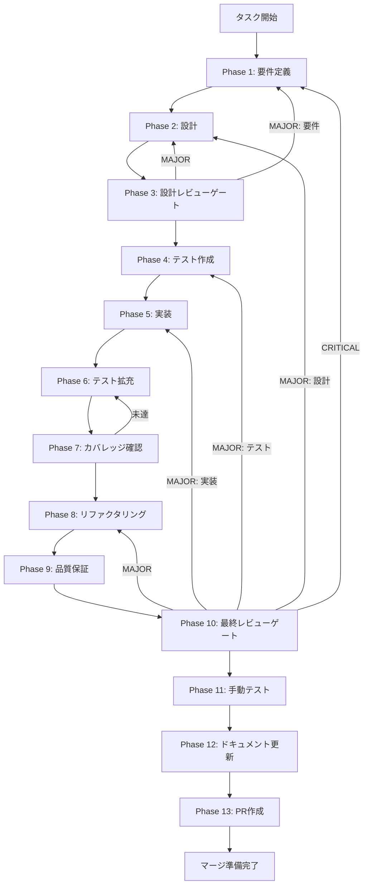

# TASK-SW-TODO-001 - タスク実行仕様書

## メタ情報

| 項目         | 内容                                                    |
| ------------ | ------------------------------------------------------- |
| タスクID     | TASK-SW-TODO-001                                        |
| タスク名     | conversation-round-step-todo-cleanup                    |
| 分類         | 技術的負債解消                                          |
| 対象機能     | スキルウィザード ConversationRoundStep TODOコメント整理 |
| 優先度       | Low                                                     |
| 見積もり規模 | 小規模                                                  |
| ステータス   | 完了                                                    |
| 作成日       | 2026-04-15                                              |
| 完了日       | 2026-04-16                                              |
| 完了PR       | #2199 (commit `2fcca99de`)                              |

---

## タスク概要

### 目的

`ConversationRoundStep.tsx:456` に残置された `TODO(UT-SKILL-WIZARD-MSO-RESOLVE-EXTERNAL-001)` コメントの完了状況を確認し、対象タスクが完了済みであればコメントを削除、未完了であれば現状に即した内容へ更新する。技術的負債を解消し、コードの可読性を維持する。

### 背景

スキル作成フロー連動調査（`docs/30-workflows/skill-create-flow-gaps/00-task-spec-design-docs/`）の Phase 1 分析により、`ConversationRoundStep.tsx:456` に以下の TODO コメントが存在することが判明した。

```typescript
// TODO(UT-SKILL-WIZARD-MSO-RESOLVE-EXTERNAL-001): 主ツールバッジ - resolveExternalIntegration の主ツール参照ロジック変更後に削除
const isMainTool = shouldShowMainToolBadge({
  questionKey: key,
  optionValue: opt,
  selectedOptions,
});
```

この TODO は「`resolveExternalIntegration` の主ツール参照ロジック変更後に削除」と述べていた。PR #2199（コミット `2fcca99de`）により、`resolveExternalIntegration` が `selectedOptions[0]` 単一ツール参照から `string[]` を受け取り `Promise.all` で複数ツールを並列統合する形に変更された。これにより TODO のトリガー条件が満たされ、以下のコードが全て削除された：

- `MAIN_TOOL_BADGE_ENABLED` フラグ
- `shouldShowMainToolBadge()` 関数および `MainToolBadgeProps` インターフェース
- `isMainTool` 変数
- 主ツールバッジJSX（`<span>主ツール</span>`）
- `aria-describedby={isMainTool ? mainToolBadgeId : undefined}` 属性
- `TODO(UT-SKILL-WIZARD-MSO-RESOLVE-EXTERNAL-001)` コメント本体

タスクは PR #2199 により完全に解消済みである。

### 最終ゴール

- `UT-SKILL-WIZARD-MSO-RESOLVE-EXTERNAL-001` の完了状況が確認されている
- 完了済みの場合: TODOコメントを削除し、`MAIN_TOOL_BADGE_ENABLED` フラグも整理する
- 未完了の場合: 現状に即した TODOコメントへ更新し、トレーサビリティを確保する
- コードの意図が明確であり、将来の変更時に混乱が生じない状態

### 成果物一覧

| 種別         | 成果物                       | 配置先                                                                        |
| ------------ | ---------------------------- | ----------------------------------------------------------------------------- |
| コード       | TODOコメント整理済みファイル | `apps/desktop/src/renderer/components/skill/wizard/ConversationRoundStep.tsx` |
| ドキュメント | 要件定義書                   | `outputs/phase-1/requirements-definition.md`                                  |
| ドキュメント | 設計書                       | `outputs/phase-2/design.md`                                                   |
| ドキュメント | 設計レビュー結果             | `outputs/phase-3/gate-decision.md`                                            |
| ドキュメント | カバレッジレポート           | `outputs/phase-7/coverage-report.md`                                          |
| ドキュメント | 最終レビュー結果             | `outputs/phase-10/final-review-result.md`                                     |
| ドキュメント | 手動テスト結果               | `outputs/phase-11/manual-test-result.md`                                      |
| ドキュメント | 実装ガイド                   | `outputs/phase-12/implementation-guide.md`                                    |
| PR           | GitHub Pull Request          | GitHub UI（Phase 13 blocked）                                                 |

---

## 参照ファイル

本仕様書のコマンド選定は以下を参照：

- `docs/30-workflows/skill-create-flow-gaps/00-task-spec-design-docs/phase-1-analysis.md` - 問題4の現状分析
- `docs/30-workflows/skill-create-flow-gaps/00-task-spec-design-docs/phase-2-solution.md` - 解決策設計
- `docs/30-workflows/skill-create-flow-gaps/00-task-spec-design-docs/phase-3-review.md` - 設計レビュー
- `apps/desktop/src/renderer/components/skill/wizard/ConversationRoundStep.tsx` - 修正対象ファイル
- `apps/desktop/src/renderer/components/skill/SkillCreateWizard.tsx` - resolveExternalIntegration 実装

---

## タスク分解サマリー

| ID     | フェーズ | サブタスク名                             | 責務                                       | 依存 |
| ------ | -------- | ---------------------------------------- | ------------------------------------------ | ---- |
| T-01-1 | Phase 1  | 現状確認・受け入れ基準定義               | 対象タスクの完了状況確認・AC定義           | -    |
| T-02-1 | Phase 2  | TODOコメント整理方針の設計               | 完了・未完了の各場合の変更内容確定         | T-01 |
| T-03-1 | Phase 3  | 設計レビューゲート                       | 設計内容の整合性・影響範囲確認             | T-02 |
| T-04-1 | Phase 4  | テスト作成（コメント変更の検証方法確立） | grep/型チェックによる検証方法の定義        | T-03 |
| T-05-1 | Phase 5  | コメント整理の実装                       | TODOコメント削除または更新の実施           | T-04 |
| T-06-1 | Phase 6  | テスト拡充・回帰確認                     | 既存テストへの影響なし確認                 | T-05 |
| T-07-1 | Phase 7  | カバレッジ確認                           | 変更箇所のコードカバレッジ確認             | T-06 |
| T-08-1 | Phase 8  | リファクタリング                         | コメント整理後の不要コード除去             | T-07 |
| T-09-1 | Phase 9  | 品質保証                                 | lint・型チェック・テスト全通過確認         | T-08 |
| T-10-1 | Phase 10 | 最終レビューゲート                       | 変更内容の最終確認                         | T-09 |
| T-11-1 | Phase 11 | 手動テスト                               | UIでの主ツールバッジ動作確認               | T-10 |
| T-12-1 | Phase 12 | ドキュメント更新                         | 変更履歴・未タスク検出・フィードバック記録 | T-11 |
| T-13-1 | Phase 13 | PR作成                                   | PR作成（blocked / ユーザー承認待ち）       | T-12 |

**総サブタスク数**: 13個

---

## 実行フロー図



---

## Phase一覧

| Phase | 名称               | 仕様書                                                       | ステータス                    |
| ----- | ------------------ | ------------------------------------------------------------ | ----------------------------- |
| 1     | 要件定義           | [phase-1-requirements.md](phase-1-requirements.md)           | 完了（PR #2199 にて解消済み） |
| 2     | 設計               | [phase-2-design.md](phase-2-design.md)                       | 完了（PR #2199 にて解消済み） |
| 3     | 設計レビューゲート | [phase-3-design-review.md](phase-3-design-review.md)         | 完了（PR #2199 にて解消済み） |
| 4     | テスト作成         | [phase-4-test-creation.md](phase-4-test-creation.md)         | 完了（PR #2199 にて解消済み） |
| 5     | 実装               | [phase-5-implementation.md](phase-5-implementation.md)       | 完了（PR #2199 にて解消済み） |
| 6     | テスト拡充         | [phase-6-test-expansion.md](phase-6-test-expansion.md)       | 完了（PR #2199 にて解消済み） |
| 7     | カバレッジ確認     | [phase-7-coverage-check.md](phase-7-coverage-check.md)       | 完了（PR #2199 にて解消済み） |
| 8     | リファクタリング   | [phase-8-refactoring.md](phase-8-refactoring.md)             | 完了（PR #2199 にて解消済み） |
| 9     | 品質保証           | [phase-9-quality-assurance.md](phase-9-quality-assurance.md) | 完了（PR #2199 にて解消済み） |
| 10    | 最終レビューゲート | [phase-10-final-review.md](phase-10-final-review.md)         | 完了（PR #2199 にて解消済み） |
| 11    | 手動テスト         | [phase-11-manual-test.md](phase-11-manual-test.md)           | 完了（PR #2199 にて解消済み） |
| 12    | ドキュメント更新   | [phase-12-documentation.md](phase-12-documentation.md)       | 完了（本ファイル更新済み）    |
| 13    | PR作成             | [phase-13-pr-creation.md](phase-13-pr-creation.md)           | 完了（PR #2199 マージ済み）   |

---

## テストカバレッジ目標

### ユニットテスト

| 指標              | 最低基準 | 推奨基準 |
| ----------------- | -------- | -------- |
| Line Coverage     | 80%      | 90%      |
| Branch Coverage   | 60%      | 70%      |
| Function Coverage | 80%      | 90%      |

---

## Phase完了時の必須アクション

**各Phase完了時に以下を必ず実行すること:**

1. **タスク100%実行**: Phase内で指定された全タスクを完全に実行
2. **成果物確認**: 全ての必須成果物が生成されていることを検証
3. **実行記録**: 実行タスクの結果を記録
4. **artifacts.json更新**: Phase完了ステータスを更新
5. **Phase末端の実行確認**: 各タスクを100%実行し、各タスクを完遂した旨を必ず明記

```bash
# Phase完了処理
node .claude/skills/task-specification-creator/scripts/complete-phase.js \
  --workflow docs/30-workflows/skill-create-flow-gaps/TASK-SW-TODO-001 --phase {{N}} \
  --artifacts "outputs/phase-{{N}}/{{FILE}}.md:{{DESCRIPTION}}"
```
