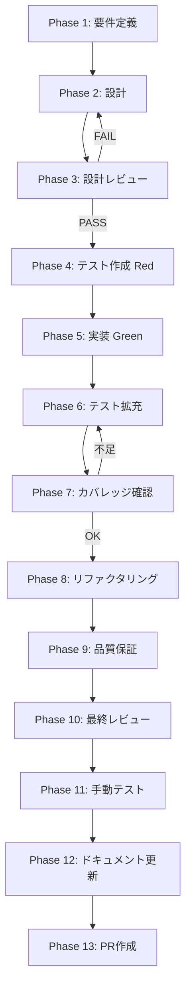

# fix-step3-seq-execute-plan-nonblocking - タスク実行仕様書

## ユーザーからの元の指示

skill-creator:execute-plan IPCハンドラーをfire-and-forget化し、30分スキル生成タスクの非同期実行を可能にする

## メタ情報

| 項目         | 内容                                   |
| ------------ | -------------------------------------- |
| タスクID     | TASK-FIX-EXECUTE-PLAN-FF-001           |
| タスク名     | fix-step3-seq-execute-plan-nonblocking |
| 分類         | バグ修正/改善                          |
| 対象機能     | スキル生成IPC実行層                    |
| 優先度       | 高                                     |
| 見積もり規模 | 中規模                                 |
| ステータス   | 未実施                                 |
| 作成日       | 2026-04-01                             |

## タスク概要

### 目的

`skill-creator:execute-plan` IPC ハンドラーが持つ根本的な設計上の問題を修正する。現状は `await runtimeSkillCreatorService.execute(...)` で同期待機するため、Renderer が 5 秒でタイムアウトし、10〜30 分かかるスキル生成タスクを完了させることができない。

### 背景

Electron の IPC request/response モデルは 1 往復の通信を想定しており、長時間ブロッキング処理とは根本的に非互換である。`skill-creator:execute-plan` チャンネルは以下の 2 つの問題を抱えている:

1. **`CHANNEL_TIMEOUTS` に未登録** → デフォルト 5000ms でタイムアウト（30 分タスクに対して致命的）
2. **`creatorHandlers.ts` がブロッキング** → `await runtimeSkillCreatorService.execute(...)` で同期待機するため Renderer が 5 秒でタイムアウト

### 最終ゴール

`ipcMain.handle('skill-creator:execute-plan')` が 100ms 以内に `{ accepted: true, planId }` を返し、バックグラウンドで Agent SDK `query()` 呼び出しが非同期実行される。各フェーズ遷移は既存の `SKILL_CREATOR_WORKFLOW_STATE_CHANGED` チャンネル経由でプッシュ通知される。

### 成果物一覧

| 成果物                     | パス                                                                                               | 種別       |
| -------------------------- | -------------------------------------------------------------------------------------------------- | ---------- |
| CHANNEL_TIMEOUTS 追加      | `apps/desktop/src/preload/ipc-utils.ts`                                                            | コード修正 |
| fire-and-forget ハンドラー | `apps/desktop/src/main/ipc/creatorHandlers.ts`                                                     | コード修正 |
| onPhaseChanged callback    | `apps/desktop/src/main/services/runtime/SkillCreatorWorkflowEngine.ts`                             | コード修正 |
| executeAsync メソッド      | `apps/desktop/src/main/services/runtime/RuntimeSkillCreatorFacade.ts`                              | コード修正 |
| タイムアウト設定テスト     | `apps/desktop/src/preload/__tests__/ipc-utils.execute-plan-timeout.test.ts`                        | テスト     |
| fire-and-forget テスト     | `apps/desktop/src/main/ipc/__tests__/creatorHandlers.fire-and-forget.test.ts`                      | テスト     |
| フェーズイベントテスト     | `apps/desktop/src/main/services/runtime/__tests__/SkillCreatorWorkflowEngine.phase-events.test.ts` | テスト     |

## 参照ファイル

| 参照資料                      | パス                                                                           | 内容                              |
| ----------------------------- | ------------------------------------------------------------------------------ | --------------------------------- |
| セキュリティ仕様              | `.claude/skills/aiworkflow-requirements/references/security-electron-ipc.md`   | Electron IPC セキュリティ設計     |
| アーキテクチャ仕様            | `.claude/skills/aiworkflow-requirements/references/architecture-overview.md`   | システム全体像                    |
| タスクワークフロー            | `.claude/skills/aiworkflow-requirements/references/task-workflow-completed.md` | 完了タスク記録                    |
| ipc-utils.ts                  | `apps/desktop/src/preload/ipc-utils.ts`                                        | CHANNEL_TIMEOUTS 定義（修正対象） |
| creatorHandlers.ts            | `apps/desktop/src/main/ipc/creatorHandlers.ts`                                 | execute ハンドラー（修正対象）    |
| SkillCreatorWorkflowEngine.ts | `apps/desktop/src/main/services/runtime/SkillCreatorWorkflowEngine.ts`         | WorkflowEngine（修正対象）        |
| RuntimeSkillCreatorFacade.ts  | `apps/desktop/src/main/services/runtime/RuntimeSkillCreatorFacade.ts`          | Facade（修正対象）                |

## タスク分解サマリー

| Phase | 名称                  | 主な作業                                      |
| ----- | --------------------- | --------------------------------------------- |
| 1     | 要件定義              | P50チェック、インベントリ、受入条件（AC）定義 |
| 2     | 設計                  | 4 concern 変更設計、IPC 4層整合性確認         |
| 3     | 設計レビュー          | AC 充足確認、Phase 4 進行判定                 |
| 4     | テスト作成（TDD Red） | テストファイル 3 本作成（Red 状態）           |
| 5     | 実装                  | 修正ファイル 4 本、テスト Green 化            |
| 6     | テスト拡充            | エッジケース・並列実行・エラーパステスト追加  |
| 7     | カバレッジ確認        | 各ファイルのカバレッジ目標達成確認            |
| 8     | リファクタリング      | コード整理、コメント・型安全性改善            |
| 9     | 品質保証              | 全体テスト実行、ESLint、型チェック            |
| 10    | 最終レビュー          | AC-1〜AC-6 充足確認、PR 可否判定              |
| 11    | 手動テスト            | Electron 上での統合動作確認（NON_VISUAL）     |
| 12    | ドキュメント更新      | 実装ガイド・仕様書同期・スキルフィードバック  |
| 13    | PR作成                | ユーザー明示承認後のみ実施                    |

## 実行フロー図

## Phase一覧

| Phase | 名称             | 仕様書                                                         |
| ----- | ---------------- | -------------------------------------------------------------- |
| 1     | 要件定義         | [phase-1-requirements.md](./phase-1-requirements.md)           |
| 2     | 設計             | [phase-2-design.md](./phase-2-design.md)                       |
| 3     | 設計レビュー     | [phase-3-design-review.md](./phase-3-design-review.md)         |
| 4     | テスト作成       | [phase-4-test-creation.md](./phase-4-test-creation.md)         |
| 5     | 実装             | [phase-5-implementation.md](./phase-5-implementation.md)       |
| 6     | テスト拡充       | [phase-6-test-expansion.md](./phase-6-test-expansion.md)       |
| 7     | カバレッジ確認   | [phase-7-coverage-check.md](./phase-7-coverage-check.md)       |
| 8     | リファクタリング | [phase-8-refactoring.md](./phase-8-refactoring.md)             |
| 9     | 品質保証         | [phase-9-quality-assurance.md](./phase-9-quality-assurance.md) |
| 10    | 最終レビュー     | [phase-10-final-review.md](./phase-10-final-review.md)         |
| 11    | 手動テスト       | [phase-11-manual-test.md](./phase-11-manual-test.md)           |
| 12    | ドキュメント更新 | [phase-12-documentation.md](./phase-12-documentation.md)       |
| 13    | PR作成           | [phase-13-pr-creation.md](./phase-13-pr-creation.md)           |

## テストカバレッジ目標

| 対象ファイル                                      | 行カバレッジ | ブランチカバレッジ | 備考                         |
| ------------------------------------------------- | ------------ | ------------------ | ---------------------------- |
| `ipc-utils.ts`（execute-plan 部分）               | 100%         | 100%               | CHANNEL_TIMEOUTS 追加行      |
| `creatorHandlers.ts`（execute ハンドラー）        | 90% 以上     | 85% 以上           | fire-and-forget ブランチ含む |
| `SkillCreatorWorkflowEngine.ts`（onPhaseChanged） | 90% 以上     | 85% 以上           | callback 呼び出しパス        |
| `RuntimeSkillCreatorFacade.ts`（executeAsync）    | 90% 以上     | 85% 以上           | エラーパス含む               |

## Phase完了時の必須アクション

各 Phase 完了時に以下を実施すること:

1. `outputs/phase-N/` に成果物ファイルを配置する
2. 完了条件チェックリストの全項目にチェックを入れる
3. 「タスク100%実行確認【必須】」セクションを確認する
4. 次 Phase へ進む前に成果物の存在を確認する
