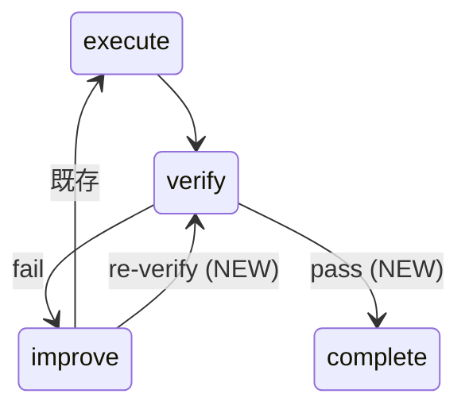

# Phase 2: 設計

## メタ情報

| 項目       | 内容                                             |
| ---------- | ------------------------------------------------ |
| Phase      | 2                                                |
| Phase名    | 設計                                             |
| 対象機能   | TASK-P0-02 verify→improve→re-verify 閉ループ修復 |
| 前提Phase  | Phase 1: 要件定義                                |
| 次Phase    | Phase 3: 設計レビュー                            |
| ステータス | pending                                          |
| 作成日     | 2026-03-29                                       |

## 目的

`recordVerifyPass()` のシグネチャ設計、improve→verify 遷移の追加、verification engine との統合方式、UI snapshot への反映方法を確定する。

## 実行タスク

### Task 1: recordVerifyPass() シグネチャ設計

- `recordVerifyFailure()` と対称的なインターフェースで `recordVerifyPass()` を定義する
- 引数: `SkillCreatorVerifyResult` (status: "pass")
- 戻り値: phase 遷移結果（verify→complete or verify→handoff）
- verify pass 後の nextAction を定義する（"complete" | "handoff"）

### Task 2: phase 遷移テーブル修正設計

- 現行遷移テーブルに以下を追加:
  - verify(pass) → complete（または次フェーズ）
  - improve → verify（re-verify 直接遷移）
- improve→execute→verify の間接経路を残しつつ、improve→verify のショートカットを追加する
- 遷移テーブルの一貫性を state machine 図で確認する

### Task 3: verification engine 統合設計

- P0-01 の SkillCreatorVerificationEngine から verify 結果を受け取る interface を定義する
- `requestReverify()` の eligibility check を verification engine の状態と連動させる
- auto-populate checks の結果を `recordVerifyPass()` / `recordVerifyFailure()` に渡す流れを設計する

### Task 4: UI snapshot 変更設計

- verify 状態の pass/fail/pending を SkillCreatorSnapshot に反映する
- creatorHandlers.ts の IPC 経路で verify 結果を renderer に通知する設計
- 既存の `getCreatorSnapshot` が verify 状態を含むよう拡張する

### Task 5: RuntimeSkillCreatorFacade 統合設計

- Facade 経由で `recordVerifyPass()` を呼び出す経路を定義する
- 既存の `recordVerifyFailure()` と並列に配置する
- improve 後の re-verify 要求を Facade から発行する方法を定義する

## 参照資料

| 資料名             | パス                                                                   | 説明                        |
| ------------------ | ---------------------------------------------------------------------- | --------------------------- |
| 要件定義           | `phase-1-requirements.md`                                              | AC-1〜AC-6                  |
| WorkflowEngine     | `apps/desktop/src/main/services/runtime/SkillCreatorWorkflowEngine.ts` | 遷移テーブル修正対象        |
| RuntimeFacade      | `apps/desktop/src/main/services/runtime/RuntimeSkillCreatorFacade.ts`  | Facade 統合対象             |
| creatorHandlers    | `apps/desktop/src/main/ipc/creatorHandlers.ts`                         | IPC handler 更新対象        |
| skillCreator types | `packages/shared/src/types/skillCreator.ts`                            | SkillCreatorVerifyResult 型 |

## 統合テスト連携

- 遷移テーブルの全 edge を Phase 4 のテストケースに落とす
- UI snapshot の verify 状態が renderer テストで観測可能であることを確認する

## 成果物

| 成果物 | パス                                 | 説明                                            |
| ------ | ------------------------------------ | ----------------------------------------------- |
| 設計書 | `outputs/phase-2/design-document.md` | シグネチャ、遷移テーブル、統合設計、UI snapshot |

## 完了条件

- [ ] `recordVerifyPass()` のシグネチャが確定している
- [ ] phase 遷移テーブルに improve→verify と verify(pass) が追加されている
- [ ] verification engine との統合 interface が定義されている
- [ ] UI snapshot 変更が設計されている
- [ ] Facade 統合経路が定義されている
- [ ] 本Phase内の全タスクを100%実行完了

## タスク100%実行確認【必須】

- [ ] 本Phase内の全タスクを100%実行完了
- [ ] 各タスクの成果物が生成されている
- [ ] artifacts.jsonが更新されている
- [ ] Phase末端で各タスクを100%完了し、完了を明記している

## 次Phase

→ [Phase 3: 設計レビュー](./phase-3-design-review.md)
