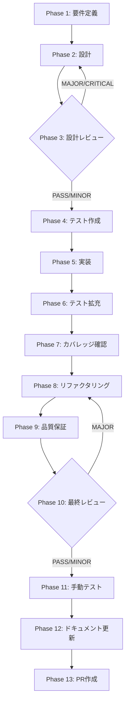

# TASK-UI-01: LifecyclePanel 一次導線昇格

## メタ情報

| 項目           | 内容                                                                                        |
| -------------- | ------------------------------------------------------------------------------------------- |
| タスクID       | TASK-UI-01                                                                                  |
| タスク名       | LifecyclePanel 一次導線昇格                                                                 |
| 分類           | UI ルーティング改善                                                                         |
| 対象機能       | SkillLifecyclePanel を一次導線に昇格                                                        |
| 優先度         | P0                                                                                          |
| 見積もり規模   | 中規模                                                                                      |
| ステータス     | spec_created                                                                                |
| 依存タスク     | なし                                                                                        |
| 後続タスク     | TASK-UI-02, TASK-UI-03                                                                      |
| 作成日         | 2026-04-06                                                                                  |
| 親ワークフロー | skill-creator-agent-sdk-lane/step-11-seq-task-ui-01-lifecycle-panel-primary-route-promotion |

---

## タスク概要

### 目的

SkillLifecyclePanel をスキル作成の一次導線（プライマリルート）として直接アクセス可能にし、会話型インタビューによるスキル作成フロー（plan → review → execute → verify → improve）をメインナビゲーションから直接利用できるようにする。

### 背景

現状、スキル作成には2つの導線が存在する:

1. **一次導線（プライマリ）**: `SkillCreateWizard`（4ステップフォーム）— メインナビゲーションの「スキル作成」からアクセス
2. **二次導線（セカンダリ）**: `SkillLifecyclePanel`（会話型インタビュー + フルライフサイクル）— `SkillManagementPanel` 経由でのみアクセス可能

会話型スキル作成フロー（LifecyclePanel）は、plan → review → execute → verify → improve の完全なライフサイクルを提供し、SkillCreateWizard よりも高品質なスキル作成体験を実現する。しかし、現在はメインナビゲーションからの直接アクセスができず、ユーザーが SkillManagementPanel を経由する必要がある。

### 最終ゴール

1. SkillLifecyclePanel がメインナビゲーションの「スキル作成」から直接アクセスできる
2. 既存の SkillCreateWizard への導線は維持される（後方互換）
3. `normalizeSkillLifecycleView()` が新しいルーティングを正しくハンドルする
4. `skillLifecycleJourney.ts` のナビゲーション定義が更新される
5. モバイル/デスクトップ両方のナビゲーションで動作する

---

## 受入条件

| AC   | 条件                                                             | 検証方法        |
| ---- | ---------------------------------------------------------------- | --------------- |
| AC-1 | SkillLifecyclePanel がスキル作成の一次導線として直接アクセス可能 | E2E テスト      |
| AC-2 | 既存 SkillCreateWizard への導線は維持（後方互換）                | E2E テスト      |
| AC-3 | `normalizeSkillLifecycleView()` が新ルーティングを正しくハンドル | ユニットテスト  |
| AC-4 | `skillLifecycleJourney.ts` のナビゲーション定義が更新されている  | ユニットテスト  |
| AC-5 | モバイル/デスクトップ両方のナビゲーションで動作する              | 手動テスト      |
| AC-6 | 既存テストが pass する                                           | CI / テスト実行 |

---

## スコープ

### 含む

- `App.tsx` のルート定義変更（LifecyclePanel への直接ルート追加）
- `normalizeSkillLifecycleView()` の更新
- `skillLifecycleJourney.ts` のナビゲーション定義更新
- `SkillManagementPanel.tsx` からの既存導線維持
- メインナビゲーションのエントリポイント追加/変更
- 既存テストの修正（ルーティング変更に伴うもの）

### 含まない

- SkillCreateWizard の廃止や機能変更
- SkillLifecyclePanel の内部ロジック変更
- 新しいUIコンポーネントの作成
- バックエンド/IPC の変更
- ViewType 定義の新規追加（既存定義の活用を優先）

---

## 依存関係

| 種別       | 参照先                                                                                      | 役割                            |
| ---------- | ------------------------------------------------------------------------------------------- | ------------------------------- |
| upstream   | `../requirements-draft.md`                                                                  | skill-creator 全体の要件        |
| upstream   | `../root-workflow-pack/index.md`                                                            | lane 共通不変条件と責務分離方針 |
| reference  | `.agents/skills/aiworkflow-requirements/references/ui-ux-navigation.md`                     | ナビゲーション契約              |
| reference  | `.agents/skills/aiworkflow-requirements/references/interfaces-agent-sdk-skill-reference.md` | Skill Creator サービス仕様      |
| downstream | TASK-UI-02                                                                                  | 本タスク完了後に着手可能        |
| downstream | TASK-UI-03                                                                                  | 本タスク完了後に着手可能        |

## 現行コードアンカー

| ファイル                                                              | 現状の役割                                                     | TASK-UI-01 での扱い                              |
| --------------------------------------------------------------------- | -------------------------------------------------------------- | ------------------------------------------------ |
| `apps/desktop/src/renderer/components/skill/SkillCreateWizard.tsx`    | 現在の一次導線。4ステップフォームによるスキル作成UI            | 導線維持（後方互換）。廃止しない                 |
| `apps/desktop/src/renderer/components/skill/SkillLifecyclePanel.tsx`  | 会話型インタビュー + フルライフサイクルUI。現在は二次導線      | 一次導線に昇格。直接ルートを追加                 |
| `apps/desktop/src/renderer/App.tsx`                                   | ルート定義、`normalizeSkillLifecycleView()` によるビュー正規化 | ルート追加、`normalizeSkillLifecycleView()` 更新 |
| `apps/desktop/src/renderer/navigation/skillLifecycleJourney.ts`       | ナビゲーション定義。スキルライフサイクルの遷移パターン         | ナビゲーション定義更新。一次導線エントリ追加     |
| `apps/desktop/src/renderer/components/skill/SkillManagementPanel.tsx` | 現在の LifecyclePanel へのエントリポイント                     | 既存導線維持。LifecyclePanel への参照は残す      |
| `packages/shared/src/types/skillCreator.ts`                           | ViewType 定義                                                  | 既存定義の活用。新規追加は最小限                 |

## 要件レビュー一次結論

| 観点                 | 結論                                                                                                                                                   |
| -------------------- | ------------------------------------------------------------------------------------------------------------------------------------------------------ |
| 真の論点             | SkillLifecyclePanel が二次導線にしかないため、会話型スキル作成フローへの到達性が低い問題を、ルーティング変更で解決する                                 |
| 依存関係・責務分離   | ルーティング層（App.tsx, skillLifecycleJourney.ts）のみ変更。コンポーネント内部ロジックは変更しない。SkillCreateWizard の既存導線は維持                |
| 価値とコストの不均衡 | ルーティング定義の追加・変更のみで実現可能。コスト小・価値高（UX の大幅改善）                                                                          |
| 改善優先順位         | 1. App.tsx ルート定義追加 2. normalizeSkillLifecycleView() 更新 3. skillLifecycleJourney.ts 更新 4. メインナビゲーションエントリ調整 5. 既存テスト修正 |
| 4条件評価            | 価値性: 高（UX改善・到達性向上）/ 実現性: 高（ルーティング変更のみ）/ 整合性: ナビゲーション契約と整合 / 運用性: 後方互換性を維持しつつ段階的移行可能  |

---

## 成果物一覧

| Phase | 名称             | 成果物                                      |
| ----- | ---------------- | ------------------------------------------- |
| 1     | 要件定義         | `outputs/phase-1/spec-extraction-map.md`    |
|       |                  | `outputs/phase-1/requirements-checklist.md` |
| 2     | 設計             | `outputs/phase-2/design-document.md`        |
| 3     | 設計レビュー     | `outputs/phase-3/design-review-gate.md`     |
| 4     | テスト作成       | `outputs/phase-4/test-matrix.md`            |
| 5     | 実装             | `outputs/phase-5/implementation-record.md`  |
| 6     | テスト拡充       | `outputs/phase-6/test-expansion.md`         |
| 7     | カバレッジ確認   | `outputs/phase-7/coverage-report.md`        |
| 8     | リファクタリング | `outputs/phase-8/refactoring-log.md`        |
| 9     | 品質保証         | `outputs/phase-9/qa-report.md`              |
| 10    | 最終レビュー     | `outputs/phase-10/final-review-result.md`   |
| 11    | 手動テスト       | `outputs/phase-11/manual-test-result.md`    |
| 12    | ドキュメント更新 | `outputs/phase-12/implementation-guide.md`  |
| 13    | PR作成           | `outputs/phase-13/pr-creation-record.md`    |

---

## タスク分解サマリ（Phase 1-13）



| Phase | 名称             | パターン | 依存     | ゲート |
| ----- | ---------------- | -------- | -------- | ------ |
| 1     | 要件定義         | seq      | -        | -      |
| 2     | 設計             | seq      | Phase 1  | -      |
| 3     | 設計レビュー     | seq      | Phase 2  | GATE   |
| 4     | テスト作成       | seq      | Phase 3  | -      |
| 5     | 実装             | seq      | Phase 4  | -      |
| 6     | テスト拡充       | seq      | Phase 5  | -      |
| 7     | カバレッジ確認   | seq      | Phase 6  | -      |
| 8     | リファクタリング | seq      | Phase 7  | -      |
| 9     | 品質保証         | seq      | Phase 8  | -      |
| 10    | 最終レビュー     | seq      | Phase 9  | GATE   |
| 11    | 手動テスト       | seq      | Phase 10 | -      |
| 12    | ドキュメント更新 | par      | Phase 11 | -      |
| 13    | PR作成           | seq      | Phase 12 | -      |

---

## テストカバレッジ目標

| カテゴリ | 対象                                                     | 目標         |
| -------- | -------------------------------------------------------- | ------------ |
| ユニット | `normalizeSkillLifecycleView()` の新ルーティングハンドル | 100%         |
| ユニット | `skillLifecycleJourney.ts` のナビゲーション定義          | 100%         |
| ユニット | App.tsx ルート定義の一致確認                             | 100%         |
| 統合     | メインナビゲーション → LifecyclePanel 到達 E2E フロー    | 導線到達確認 |
| 統合     | SkillCreateWizard への既存導線維持                       | 後方互換確認 |

---

## Phase 完了時アクション

各 Phase 完了時に以下を実行:

```bash
node .claude/skills/task-specification-creator/scripts/complete-phase.js \
  --workflow step-11-seq-task-ui-01-lifecycle-panel-primary-route-promotion \
  --phase <PHASE_NUMBER>
```

---

## 実装者向けクイックガイド

### 変更の核心

1. **App.tsx**: メインナビゲーションの「スキル作成」エントリポイントが SkillLifecyclePanel を直接開くルートを追加
2. **normalizeSkillLifecycleView()**: 新ルートからのアクセスを正しく正規化するロジック追加
3. **skillLifecycleJourney.ts**: 一次導線としてのナビゲーション遷移パターン定義
4. **後方互換**: SkillCreateWizard、SkillManagementPanel 経由のアクセスは全て維持

### 注意点

- ViewType の新規追加は最小限に。既存定義の活用を優先
- SkillLifecyclePanel のコンポーネント内部は変更しない
- モバイル/デスクトップ両方のナビゲーションパターンを考慮する

---

## 出力ファイル構成

```
docs/30-workflows/skill-creator-agent-sdk-lane/step-11-seq-task-ui-01-lifecycle-panel-primary-route-promotion/
├── index.md
├── artifacts.json
├── phase-1-requirements.md
├── phase-2-design.md
├── phase-3-design-review.md
├── phase-4-test-creation.md
├── phase-5-implementation.md
├── phase-6-test-expansion.md
├── phase-7-coverage-check.md
├── phase-8-refactoring.md
├── phase-9-quality-assurance.md
├── phase-10-final-review.md
├── phase-11-manual-test.md
├── phase-12-documentation.md
├── phase-13-pr-creation.md
└── outputs/
    ├── .gitkeep
    ├── phase-1/ ~ phase-13/
    └── phase-11/screenshots/
```
