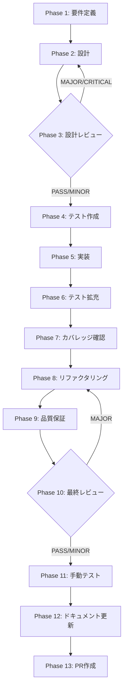

# TASK-UI-02: ConversationPanel 孤立解消

## メタ情報

| 項目           | 内容                                                         |
| -------------- | ------------------------------------------------------------ |
| タスクID       | TASK-UI-02                                                   |
| タスク名       | ConversationPanel 孤立解消                                   |
| 分類           | UI コンポーネント統合                                        |
| 対象機能       | SkillCreatorConversationPanel / ConversationalInterview 統合 |
| 優先度         | P0（最高）                                                   |
| 見積もり規模   | 中規模                                                       |
| ステータス     | spec_created                                                 |
| 発見元         | UI/UX ナビゲーション監査                                     |
| 作成日         | 2026-04-06                                                   |
| 更新日         | 2026-04-06                                                   |
| 依存タスク     | TASK-UI-01（ルート昇格完了後に着手）                         |
| 後続タスク     | なし                                                         |
| 関連Issue      | -                                                            |
| 親ワークフロー | step-12-par-task-ui-02-conversation-panel-orphan-resolution  |

---

## タスク概要

### 目的

完全実装済みだがルート未登録で到達不能な `SkillCreatorConversationPanel` コンポーネントを、正式なルートへ昇格するか `ConversationalInterview` と統合し、孤立状態を解消する。

### 背景

現在、会話型スキル作成 UI に以下の二重構造が存在する:

1. **SkillCreatorConversationPanel.tsx** — フル機能のチャットベーススキル作成 UI だが、`App.tsx` にルートが存在せず完全に到達不能。Phase-11 デモ HTML からのみ参照されている。`window.skillCreatorSessionAPI`（session IPC）を使用。
2. **ConversationalInterview.tsx** — `SkillLifecyclePanel` に埋め込まれた既存インタビュー UI。runtime IPC パスを使用。

この 2 つの会話型 UI はコードも IPC パスも共有しておらず、以下の問題を引き起こしている:

- ナビゲーションの断絶（ConversationPanel に到達する正規ルートがない）
- IPC パスの分散（session IPC と runtime IPC が並立）
- 共有可能コンポーネント（QuestionCard 等）の再利用不足
- 孤立した参照（デモ HTML）の残存

### 最終ゴール

1. SkillCreatorConversationPanel が正式なルートを持つ、または ConversationalInterview と統合される
2. session IPC と runtime IPC の使い分けが明確化される
3. QuestionCard 等の共有可能コンポーネントが整理される
4. 孤立した参照（デモ HTML）がクリーンアップされる
5. 既存テストが全て pass する

---

## 受入条件

| AC   | 条件                                                                                            | 検証方法          |
| ---- | ----------------------------------------------------------------------------------------------- | ----------------- |
| AC-1 | SkillCreatorConversationPanel が正式なルートを持つ、または ConversationalInterview と統合される | 手動テスト / UT   |
| AC-2 | session IPC と runtime IPC の使い分けが明確化される                                             | 設計レビュー / UT |
| AC-3 | QuestionCard 等の共有可能コンポーネントが整理される                                             | コードレビュー    |
| AC-4 | 孤立した参照（デモ HTML）がクリーンアップされる                                                 | grep 検索で確認   |
| AC-5 | 既存テストが pass する                                                                          | `pnpm test` 実行  |

---

## スコープ

- **含む**: ConversationPanel のルート追加または統合、IPC 経路の明確化、QuestionCard 等の共有コンポーネント整理、デモ HTML クリーンアップ、テスト維持
- **含まない**: 新規 IPC チャネルの設計（既存パスの整理のみ）、SkillLifecyclePanel の全面再設計、Electron メインプロセスの大規模改修

---

## 依存関係

| 種別       | 参照先                                                                                      | 役割                                      |
| ---------- | ------------------------------------------------------------------------------------------- | ----------------------------------------- |
| upstream   | TASK-UI-01（ルート昇格）                                                                    | プライマリルートが確定してから着手する    |
| peer       | TASK-UI-03                                                                                  | 並行実行可能                              |
| upstream   | `.agents/skills/aiworkflow-requirements/references/ui-ux-navigation.md`                     | ナビゲーション契約                        |
| upstream   | `.agents/skills/aiworkflow-requirements/references/interfaces-agent-sdk-skill-reference.md` | Skill Creator サービス仕様                |
| downstream | なし                                                                                        | 本タスクで ConversationPanel の孤立を解消 |

## 現行コードアンカー

| ファイル                                                                               | 現状の役割                                                    | TASK-UI-02 での扱い                            |
| -------------------------------------------------------------------------------------- | ------------------------------------------------------------- | ---------------------------------------------- |
| `apps/desktop/src/renderer/components/skill-creator/SkillCreatorConversationPanel.tsx` | チャットベーススキル作成 UI。ルート未登録で到達不能           | ルート追加 or ConversationalInterview との統合 |
| `apps/desktop/src/renderer/components/skill-creator/QuestionCard.tsx`                  | 質問レンダリング。ConversationPanel から使用                  | 共有コンポーネントとして整理                   |
| `apps/desktop/src/renderer/components/skill/ConversationalInterview.tsx`               | SkillLifecyclePanel 内の既存インタビュー UI。runtime IPC 使用 | 統合対象候補。IPC 経路の統一を検討             |
| `apps/desktop/src/renderer/App.tsx`                                                    | ルーティング定義。ConversationPanel のルートが存在しない      | ルート追加 or 不要判定                         |
| `apps/desktop/src/preload/skill-creator-api.ts`                                        | session IPC API 定義。ConversationPanel が依存                | runtime IPC との関係を明確化                   |
| `packages/shared/src/types/skillCreator.ts`                                            | 共有型定義                                                    | 型の統一・共通化を検討                         |

## システム仕様参照（aiworkflow-requirements連携）

各 Phase の「参照資料」セクションに以下のシステム仕様を含めること:

| 参照資料                  | パス                                                                                                  | 内容                                               |
| ------------------------- | ----------------------------------------------------------------------------------------------------- | -------------------------------------------------- |
| UI/UX ナビゲーション契約  | `.agents/skills/aiworkflow-requirements/references/ui-ux-navigation.md`                               | ルーティング・ナビゲーション設計の正本             |
| Skill Creator Service仕様 | `.agents/skills/aiworkflow-requirements/references/interfaces-agent-sdk-skill-reference.md`           | SkillCreatorService、IPC パターンの仕様            |
| IPC契約チェックリスト     | `.agents/skills/aiworkflow-requirements/references/ipc-contract-checklist.md`                         | IPC修正時の Main/Preload/型定義 同時更新チェック   |
| スキル実行IPCセキュリティ | `.agents/skills/aiworkflow-requirements/references/security-skill-ipc-core.md`                        | パストラバーサル防止、コマンドインジェクション防止 |
| テスト標準化              | `.agents/skills/aiworkflow-requirements/references/lessons-learned-skill-lifecycle-test-hardening.md` | コンポーネントテストの標準化                       |

---

## 要件レビュー一次結論

| 観点                 | 結論                                                                                                                                                   |
| -------------------- | ------------------------------------------------------------------------------------------------------------------------------------------------------ |
| 真の論点             | 2つの会話型UIが並立し、コードもIPC経路も共有していない状態を解消すること。統合か分離かの方針決定が最重要                                               |
| 依存関係・責務境界   | ConversationPanel は session IPC、ConversationalInterview は runtime IPC を使用。TASK-UI-01 でプライマリルートが確定した後に、本タスクで孤立を解消する |
| 価値とコストの不均衡 | 統合は中程度のコストだが、ナビゲーション断絶と IPC 分散の解消は高い価値がある。デモ HTML の残存もメンテナンスコストとなる                              |
| 改善優先順位         | 1. 2UI の機能比較・方針決定 2. IPC 経路統一設計 3. 共有コンポーネント抽出 4. ルート追加/統合実装 5. デモ HTML クリーンアップ                           |
| 4条件評価            | 価値性: P0（到達不能 UI の解消）/ 実現性: 高（既存コード整理）/ 整合性: TASK-UI-01 後に着手 / 運用性: ナビゲーションの一貫性確保                       |

---

## 成果物一覧

| Phase | 名称             | 成果物                                           |
| ----- | ---------------- | ------------------------------------------------ |
| 1     | 要件定義         | `outputs/phase-1/spec-extraction-map.md`         |
|       |                  | `outputs/phase-1/component-comparison-matrix.md` |
| 2     | 設計             | `outputs/phase-2/design-document.md`             |
| 3     | 設計レビュー     | `outputs/phase-3/design-review-gate.md`          |
| 4     | テスト作成       | `outputs/phase-4/test-matrix.md`                 |
| 5     | 実装             | `outputs/phase-5/implementation-record.md`       |
| 6     | テスト拡充       | `outputs/phase-6/test-expansion.md`              |
| 7     | カバレッジ確認   | `outputs/phase-7/coverage-report.md`             |
| 8     | リファクタリング | `outputs/phase-8/refactoring-log.md`             |
| 9     | 品質保証         | `outputs/phase-9/qa-report.md`                   |
| 10    | 最終レビュー     | `outputs/phase-10/final-review-result.md`        |
| 11    | 手動テスト       | `outputs/phase-11/manual-test-result.md`         |
| 12    | ドキュメント更新 | `outputs/phase-12/implementation-guide.md`       |
| 13    | PR作成           | `outputs/phase-13/pr-creation-record.md`         |

---

## タスク分解サマリ（Phase 1-13）



| Phase | 名称             | パターン | 依存     | ゲート |
| ----- | ---------------- | -------- | -------- | ------ |
| 1     | 要件定義         | seq      | -        | -      |
| 2     | 設計             | seq      | Phase 1  | -      |
| 3     | 設計レビュー     | seq      | Phase 2  | GATE   |
| 4     | テスト作成       | seq      | Phase 3  | -      |
| 5     | 実装             | seq      | Phase 4  | -      |
| 6     | テスト拡充       | seq      | Phase 5  | -      |
| 7     | カバレッジ確認   | seq      | Phase 6  | -      |
| 8     | リファクタリング | seq      | Phase 7  | -      |
| 9     | 品質保証         | seq      | Phase 8  | -      |
| 10    | 最終レビュー     | seq      | Phase 9  | GATE   |
| 11    | 手動テスト       | seq      | Phase 10 | -      |
| 12    | ドキュメント更新 | par      | Phase 11 | -      |
| 13    | PR作成           | seq      | Phase 12 | -      |

---

## テストカバレッジ目標

### ユニットテスト

| 指標              | 最低基準 | 推奨基準 |
| ----------------- | -------- | -------- |
| Line Coverage     | 80%      | 90%      |
| Branch Coverage   | 60%      | 70%      |
| Function Coverage | 80%      | 90%      |

### テスト対象と目標

| カテゴリ | 対象                                                           | 目標 | テストファイル          |
| -------- | -------------------------------------------------------------- | ---- | ----------------------- |
| ユニット | ConversationPanel / ConversationalInterview コンポーネント描画 | 80%  | コンポーネントテスト    |
| ユニット | QuestionCard 共有コンポーネント                                | 90%  | `QuestionCard.test.tsx` |
| ユニット | IPC 経路（session / runtime）の呼び出し                        | 90%  | IPC ハンドラテスト      |
| 統合     | ルーティング到達性（App.tsx → ConversationPanel）              | 100% | ルーティングテスト      |

---

## Phase 完了時アクション

各 Phase 完了時に以下を実行:

```bash
node .claude/skills/task-specification-creator/scripts/complete-phase.js \
  --workflow step-12-par-task-ui-02-conversation-panel-orphan-resolution \
  --phase <PHASE_NUMBER>
```

---

## 出力ファイル構成

```
docs/30-workflows/skill-creator-agent-sdk-lane/step-12-par-task-ui-02-conversation-panel-orphan-resolution/
├── index.md
├── artifacts.json
├── phase-1-requirements.md
├── phase-2-design.md
├── phase-3-design-review.md
├── phase-4-test-creation.md
├── phase-5-implementation.md
├── phase-6-test-expansion.md
├── phase-7-coverage-check.md
├── phase-8-refactoring.md
├── phase-9-quality-assurance.md
├── phase-10-final-review.md
├── phase-11-manual-test.md
├── phase-12-documentation.md
├── phase-13-pr-creation.md
└── outputs/
    ├── phase-1/ ~ phase-13/
    └── phase-11/screenshots/
```

---

## 実装者向けクイックガイド

1. **Phase 1** で 2 つの会話 UI の機能比較マトリクスを作成し、統合 or 分離の方針を決定する
2. **Phase 2** で共有コンポーネント抽出設計と IPC 経路選択設計を行う
3. **Phase 3** のゲートを通過したら **Phase 4** でテストを先行作成する
4. **Phase 5** でルート追加/統合実装とデモ HTML クリーンアップを行う
5. **Phase 10** のゲートで AC-1〜AC-5 の総合判定を行う
6. 全 Phase 完了後、`/ai:diff-to-pr` で PR を作成する
