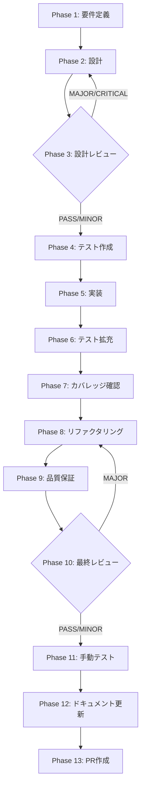

# TASK-UI-03: IPC 二重経路統合

## メタ情報

| 項目           | 内容                                                   |
| -------------- | ------------------------------------------------------ |
| タスクID       | TASK-UI-03                                             |
| タスク名       | IPC 二重経路統合（Session IPC / Runtime IPC）          |
| 分類           | IPC アーキテクチャ統合                                 |
| 対象機能       | skill-creator IPC 通信層                               |
| 優先度         | P0（最高）                                             |
| 見積もり規模   | 中規模                                                 |
| ステータス     | spec_created                                           |
| 発見元         | skill-creator-agent-sdk-lane UI 統合監査               |
| 作成日         | 2026-04-06                                             |
| 更新日         | 2026-04-06                                             |
| 依存タスク     | TASK-UI-01（ルート昇格が先行完了すること）             |
| 後続タスク     | なし                                                   |
| 並行可能タスク | TASK-UI-02                                             |
| 親ワークフロー | step-12-par-task-ui-03-ipc-session-runtime-unification |

---

## タスク概要

### 目的

Skill Creator の IPC 通信に存在する二重経路（Session IPC / Runtime IPC）を統合し、新機能開発者が迷わず使える一貫した IPC アーキテクチャを確立する。

### 背景

現在の Skill Creator には 2 つの独立した IPC 通信パスが存在する:

1. **Session IPC** (`window.skillCreatorSessionAPI`):
   - 使用元: `SkillCreatorConversationPanel`
   - チャネル: `startSession`, `sendAnswer`, `onQuestion`, `listSessions`, `getSessionDetail`, `resumeSession`, `deleteSession`
   - パターン: 質問/回答型の会話フロー

2. **Runtime IPC** (`window.electronAPI.skillCreator`):
   - 使用元: `SkillLifecyclePanel` / `ConversationalInterview`
   - チャネル: `planSkill`, `executePlan`, `submitUserInput`, `getWorkflowState`, `onWorkflowStateChanged`
   - パターン: ワークフロー状態スナップショット型

これらの二重経路は以下の問題を引き起こしている:

- エラーハンドリングが経路ごとに異なる
- 状態モデルが分断されている（質問/回答 vs ワークフロー状態）
- preload 層が両 API surface を公開するが相互運用しない
- 新機能開発時にどちらの IPC 経路を使うべきか判断基準がない

### 最終ゴール

1. IPC 経路に統一された設計方針を持つ（統合 or 明確な分離契約）
2. 新機能開発者が適切な IPC 経路を迷わず選択できるガイドライン
3. preload 層の API surface が整理され一貫性を持つ
4. `creatorHandlers.ts` のハンドラー構成が整合的である
5. セキュリティ要件（パストラバーサル防止等）が両経路で均一に適用される

---

## 受入条件

| AC   | 条件                                                                 | 検証方法          |
| ---- | -------------------------------------------------------------------- | ----------------- |
| AC-1 | IPC 経路が統一された設計方針を持つ（統合 or 明確な分離契約）         | 設計レビュー      |
| AC-2 | 新機能開発者がどの IPC 経路を使うべきか明確に判断できる              | ドキュメント確認  |
| AC-3 | preload 層の API surface が整理されている                            | コードレビュー    |
| AC-4 | creatorHandlers.ts のハンドラーが整合的に構成されている              | コードレビュー    |
| AC-5 | IPC 契約チェックリスト（Main/Preload/型定義の同時更新）に準拠        | チェックリスト    |
| AC-6 | セキュリティ要件（パストラバーサル防止等）が両経路で均一に適用される | セキュリティ監査  |
| AC-7 | 既存テストが pass する                                               | CI/ユニットテスト |

---

## スコープ

- **含む**: IPC 経路の設計方針策定、preload API surface の整理、creatorHandlers.ts の構成統合、channel 命名規則の統一、セキュリティ要件の均一化、IPC 契約チェックリスト準拠
- **含まない**: UI コンポーネントの全面リライト、WorkflowEngine の状態遷移変更（TASK-P0-02 の範囲）、新規 IPC チャネルの追加（統合/整理のみ）、Electron バージョンアップ

---

## 依存関係

| 種別       | 参照先                           | 役割                                                |
| ---------- | -------------------------------- | --------------------------------------------------- |
| upstream   | TASK-UI-01（ルート昇格）         | ルーティング構造が確定してから IPC 整理を行う       |
| peer       | TASK-UI-02（並行実行可能）       | UI 統合と IPC 統合を並行で進められる                |
| upstream   | `../root-workflow-pack/index.md` | lane 共通不変条件と責務分離方針                     |
| downstream | なし                             | 本タスクは IPC アーキテクチャ統合の最終ピースとなる |

## 現行コードアンカー

| ファイル                                                              | 現状の役割                                       | TASK-UI-03 での扱い                          |
| --------------------------------------------------------------------- | ------------------------------------------------ | -------------------------------------------- |
| `apps/desktop/src/preload/skill-creator-api.ts`                       | Session IPC の API 定義                          | Runtime IPC との統合 or 明確な分離契約を策定 |
| `apps/desktop/src/preload/channels.ts`                                | チャネルホワイトリスト（session + runtime 両方） | 命名規則の統一、重複チャネルの整理           |
| `apps/desktop/src/main/ipc/creatorHandlers.ts`                        | Session IPC と Runtime IPC 両方のハンドラー      | ハンドラー構成の整合化                       |
| `apps/desktop/src/main/ipc/index.ts`                                  | IPC ハンドラー登録                               | 登録パターンの統一確認                       |
| `apps/desktop/src/main/services/runtime/RuntimeSkillCreatorFacade.ts` | Runtime IPC のバックエンド                       | Session IPC との接続点の明確化               |
| `packages/shared/src/types/skillCreator.ts`                           | 共有型定義（session + runtime 両方の型）         | 型の統合 or 明確な分離                       |

## システム仕様参照（aiworkflow-requirements 連携）

各 Phase の「参照資料」セクションに以下のシステム仕様を含めること:

| 参照資料                  | パス                                                                           | 内容                                               |
| ------------------------- | ------------------------------------------------------------------------------ | -------------------------------------------------- |
| Agent IPC チャネル仕様    | `.agents/skills/aiworkflow-requirements/references/api-ipc-agent-core.md`      | IPC チャネル定義の正本                             |
| IPC契約チェックリスト     | `.agents/skills/aiworkflow-requirements/references/ipc-contract-checklist.md`  | IPC修正時の Main/Preload/型定義 同時更新チェック   |
| スキル実行IPCセキュリティ | `.agents/skills/aiworkflow-requirements/references/security-skill-ipc-core.md` | パストラバーサル防止、コマンドインジェクション防止 |

---

## 要件レビュー一次結論

| 観点                 | 結論                                                                                                                                                   |
| -------------------- | ------------------------------------------------------------------------------------------------------------------------------------------------------ |
| 真の論点             | 二重 IPC 経路が新機能開発の判断コストを高め、セキュリティ適用の均一性を損なっている。統合 or 明確な分離契約で解消する                                  |
| 依存関係・責務境界   | Session IPC は会話型フロー、Runtime IPC はワークフロー状態管理。責務が異なるため、完全統合よりも明確な分離契約+共通基盤の方が適切な可能性がある        |
| 価値とコストの不均衡 | preload API surface の整理と命名規則統一は低コスト・高価値。完全統合は高コストのため、段階的アプローチが妥当                                           |
| 改善優先順位         | 1. 全チャネル棚卸し 2. 設計方針決定 3. preload 整理 4. creatorHandlers 整合化 5. セキュリティ均一化 6. ドキュメント整備                                |
| 4条件評価            | 価値性: P0（開発者体験・セキュリティ基盤）/ 実現性: 高（既存コードの整理）/ 整合性: TASK-UI-01 完了後に実施 / 運用性: IPC 契約チェックリストで持続可能 |

---

## 成果物一覧

| Phase | 名称             | 成果物                                        |
| ----- | ---------------- | --------------------------------------------- |
| 1     | 要件定義         | `outputs/phase-1/spec-extraction-map.md`      |
|       |                  | `outputs/phase-1/ipc-channel-inventory.md`    |
| 2     | 設計             | `outputs/phase-2/design-document.md`          |
|       |                  | `outputs/phase-2/ipc-unification-strategy.md` |
| 3     | 設計レビュー     | `outputs/phase-3/design-review-gate.md`       |
| 4     | テスト作成       | `outputs/phase-4/test-matrix.md`              |
| 5     | 実装             | `outputs/phase-5/implementation-record.md`    |
| 6     | テスト拡充       | `outputs/phase-6/test-expansion.md`           |
| 7     | カバレッジ確認   | `outputs/phase-7/coverage-report.md`          |
| 8     | リファクタリング | `outputs/phase-8/refactoring-log.md`          |
| 9     | 品質保証         | `outputs/phase-9/qa-report.md`                |
| 10    | 最終レビュー     | `outputs/phase-10/final-review-result.md`     |
| 11    | 手動テスト       | `outputs/phase-11/manual-test-result.md`      |
| 12    | ドキュメント更新 | `outputs/phase-12/implementation-guide.md`    |
| 13    | PR作成           | `outputs/phase-13/pr-creation-record.md`      |

---

## タスク分解サマリ（Phase 1-13）



| Phase | 名称             | パターン | 依存     | ゲート |
| ----- | ---------------- | -------- | -------- | ------ |
| 1     | 要件定義         | seq      | -        | -      |
| 2     | 設計             | seq      | Phase 1  | -      |
| 3     | 設計レビュー     | seq      | Phase 2  | GATE   |
| 4     | テスト作成       | seq      | Phase 3  | -      |
| 5     | 実装             | seq      | Phase 4  | -      |
| 6     | テスト拡充       | seq      | Phase 5  | -      |
| 7     | カバレッジ確認   | seq      | Phase 6  | -      |
| 8     | リファクタリング | seq      | Phase 7  | -      |
| 9     | 品質保証         | seq      | Phase 8  | -      |
| 10    | 最終レビュー     | seq      | Phase 9  | GATE   |
| 11    | 手動テスト       | seq      | Phase 10 | -      |
| 12    | ドキュメント更新 | par      | Phase 11 | -      |
| 13    | PR作成           | seq      | Phase 12 | -      |

---

## テストカバレッジ目標

### ユニットテスト

| 指標              | 最低基準 | 推奨基準 |
| ----------------- | -------- | -------- |
| Line Coverage     | 80%      | 90%      |
| Branch Coverage   | 60%      | 70%      |
| Function Coverage | 80%      | 90%      |

### テスト対象と目標

| カテゴリ | 対象                                           | 目標 | テストファイル              |
| -------- | ---------------------------------------------- | ---- | --------------------------- |
| ユニット | preload API surface（統合後）                  | 100% | `skill-creator-api.test.ts` |
| ユニット | creatorHandlers チャネルルーティング           | 100% | `creatorHandlers.test.ts`   |
| ユニット | チャネルホワイトリスト整合性                   | 100% | `channels.test.ts`          |
| ユニット | セキュリティ要件（パストラバーサル防止）       | 100% | セキュリティテスト          |
| 統合     | Session IPC + Runtime IPC の end-to-end フロー | E2E  | 統合テスト                  |

---

## Phase 完了時アクション

各 Phase 完了時に以下を実行:

```bash
node .claude/skills/task-specification-creator/scripts/complete-phase.js \
  --workflow step-12-par-task-ui-03-ipc-session-runtime-unification \
  --phase <PHASE_NUMBER>
```

---

## 出力ファイル構成

```
docs/30-workflows/skill-creator-agent-sdk-lane/step-12-par-task-ui-03-ipc-session-runtime-unification/
├── index.md
├── artifacts.json
├── phase-1-requirements.md
├── phase-2-design.md
├── phase-3-design-review.md
├── phase-4-test-creation.md
├── phase-5-implementation.md
├── phase-6-test-expansion.md
├── phase-7-coverage-check.md
├── phase-8-refactoring.md
├── phase-9-quality-assurance.md
├── phase-10-final-review.md
├── phase-11-manual-test.md
├── phase-12-documentation.md
├── phase-13-pr-creation.md
└── outputs/
    ├── .gitkeep
    ├── phase-1/ ~ phase-13/
    └── phase-11/screenshots/
```
