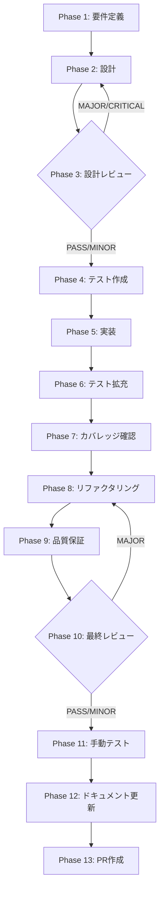

# TASK-UI-04: 仕様書ステータス乖離修正

## メタ情報

| 項目           | 内容                                                            |
| -------------- | --------------------------------------------------------------- |
| タスクID       | TASK-UI-04                                                      |
| タスク名       | 仕様書ステータス乖離修正                                        |
| 分類           | メンテナンス / 品質管理                                         |
| 対象機能       | タスク仕様書群の artifacts.json / index.md ステータスフィールド |
| 優先度         | P0（最高）                                                      |
| 見積もり規模   | 中規模                                                          |
| ステータス     | spec_created                                                    |
| 発見元         | 実装状態監査（P0タスク群の実装完了後レビュー）                  |
| 作成日         | 2026-04-06                                                      |
| 更新日         | 2026-04-06                                                      |
| 依存タスク     | TASK-UI-01, TASK-UI-02, TASK-UI-03                              |
| 後続タスク     | なし                                                            |
| 関連Issue      | -                                                               |
| 親ワークフロー | step-13-seq-task-ui-04-spec-status-drift-correction             |

---

## タスク概要

### 目的

タスク仕様書の artifacts.json および index.md に記載された status フィールドが、実際のコード実装状態と乖離している問題を是正する。7〜8 件のタスク仕様書で `spec_created` / `未着手` と記載されているにもかかわらず、対応するコードは完全に実装・マージ済みであり、開発者が残作業を正確に判断できない状態にある。

### 背景

P0 タスク群（TASK-P0-01 〜 TASK-P0-09）の実装が進行する中で、仕様書のステータスフィールドが更新されずに取り残された。結果として以下の混乱が発生している:

1. **TASK-P0-01** (verify engine layer1/2) — artifacts.json が `in_progress` だがコードは完全実装済み・マージ済み
2. **TASK-P0-02** (verify→improve closed loop) — spec が `spec_created` だが `recordVerifyPass()`, `requestReverify()` は実装済み
3. **TASK-P0-04** (ManifestLoader default activation) — spec が `spec_created` だが `hasDynamicResourcePipeline()` は動作済み
4. **TASK-P0-05** (execute→SkillFileWriter integration) — `spec_created` だが `_executeInternal()` に完全パイプライン実装済み
5. **TASK-P0-06** (conversational interview UI) — `spec_created` だが `ConversationalInterview.tsx` は機能済み
6. **TASK-P0-07** (hardcoded agent names) — `spec_created` だが動的解決ステータスの検証が必要
7. **TASK-P0-08** (session resume renderer) — `spec_created` だが session IPC handlers が `creatorHandlers.ts` に存在
8. **TASK-P0-09** (permission hooks governance) — `in_progress` だが `governance/` ディレクトリに完全実装済み

### 最終ゴール

1. 全タスク仕様書の artifacts.json status が実装状態と一致する
2. 完了済みタスクは completed-tasks/ ディレクトリへ移動される（該当する場合）
3. 部分完了タスクに残作業の明確な記録がある
4. 親 index.md のタスク一覧が最新の状態を反映する
5. executor-guide.md の実行ステータスが更新されている

---

## 受入条件

| AC   | 条件                                                                   | 検証方法         |
| ---- | ---------------------------------------------------------------------- | ---------------- |
| AC-1 | 全タスク仕様書の artifacts.json status が実装状態と一致する            | 手動レビュー     |
| AC-2 | 完了タスクは completed-tasks/ ディレクトリへ移動される（該当する場合） | ディレクトリ確認 |
| AC-3 | 部分完了タスクに残作業の明確な記録がある                               | ドキュメント確認 |
| AC-4 | 親 index.md のタスク一覧が最新の状態を反映する                         | 手動レビュー     |
| AC-5 | executor-guide.md の実行ステータスが更新されている                     | 手動レビュー     |

---

## スコープ

- **含む**: artifacts.json の status フィールド更新、index.md のステータス更新、completed-tasks ディレクトリへの移動、残作業の記録、executor-guide.md の更新
- **含まない**: コード変更、テスト追加、機能実装、新規タスク仕様書の作成

---

## 依存関係

| 種別       | 参照先                           | 役割                                         |
| ---------- | -------------------------------- | -------------------------------------------- |
| upstream   | TASK-UI-01 (UI変更仕様)          | UI変更が仕様化されてから実行し再乖離を防ぐ   |
| upstream   | TASK-UI-02 (UI変更仕様)          | UI変更が仕様化されてから実行し再乖離を防ぐ   |
| upstream   | TASK-UI-03 (UI変更仕様)          | UI変更が仕様化されてから実行し再乖離を防ぐ   |
| upstream   | `../requirements-draft.md`       | lane 共通要件                                |
| upstream   | `../root-workflow-pack/index.md` | lane 共通不変条件と責務分離方針              |
| peer       | TASK-P0-01 〜 TASK-P0-09         | ステータス修正の対象タスク群                 |
| downstream | なし                             | 本タスクはメンテナンス作業の最終ピースとなる |

## 現行コードアンカー

| ファイル / ディレクトリ                                            | 現状の役割                     | TASK-UI-04 での扱い                  |
| ------------------------------------------------------------------ | ------------------------------ | ------------------------------------ |
| `docs/30-workflows/skill-creator-agent-sdk-lane/`                  | 全タスク仕様書ディレクトリの親 | 各タスク仕様書の status を監査・更新 |
| `apps/desktop/src/main/services/runtime/`                          | runtime 実装ファイル群         | 実装状態の確認対象（読取のみ）       |
| `apps/desktop/src/renderer/components/skill/`                      | UI コンポーネントファイル群    | 実装状態の確認対象（読取のみ）       |
| `apps/desktop/src/main/ipc/creatorHandlers.ts`                     | IPC ハンドラ                   | 実装状態の確認対象（読取のみ）       |
| `docs/30-workflows/skill-creator-agent-sdk-lane/executor-guide.md` | 実行ガイド                     | ステータス更新対象                   |
| `docs/30-workflows/skill-creator-agent-sdk-lane/index.md`          | lane 親 index                  | タスク一覧のステータス更新対象       |

## システム仕様参照（aiworkflow-requirements連携）

各 Phase の「参照資料」セクションに以下のシステム仕様を含めること:

| 参照資料                       | パス                                                                                        | 内容                                      |
| ------------------------------ | ------------------------------------------------------------------------------------------- | ----------------------------------------- |
| Skill Creator Service仕様      | `.agents/skills/aiworkflow-requirements/references/interfaces-agent-sdk-skill-reference.md` | SkillCreatorService の公開 API と状態遷移 |
| タスクワークフローフェーズ仕様 | `.agents/skills/aiworkflow-requirements/references/task-workflow-phases.md`                 | Phase 1-13 のフェーズ遷移テーブル         |

---

## 要件レビュー一次結論

| 観点                 | 結論                                                                                                                                          |
| -------------------- | --------------------------------------------------------------------------------------------------------------------------------------------- |
| 真の論点             | 仕様書の status フィールドが実装状態と乖離しており、残作業の正確な把握が不可能になっている問題を一括修正すること                              |
| 依存関係・責務境界   | 本タスクはドキュメント修正のみ。コード変更は行わない。TASK-UI-01/02/03 の仕様化完了後に実行し再乖離を防ぐ                                     |
| 価値とコストの不均衡 | ステータスフィールドの更新のみで実装コストは極めて低い。一方、乖離放置は開発者の混乱を継続させるため価値は高い                                |
| 改善優先順位         | 1. 全タスク仕様書の現行ステータス抽出 2. コード実装状態との突合 3. artifacts.json 更新 4. index.md 更新 5. completed-tasks 移動 6. ガイド更新 |
| 4条件評価            | 価値性: P0（正確な状態把握の前提）/ 実現性: 高（ドキュメント修正のみ）/ 整合性: 全タスクと横断的に関連 / 運用性: 更新後は即座に効果発揮       |

---

## 成果物一覧

| Phase | 名称             | 成果物                                      |
| ----- | ---------------- | ------------------------------------------- |
| 1     | 要件定義         | `outputs/phase-1/spec-extraction-map.md`    |
|       |                  | `outputs/phase-1/status-drift-inventory.md` |
| 2     | 設計             | `outputs/phase-2/correction-plan.md`        |
| 3     | 設計レビュー     | `outputs/phase-3/design-review-gate.md`     |
| 4     | テスト作成       | `outputs/phase-4/test-matrix.md`            |
| 5     | 実装             | `outputs/phase-5/implementation-record.md`  |
| 6     | テスト拡充       | `outputs/phase-6/test-expansion.md`         |
| 7     | カバレッジ確認   | `outputs/phase-7/coverage-report.md`        |
| 8     | リファクタリング | `outputs/phase-8/refactoring-log.md`        |
| 9     | 品質保証         | `outputs/phase-9/qa-report.md`              |
| 10    | 最終レビュー     | `outputs/phase-10/final-review-result.md`   |
| 11    | 手動テスト       | `outputs/phase-11/manual-test-result.md`    |
| 12    | ドキュメント更新 | `outputs/phase-12/implementation-guide.md`  |
| 13    | PR作成           | `outputs/phase-13/pr-creation-record.md`    |

---

## タスク分解サマリ（Phase 1-13）



| Phase | 名称             | パターン | 依存     | ゲート |
| ----- | ---------------- | -------- | -------- | ------ |
| 1     | 要件定義         | seq      | -        | -      |
| 2     | 設計             | seq      | Phase 1  | -      |
| 3     | 設計レビュー     | seq      | Phase 2  | GATE   |
| 4     | テスト作成       | seq      | Phase 3  | -      |
| 5     | 実装             | seq      | Phase 4  | -      |
| 6     | テスト拡充       | seq      | Phase 5  | -      |
| 7     | カバレッジ確認   | seq      | Phase 6  | -      |
| 8     | リファクタリング | seq      | Phase 7  | -      |
| 9     | 品質保証         | seq      | Phase 8  | -      |
| 10    | 最終レビュー     | seq      | Phase 9  | GATE   |
| 11    | 手動テスト       | seq      | Phase 10 | -      |
| 12    | ドキュメント更新 | par      | Phase 11 | -      |
| 13    | PR作成           | seq      | Phase 12 | -      |

---

## Phase 完了時アクション

各 Phase 完了時に以下を実行:

```bash
node .claude/skills/task-specification-creator/scripts/complete-phase.js \
  --workflow step-13-seq-task-ui-04-spec-status-drift-correction \
  --phase <PHASE_NUMBER>
```

---

## 出力ファイル構成

```
docs/30-workflows/skill-creator-agent-sdk-lane/step-13-seq-task-ui-04-spec-status-drift-correction/
├── index.md
├── artifacts.json
├── phase-1-requirements.md
├── phase-2-design.md
├── phase-3-design-review.md
├── phase-4-test-creation.md
├── phase-5-implementation.md
├── phase-6-test-expansion.md
├── phase-7-coverage-check.md
├── phase-8-refactoring.md
├── phase-9-quality-assurance.md
├── phase-10-final-review.md
├── phase-11-manual-test.md
├── phase-12-documentation.md
├── phase-13-pr-creation.md
└── outputs/
    ├── .gitkeep
    ├── phase-1/
    │   ├── spec-extraction-map.md
    │   └── status-drift-inventory.md
    ├── phase-2/
    │   └── correction-plan.md
    ├── phase-3/
    │   └── design-review-gate.md
    ├── phase-4/
    │   └── test-matrix.md
    ├── phase-5/
    │   └── implementation-record.md
    ├── phase-6/
    │   └── test-expansion.md
    ├── phase-7/
    │   └── coverage-report.md
    ├── phase-8/
    │   └── refactoring-log.md
    ├── phase-9/
    │   └── qa-report.md
    ├── phase-10/
    │   └── final-review-result.md
    ├── phase-11/
    │   └── manual-test-result.md
    ├── phase-12/
    │   └── implementation-guide.md
    └── phase-13/
        └── pr-creation-record.md
```
