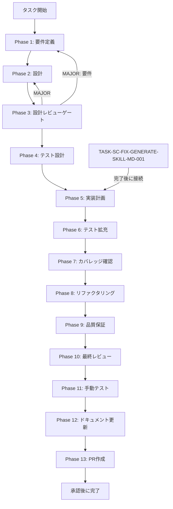

# TASK-SC-IMP-CREATE-WORKFLOW-001 - タスク実行仕様書

## ユーザーからの元の指示

```
SkillCreatorService.ts の runCreateWorkflow が空実装（void options のみ）。
create モードでスキルを作成する際に LLM による SKILL.md 内容生成が行われない問題を修正する。
既存の resourceLoader.loadAgent パターンを踏襲し、agentファイルを読み込んで構造計画 JSON を
組み立てる実装を追加する。
```

## メタ情報

| 項目         | 内容                                           |
| ------------ | ---------------------------------------------- |
| タスクID     | TASK-SC-IMP-CREATE-WORKFLOW-001                |
| タスク名     | imp-create-workflow                            |
| 分類         | バグ修正 / 実装                                |
| 対象機能     | SkillCreatorService - createモードワークフロー |
| 優先度       | High                                           |
| 見積もり規模 | 小規模                                         |
| ステータス   | 進行中                                         |
| 作成日       | 2026-04-14                                     |
| depends_on   | **TASK-SC-FIX-GENERATE-SKILL-MD-001**（必須）  |

---

## タスク概要

### 目的

`SkillCreatorService.ts` の `runCreateWorkflow`（行574-577）が `void options` のみで空実装になっている。
`create` モードでスキルを作成する際に `resourceLoader.loadAgent` を通じて agentファイルを読み込み、
構造計画 JSON（StructurePlanJson）を組み立てるロジックを実装する。

### 背景

`collaborative` モードでは `runCollaborativeWorkflow` が `resourceLoader.loadAgent("hearing")` を呼び出すパターンが確立されている。
同様に `create` モードでも `runCreateWorkflow` が `resourceLoader.loadAgent("extract-purpose")` 等を
呼び出して構造計画を生成すべきだが、現状は `void options` のコメントのみで何も行われていない。

タスクA（TASK-SC-FIX-GENERATE-SKILL-MD-001）が `generate_skill_md.js` の `--plan / --output` 引数修正と
tmp JSON 生成ロジックを実装するため、タスクBはその接続点として `runCreateWorkflow` が
structurePlan を返す設計に変更する。

### 最終ゴール

- `create` モードで `createSkill()` を呼ぶと `resourceLoader.loadAgent` が呼ばれる
- `runCreateWorkflow` が `StructurePlanJson | null` を返す（`void` から型変更）
- `loadAgent` 失敗時はフォールバック（`null` 返却）で `createSkill()` 後続処理を継続
- `void options` コメントが削除され `options.description` が使用される
- `collaborative` モードの既存テストが全てパスし続ける

### 成果物一覧

| 種別         | 成果物                      | 配置先                                                                       |
| ------------ | --------------------------- | ---------------------------------------------------------------------------- |
| 機能         | runCreateWorkflow 実装      | `apps/desktop/src/main/services/skill/SkillCreatorService.ts`                |
| テスト       | runCreateWorkflow テスト    | `apps/desktop/src/main/services/skill/__tests__/SkillCreatorService.test.ts` |
| ドキュメント | Phase 1-13 仕様・実行成果物 | `outputs/phase-1/ 〜 phase-13/`                                              |

---

## 参照ファイル

- `apps/desktop/src/main/services/skill/SkillCreatorService.ts` - 実装対象（行574-577）
- `apps/desktop/src/main/services/skill/__tests__/SkillCreatorService.test.ts` - テスト追加対象
- `.agents/skills/skill-creator/agents/extract-purpose.md` - loadAgent で参照するエージェント
- `.agents/skills/skill-creator/agents/plan-structure.md` - loadAgent で参照するエージェント
- `docs/30-workflows/skill-creator-workflow-fix-lane/TASK-SC-FIX-GENERATE-SKILL-MD-001/` - 先行タスクA

---

## 受入条件

| ID   | 条件                                                                                   |
| ---- | -------------------------------------------------------------------------------------- |
| AC-1 | mode:"create" で `createSkill()` を呼ぶと `resourceLoader.loadAgent` が呼ばれる        |
| AC-2 | `runCreateWorkflow` 完了後、`createSkill()` 後続処理が正常に続く                       |
| AC-3 | `loadAgent` が失敗した場合でも `createSkill()` は成功する（フォールバック：null 返却） |
| AC-4 | `void options` コメントが削除され、`options.description` が使用される                  |
| AC-5 | `collaborative` モードの既存テストが全てパスし続ける                                   |

---

## タスク分解サマリー

| ID     | フェーズ | サブタスク名       | 責務                                       | 依存 |
| ------ | -------- | ------------------ | ------------------------------------------ | ---- |
| T-01-1 | Phase 1  | 要件定義           | 問題特定・受入条件策定                     | -    |
| T-02-1 | Phase 2  | 設計               | runCreateWorkflow 詳細設計・型変更計画     | T-01 |
| T-03-1 | Phase 3  | 設計レビューゲート | 設計の整合性・リスク検証                   | T-02 |
| T-04-1 | Phase 4  | テスト設計         | TDD Red フェーズ用テストケース作成         | T-03 |
| T-05-1 | Phase 5  | 実装計画           | 実装ステップ詳細化（タスクA完了後に着手）  | T-04 |
| T-06-1 | Phase 6  | テスト拡充         | 境界条件・フォールバック回帰の補強         | T-05 |
| T-07-1 | Phase 7  | カバレッジ確認     | concern coverage と branch coverage の確認 | T-06 |
| T-08-1 | Phase 8  | リファクタリング   | 最小複雑性の再調整                         | T-07 |
| T-09-1 | Phase 9  | 品質保証           | lint / typecheck / test の品質ゲート確認   | T-08 |
| T-10-1 | Phase 10 | 最終レビュー       | AC・依存関係・4条件の最終判定              | T-09 |
| T-11-1 | Phase 11 | 手動テスト         | createモード実フロー・ログ・生成成果物確認 | T-10 |
| T-12-1 | Phase 12 | ドキュメント更新   | 実装ガイド・system spec・未タスクの固定    | T-11 |
| T-13-1 | Phase 13 | PR作成             | ユーザー承認後の変更要約と PR 作成         | T-12 |

**総サブタスク数**: 13個

---

## 実行フロー図



---

## Phase一覧

| Phase | 名称               | 仕様書                                                                                                                                                                                                                                                                                                                                                                                                                                                                                                                                                                                            | ステータス                  |
| ----- | ------------------ | ------------------------------------------------------------------------------------------------------------------------------------------------------------------------------------------------------------------------------------------------------------------------------------------------------------------------------------------------------------------------------------------------------------------------------------------------------------------------------------------------------------------------------------------------------------------------------------------------- | --------------------------- |
| 1     | 要件定義           | [outputs/phase-1/requirements.md](outputs/phase-1/requirements.md)                                                                                                                                                                                                                                                                                                                                                                                                                                                                                                                                | 完了                        |
| 2     | 設計               | [outputs/phase-2/design.md](outputs/phase-2/design.md)                                                                                                                                                                                                                                                                                                                                                                                                                                                                                                                                            | 完了                        |
| 3     | 設計レビューゲート | [outputs/phase-3/review.md](outputs/phase-3/review.md)                                                                                                                                                                                                                                                                                                                                                                                                                                                                                                                                            | 完了                        |
| 4     | テスト設計         | [outputs/phase-4/test-design.md](outputs/phase-4/test-design.md)                                                                                                                                                                                                                                                                                                                                                                                                                                                                                                                                  | 完了                        |
| 5     | 実装計画           | [outputs/phase-5/implementation-plan.md](outputs/phase-5/implementation-plan.md)                                                                                                                                                                                                                                                                                                                                                                                                                                                                                                                  | 完了                        |
| 6     | テスト拡充         | [outputs/phase-6/extended-test-record.md](outputs/phase-6/extended-test-record.md)                                                                                                                                                                                                                                                                                                                                                                                                                                                                                                                | pending                     |
| 7     | カバレッジ確認     | [outputs/phase-7/coverage-report.md](outputs/phase-7/coverage-report.md)                                                                                                                                                                                                                                                                                                                                                                                                                                                                                                                          | pending                     |
| 8     | リファクタリング   | [outputs/phase-8/refactoring-record.md](outputs/phase-8/refactoring-record.md)                                                                                                                                                                                                                                                                                                                                                                                                                                                                                                                    | pending                     |
| 9     | 品質保証           | [outputs/phase-9/quality-report.md](outputs/phase-9/quality-report.md)                                                                                                                                                                                                                                                                                                                                                                                                                                                                                                                            | pending                     |
| 10    | 最終レビュー       | [outputs/phase-10/final-review-result.md](outputs/phase-10/final-review-result.md)                                                                                                                                                                                                                                                                                                                                                                                                                                                                                                                | pending                     |
| 11    | 手動テスト         | [outputs/phase-11/manual-test-checklist.md](outputs/phase-11/manual-test-checklist.md) / [outputs/phase-11/manual-test-result.md](outputs/phase-11/manual-test-result.md)                                                                                                                                                                                                                                                                                                                                                                                                                         | pending                     |
| 12    | ドキュメント更新   | [outputs/phase-12/implementation-guide.md](outputs/phase-12/implementation-guide.md) / [outputs/phase-12/system-spec-update-summary.md](outputs/phase-12/system-spec-update-summary.md) / [outputs/phase-12/documentation-changelog.md](outputs/phase-12/documentation-changelog.md) / [outputs/phase-12/unassigned-task-detection.md](outputs/phase-12/unassigned-task-detection.md) / [outputs/phase-12/skill-feedback-report.md](outputs/phase-12/skill-feedback-report.md) / [outputs/phase-12/phase12-task-spec-compliance-check.md](outputs/phase-12/phase12-task-spec-compliance-check.md) | pending                     |
| 13    | PR作成             | [outputs/phase-13/change-summary.md](outputs/phase-13/change-summary.md) / [outputs/phase-13/local-check-result.md](outputs/phase-13/local-check-result.md)                                                                                                                                                                                                                                                                                                                                                                                                                                       | blocked（ユーザー承認待ち） |

---

## 依存関係

- **depends_on**: TASK-SC-FIX-GENERATE-SKILL-MD-001
  - タスクAで実装する `generate_skill_md.js` の `--plan` 引数受け取りロジック（tmp JSON 生成）に
    `runCreateWorkflow` の戻り値を接続するため、タスクAの完了が前提条件となる
- Phase 1〜4（要件・設計・レビュー・テスト設計）はタスクA完了前でも先行実施可能
- Phase 5〜13（実装以降）はタスクA完了後に順次着手すること

---

## Phase完了時の必須アクション

1. **タスク100%実行**: Phase内で指定された全タスクを完全に実行
2. **成果物確認**: 全ての必須成果物が生成されていることを検証
3. **artifacts.json更新**: Phase完了ステータスを更新
4. **完了条件チェック**: 各タスクを完遂した旨を必ず明記

```bash
# Phase完了処理
node .claude/skills/task-specification-creator/scripts/complete-phase.js \
  --workflow docs/30-workflows/skill-creator-workflow-fix-lane/TASK-SC-IMP-CREATE-WORKFLOW-001 \
  --phase {{N}} \
  --artifacts "outputs/phase-{{N}}/{{FILE}}.md:{{DESCRIPTION}}"
```
