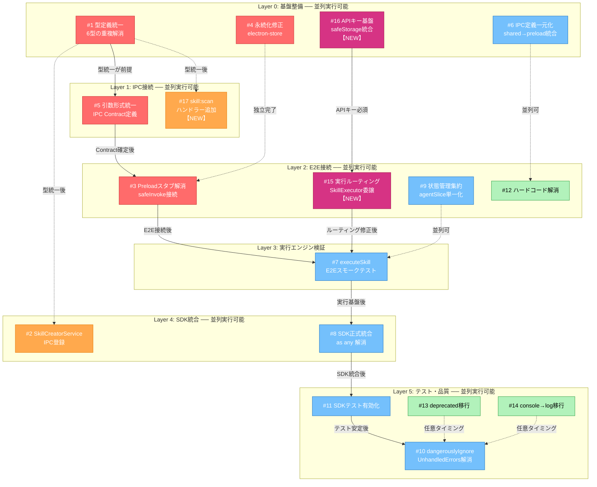

# スキルシステム 設計-実装ギャップ調査レポート

- **調査日**: 2026-02-05
- **正本**: `docs/30-workflows/skill-import-agent-system/`（設計・タスク仕様）
- **調査範囲**: スキル作成・実行システム全体（型定義 / IPC / Preload / Store / UI / テスト）
- **調査方法**: 設計仕様との突合 + コードベース直接検証（Grep/Read）+ ファクトチェック済み

---

## エグゼクティブサマリー

設計仕様（specification.md + technical-decisions.md + tasks/index.md）が定める目標に対し、現在の実装で **17件のギャップ** を特定（うち3件は多角的思考分析で新規発見）。

**根本診断**: スキルシステムは **3層の断絶** により End-to-End で完全に機能停止している。

1. **入口の断絶**（#3）: Preload API の5メソッドがスタブ → Rendererから呼んでも空配列 → UIにスキルが表示されない
2. **実行ルーティングの誤り**（#15 **NEW**）: SKILL_EXECUTE ハンドラーが `skillService.executeSkill()`（スタブ）を呼び出し、SDK統合済みの `skillExecutor.execute()` は**一度も呼ばれない**
3. **SDK基盤の欠落**（#16 **NEW**）: SkillExecutor.callSDKQuery() が API キーなしで `query()` を呼び出し → 認証失敗確実

**重要**: #1〜#14 を全て修正しても、#15（ハンドラールーティング）を修正しない限り SDK ベースのスキル実行は動作しない。

---

## 深刻度別一覧

| #   | 深刻度   | カテゴリ       | 問題                                                                                      | 根本原因                                  | 関連タスク                           |
| --- | -------- | -------------- | ----------------------------------------------------------------------------------------- | ----------------------------------------- | ------------------------------------ |
| 15  | **最高** | ルーティング   | SKILL_EXECUTEハンドラーがSkillService（スタブ）を呼び、SkillExecutor（SDK統合）を呼ばない | 実行パス設計の未接続                      | **NEW**                              |
| 16  | **最高** | SDK基盤        | SkillExecutor.callSDKQuery()がAPIキーなしでSDK query()を呼び出し                          | APIキー取得基盤が未構築                   | **NEW**                              |
| 1   | **高**   | 型競合         | SkillStreamMessage + SkillExecutionRequest が shared と SkillExecutor で重複定義          | 設計（Discriminated Union）への移行未完了 | Issue #622, TASK-7D                  |
| 2   | **高**   | 到達不能       | SkillCreatorService（459行）がIPCハンドラーに未登録                                       | Tier 2タスク未着手                        | TASK-9B-H (Issue #692)               |
| 3   | **高**   | 到達不能       | skill-api.ts の5メソッドがスタブ（list, getImported, rescan, import, remove）             | TASK-FIX-5-1 未着手                       | TASK-7A, TASK-FIX-5-1                |
| 4   | **高**   | データ消失     | インポートしたスキルがアプリ再起動後に消失                                                | electron-storeロードタイミング            | SKILL-STORE-001 (Issue #418)         |
| 5   | **高**   | 引数不一致     | Preload APIとMain Handlerの引数形式が不一致（execute/import/removeでランタイムエラー）    | IPC Contract未定義                        | TASK-FIX-5-1                         |
| 17  | **高**   | ハンドラー欠落 | skill:scan チャネル定義済み・ホワイトリスト登録済みだがIPCハンドラーが存在しない          | ハンドラー実装漏れ                        | **NEW**                              |
| 6   | **中**   | IPC分散        | IPCチャネル定義がpreload/channels.tsとshared/ipc/channels.tsに分散                        | Single Source of Truth移行途中            | TASK-IPC-SHARED-CHANNELS-REFACTORING |
| 7   | **中**   | スタブ         | SkillService.executeSkill のコアロジック未実装（バリデーションは実装済み）                | 設計§5.1の実行エンジン未着手              | Issue #411                           |
| 8   | **中**   | 型安全性       | SkillExecutor L746: Agent SDKを `as any` で動的import                                     | SDK正式統合前の暫定措置                   | Issue #641                           |
| 9   | **中**   | 型安全性       | skillSlice.ts L317: Zustand slice間の `as unknown` キャスト                               | slice合成の型制約                         | -                                    |
| 10  | **中**   | テスト隠蔽     | vitest.config.ts: `dangerouslyIgnoreUnhandledErrors: true`                                | テスト安定化の暫定措置                    | -                                    |
| 11  | **中**   | テスト無効     | SDK統合テスト17箇所が無効化（3テストファイル）                                            | SDK正式統合待ち                           | Issue #641                           |
| 12  | **低**   | IPC            | SkillExecutor L871: IPCチャネル名 `"skill:stream"` ハードコード                           | 定数化漏れ                                | -                                    |
| 13  | **低**   | 非推奨         | deprecated プロパティ残存: `Anchor.name`, `Skill.lastUpdated`                             | 旧API互換性維持                           | -                                    |
| 14  | **低**   | ログ           | 本番コードで `console.error/warn` が20+箇所                                               | electron-log移行未完了                    | -                                    |

---

## End-to-End 断絶パス分析（多角的思考による新規分析）

> 本セクションはシステム思考・水平思考・垂直思考・逆説思考の4フレームワークで構造的に検証した結果。

### ユーザー操作からの実データフロー

```
[Renderer: skillSlice.ts]
  │
  ├─ fetchSkills() L173 → skill.list() → ❌ Preload STUB → Promise.resolve([])
  │                      → skill.getImported() → ❌ Preload STUB → Promise.resolve([])
  │  結果: UIにスキルが表示されない（空配列）
  │
  ├─ rescanSkills() L190 → skill.rescan() → ❌ Preload STUB → Promise.resolve([])
  │  結果: 再スキャンしても常に空配列
  │  追加問題: skill:scan ハンドラー自体が存在しない（#17）
  │
  ├─ importSkill() L211 → skill.import(name) → ❌ Preload STUB → 固定オブジェクト
  │  結果: UIには反映されるがMain Processに到達しない（永続化されない）
  │
  └─ executeSkill() → skill.execute(request) → ✅ safeInvoke (IPC到達)
     │
     └─ [Main: skillHandlers.ts L195]
        │
        ├─ skillService.executeSkill(skillId, params) → ❌ STUB（固定文字列返却）
        │  「SkillService」は バリデーション + スタブ
        │
        └─ ❌ skillExecutor.execute() は呼ばれない
           SkillExecutor（SDK query() 統合済み）は abort/getStatus にしか使用されない
```

### 2つの並行システムの断絶（システム思考）

| システム                | 含まれるコンポーネント                                      | 状態            | 接続                 |
| ----------------------- | ----------------------------------------------------------- | --------------- | -------------------- |
| **A: Renderer→Preload** | skillSlice → skill-api.ts（スタブ）                         | ❌ 空配列を返す | Mainに未接続         |
| **B: Main Process**     | skillHandlers → SkillService → SkillScanner → SkillExecutor | ⚠️ 個別には動作 | Rendererから到達不能 |

**逆説思考の発見**: 現在のレポートIssue #3（Preloadスタブ）を修正してsafeInvokeに接続しても、`execute` のルーティングが `skillService.executeSkill()`（スタブ）に向いているため、SDK実行は動作しない。Issue #7（SkillService.executeSkill スタブ）を修正する際に、**SkillExecutor に委譲する設計判断**が必要。

---

## 詳細分析

### 15. SKILL_EXECUTE ハンドラーの実行パス誤り（深刻度: 最高）【NEW: 多角的思考で発見】

**発見方法**: 垂直思考（SKILL_EXECUTE ハンドラーの呼び出しチェーンを末端まで追跡）

**設計の意図**: technical-decisions.md §5 で Claude Agent SDK の `query()` API を使用してスキル実行。SkillExecutor がその実装体。

**現状**: `skillHandlers.ts` L179-208 の SKILL_EXECUTE ハンドラーは以下の経路で処理:

```
SKILL_EXECUTE handler (L195)
  → skillService.executeSkill(args.skillId, args.params)    ← ❌ ここが問題
    → SkillService.executeSkill() (L214-216)
      → return `Skill "${skill.name}" executed successfully`  ← スタブ
```

一方、SDK統合済みの SkillExecutor は:

```
_skillExecutorInstance = new SkillExecutor(mainWindow)  ← L40 でインスタンス化
  → .abort(executionId)      ← L226 で使用 ✅
  → .getExecutionStatus(id)  ← L250 で使用 ✅
  → .execute(request, skill) ← ❌ 一度も呼ばれない
```

**影響**: `SkillExecutor.execute()` には SDK `query()` 呼び出し、ストリーミング処理、Hooks（PreToolUse/PostToolUse）、リトライロジック、AbortController統合が全て実装済みだが、**IPCハンドラーから完全に切り離されている**。

**修正方針**: SKILL_EXECUTE ハンドラーで `skillService.executeSkill()` → `_skillExecutorInstance.execute()` に切り替え。SkillService のバリデーションロジック（スキル存在確認・インポート状態確認）は保持し、実行のみ SkillExecutor に委譲する。

---

### 16. SDK実行にAPIキー基盤が不在（深刻度: 最高）【NEW: 多角的思考で発見】

**発見方法**: 水平思考（SDKの利用要件から逆算して実装を検証）

**現状**: `SkillExecutor.callSDKQuery()` L746-755:

```typescript
const { query } = (await import("@anthropic-ai/claude-agent-sdk")) as any;
const conversation = query({
  prompt,
  options: {
    tools: options.tools,
    permissionMode: options.permissionMode,
    signal: options.signal,
  },
});
```

`query()` に API キー（`ANTHROPIC_API_KEY`）が渡されていない。Claude Agent SDK は認証なしでは動作しない。

**必要な基盤**:

| 要素        | 現状 | 必要な実装                                                                  |
| ----------- | ---- | --------------------------------------------------------------------------- |
| APIキー取得 | なし | Electron safeStorage / 環境変数 / 設定画面から取得                          |
| APIキー渡し | なし | `query({ prompt, options: { apiKey } })` または環境変数 `ANTHROPIC_API_KEY` |
| キー検証    | なし | 実行前のバリデーション                                                      |

**修正方針**: 認証セキュリティ原則（04-electron-security.md）に従い、`electron.safeStorage.encryptString()` でAPIキーを暗号化保存。実行時に復号して `query()` に渡す。

---

### 17. skill:scan ハンドラー完全欠落（深刻度: 高）【NEW: 多角的思考で発見】

**発見方法**: 逆説思考（「ハンドラー未確認」は「未確認」ではなく「不在」ではないか？）

**現状**:

| レイヤー        | ファイル                   | 状態                                    |
| --------------- | -------------------------- | --------------------------------------- |
| チャネル定義    | `preload/channels.ts` L184 | `SKILL_SCAN: "skill:scan"` ✅ 定義済み  |
| ホワイトリスト  | `preload/channels.ts` L390 | `ALLOWED_INVOKE_CHANNELS` に含まれる ✅ |
| Preload API     | `skill-api.ts` L207        | `Promise.resolve([])` スタブ            |
| **IPC Handler** | `skillHandlers.ts`         | **❌ 完全に存在しない**                 |

Issue #3 のテーブルでは `rescan` の対応ハンドラーを「ハンドラー未確認」と記載していたが、正確には**ハンドラー自体が実装されていない**。スタブを `safeInvoke(IPC_CHANNELS.SKILL_SCAN, ...)` に置き換えても、Main Process 側にハンドラーがないため `Error: No handler registered for 'skill:scan'` が発生する。

**修正方針**: `skillHandlers.ts` に `SKILL_SCAN` ハンドラーを追加。内部で `skillService.scanAvailableSkills(true)` を呼び出す（`SKILL_LIST` ハンドラーと類似だが `forceRefresh: true` 固定）。

---

### 1. 型定義の重複競合（深刻度: 高）

**設計の意図**: `packages/shared/src/types/skill.ts` の型定義が正本。

#### 1-A: SkillStreamMessage

| 定義場所                                                        | type値                                                              | 設計との関係       |
| --------------------------------------------------------------- | ------------------------------------------------------------------- | ------------------ |
| `packages/shared/src/types/skill.ts` L446-466                   | `"assistant"`, `"tool_use"`, `"tool_result"`, `"status"`, `"error"` | **設計準拠（正）** |
| `apps/desktop/src/main/services/skill/SkillExecutor.ts` L93-108 | `"text"`, `"tool_use"`, `"error"`, `"complete"`, `"retry"`          | **移行前の旧定義** |

#### 1-B: SkillExecutionRequest【2次検証で追加】

| 定義場所                                                       | フィールド                                                    | 設計との関係       |
| -------------------------------------------------------------- | ------------------------------------------------------------- | ------------------ |
| `packages/shared/src/types/skill.ts` L310-319                  | `skillName`, `prompt`, `workingDirectory?`                    | **設計準拠（正）** |
| `apps/desktop/src/main/services/skill/SkillExecutor.ts` L67-74 | `skillId`, `prompt`, `timeout?`, `sessionId?`, `retryConfig?` | **移行前の旧定義** |

`skillName` vs `skillId` のフィールド名の差異が Issue #5（execute引数不一致）の根本原因。

**影響箇所**:

| ファイル                 | 行  | 問題                                                             |
| ------------------------ | --- | ---------------------------------------------------------------- |
| `setupSkillListeners.ts` | L25 | `as (message: unknown) => void` で型安全性を喪失                 |
| `SkillExecutor.ts`       | L27 | コメント: `// @repo/shared の型と競合を避けるためローカルに定義` |

#### 1-C: その他の重複型（同一ファイル内）

SkillExecutor.ts L25-120 にはさらに以下のローカル型が存在し、shared側と重複：

| 型名                      | SkillExecutor.ts | shared/types/skill.ts | 差異                                      |
| ------------------------- | ---------------- | --------------------- | ----------------------------------------- |
| `SkillExecutionResponse`  | L77-81           | L324-333              | `error?: SkillExecutionError` vs `string` |
| `ExecutionState`          | L31-36           | L519-524              | 値は同一だが定義が重複                    |
| `ExecutionInfo`           | L84-90           | L529-544              | フィールド同一だが定義が重複              |
| `SkillExecutionErrorCode` | L110-120         | L549-558              | 値は同一だが定義が重複                    |

**修正方針**: SkillExecutor.ts L25-120 のローカル型定義を**全て**削除し、shared側の型を使用。SkillStreamMessageの type 値とSkillExecutionRequestのフィールド名をsharedに統一。

---

### 2. SkillCreatorService IPCハンドラー未登録（深刻度: 高）

**設計の意図**: technical-decisions.md §11 で skill-creator メタスキルの設計が定義済み。SkillCreatorServiceはその実装体。

**現状**: `SkillCreatorService`（459行）は実装済みだが、`skillHandlers.ts` にimportすら存在しない。

**未定義のIPCチャネル**（設計で想定）:

| チャネル（想定）            | 用途           | 設計参照 |
| --------------------------- | -------------- | -------- |
| `skill-creator:create`      | スキル新規作成 | §11.4    |
| `skill-creator:progress`    | 作成進捗通知   | §18.3    |
| `skill-creator:validate`    | バリデーション | §11.3    |
| `skill-creator:detect-mode` | 作成モード検出 | §15.3    |

**対応タスク**: TASK-9B-H（Issue #692）。Tier 2タスクのため、Tier 1完了後に着手予定。

---

### 3. skill-api.ts の5メソッドがスタブ（深刻度: 高）

**設計の意図**: specification.md §3.1 で Preload API は IPC Handlers 経由で Main Process サービスに到達する。

**現状**: Main Process側のskillHandlersは実装済みだが、Preload層のブリッジが未接続。

| メソッド      | 行       | 現在の実装              | 対応するMain Handler                       | 対応タスク   |
| ------------- | -------- | ----------------------- | ------------------------------------------ | ------------ |
| `list`        | L203     | `Promise.resolve([])`   | `IPC_CHANNELS.SKILL_LIST` 登録済み         | TASK-7A      |
| `getImported` | L205     | `Promise.resolve([])`   | `IPC_CHANNELS.SKILL_GET_IMPORTED` 登録済み | TASK-7A      |
| `rescan`      | L207     | `Promise.resolve([])`   | **ハンドラー不在**（#17参照）              | TASK-7A      |
| `import`      | L209-224 | 固定オブジェクト返却    | `IPC_CHANNELS.SKILL_IMPORT` 登録済み       | TASK-FIX-5-1 |
| `remove`      | L226     | `Promise.resolve(true)` | `IPC_CHANNELS.SKILL_REMOVE` 登録済み       | TASK-7A      |

**注記**: `execute`（L174-175）は `safeInvoke(IPC_CHANNELS.SKILL_EXECUTE, request)` を使用しており**スタブではない**。ただし IPC 経由で Main Process に到達するものの、引数形式の不一致（Issue #5 参照）によりランタイムで常にバリデーション失敗する。

---

### 4. スキルインポート永続化消失（深刻度: 高）

**設計の意図**: technical-decisions.md §3 で electron-store による永続化を採用。`~/.aiworkflow/config/skill-imports.json` に保存。

**現状**: `skill:getImported` が空配列を返す。skillHandlers.ts L73-100 に6箇所のDEBUGログが残存しており、積極的に調査されたバグ。

**推定原因**: electron-storeのデータロードタイミング。設計§3.5.4 では `app.whenReady()` 時の初期化を規定しているが、実装が設計通りか要確認。

---

### 5. Preload APIとMain Handlerの引数形式不一致（深刻度: 高）【新規発見】

**ファクトチェックで発見された問題**: スタブを `safeInvoke` に置き換えるだけではランタイムエラーが発生する。

| メソッド  | skill-api.ts（Preload側）                                | skillHandlers.ts（Main側）               | 不一致内容                        |
| --------- | -------------------------------------------------------- | ---------------------------------------- | --------------------------------- |
| `execute` | `SkillExecutionRequest`（shared: `skillName`, `prompt`） | `{ skillId, params? }`                   | **skillName vs skillId**【追加】  |
| `import`  | `(skillName: string)` 単一文字列                         | `{ skillIds: string[] }` 配列ラップ      | **単一 vs 配列**                  |
| `remove`  | `(skillName: string)` 直接文字列                         | `{ skillId: string }` オブジェクトラップ | **直接 vs ラップ**                |
| `list`    | `()` 引数なし                                            | `{ basePath?, forceRefresh? }`           | **オプション引数が渡せない**（※） |

※ `list` のHandler側は `args?`（optional）のため、引数なしでも**ランタイムエラーにはならない**。ただしPreload APIからオプション引数（`forceRefresh` 等）を渡す手段がないAPI設計上の制限が残る。

**根本原因**: IPC Contract（Preload-Handler間の引数/戻り値の型共有）が定義されていない。`ipcRenderer.invoke` は `...args: unknown[]` を受け取るため、TypeScriptの型チェックが効かない。

**修正方針**: TASK-FIX-5-1 で SkillAPI 統一時に、IPC Contract型を `@repo/shared` に定義し、Preload側とHandler側の両方で参照する。

---

### 6. IPCチャネル定義の分散（深刻度: 中）

**設計の意図**: specification.md §3.1 の IPC チャネルは `skill:list`, `skill:import`, `skill:execute` の3種が基本。

**現状**: 2箇所に分散。

| 場所                                   | 内容                                                   | 行数  |
| -------------------------------------- | ------------------------------------------------------ | ----- |
| `apps/desktop/src/preload/channels.ts` | 全IPC_CHANNELS定義（正本）                             | 494行 |
| `packages/shared/src/ipc/channels.ts`  | CHAT_EXPORT + FILE_SYSTEM + SKILL チャネルのサブセット | 109行 |

**追加問題**: `skillHandlers.test.ts` L157-163 でもテスト内独自にSKILL_CHANNELSを定義。

**TASK-FIX-4-1** でpreload側への統合は完了済み。shared側の残存定義の整理が残課題。

---

### 7. SkillService.executeSkill コアロジック未実装（深刻度: 中）

**設計の意図**: technical-decisions.md §5で Claude Agent SDK の `query()` API を使用してスキル実行。

**現状**: バリデーション（スキル存在確認・インポート状態確認）は実装済みだが、コアの実行ロジックが固定文字列を返すスタブ。

```
// SkillService.ts L214-216
// 初期実装: 成功結果を返す
// 将来的にはスキルの実際の実行ロジックを実装
const output = `Skill "${skill.name}" executed successfully`;
```

**注記**: SkillExecutorは SDK query() との統合を実装済み。しかし SKILL_EXECUTE ハンドラーは SkillService.executeSkill()（スタブ）を呼び出しており、SkillExecutor.execute() は**一度も呼ばれない**（#15参照）。Issue #7 の修正は、SkillService にロジックを追加するのではなく、**SkillExecutor に委譲する設計判断**が鍵。

---

### 8. Agent SDK `as any` 動的import（深刻度: 中）

**設計の意図**: technical-decisions.md §1 で Claude Agent SDK を正式採用。

**現状**: `SkillExecutor.ts` L746 で `as any` による暫定統合。SDK型情報が完全に失われ、APIの誤用がコンパイル時に検出不可能。

**修正時期**: SDK正式統合タスク（Issue #641, TASK-9B-I）で対応予定。

---

### 9. Zustand slice間の `as unknown` キャスト（深刻度: 中）

**設計の意図**: specification.md §4.3 では `agentSlice` 単一での状態管理を規定。

**現状**: 実装では `skillSlice` + `permissionHistorySlice` に分割されており、slice間のアクセスに `as unknown as PermissionHistorySlice` キャストが必要。

**注記**: TASK-FIX-6-1（状態管理集約）で agentSlice への集約が予定されているが、現在の分割構成が実用上は動作している。

---

### 10. dangerouslyIgnoreUnhandledErrors（深刻度: 中）

**問題**: `apps/desktop/vitest.config.ts` L43 で未処理のPromise拒否がテストで無視される。

**影響**: 「テスト全PASS」の信頼性が低下。非同期テストの失敗が隠蔽される可能性がある。

---

### 11. SDK統合テスト無効化（深刻度: 中）

**問題**: `// TODO: SDK統合後に実装` コメント付きテストが17箇所（3テストファイル: skill-executor.test.ts / sdk-integration.test.ts / agent-client.test.ts）で無効化。

**未テスト項目**: API Key取得、HTTPエラーハンドリング（401/500）、タイムアウト処理（30秒）等。

---

### 12. IPCチャネル名ハードコード（深刻度: 低）

**問題**: `SkillExecutor.ts` L871 で `"skill:stream"` がハードコード。`SKILL_CHANNELS.SKILL_STREAM` 定数が利用可能だが未使用。

---

### 13. deprecated プロパティ残存（深刻度: 低）

**問題**: `packages/shared/src/types/skill.ts` にて:

| 行       | プロパティ          | 推奨代替       |
| -------- | ------------------- | -------------- |
| L14-15   | `Anchor.name`       | `source`       |
| L100-101 | `Skill.lastUpdated` | `lastModified` |

---

### 14. 本番コードでのconsole使用（深刻度: 低）

**問題**: 20+箇所で `console.error/warn` が使用。

| ファイル                | 箇所数 |
| ----------------------- | ------ |
| `SkillService.ts`       | 6      |
| `SkillScanner.ts`       | 5      |
| `PermissionStore.ts`    | 4      |
| `SkillExecutor.ts`      | 2      |
| `SkillImportManager.ts` | 2      |
| `SkillAnalyzer.ts`      | 1      |

---

## 設計-実装の移行マップ

### 現在の Tier 0（修正タスク）進捗

| タスク       | 内容              | ステータス | 本レポートの関連Issue                   |
| ------------ | ----------------- | ---------- | --------------------------------------- |
| TASK-FIX-1-1 | 型定義統一        | **完了**   | #1（残存あり: SkillExecutor側の旧定義） |
| TASK-FIX-4-1 | IPCチャンネル整理 | **完了**   | #6（残存あり: shared側の定義）          |
| TASK-FIX-5-1 | SkillAPI統一      | **未着手** | #3, #5, #17                             |
| TASK-FIX-6-1 | 状態管理集約      | **未着手** | #9                                      |

### Tier 0 完了条件の充足状況

| 条件                                              | 状態         | ブロッカー                                          |
| ------------------------------------------------- | ------------ | --------------------------------------------------- |
| 型定義が `@repo/shared/src/types/skill.ts` に集約 | **未完了**   | SkillExecutor.ts の旧定義が残存                     |
| IPCチャンネルが仕様書の命名に準拠                 | **ほぼ完了** | shared側の整理残り                                  |
| SkillAPIが単一のインターフェースに統一            | **未完了**   | TASK-FIX-5-1 未着手                                 |
| 状態管理がagentSlice単一に集約                    | **未完了**   | TASK-FIX-6-1 未着手                                 |
| 全テストがPASS                                    | **確認不可** | rollup環境問題                                      |
| **実行パスがSDK統合コードに到達**                 | **未完了**   | **#15 ハンドラールーティング誤り（4次検証で発見）** |
| **SDK認証基盤が構築済み**                         | **未完了**   | **#16 APIキー基盤不在（4次検証で発見）**            |
| **全IPCチャネルにハンドラーが存在**               | **未完了**   | **#17 skill:scanハンドラー欠落（4次検証で発見）**   |

---

## 修正優先順序の提案

### Phase 0: 構造的断絶の解消（最優先・即時対応）

> **多角的思考で発見**: 既存14件を全て修正してもPhase 0が未解決なら動作しない

| 順序 | 問題# | タスク  | 理由                                                                                |
| ---- | ----- | ------- | ----------------------------------------------------------------------------------- |
| 0    | #15   | **NEW** | ハンドラーがSkillExecutor(SDK)ではなくSkillService(スタブ)を呼ぶ → 全実行パスが断絶 |
| 1    | #16   | **NEW** | SDKのquery()にAPIキーが渡されない → 認証失敗確実                                    |

### Phase 1: End-to-End接続（即時対応推奨）

| 順序 | 問題#       | タスク          | 理由                                                   |
| ---- | ----------- | --------------- | ------------------------------------------------------ |
| 2    | #4          | SKILL-STORE-001 | データ消失はユーザー影響が最も大きい                   |
| 3    | #1          | Issue #622      | 型の不整合が他の問題の根本原因                         |
| 4    | #3, #5, #17 | TASK-FIX-5-1    | skill-api.tsスタブ + 引数不一致 + rescanハンドラー欠落 |

### Phase 2: 設計移行の完了（短期）

| 順序 | 問題# | タスク                               | 理由                                             |
| ---- | ----- | ------------------------------------ | ------------------------------------------------ |
| 5    | #6    | TASK-IPC-SHARED-CHANNELS-REFACTORING | IPC定義の一元化                                  |
| 6    | #7    | Issue #411                           | 実行ロジック実装（#15と統合: SkillExecutor委譲） |
| 7    | #9    | TASK-FIX-6-1                         | 状態管理を設計通りagentSlice単一に集約           |

### Phase 3: Tier 2 機能接続（中期）

| 順序 | 問題# | タスク                | 理由                         |
| ---- | ----- | --------------------- | ---------------------------- |
| 8    | #2    | TASK-9B-H             | SkillCreatorServiceのIPC接続 |
| 9    | #8    | Issue #641, TASK-9B-I | Agent SDK型安全な正式統合    |
| 10   | #11   | Issue #641            | SDK統合テスト有効化          |

### Phase 4: 品質向上（長期）

| 順序 | 問題# | 理由                                      |
| ---- | ----- | ----------------------------------------- |
| 11   | #10   | dangerouslyIgnoreUnhandledErrors: false化 |
| 12   | #12   | IPCハードコード解消                       |
| 13   | #13   | deprecated プロパティ移行                 |
| 14   | #14   | console → electron-log移行                |

---

## 対策実行フロー

> **注記**: 本セクションのLayer番号は依存関係の深さ（実行順序）を示す。上記「修正優先順序」のPhase番号は緊急度（ビジネスインパクト）基準であり、観点が異なる。

### 依存関係グラフ（Mermaid）



### 実行計画テーブル

```
Layer 0 ─── 並列4タスク ────────────────────────────────────
  ┌──────────┐  ┌──────────┐  ┌──────────┐  ┌───────────┐
  │ #1 型統一 │  │ #4 永続化 │  │ #6 IPC   │  │ #16 APIキー│
  │ 高・直列  │  │ 高・独立  │  │ 中・独立  │  │ 最高・直列 │
  └────┬─────┘  └────┬─────┘  └────┬─────┘  └────┬──────┘
       │              │              │              │
Layer 1│── #1完了待ち │              │              │
  ┌────┴─────┐  ┌────┴─────┐  ┌────┴─────┐        │
  │ #5 引数  │  │ #17 scan │  │ #12 定数 │  ← 並列可│
  │ 形式統一 │  │ ハンドラ │  │ 化       │        │
  └────┬─────┘  └──────────┘  └──────────┘        │
       │                                           │
Layer 2│── #5完了待ち ─── #4独立完了 ── #16完了待ち
  ┌────┴─────┐  ┌──────────┐  ┌─────┴────┐
  │ #3 スタブ │  │ #9 状態  │  │ #15 実行 │  ← 並列可
  │ 解消     │  │ 管理集約 │  │ ルーティ │
  └────┬─────┘  └────┬─────┘  │ ング修正 │
       │              │        └────┬─────┘
       │              │             │
Layer 3│── #3 + #15 完了待ち ── 並列可
  ┌────┴─────────────┴──────────┴┐
  │ #7 executeSkill               │
  │ E2Eスモークテスト             │
  └────┬─────────────────────────┘
       │
Layer 4│── #7完了待ち ─────────────
  ┌────┴─────┐  ┌──────────┐
  │ #8 SDK   │  │ #2 Creator│  ← 並列可
  │ 正式統合 │  │ Service  │
  └────┬─────┘  └──────────┘
       │
Layer 5│── #8完了待ち ─────────────
  ┌────┴─────┐  ┌──────────┐  ┌──────────┐
  │ #11 SDK  │  │ #13 depr │  │ #14 log  │  ← 並列可
  │ テスト   │  │ ecated   │  │ 移行     │
  └────┬─────┘  └──────────┘  └──────────┘
       │
  ┌────┴─────┐
  │ #10 Err  │  ← 全テスト安定後
  │ 隠蔽解消 │
  └──────────┘
```

### クリティカルパス

**2本の並行クリティカルパスが存在:**

```
パスA（型→IPC→E2E）:
  #1 型統一 → #5 引数統一 → #3 スタブ解消 ──┐
                                              ├→ #7 E2E検証 → #8 SDK統合 → #11 テスト → #10 品質
パスB（SDK基盤→ルーティング）:               │
  #16 APIキー基盤 → #15 実行ルーティング修正 ┘
```

**重要**: パスAとパスBは**両方**が Layer 2 で合流し、**両方完了しないと** Layer 3 (#7) に進めない。パスBが旧レポートに含まれていなかったため、実行計画が不完全だった。

### 並列実行ポイント

| Layer | 並列可能なタスク群 | 条件                              |
| ----- | ------------------ | --------------------------------- |
| 0     | #1, #4, #6, #16    | 全て独立、同時着手可能            |
| 1     | #5, #17, #12       | #1完了後（#17は#1依存）           |
| 2     | #3, #15, #9        | #5完了 + #16完了（#15は#16依存）  |
| 4     | #8 と #2           | #1完了 + #7完了（#2は#1のみ依存） |
| 5     | #11, #13, #14      | #8完了後（#13/#14は任意）         |

### 推定工数配分

| Layer | 含まれるIssue      | 推定比率 | ブロッカー有無    |
| ----- | ------------------ | -------- | ----------------- |
| 0     | #1, #4, #6, #16    | 30%      | なし（即着手）    |
| 1     | #5, #17            | 12%      | #1完了待ち        |
| 2     | #3, #9, #12, #15   | 20%      | #5 + #16 完了待ち |
| 3     | #7                 | 8%       | #3 + #15 完了待ち |
| 4     | #2, #8             | 15%      | #7完了待ち        |
| 5     | #10, #11, #13, #14 | 15%      | #8完了待ち        |

---

## 付録A: ファクトチェック記録

### 1次検証（初回レポート → 修正）

| 項目              | 初回レポートの記載               | 検証結果                                                                              | 修正内容                                                 |
| ----------------- | -------------------------------- | ------------------------------------------------------------------------------------- | -------------------------------------------------------- |
| Issue #3 テーブル | `execute` L224 をスタブと記載    | **誤り**: L174-175の`execute`は`safeInvoke`使用で正常動作。L209-224は`import`メソッド | `import`に訂正                                           |
| Issue #5 shared側 | 「SKILL_CHANNELSのみ（旧定義）」 | **不正確**: CHAT_EXPORT + FILE_SYSTEM + SKILL の3カテゴリを含むサブセット             | 「preload側のサブセット」に訂正                          |
| Issue #6 深刻度   | 「内部実装がスタブ状態」のみ     | **不十分**: バリデーション（スキル存在確認・インポート状態確認）は実装済み            | 「コアロジック未実装（バリデーションは実装済み）」に訂正 |
| Issue #5（新規）  | 記載なし                         | **新規発見**: Preload API vs Handler の引数形式不一致                                 | Issue #5 として追加                                      |

### 2次検証（修正済みレポート → 再修正）

| 項目              | 修正済みレポートの記載                  | 検証結果                                                                                                 | 修正内容                             |
| ----------------- | --------------------------------------- | -------------------------------------------------------------------------------------------------------- | ------------------------------------ |
| Issue #3 注記     | `execute`は「正常にMain Processに到達」 | **不正確**: IPC到達するが引数不一致で常にバリデーション失敗（shared: `skillName` vs handler: `skillId`） | 「到達するが引数不一致で失敗」に訂正 |
| Issue #5 テーブル | import/remove/list の3行のみ            | **不完全**: `execute` も引数不一致（shared `SkillExecutionRequest` vs handler `{ skillId, params? }`）   | `execute` 行を追加                   |
| Issue #1 型重複   | SkillStreamMessage のみ記載             | **不完全**: `SkillExecutionRequest` も重複（shared: `skillName` vs SkillExecutor: `skillId`）            | 1-B サブセクション追加               |
| Issue #1 影響箇所 | setupSkillListeners.ts **L23**          | **行番号ずれ**: L23はTODOコメント行。実際のキャストは**L25**                                             | L25に訂正                            |
| Issue #6 行数     | preload/channels.ts **495行**           | **軽微**: 実際は**494行**。shared側も**109行**（110行から訂正）                                          | 494行/109行に訂正                    |
| Issue #11 箇所数  | **50+箇所**が無効化                     | **過大**: TODO SDK関連は3テストファイルで計**17箇所**                                                    | 17箇所に訂正                         |

### 3次検証（再修正済みレポート → 最終修正）

| 項目                | 再修正済みレポートの記載                            | 検証結果                                                                                          | 修正内容                                             |
| ------------------- | --------------------------------------------------- | ------------------------------------------------------------------------------------------------- | ---------------------------------------------------- |
| Issue #1 型重複     | SkillStreamMessage + SkillExecutionRequest の2型    | **不完全**: SkillExecutionResponse, ExecutionState, ExecutionInfo, SkillExecutionErrorCode も重複 | 1-C サブセクション追加（計6型）                      |
| Issue #5 list       | 「ランタイムエラー確実」（4メソッド全てに適用）     | **過剰**: `list` のHandler側は `args?`（optional）のためエラーにならない                          | テーブルに※注釈追加、一覧表タイトルを3メソッドに修正 |
| Issue #4 DEBUG範囲  | skillHandlers.ts **L73-97**                         | **微差**: 最終DEBUGログはL100の `console.error`                                                   | **L73-100** に訂正                                   |
| Issue #4 チャネル名 | `skill:list-imported`                               | **未確認**: 実際のチャネル定数名は `SKILL_GET_IMPORTED`                                           | `skill:getImported` に訂正                           |
| Issue #6 shared行数 | shared/ipc/channels.ts **110行**                    | **微差**: 実際は**109行**                                                                         | 109行に訂正                                          |
| Issue #11 箇所数    | **18箇所**が無効化                                  | **微差**: 実際は**17箇所**（skill-executor:5, sdk-integration:3, agent-client:9）                 | 17箇所に訂正                                         |
| Phase番号衝突       | 「修正優先順序」と「対策実行フロー」が両方Phase使用 | **構造的混乱**: 同じラベルで異なる意味（緊急度 vs 依存順）                                        | 対策実行フロー側を **Layer** に改名                  |
| Mermaid未使用       | `classDef phase` が定義済み                         | **未使用**: どのノードにも適用されていない                                                        | 削除                                                 |

### 4次検証（多角的思考フレームワーク分析）

| 思考法           | 発見内容                                                       | 検証結果                                                                                                      | 修正内容                                                                          |
| ---------------- | -------------------------------------------------------------- | ------------------------------------------------------------------------------------------------------------- | --------------------------------------------------------------------------------- |
| **垂直思考**     | SKILL_EXECUTE ハンドラー (L195) の呼び出し先を末端まで追跡     | `skillService.executeSkill()` (スタブ) を呼び出し、`skillExecutor.execute()` (SDK統合) は**一度も呼ばれない** | Issue #15 として追加（深刻度: 最高）                                              |
| **水平思考**     | SDK利用要件（APIキー）からの逆算検証                           | `callSDKQuery()` L748 で `query()` にAPIキーが渡されていない。認証基盤自体が不在                              | Issue #16 として追加（深刻度: 最高）                                              |
| **逆説思考**     | Issue #3 `rescan` の「ハンドラー未確認」は本当に「未確認」か？ | `SKILL_SCAN` チャネルは channels.ts L184 に定義・ホワイトリスト登録済みだが、**ハンドラー自体が存在しない**   | Issue #17 として追加（深刻度: 高）、Issue #3 テーブル修正                         |
| **システム思考** | 14件を全修正した場合のE2Eシミュレーション                      | パスA（型→IPC→E2E）とパスB（SDK基盤→ルーティング）の**2本のクリティカルパス**が存在。パスBが欠落していた      | 実行フロー全面改訂（Layer 0に#16追加、Layer 2に#15追加、クリティカルパスを2本化） |
| **逆説思考**     | TASK-FIX-1-1「完了」は本当に完了か？                           | 6型がまだ重複しており、実質的に未完了。タスクトラッキングの信頼性に疑問                                       | 移行マップの注記を強化                                                            |

---

## 付録B: `as any` / `as unknown` 使用箇所（スキル関連）

### 本番コード

| ファイル                 | 行   | 使用パターン                           | 暫定/恒久                |
| ------------------------ | ---- | -------------------------------------- | ------------------------ |
| `SkillExecutor.ts`       | L746 | `as any` - SDK動的import               | 暫定（SDK正式統合まで）  |
| `skillSlice.ts`          | L317 | `as unknown as PermissionHistorySlice` | 暫定（TASK-FIX-6-1まで） |
| `setupSkillListeners.ts` | L25  | `as (message: unknown) => void`        | 暫定（Issue #622まで）   |

### テストコード（40+箇所、主要ファイルのみ）

| ファイル                           | 箇所数 | 主な用途                          |
| ---------------------------------- | ------ | --------------------------------- |
| `skillSlice.test.ts`               | 14     | `(global as any).window` パターン |
| `skillSlice.edge-cases.test.ts`    | 9      | 同上 + 意図的な不正値テスト       |
| `skillSlice.ipc.test.ts`           | 7      | 同上                              |
| `SkillAnalyzer.test.ts`            | 9      | `fs.stat` モック戻り値            |
| `SkillAnalyzer.additional.test.ts` | 22     | 同上                              |

---

## 付録C: 設計参照マップ

| 設計仕様の章               | 内容                       | 関連する実装ギャップ                                     |
| -------------------------- | -------------------------- | -------------------------------------------------------- |
| specification.md §3.1      | 全体アーキテクチャ         | #3, #5, #17（Preload-Main接続）, #15（実行ルーティング） |
| specification.md §4.3      | 状態管理（agentSlice単一） | #9（skillSlice分割）                                     |
| specification.md §5.1      | 実行エンジン               | #7, #15（SkillExecutor未接続）, #16（APIキー不在）, #1   |
| technical-decisions.md §1  | Claude Agent SDK採用       | #8（as any暫定統合）, #16（APIキー基盤）                 |
| technical-decisions.md §3  | electron-store永続化       | #4（データ消失）                                         |
| technical-decisions.md §5  | スキル実行設計             | #15（ハンドラーがSkillServiceに向いている）              |
| technical-decisions.md §11 | skill-creatorメタスキル    | #2（IPC未登録）                                          |
| tasks/index.md Tier 0      | 修正タスク4件              | FIX-1-1完了, FIX-4-1完了, FIX-5-1/6-1未着手              |

---

_End of Report_
