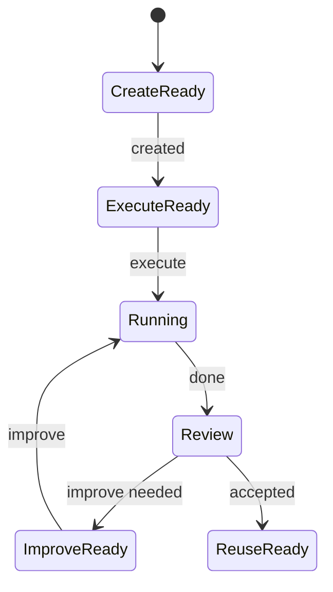
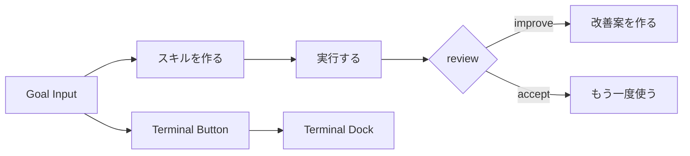
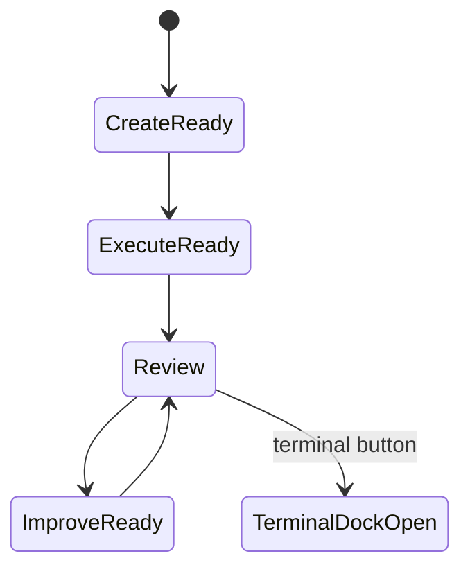
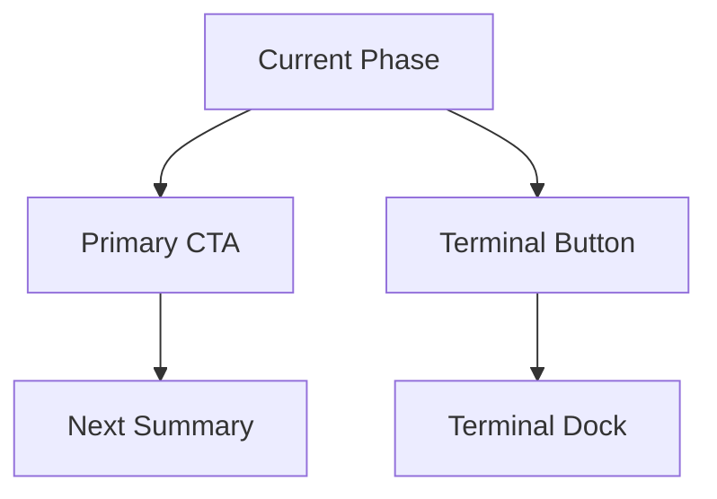
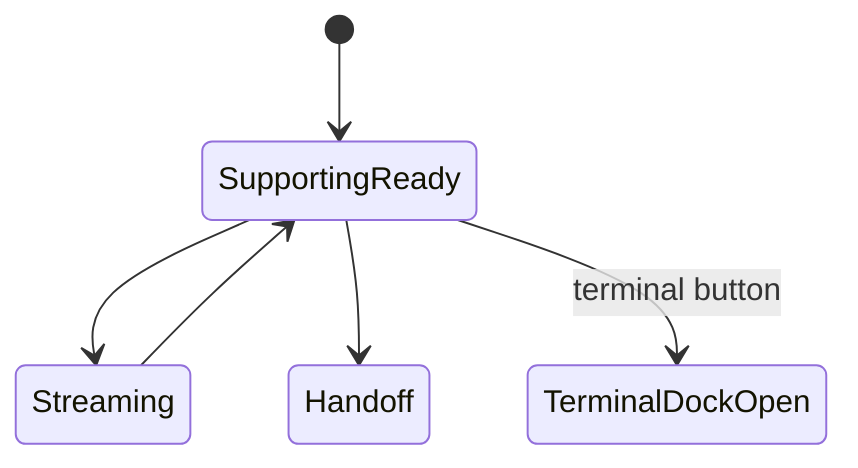
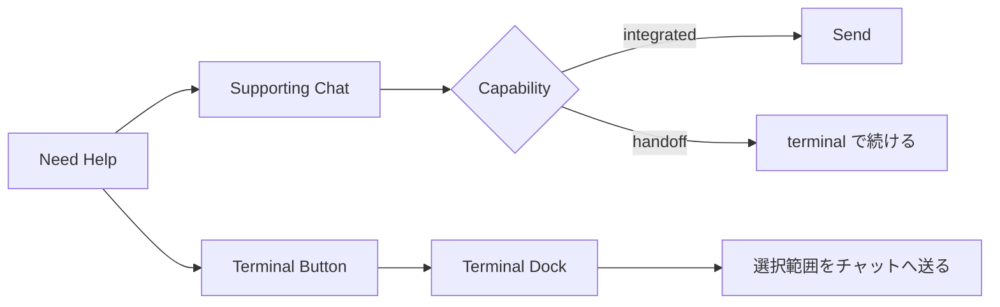

# Skill Lifecycle UI/UX 図解

## 図解フォーマット

各主要 surface ごとに、次の 5 図をそろえる。

1. 核となる責務図
2. 画面構成図
3. 状態遷移図
4. 必要マイコンポーネント図
5. CTA / handoff flow 図

## Core Journey

### 1. 核となる責務図

```text
Create -> Execute -> Improve -> Reuse
   |         |          |         |
   +---------+----------+---------+
        Supporting Chat / Terminal Continuation / Review
```

### 2. 画面構成図

```text
+------------------------------------------------------------------+
| Skill Lifecycle Header                               [Terminal]  |
+------------------------------------------------------------------+
| Goal / Constraints / Current Output                              |
+------------------------------------------------------------------+
| Primary Action / Review Summary / Handoff                        |
+------------------------------------------------------------------+
| Supporting Chat / Terminal Transcript                            |
+------------------------------------------------------------------+
```

### 3. 状態遷移図



### 4. 必要マイコンポーネント図

```text
LifecycleHeader
GoalInput
ConstraintChips
ExecutionSummary
ImprovementSummary
PrimaryActionButton
SupportingChatPanel
TerminalHandoffCard
PersistentTerminalLauncher
TerminalDock
```

### 5. CTA / handoff flow 図



## Skill Lifecycle Panel

### 1. 核となる責務図

```text
SkillLifecyclePanel
  -> single visible journey
  -> one primary action
  -> current phase summary
  -> terminal always reachable
```

### 2. 画面構成図

```text
+------------------------------------------------------------------+
| Current Phase / Stepper                              [Terminal]  |
+------------------------------------------------------------------+
| Goal + Constraints                                               |
+------------------------------------------------------------------+
| Current Output Summary                                           |
+------------------------------------------------------------------+
| Primary CTA | Secondary CTA                                      |
+------------------------------------------------------------------+
| Terminal Dock / Supporting Guidance                              |
+------------------------------------------------------------------+
```

### 3. 状態遷移図



### 4. 必要マイコンポーネント図

```text
LifecycleStepper
GoalEditor
ConstraintChipList
CurrentOutputSummary
PrimaryActionButton
SecondaryActionLink
PersistentTerminalLauncher
TerminalDock
```

### 5. CTA / handoff flow 図



## Supporting Chat Surface

### 1. 核となる責務図

```text
Supporting Chat
  -> explain context
  -> assist current job
  -> never replace primary journey
  -> terminal escape hatch always visible
  -> transcript share is always explicit
```

### 2. 画面構成図

```text
+------------------------------------------------------------------+
| Supporting Chat Header                               [Terminal]  |
+------------------------------------------------------------------+
| Context Summary                                                  |
+------------------------------------------------------------------+
| Message Log                                                      |
+------------------------------------------------------------------+
| Composer / Handoff / Terminal Dock                               |
+------------------------------------------------------------------+
```

### 3. 状態遷移図



### 4. 必要マイコンポーネント図

```text
SupportingChatHeader
ContextSummary
MessageLog
Composer
HandoffCard
PersistentTerminalLauncher
TerminalDock
```

### 5. CTA / handoff flow 図


