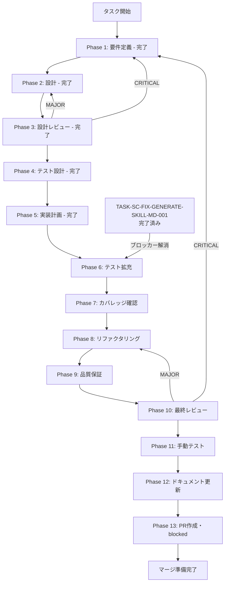

# `runCreateWorkflow` 実装（create モード LLM エージェント統合）- タスク仕様書

## メタ情報

```yaml
issue_number: 2178
task_id: TASK-SC-IMP-CREATE-WORKFLOW-001
status: open
priority: high
scale: small
task_type: BUGFIX
```

| 項目         | 内容                                                               |
| ------------ | ------------------------------------------------------------------ |
| タスクID     | TASK-SC-IMP-CREATE-WORKFLOW-001                                    |
| タスク名     | `runCreateWorkflow` 実装（create モード LLM エージェント統合）     |
| 分類         | バグ修正 / 実装（`task_type: BUGFIX`）                             |
| 対象機能     | `SkillCreatorService.ts` の `runCreateWorkflow`（行 574-577）      |
| 優先度       | 高（`priority: high`）                                             |
| 見積もり規模 | 小規模（`scale: small`）                                           |
| ステータス   | 未実施（`status: open`）                                           |
| 実行ウェーブ | TASK-SC-FIX-GENERATE-SKILL-MD-001 完了後（ブロッカー解消済み）     |
| 依存タスク   | TASK-SC-FIX-GENERATE-SKILL-MD-001（**完了済み** - ブロッカー解消） |
| 関連Issue    | TBD                                                                |
| 作成日       | 2026-04-15                                                         |

---

## 1. なぜこのタスクが必要か（Why）

### 1.1 背景

`SkillCreatorService.ts` の `runCreateWorkflow`（行 574-577）が空実装になっており、
`create` モードでスキルを作成する際に LLM による SKILL.md 内容生成が行われない。

現状のコード:

```typescript
private async runCreateWorkflow(options: CreateSkillOptions): Promise<void> {
  void options; // unused warning回避
}
```

### 1.2 問題の構造

`collaborative` モードでは `runCollaborativeWorkflow` が `resourceLoader.loadAgent("hearing")` を
呼び出すパターンが確立されている。同様に `create` モードでも `runCreateWorkflow` が
`resourceLoader.loadAgent("extract-purpose")` 等を呼び出して構造計画を生成すべきだが、
現状は `void options` のコメントのみで何も行われていない。

| 問題                       | 内容                                                                                                   |
| -------------------------- | ------------------------------------------------------------------------------------------------------ |
| `runCreateWorkflow` の現状 | `void options` のみで空実装。`loadAgent` が一切呼ばれない                                              |
| 影響する機能               | `mode: "create"` でスキル作成を実行しても、LLM によるエージェント統合が行われない                      |
| 本来の期待動作             | `loadAgent("extract-purpose")` と `loadAgent("plan-structure")` を呼び出して構造計画 JSON を組み立てる |
| ブロッカーの状態           | 先行タスク TASK-SC-FIX-GENERATE-SKILL-MD-001 が完了済みのため、実装着手可能                            |

### 1.3 問題点・課題

タスクB（本タスク）は、タスクA（TASK-SC-FIX-GENERATE-SKILL-MD-001）で実装した
`generate_skill_md.js` の `--plan / --output` 引数修正と tmp JSON 生成ロジックの接続点として、
`runCreateWorkflow` が `structurePlan` を返す設計に変更することを担う。

タスクA が完了済みになったことで、このタスクのブロッカーは解消された。

### 1.4 放置した場合の影響

- `create` モードでスキルを作成しても LLM によるエージェント統合が全くなされず、
  スキルの内容が自動生成されない（generate_skill_md.js への structurePlan 引き渡しが欠落）
- `void options` コメントが残り続け、`options.description` が永遠に使用されない状態となる
- `collaborative` モードと `create` モードの実装品質が乖離し続ける

---

## 2. 何を達成するか（What）

### 2.1 目的

`runCreateWorkflow` の空実装を修正し、`resourceLoader.loadAgent` パターンを用いた
構造計画 JSON 生成ロジックを実装する。タスクAが修正した `generate_skill_md.js` への
接続点として `structurePlan` を返す設計に変更する。

### 2.2 最終ゴール

| ID   | 達成すること                                                                           |
| ---- | -------------------------------------------------------------------------------------- | --------------------------------- |
| G-01 | `create` モードで `createSkill()` を呼ぶと `resourceLoader.loadAgent` が呼ばれる       |
| G-02 | `runCreateWorkflow` が `StructurePlanJson                                              | null` を返す（`void` から型変更） |
| G-03 | `loadAgent` 失敗時はフォールバック（`null` 返却）で `createSkill()` 後続処理を継続     |
| G-04 | `void options` コメントが削除され、`options.description` が `structurePlan` に含まれる |
| G-05 | `collaborative` モードの既存テストが全てパスし続ける（回帰なし）                       |

### 2.3 スコープ

**含むもの**:

- `apps/desktop/src/main/services/skill/SkillCreatorService.ts` の修正
  - `StructurePlanJson` 型定義の追加
  - `runCreateWorkflow` のシグネチャ変更（`Promise<void>` → `Promise<StructurePlanJson | null>`）
  - `runCreateWorkflow` の本体実装（`loadAgent` 呼び出し・フォールバック）
  - `createSkill()` の `case "create":` 変更（`structurePlan` を local variable で受け渡し）
- `apps/desktop/src/main/services/skill/__tests__/SkillCreatorService.test.ts` のテスト追加
  - TC-01〜TC-05（新規テストケース）
  - TC-R01〜TC-R03（collaborative モード回帰テスト）

**含まないもの**:

- `generate_skill_md.js` の変更（タスクAで完了済み）
- `resourceLoader.loadAgent` 自体の実装変更
- LLM の実呼び出し実装（将来タスクで置換予定、本タスクは `loadAgent` 読み込みまで）
- `options._structurePlan` などの hidden property 追加（明示引数渡しのみ）

### 2.4 受入条件（Acceptance Criteria）

| AC   | 条件                                                                                   | 検証方法                                                                           |
| ---- | -------------------------------------------------------------------------------------- | ---------------------------------------------------------------------------------- |
| AC-1 | `mode:"create"` で `createSkill()` を呼ぶと `resourceLoader.loadAgent` が呼ばれる      | TC-01 / TC-05 で `loadAgent` が呼ばれることをアサート                              |
| AC-2 | `runCreateWorkflow` 完了後、`createSkill()` 後続処理が正常に続く                       | TC-02 で `createSkill()` が文字列パスを返すことをアサート                          |
| AC-3 | `loadAgent` が失敗した場合でも `createSkill()` は成功する（フォールバック：null 返却） | TC-03 で `loadAgent` reject 時に `createSkill()` が例外をスローしないことを確認    |
| AC-4 | `void options` コメントが削除され、`options.description` が使用される                  | TC-04 で `structurePlan.description` に `options.description` が含まれることを確認 |
| AC-5 | `collaborative` モードの既存テストが全てパスし続ける                                   | TC-R01〜TC-R03 が引き続き PASS                                                     |

### 2.5 成果物

| 成果物                                                                       | 内容                                                 |
| ---------------------------------------------------------------------------- | ---------------------------------------------------- |
| `apps/desktop/src/main/services/skill/SkillCreatorService.ts`                | `runCreateWorkflow` 実装・`StructurePlanJson` 型定義 |
| `apps/desktop/src/main/services/skill/__tests__/SkillCreatorService.test.ts` | TC-01〜TC-05・TC-R01〜TC-R03 のテストケース追加      |

---

## 3. どのように実装するか（How）

### 3.1 前提条件

| 確認項目                                                          | 確認方法                                                                                          |
| ----------------------------------------------------------------- | ------------------------------------------------------------------------------------------------- |
| TASK-SC-FIX-GENERATE-SKILL-MD-001 が完了済みであること            | `git log --oneline` で TASK-SC-FIX-GENERATE-SKILL-MD-001 のコミットが含まれることを確認           |
| `SkillCreatorService.ts` 行 574-577 の現状を把握すること          | `runCreateWorkflow` が `void options` のみであることを確認（実装前の状態）                        |
| `resourceLoader.loadAgent` の呼び出しパターンを確認すること       | `runCollaborativeWorkflow` の `loadAgent("hearing")` 呼び出し箇所を参照し、同一パターンを踏襲する |
| `.agents/skills/skill-creator/agents/` のエージェントファイル確認 | `extract-purpose.md` と `plan-structure.md` が存在することを確認                                  |

### 3.2 依存タスク

| タスクID                          | 状態     | 関係                                                 |
| --------------------------------- | -------- | ---------------------------------------------------- |
| TASK-SC-FIX-GENERATE-SKILL-MD-001 | 完了済み | ブロッカー（tmp JSON 生成・`--plan` 引数実装の前提） |

### 3.3 アーキテクチャ設計

**変更前（空実装）**:

```typescript
private async runCreateWorkflow(options: CreateSkillOptions): Promise<void> {
  void options; // unused warning回避
}

// createSkill() 内
case "create":
  await this.runCreateWorkflow(options);
  break;
```

**変更後（loadAgent 統合）**:

```typescript
interface StructurePlanJson {
  skillName: string;
  description: string;
  purpose: string;
  features: string[];
  agents: string[];
  triggers?: string[];
  anchors?: string[];
}

private async runCreateWorkflow(
  options: CreateSkillOptions,
): Promise<StructurePlanJson | null> {
  try {
    const extractPurposeAgent =
      await this.resourceLoader.loadAgent("extract-purpose");
    const planStructureAgent =
      await this.resourceLoader.loadAgent("plan-structure");

    // TODO(TASK-SC-IMP-CREATE-WORKFLOW-001): 将来 LLM 呼び出しに置換
    const structurePlan: StructurePlanJson = {
      skillName: options.name,
      description: options.description,
      purpose: extractPurposeAgent,
      features: [],
      agents: [extractPurposeAgent, planStructureAgent],
    };

    return structurePlan;
  } catch (error) {
    return null; // AC-3: loadAgent 失敗時はフォールバック
  }
}

// createSkill() 内（変更後）
case "create": {
  const structurePlan = await this.runCreateWorkflow(options);
  // タスクA完了後に generateSkillMd(skillDir, structurePlan) へ明示的に渡す
  void structurePlan;
  break;
}
```

### 3.4 主要ファイルと役割

| ファイル                                                                     | 役割                                                  |
| ---------------------------------------------------------------------------- | ----------------------------------------------------- |
| `apps/desktop/src/main/services/skill/SkillCreatorService.ts`                | 修正対象（行 574-577 の `runCreateWorkflow` 空実装）  |
| `apps/desktop/src/main/services/skill/__tests__/SkillCreatorService.test.ts` | テスト追加対象（TC-01〜TC-05 / TC-R01〜TC-R03）       |
| `.agents/skills/skill-creator/agents/extract-purpose.md`                     | `loadAgent("extract-purpose")` で参照するエージェント |
| `.agents/skills/skill-creator/agents/plan-structure.md`                      | `loadAgent("plan-structure")` で参照するエージェント  |

---

## 4. 実装手順

### Phase 1: 要件定義

**仕様書**: [`docs/30-workflows/skill-creator-workflow-fix-lane/TASK-SC-IMP-CREATE-WORKFLOW-001/outputs/phase-1/requirements.md`](../skill-creator-workflow-fix-lane/TASK-SC-IMP-CREATE-WORKFLOW-001/outputs/phase-1/requirements.md)

**ステータス**: 完了

**目的**: 修正スコープと受入条件を確定する。

完了条件:

- `runCreateWorkflow` の問題を current facts に照らして固定する
- AC-1〜AC-5 を検証可能な形で定義する
- タスクAとの接続点（`StructurePlanJson` の引き渡し方）を明確化する

---

### Phase 2: 設計

**仕様書**: [`docs/30-workflows/skill-creator-workflow-fix-lane/TASK-SC-IMP-CREATE-WORKFLOW-001/outputs/phase-2/design.md`](../skill-creator-workflow-fix-lane/TASK-SC-IMP-CREATE-WORKFLOW-001/outputs/phase-2/design.md)

**ステータス**: 完了

**目的**: `runCreateWorkflow` の詳細設計を行い、`resourceLoader.loadAgent` パターンを用いた構造計画 JSON 生成ロジックを確定する。

設計の主要決定事項:

- `void` → `StructurePlanJson | null` への戻り型変更
- `StructurePlanJson` 型定義（`skillName / description / purpose / features / agents / triggers / anchors`）
- `loadAgent("extract-purpose")` と `loadAgent("plan-structure")` を順に呼び出す
- `loadAgent` 失敗時は `null` 返却（try-catch フォールバック）
- `createSkill()` での受け取りは local variable（`void structurePlan`）で暫定接続

---

### Phase 3: 設計レビューゲート

**仕様書**: [`docs/30-workflows/skill-creator-workflow-fix-lane/TASK-SC-IMP-CREATE-WORKFLOW-001/outputs/phase-3/review.md`](../skill-creator-workflow-fix-lane/TASK-SC-IMP-CREATE-WORKFLOW-001/outputs/phase-3/review.md)

**ステータス**: 完了

**目的**: Phase 2 の設計を Phase 4 へ進めるか判定する。

レビュー観点:

- `StructurePlanJson` 型と既存型の競合がないか
- `loadAgent` フォールバックが既存 collaborative フローに影響しないか
- try-catch スコープが適切か

---

### Phase 4: テスト設計

**仕様書**: [`docs/30-workflows/skill-creator-workflow-fix-lane/TASK-SC-IMP-CREATE-WORKFLOW-001/outputs/phase-4/test-design.md`](../skill-creator-workflow-fix-lane/TASK-SC-IMP-CREATE-WORKFLOW-001/outputs/phase-4/test-design.md)

**ステータス**: 完了

**目的**: TDD の Red フェーズとして、`runCreateWorkflow` 実装前に失敗するテストケースを設計する。

追加するテストケース:

| TC ID  | 対応AC | テストタイトル                                                     | 期待結果                                                        |
| ------ | ------ | ------------------------------------------------------------------ | --------------------------------------------------------------- |
| TC-01  | AC-1   | create モードで createSkill() を呼ぶと loadAgent が呼ばれる        | `resourceLoader.loadAgent` が最低1回呼ばれる                    |
| TC-02  | AC-2   | runCreateWorkflow 完了後、createSkill() がスキルパスを返す         | `createSkill()` が文字列パスを返す                              |
| TC-03  | AC-3   | loadAgent が例外をスローしても createSkill() は成功する            | `createSkill()` が例外をスローしない                            |
| TC-04  | AC-4   | runCreateWorkflow は options.description を使用する                | `structurePlan.description` に `options.description` が含まれる |
| TC-05  | AC-1   | loadAgent は "extract-purpose" エージェントを読み込む              | `loadAgent("extract-purpose")` が呼ばれる                       |
| TC-R01 | AC-5   | collaborative モード: interviewResult なしでエラーをスローする     | 既存動作と同一                                                  |
| TC-R02 | AC-5   | collaborative モード: 有効な interviewResult でスキルが作成される  | 既存動作と同一                                                  |
| TC-R03 | AC-5   | collaborative モード: runCollaborativeWorkflow が loadAgent を呼ぶ | 既存動作と同一                                                  |

---

### Phase 5: 実装計画

**仕様書**: [`docs/30-workflows/skill-creator-workflow-fix-lane/TASK-SC-IMP-CREATE-WORKFLOW-001/outputs/phase-5/implementation-plan.md`](../skill-creator-workflow-fix-lane/TASK-SC-IMP-CREATE-WORKFLOW-001/outputs/phase-5/implementation-plan.md)

**ステータス**: 完了

**目的**: タスクA完了後に着手する実装の手順を詳細化する。

実装ステップ:

1. `StructurePlanJson` 型定義を `SkillCreatorService.ts` に追加
2. `runCreateWorkflow` のシグネチャ変更・本体実装
3. `createSkill()` の `case "create":` を変更（`structurePlan` local variable 受け渡し）
4. TC-01〜TC-05 のテストケースを追加
5. 型チェック・テスト実行・回帰確認

---

### Phase 6〜13: 実装・品質保証（未着手）

Phase 6 以降は TASK-SC-FIX-GENERATE-SKILL-MD-001 の完了を受けて着手可能となった。

| Phase | 名称             | ステータス                  |
| ----- | ---------------- | --------------------------- |
| 6     | テスト拡充       | pending                     |
| 7     | カバレッジ確認   | pending                     |
| 8     | リファクタリング | pending                     |
| 9     | 品質保証         | pending                     |
| 10    | 最終レビュー     | pending                     |
| 11    | 手動テスト       | pending                     |
| 12    | ドキュメント更新 | pending                     |
| 13    | PR作成           | blocked（ユーザー承認待ち） |

品質保証コマンド（Phase 9 で実行）:

```bash
# 型チェック
pnpm --filter @repo/desktop typecheck 2>&1 | grep -E "error|Error" | head -20

# lint
pnpm --filter @repo/desktop lint 2>&1 | grep -E "error|Error" | head -20

# テスト実行
pnpm --filter @repo/desktop test -- --testPathPattern="SkillCreatorService"

# collaborative 回帰確認
pnpm --filter @repo/desktop test -- --testPathPattern="SkillCreatorService" --grep "collaborative"
```

---

## 5. 完了条件チェックリスト

### 機能要件

- [ ] AC-1: `mode:"create"` で `createSkill()` を呼ぶと `resourceLoader.loadAgent` が呼ばれる
- [ ] AC-2: `runCreateWorkflow` 完了後、`createSkill()` 後続処理が正常に続く
- [ ] AC-3: `loadAgent` 失敗時でも `createSkill()` は成功する（フォールバック：null 返却）
- [ ] AC-4: `void options` コメントが削除され、`options.description` が使用される
- [ ] AC-5: `collaborative` モードの既存テストが全てパスし続ける

### テスト要件

- [ ] TC-01〜TC-05 が追加され全て PASS
- [ ] TC-R01〜TC-R03 が引き続き PASS（回帰なし）
- [ ] `SkillCreatorService.test.ts` 全体が PASS

### 品質要件

- [ ] `pnpm --filter @repo/desktop typecheck` がエラー 0
- [ ] `pnpm --filter @repo/desktop lint` がエラー 0

### ドキュメント要件

- [ ] `outputs/phase-12/implementation-guide.md` が作成されている
- [ ] `outputs/phase-12/unassigned-task-detection.md` が作成されている（0件でも出力）
- [ ] `outputs/phase-12/skill-feedback-report.md` が作成されている（改善点なしでも出力）

---

## 6. テストケーステーブル

| TC ID  | 対象ファイル                | 入力条件                                     | 期待結果                                                        | 対応AC |
| ------ | --------------------------- | -------------------------------------------- | --------------------------------------------------------------- | ------ |
| TC-01  | SkillCreatorService.test.ts | `mode:"create"` で `createSkill()` 呼び出し  | `resourceLoader.loadAgent` が最低1回呼ばれる                    | AC-1   |
| TC-02  | SkillCreatorService.test.ts | `runCreateWorkflow` 正常完了                 | `createSkill()` が文字列パスを返す                              | AC-2   |
| TC-03  | SkillCreatorService.test.ts | `loadAgent` が reject する（例外スロー）     | `createSkill()` が例外をスローしない                            | AC-3   |
| TC-04  | SkillCreatorService.test.ts | `options.description` を設定した状態         | `structurePlan.description` に `options.description` が含まれる | AC-4   |
| TC-05  | SkillCreatorService.test.ts | `mode:"create"` で `createSkill()` 呼び出し  | `loadAgent("extract-purpose")` が呼ばれる                       | AC-1   |
| TC-R01 | SkillCreatorService.test.ts | collaborative モード・interviewResult なし   | エラーをスローする（既存動作と同一）                            | AC-5   |
| TC-R02 | SkillCreatorService.test.ts | collaborative モード・有効な interviewResult | スキルが作成される（既存動作と同一）                            | AC-5   |
| TC-R03 | SkillCreatorService.test.ts | collaborative モード正常フロー               | `runCollaborativeWorkflow` が `loadAgent` を呼ぶ（回帰なし）    | AC-5   |

---

## 7. リスクと対策

| リスク                                                                                               | 影響度                                  | 発生確率 | 対策                                                                                                                                            |
| ---------------------------------------------------------------------------------------------------- | --------------------------------------- | -------- | ----------------------------------------------------------------------------------------------------------------------------------------------- | ------------------------------------------------------------------------------------------------------------------------------------ |
| `StructurePlanJson` 型の設計が `generate_skill_md.js` の期待する形式と合わない                       | 高                                      | 中       | Phase 2 設計書の型定義（`skillName / description / purpose / features / agents / triggers / anchors`）をタスクAの実装と照合してから実装すること |
| `createSkill()` の `case "create":` 変更が `void structurePlan` のまま残り、生成フローが未接続となる | 中                                      | 中       | `void structurePlan` の箇所に TODO コメントを付与し、`generateSkillMd(skillDir, structurePlan)` への接続を明示する                              |
| TC-03（フォールバックテスト）のモックパターンが既存テストと異なり、設定に時間がかかる                | 低                                      | 高       | `mockRejectedValue` を使用する。`collaborative` モードのテストで `loadAgent` をモックしているパターンを参照すること                             |
| `runCreateWorkflow` の戻り型変更（`void` → `StructurePlanJson                                        | null`）が TypeScript エラーを引き起こす | 中       | 低                                                                                                                                              | `createSkill()` の `case "create":` を同時に変更して `void structurePlan` で受け取ること。型エラーは `pnpm typecheck` で早期検出する |

---

## 8. 依存関係

| タスクID                          | 状態         | 関係                                                                  |
| --------------------------------- | ------------ | --------------------------------------------------------------------- |
| TASK-SC-FIX-GENERATE-SKILL-MD-001 | **完了済み** | ブロッカー解消済み。`generate_skill_md.js` の `--plan` 引数修正が前提 |

Phase 1〜4（要件・設計・レビュー・テスト設計）はタスクA完了前でも先行実施済み。
Phase 5〜13（実装以降）はタスクA完了を受けて今すぐ着手可能。

---

## 9. Phase フロー図



---

## 10. タスク分解サマリー

| ID     | フェーズ | サブタスク名       | 責務                                        | 依存 | 状態    |
| ------ | -------- | ------------------ | ------------------------------------------- | ---- | ------- |
| T-01-1 | Phase 1  | 要件定義           | 問題特定・受入条件策定                      | -    | 完了    |
| T-02-1 | Phase 2  | 設計               | `runCreateWorkflow` 詳細設計・型変更計画    | T-01 | 完了    |
| T-03-1 | Phase 3  | 設計レビューゲート | 設計の整合性・リスク検証                    | T-02 | 完了    |
| T-04-1 | Phase 4  | テスト設計         | TDD Red フェーズ用テストケース設計          | T-03 | 完了    |
| T-05-1 | Phase 5  | 実装計画           | 実装ステップ詳細化（タスクA完了後に着手）   | T-04 | 完了    |
| T-06-1 | Phase 6  | テスト拡充         | 境界条件・フォールバック回帰の補強          | T-05 | pending |
| T-07-1 | Phase 7  | カバレッジ確認     | concern coverage と branch coverage の確認  | T-06 | pending |
| T-08-1 | Phase 8  | リファクタリング   | 最小複雑性の再調整                          | T-07 | pending |
| T-09-1 | Phase 9  | 品質保証           | lint / typecheck / test の品質ゲート確認    | T-08 | pending |
| T-10-1 | Phase 10 | 最終レビュー       | AC・依存関係・4条件の最終判定               | T-09 | pending |
| T-11-1 | Phase 11 | 手動テスト         | create モード実フロー・ログ・生成成果物確認 | T-10 | pending |
| T-12-1 | Phase 12 | ドキュメント更新   | 実装ガイド・system spec・未タスクの固定     | T-11 | pending |
| T-13-1 | Phase 13 | PR作成             | ユーザー承認後の変更要約と PR 作成          | T-12 | blocked |

**総サブタスク数**: 13個

---

## 11. 苦戦箇所（事前記録・将来実装者への知見）

Phase 2〜4 の仕様策定時点での苦戦箇所と予測リスクを記録する。

実施後は各行の「対応」「再発防止」列を実際の結果で更新すること（Phase 12 skill-feedback-report へ転記できる粒度で書くこと）。

| 症状                                                                                                     | 原因                                                                                                             | 対応（予測）                                                                                                                                                            | 再発防止                                                                                                     |
| -------------------------------------------------------------------------------------------------------- | ---------------------------------------------------------------------------------------------------------------- | ----------------------------------------------------------------------------------------------------------------------------------------------------------------------- | ------------------------------------------------------------------------------------------------------------ |
| `StructurePlanJson` 型の設計で `features / agents / triggers / anchors` の必須・任意の区別が不明確になる | `collaborative` モードの `structurePlan` に相当する既存型がなく、新規設計のため比較基準がない                    | Phase 2 設計書の型定義（`triggers?: string[]` / `anchors?: string[]` をオプションにする）を参照し、最小限のフィールドから始める                                         | 新規型定義は Phase 2 で `interface` として確定し、フィールド必須・任意の根拠をコメントで明記する             |
| `createSkill()` からの戻り値受け取り方で `void structurePlan` が残ってしまい、生成フローが未接続となる   | `generateSkillMd(skillDir, structurePlan)` への接続がタスクAの実装詳細に依存するため、本タスク単体では完結しない | `void structurePlan` の箇所に `// TODO(TASK-SC-IMP-CREATE-WORKFLOW-001): generateSkillMd(skillDir, structurePlan) へ渡す` コメントを必ず付与する                        | 複数タスク間の接続点には TODO コメントとタスクIDを明記し、中途半端な実装が見た目上は完成に見えないようにする |
| TC-01（loadAgent 成功パス）のモックで `loadAgent` の戻り値型が不明で `mockResolvedValue` の引数に迷う    | `resourceLoader.loadAgent` の戻り値型が `string` か `object` かが仕様書から一見不明確                            | `collaborative` モードの既存テスト（TC-R03 相当）で `loadAgent` をどうモックしているかを確認してから TC-01 を実装する。`string` ならそれを流用する                      | テスト設計 Phase で `loadAgent` の戻り値型を仕様書に明記する（`string`/`AgentSpec` の区別を記録する）        |
| TC-03（フォールバック）のモックで `mockRejectedValue` を使った後、他のテストに影響が残る（モック汚染）   | `beforeEach` / `afterEach` でのリセットが不十分な場合、`mockRejectedValue` が後続テストに影響する                | `vi.mocked(resourceLoader.loadAgent).mockResolvedValue(...)` を各 TC の `beforeEach` で設定し、TC-03 のみ `mockRejectedValue` で上書きする                              | フォールバックテストは独立した `describe` ブロックに分離し、`afterEach` で `vi.restoreAllMocks()` を呼ぶ     |
| Phase 5 で `runCreateWorkflow` の戻り型変更後に `createSkill()` の TypeScript 型エラーが多発する         | `case "create": await this.runCreateWorkflow(options)` が `void` 型を期待しているため、型変更で矛盾が生じる      | `case "create":` を同時に変更し `const structurePlan = await this.runCreateWorkflow(options); void structurePlan;` にする（Phase 5 ステップ 2 と 3 は必ずセットで実施） | シグネチャ変更タスクは呼び出し箇所の変更を同一コミットに含め、型エラーが中間状態で残らないようにする         |

---

## 12. 備考

### タスク命名規則

本タスクのIDは `TASK-SC-IMP-CREATE-WORKFLOW-001` であり、
skill-creator ワークフローの fix-lane における実装タスク（タスクB）である。
タスクA（TASK-SC-FIX-GENERATE-SKILL-MD-001）との接続点として設計されている。

### 「100人中100人が同じ理解で実行できる」ポイント

1. **Phase 1〜5 は仕様策定済み**: 設計・レビュー・テスト設計・実装計画は全て完了しているため、既存の成果物を読んでから作業すること。再設計は不要
2. **Phase 6 から着手**: タスクA の完了を受け、Phase 6（テスト拡充）から実際の実装・テスト作業を開始する
3. **2つのファイルのみ変更**: `SkillCreatorService.ts` と `SkillCreatorService.test.ts` の2ファイルのみが変更対象。他ファイルへの波及は禁止
4. **`void structurePlan` は意図的**: Phase 5 時点では `generateSkillMd` への接続を `void structurePlan` で暫定接続している。TODO コメントを削除せずに残すこと
5. **Phase 13 はユーザー承認後のみ**: PR 作成は承認なしに実行禁止

### 参照仕様書一覧

| ファイルパス                                                                                                               | 内容                     |
| -------------------------------------------------------------------------------------------------------------------------- | ------------------------ |
| `docs/30-workflows/skill-creator-workflow-fix-lane/TASK-SC-IMP-CREATE-WORKFLOW-001/index.md`                               | 本タスクのインデックス   |
| `docs/30-workflows/skill-creator-workflow-fix-lane/TASK-SC-IMP-CREATE-WORKFLOW-001/outputs/phase-1/requirements.md`        | 要件定義（完了）         |
| `docs/30-workflows/skill-creator-workflow-fix-lane/TASK-SC-IMP-CREATE-WORKFLOW-001/outputs/phase-2/design.md`              | 設計書（完了）           |
| `docs/30-workflows/skill-creator-workflow-fix-lane/TASK-SC-IMP-CREATE-WORKFLOW-001/outputs/phase-3/review.md`              | 設計レビュー結果（完了） |
| `docs/30-workflows/skill-creator-workflow-fix-lane/TASK-SC-IMP-CREATE-WORKFLOW-001/outputs/phase-4/test-design.md`         | テスト設計（完了）       |
| `docs/30-workflows/skill-creator-workflow-fix-lane/TASK-SC-IMP-CREATE-WORKFLOW-001/outputs/phase-5/implementation-plan.md` | 実装計画（完了）         |
