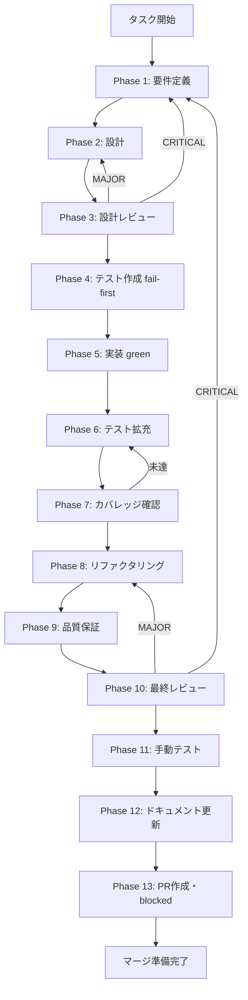

# `fetchSkills()` 非ブロッキング化（follow-up） - タスク仕様書

## メタ情報

```yaml
issue_number: 2131
task_id: TASK-SW-FIX-FEEDBACK-008
parent_task_id: TASK-SW-FIX-FEEDBACK-001
status: open
priority: medium
scale: medium
task_type: BUGFIX
```

| 項目         | 内容                                                                           |
| ------------ | ------------------------------------------------------------------------------ |
| タスクID     | TASK-SW-FIX-FEEDBACK-008                                                       |
| 親タスクID   | TASK-SW-FIX-FEEDBACK-001（スキルウィザード current facts 同期・skill準拠検証） |
| タスク名     | `fetchSkills()` 非ブロッキング化（follow-up）                                  |
| 分類         | バグ修正（エラーハンドリング改善）                                             |
| 対象機能     | `SkillLifecyclePanel.tsx` の `handleExecutePlan` / `processWorkflowOutcome`    |
| 優先度       | 中（`priority:medium`）                                                        |
| 見積もり規模 | 中規模（`scale:medium`）                                                       |
| ステータス   | 未実施（`status:open`）                                                        |
| 実行ウェーブ | Wave C（TASK-SW-FIX-FEEDBACK-001 完了後に着手可能）                            |
| 依存タスク   | TASK-SW-FIX-FEEDBACK-001（Wave B 完了済み）                                    |
| 発見元       | TASK-SW-FIX-FEEDBACK-001 Phase 11 手動テスト（NOTE-001）                       |
| 関連Issue    | #2131（TASK-SW-FIX-FEEDBACK-001 の GitHub Issue）                              |
| 発見日       | 2026-04-14                                                                     |

---

## 1. なぜこのタスクが必要か（Why）

### 1.1 背景

TASK-SW-FIX-FEEDBACK-001（スキルウィザード current facts 同期）の Phase 11 手動テストにおいて、
`SkillLifecyclePanel.tsx` の `handleExecutePlan` / `processWorkflowOutcome` に NOTE-001 が記録された。

NOTE-001 の内容:

```
対象: SkillLifecyclePanel.tsx の handleExecutePlan / processWorkflowOutcome
問題: await fetchSkills() が失敗した場合、selectSkillByName も実行されない
現行動作: fetchSkills 失敗 → generationError セット → early return
改善案: fetchSkills を non-blocking 化し、selectSkillByName は継続実行する
```

TASK-SW-FIX-FEEDBACK-001 は `docs-only / no-op` タスクであり、issue 8（このタスク）は
**受入条件（AC-1〜AC-5）のスコープ外** と判断した。そのため follow-up として切り出した。

### 1.2 問題の構造

現在の `processWorkflowOutcome` 内（`SkillLifecyclePanel.tsx` L769-778）:

```typescript
try {
  await fetchSkills();
} catch (error) {
  setGenerationError(
    error instanceof Error ? error.message : "スキル一覧の取得に失敗しました。",
  );
  return true; // ← fetchSkills 失敗で early return、selectSkillByName が実行されない
}
if (executeResult.skillName) {
  selectSkillByName(executeResult.skillName); // ← fetchSkills 失敗時は到達しない
}
```

同様のパターンが `handleExecutePlan` 内（L1110-1113）にも存在する:

```typescript
await loadVerifyDetail(planId);
await fetchSkills(); // ← 失敗すると外側の catch に飛ぶ
if (executeResponse.skillName) {
  selectSkillByName(executeResponse.skillName); // ← fetchSkills 失敗時は未到達
}
```

### 1.3 問題点・課題

`fetchSkills()` はスキル一覧の更新（UI のリフレッシュ）を担う補助的な処理であり、
スキル生成自体は既に成功している。この補助処理の失敗によって
`selectSkillByName` （生成したスキルをアクティブにする）が実行されないのは、
ユーザー体験の観点で不適切である。

| 問題                 | 内容                                                                                                  |
| -------------------- | ----------------------------------------------------------------------------------------------------- |
| `fetchSkills` の役割 | スキル一覧を最新化する補助処理（スキル生成の成否とは独立）                                            |
| 現行の問題           | `fetchSkills` 失敗 → `generationError` セット → `selectSkillByName` 未実行                            |
| 期待する挙動         | `fetchSkills` が失敗しても `selectSkillByName` は必ず実行される                                       |
| ユーザー影響         | ネットワーク等の一時的な問題で `fetchSkills` が失敗すると、正常に生成されたスキルが選択状態にならない |

### 1.4 放置した場合の影響

- スキル生成は成功しているにもかかわらず、ユーザーには「スキル一覧の取得に失敗しました」というエラーが表示される
- 生成したスキルが自動選択されず、ユーザーが手動でスキルを探す必要が生じる
- ネットワーク一時障害など非致命的なエラーが、ユーザーには致命的なエラーとして見える

### 1.5 issue 8 が TASK-SW-FIX-FEEDBACK-001 のスコープ外となった理由

TASK-SW-FIX-FEEDBACK-001 は **docs-only / no-op** タスクとして定義された。
目的は「current facts と skill 定義の差分を docs に記録すること」であり、
コード変更は受入条件（AC-1〜AC-5）が未達の場合のみ実施する方針だった。

AC-1〜AC-5 はすべて current facts で PASS 確認済みであったため、
コード変更（issue 8 の修正）は本タスクの範囲外と確定された。
follow-up として本仕様書（TASK-SW-FIX-FEEDBACK-008）に切り出した。

---

## 2. 何を達成するか（What）

### 2.1 目的

`fetchSkills()` を non-blocking 化し、`fetchSkills` の成否によらず
`selectSkillByName` が必ず実行されるように `SkillLifecyclePanel.tsx` を修正する。

### 2.2 最終ゴール

| ID   | 達成すること                                                                        |
| ---- | ----------------------------------------------------------------------------------- |
| G-01 | `processWorkflowOutcome` で `fetchSkills` 失敗時も `selectSkillByName` が実行される |
| G-02 | `handleExecutePlan` で `fetchSkills` 失敗時も `selectSkillByName` が実行される      |
| G-03 | `fetchSkills` の失敗はエラーとして記録するが、スキル選択処理を妨げない              |
| G-04 | 既存の正常フロー（`fetchSkills` 成功 → `selectSkillByName`）に回帰影響がない        |
| G-05 | 対応するユニットテストを追加・更新する（TDD red → green）                           |

### 2.3 スコープ

**含むもの**:

- `apps/desktop/src/renderer/components/skill/SkillLifecyclePanel.tsx` の修正
  - `processWorkflowOutcome` の `fetchSkills` try-catch ブロックの修正
  - `handleExecutePlan` の `fetchSkills` 呼び出し部分の修正
- `apps/desktop/src/renderer/components/skill/__tests__/SkillLifecyclePanel.llm-generation.test.tsx` のテスト追加・更新
  - `fetchSkills` 失敗時でも `selectSkillByName` が呼ばれることを検証するテスト

**含まないもの**:

- `CompleteStep.tsx` の変更（TASK-SW-FIX-FEEDBACK-001 の解析結果：対象外と確定済み）
- Main Process 側の IPC ハンドラー変更
- IPC チャンネル定義（`channels.ts`）の変更
- `fetchSkills()` 自体のエラーハンドリング改善（呼び出し側の責務に限定）
- `selectSkillByName` の実装変更

### 2.4 受入条件（Acceptance Criteria）

| AC   | 条件                                                                                                    | 検証方法                                                                                   |
| ---- | ------------------------------------------------------------------------------------------------------- | ------------------------------------------------------------------------------------------ |
| AC-1 | `processWorkflowOutcome` で `fetchSkills` が throw した場合、`selectSkillByName` が実行される           | `SkillLifecyclePanel.llm-generation.test.tsx` に新規テストを追加し検証                     |
| AC-2 | `handleExecutePlan` で `fetchSkills` が throw した場合、`selectSkillByName` が実行される                | 同上                                                                                       |
| AC-3 | `fetchSkills` が失敗した場合、エラーは `console.warn` 等で記録されるが `generationError` には設定しない | テストで `setGenerationError` が呼ばれないことを確認（またはエラー設定方針を仕様書で明記） |
| AC-4 | `fetchSkills` が成功した場合の既存フロー（`selectSkillByName` が呼ばれる）に回帰がない                  | 既存テスト U-8 / U-13 が引き続き PASS                                                      |
| AC-5 | 修正後に TypeScript 型エラー・ESLint エラーがない                                                       | `pnpm --filter @repo/desktop typecheck` / `pnpm --filter @repo/desktop lint` が PASS       |

### 2.5 成果物

| 成果物                                                                                             | 内容                                  |
| -------------------------------------------------------------------------------------------------- | ------------------------------------- |
| `apps/desktop/src/renderer/components/skill/SkillLifecyclePanel.tsx`                               | `fetchSkills` non-blocking 化の実装   |
| `apps/desktop/src/renderer/components/skill/__tests__/SkillLifecyclePanel.llm-generation.test.tsx` | AC-1〜AC-3 を検証するテストケース追加 |

---

## 3. どのように実行するか（How）

### 3.1 前提条件

| 確認項目                                                       | 確認方法                                                                                                    |
| -------------------------------------------------------------- | ----------------------------------------------------------------------------------------------------------- |
| TASK-SW-FIX-FEEDBACK-001 が完了済みであること                  | `git log --oneline` で TASK-SW-FIX-FEEDBACK-001 のコミットが含まれることを確認                              |
| `SkillLifecyclePanel.tsx` の現状を把握すること                 | `processWorkflowOutcome` / `handleExecutePlan` の `fetchSkills` 呼び出し箇所（L769-784 / L1110-1113）を確認 |
| `SkillLifecyclePanel.llm-generation.test.tsx` の構成を把握する | U-8（fetchSkills 呼び出し順）/ U-13（terminal_handoff 早期リターン）のテスト構造を確認                      |

### 3.2 依存タスク

| タスクID                     | 状態     | 関係                                         |
| ---------------------------- | -------- | -------------------------------------------- |
| TASK-SW-FIX-FEEDBACK-001     | 完了済み | 本タスクの親タスク（Wave B）                 |
| TASK-SW-FIX-STATE-DETAIL-001 | 並列可能 | `SkillCreateWizard.tsx` 側の修正（競合なし） |
| TASK-SW-FIX-UI-001           | 並列可能 | Wave C 内で競合ファイルを確認すること        |

### 3.3 アーキテクチャ設計

**修正前（blocking パターン）**:

```
processWorkflowOutcome / handleExecutePlan
  │
  ├── await fetchSkills()        ← ブロッキング呼び出し
  │     │
  │     └── 失敗（throw）
  │           └── setGenerationError() → early return
  │               （selectSkillByName は実行されない）
  │
  └── if (skillName) selectSkillByName(skillName)   ← 到達しない
```

**修正後（non-blocking パターン）**:

```
processWorkflowOutcome / handleExecutePlan
  │
  ├── fetchSkills().catch(err => {
  │     console.warn("[SkillLifecyclePanel] fetchSkills failed (non-blocking)", err);
  │   })  ← 失敗を非同期で処理（await しない、または try-catch で無視）
  │
  └── if (skillName) selectSkillByName(skillName)   ← 必ず実行される
```

### 3.4 主要ファイルと役割

| ファイル                                                                                           | 役割                                          |
| -------------------------------------------------------------------------------------------------- | --------------------------------------------- |
| `apps/desktop/src/renderer/components/skill/SkillLifecyclePanel.tsx`                               | 修正対象（L769-784 と L1110-1113 の2箇所）    |
| `apps/desktop/src/renderer/components/skill/__tests__/SkillLifecyclePanel.llm-generation.test.tsx` | テスト追加対象（AC-1〜AC-3 の検証テスト追加） |

---

## 4. 実行手順

### Phase 1: 要件定義

**目的**: 修正スコープと受入条件を確定する。

完了条件:

- issue 8 の問題文と改善案を current facts に照らして固定する
- AC-1〜AC-5 を検証可能な形で定義する
- 含む/含まないスコープ境界を明確化する
- 親タスク（TASK-SW-FIX-FEEDBACK-001）での調査結果を current facts として引き継ぐ

成果物:

- `outputs/phase-1/requirements-definition.md`

---

### Phase 2: 設計

**目的**: `fetchSkills` non-blocking 化の実装方針を確定する。

設計すべき項目:

- `processWorkflowOutcome` の `fetchSkills` try-catch ブロックの修正方針
  - Option A: `await fetchSkills()` を `void fetchSkills().catch(...)` に変更
  - Option B: try-catch を維持しつつ catch 節で early return を除去
- `handleExecutePlan` の `fetchSkills` 呼び出し部分の修正方針
  - `handleExecutePlan` の outer try-catch と `fetchSkills` の関係を整理
- `fetchSkills` 失敗時のエラー記録方針（`console.warn` vs `console.error` vs サイレント無視）
- 2箇所の修正で同一パターンを適用するか、文脈に応じて分岐するか

完了条件:

- 修正方針が Before/After コードスニペットで明記されている
- `fetchSkills` 失敗のエラー記録方針が決定している
- 無限ループリスク・型エラーリスクを評価している

成果物:

- `outputs/phase-2/design-document.md`

---

### Phase 3: 設計レビュー

**目的**: Phase 2 の設計を Phase 4 へ進めるか判定する。

レビュー観点:

- `void fetchSkills().catch(...)` パターンの lint 互換性（`no-floating-promises` ルール対策確認）
- `handleExecutePlan` の outer catch との干渉が発生しないか
- 既存テスト U-8 / U-13 への回帰影響がないか

判定基準:

- PASS / MINOR → Phase 4 へ進む
- MAJOR → Phase 2 に差し戻し
- CRITICAL → Phase 1 に差し戻し

完了条件:

- レビュー結果（PASS/MINOR/MAJOR/CRITICAL）が明記されている
- MINOR 指摘がある場合は未タスク候補として記録されている

成果物:

- `outputs/phase-3/review-result.md`

---

### Phase 4: テスト作成（fail-first）

**目的**: AC-1〜AC-3 を検証するテストを fail-first で追加する。

追加するテストケース:

| テストID | スイート                                    | 内容                                                                                              | 対応AC |
| -------- | ------------------------------------------- | ------------------------------------------------------------------------------------------------- | ------ |
| U-NEW-1  | SkillLifecyclePanel.llm-generation.test.tsx | `fetchSkills` が reject した場合でも `selectSkillByName` が1回呼ばれる                            | AC-1   |
| U-NEW-2  | SkillLifecyclePanel.llm-generation.test.tsx | `handleExecutePlan` で `fetchSkills` reject 後も `selectSkillByName` が呼ばれる                   | AC-2   |
| U-NEW-3  | SkillLifecyclePanel.llm-generation.test.tsx | `fetchSkills` reject 時に `setGenerationError` が呼ばれない（または呼ばれる場合はその仕様を明記） | AC-3   |

既存テストの確認:

| テストID | 内容                                                         | 期待             |
| -------- | ------------------------------------------------------------ | ---------------- |
| U-8      | `fetchSkills` が1回呼ばれ `selectSkillByName` が続く         | PASS（回帰なし） |
| U-13     | `terminal_handoff` 時に `fetchSkills` が呼ばれず早期リターン | PASS（回帰なし） |

完了条件:

- U-NEW-1〜U-NEW-3 が red（実装前に fail）であることを確認している
- U-8 / U-13 が PASS（回帰なし）であることを確認している

成果物:

- `outputs/phase-4/test-specifications.md`

---

### Phase 5: 実装

**目的**: `SkillLifecyclePanel.tsx` の `fetchSkills` non-blocking 化を実装する。

実装対象（2箇所）:

**修正箇所 1: `processWorkflowOutcome` 内（L769-778）**

修正前:

```typescript
try {
  await fetchSkills();
} catch (error) {
  setGenerationError(
    error instanceof Error ? error.message : "スキル一覧の取得に失敗しました。",
  );
  return true;
}
if (executeResult.skillName) {
  selectSkillByName(executeResult.skillName);
}
```

修正後（設計レビュー結果に基づき確定した方針を適用）:

```typescript
// fetchSkills の失敗はスキル選択を妨げない（non-blocking）
await fetchSkills().catch((error) => {
  console.warn(
    "[SkillLifecyclePanel] fetchSkills failed (non-blocking):",
    error,
  );
});
if (executeResult.skillName) {
  selectSkillByName(executeResult.skillName);
}
```

**修正箇所 2: `handleExecutePlan` 内（L1110-1113）**

修正前:

```typescript
await loadVerifyDetail(planId);
await fetchSkills();
if (executeResponse.skillName) {
  selectSkillByName(executeResponse.skillName);
}
```

修正後（設計レビュー結果に基づき確定した方針を適用）:

```typescript
await loadVerifyDetail(planId);
// fetchSkills の失敗はスキル選択を妨げない（non-blocking）
await fetchSkills().catch((error) => {
  console.warn(
    "[SkillLifecyclePanel] fetchSkills failed (non-blocking):",
    error,
  );
});
if (executeResponse.skillName) {
  selectSkillByName(executeResponse.skillName);
}
```

> **注意**: 上記の修正コードは設計フェーズ（Phase 2）の検討結果によって変更される場合がある。
> Phase 5 実施時は `outputs/phase-2/design-document.md` を必ず参照すること。

完了条件:

- U-NEW-1〜U-NEW-3 が green（実装後に PASS）になっている
- U-8 / U-13 が引き続き PASS（回帰なし）である
- TypeScript 型エラー・ESLint エラーがない

成果物:

- `outputs/phase-5/implementation-record.md`

---

### Phase 6: テスト拡充

**目的**: エッジケースを追加し、テストの網羅性を向上させる。

追加すべきエッジケース:

| テストID | 内容                                                                                 | 観点             |
| -------- | ------------------------------------------------------------------------------------ | ---------------- |
| U-NEW-4  | `executeResult.skillName` が null/undefined の場合、`selectSkillByName` が呼ばれない | ガード条件の確認 |
| U-NEW-5  | `fetchSkills` が成功後に `selectSkillByName` が呼ばれる（正常パス回帰）              | 既存動作の保全   |
| U-NEW-6  | `fetchSkills` が失敗かつ `executeResult.skillName` が null の場合、何も起きない      | 複合条件の確認   |

完了条件:

- U-NEW-4〜U-NEW-6 が PASS である
- 追加テストに TypeScript 型エラー・ESLint エラーがない

成果物:

- `outputs/phase-6/extended-test-record.md`

---

### Phase 7: カバレッジ確認

**目的**: 修正箇所のブランチカバレッジを確認する。

確認コマンド:

```bash
pnpm --filter @repo/desktop vitest run --coverage \
  src/renderer/components/skill/__tests__/SkillLifecyclePanel.llm-generation.test.tsx
```

確認観点:

- `processWorkflowOutcome` の `fetchSkills` 成功パス・失敗パスの両方がカバーされているか
- `handleExecutePlan` の `fetchSkills` 成功パス・失敗パスの両方がカバーされているか
- `executeResult.skillName` が truthy/falsy 両方のパスがカバーされているか

カバレッジ目標:

| 指標              | 最低基準 |
| ----------------- | -------- |
| Line Coverage     | 80%      |
| Branch Coverage   | 70%      |
| Function Coverage | 80%      |

成果物:

- `outputs/phase-7/coverage-report.md`

---

### Phase 8: リファクタリング

**目的**: 修正コードの可読性・保守性を確認し、必要であれば改善する。

確認観点（`対象/Before/After/理由` テーブル形式で記録）:

- `console.warn` のメッセージフォーマットが既存コード（`[SkillLifecyclePanel]` プレフィックス）と整合しているか
- 2箇所の修正（`processWorkflowOutcome` と `handleExecutePlan`）で同一パターンが適用されているか
- コメント（`// non-blocking`）が意図を明確に伝えているか

成果物:

- `outputs/phase-8/refactoring-record.md`

---

### Phase 9: 品質保証

**目的**: 型チェック・lint・全テストを一括確認する。

実行コマンド:

```bash
# 型チェック
pnpm --filter @repo/desktop typecheck 2>&1 | grep -E "error|Error" | head -20

# lint
pnpm --filter @repo/desktop lint 2>&1 | grep -E "error|Error" | head -20

# 関連テスト
pnpm --filter @repo/desktop vitest run \
  src/renderer/components/skill/__tests__/SkillLifecyclePanel.llm-generation.test.tsx \
  2>&1 | tail -20
```

判定基準:

- TypeScript エラー 0件
- ESLint エラー 0件
- テスト全件 PASS

成果物:

- `outputs/phase-9/quality-report.md`

---

### Phase 10: 最終レビュー

**目的**: AC-1〜AC-5 と blockers を最終確認し、Phase 11 に進む判定を行う。

確認テーブル:

| AC   | 条件                                                                        | 検証テスト       | 判定 |
| ---- | --------------------------------------------------------------------------- | ---------------- | ---- |
| AC-1 | `processWorkflowOutcome` で `fetchSkills` 失敗時も `selectSkillByName` 実行 | U-NEW-1          | ?    |
| AC-2 | `handleExecutePlan` で `fetchSkills` 失敗時も `selectSkillByName` 実行      | U-NEW-2          | ?    |
| AC-3 | `fetchSkills` 失敗時のエラー記録方針が仕様書に明記されている                | U-NEW-3          | ?    |
| AC-4 | 既存テスト U-8 / U-13 が PASS（回帰なし）                                   | U-8 / U-13       | ?    |
| AC-5 | TypeScript 型エラー・ESLint エラーなし                                      | typecheck / lint | ?    |

判定基準:

- PASS / MINOR → Phase 11 へ
- MAJOR → Phase 8 に差し戻し
- CRITICAL → Phase 1 に差し戻し

成果物:

- `outputs/phase-10/final-review-result.md`

---

### Phase 11: 手動テスト

**目的**: 実際のアプリ動作で修正が正しく機能することを目視確認する。

手動テストシナリオ:

1. `pnpm --filter @repo/desktop dev` でアプリを起動する
2. Skill Creator を開き、スキルを LLM モードで生成する
3. スキル生成が完了したとき、スキル一覧が更新され生成したスキルが選択状態になることを確認する
4. （実機での再現が困難な場合）開発ツール等で `fetchSkills` を一時的に失敗させ、
   それでも `selectSkillByName` が呼ばれることを確認する

テストタイプ: NON_VISUAL（DOM 変化は UI テストで確認済み）

完了条件:

- Blocker が 0件であることを確認した
- Note がある場合は未タスク候補として記録した

成果物:

- `outputs/phase-11/manual-test-result.md`
- `outputs/phase-11/discovered-issues.md`

---

### Phase 12: ドキュメント更新

**目的**: 実装ガイド・システム仕様更新・未タスク検出・フィードバックの4成果物を完了する。

#### Task 12-1: 実装ガイド（Part 1 + Part 2）

**Part 1（中学生レベル）の要件**:

- 「`fetchSkills` 失敗は棚卸し失敗であり、スキルを選ぶ行為とは別のこと」を日常の例え話で説明
- 「なぜスキル選択が継続されるべきか」を先に説明する
- 専門用語を使う場合は即座に説明する

**Part 2（技術者レベル）の要件**:

- `processWorkflowOutcome` / `handleExecutePlan` の Before/After コードスニペット
- `void fetchSkills().catch(...)` vs `try-catch` 修正の設計根拠
- `console.warn` によるエラー記録とサイレント無視の選択理由
- エラーハンドリング方針（non-blocking の意図）を型コメントとして記録

#### Task 12-2: システム仕様書更新

| Step     | 内容                                                                                                                                                    |
| -------- | ------------------------------------------------------------------------------------------------------------------------------------------------------- |
| Step 1-A | `aiworkflow-requirements` の完了タスクセクション追加（TASK-SW-FIX-FEEDBACK-008）                                                                        |
| Step 1-B | 実装状況テーブルに本タスクを `completed` で追記                                                                                                         |
| Step 1-C | 親タスク（TASK-SW-FIX-FEEDBACK-001）の関連タスクテーブルに本タスクの完了を反映                                                                          |
| Step 2   | `fetchSkills` non-blocking パターンを `SkillLifecyclePanel` のアーキテクチャに反映（新規 API 追加なし → 内部実装変更のみ → Step 2 は N/A の可能性あり） |

#### Task 12-3: ドキュメント更新履歴

- `documentation-changelog.md` に全 Step の実施結果を記録する（「該当なし」も記録）

#### Task 12-4: 未タスク検出（0件でも出力必須）

確認ソース:

- Phase 3/10 の MINOR 指摘
- Phase 11 の発見事項
- 修正コード内の TODO/FIXME

#### Task 12-5: スキルフィードバックレポート（改善点なしでも出力必須）

- `task-specification-creator` / `aiworkflow-requirements` への改善提案を記録する

成果物:

- `outputs/phase-12/implementation-guide.md`（Part 1 + Part 2）
- `outputs/phase-12/system-spec-update-summary.md`
- `outputs/phase-12/documentation-changelog.md`
- `outputs/phase-12/unassigned-task-detection.md`
- `outputs/phase-12/skill-feedback-report.md`
- `outputs/phase-12/phase12-task-spec-compliance-check.md`

#### 苦戦箇所と調査結果の引き継ぎ（Phase 12 必須記述）

| 項目                                     | 内容                                                                                                                                                            |
| ---------------------------------------- | --------------------------------------------------------------------------------------------------------------------------------------------------------------- |
| 親タスクでの調査結果                     | `processWorkflowOutcome` L769-778 と `handleExecutePlan` L1110-1113 の2箇所に同一パターンが存在することを確認済み                                               |
| issue 8 がスコープ外となった理由         | TASK-SW-FIX-FEEDBACK-001 は docs-only / no-op。AC-1〜AC-5 が current facts で PASS 済みのため、コード変更は範囲外と確定した                                     |
| non-blocking 化で注意すべき点（予測）    | `no-floating-promises` lint ルール対策として `void` または `.catch()` チェーンが必要。Phase 2 設計レビューで確認すること                                        |
| `handleExecutePlan` outer catch との関係 | `handleExecutePlan` 内の `fetchSkills` は outer try-catch に包まれている（L1117-1123）。non-blocking 化後も outer catch が機能することを Phase 3 で確認すること |

---

### Phase 13: PR作成

**目的**: ユーザーの明示承認後にのみ PR を作成する。

> **このフェーズはユーザーの承認なしに実行してはならない。**

PR 作成時の情報:

- タイトル: `fix(SkillLifecyclePanel): fetchSkills 失敗時も selectSkillByName を継続実行`
- ベースブランチ: `main`
- 関連Issue: #2131（TASK-SW-FIX-FEEDBACK-001 の Issue にコメントで言及）
- ラベル: `fix`, `skill-wizard`

成果物:

- `outputs/phase-13/pr-info.md`

---

## 5. 完了条件チェックリスト

### 機能要件

- [ ] AC-1: `processWorkflowOutcome` で `fetchSkills` 失敗時も `selectSkillByName` が実行される
- [ ] AC-2: `handleExecutePlan` で `fetchSkills` 失敗時も `selectSkillByName` が実行される
- [ ] AC-3: `fetchSkills` 失敗時のエラー記録方針が仕様書に明記されている
- [ ] AC-4: 既存テスト U-8 / U-13 が PASS（回帰なし）
- [ ] AC-5: TypeScript 型エラー・ESLint エラーなし

### テスト要件

- [ ] U-NEW-1〜U-NEW-3 が追加され全て PASS
- [ ] U-NEW-4〜U-NEW-6 のエッジケーステストが PASS
- [ ] 関連テストスイート全体が PASS（`SkillLifecyclePanel.llm-generation.test.tsx`）

### 品質要件

- [ ] `pnpm --filter @repo/desktop typecheck` がエラー 0
- [ ] `pnpm --filter @repo/desktop lint` がエラー 0

### ドキュメント要件

- [ ] `outputs/phase-12/implementation-guide.md` が Part 1 / Part 2 構成で作成されている
- [ ] `outputs/phase-12/system-spec-update-summary.md` が作成されている
- [ ] `outputs/phase-12/documentation-changelog.md` が作成されている
- [ ] `outputs/phase-12/unassigned-task-detection.md` が作成されている（0件でも出力）
- [ ] `outputs/phase-12/skill-feedback-report.md` が作成されている（改善点なしでも出力）
- [ ] `outputs/phase-12/phase12-task-spec-compliance-check.md` が作成されている

---

## 6. テストケーステーブル

| テストID | 対象ファイル                                | 入力条件                                              | 期待結果                                                        | 対応AC |
| -------- | ------------------------------------------- | ----------------------------------------------------- | --------------------------------------------------------------- | ------ |
| U-8      | SkillLifecyclePanel.llm-generation.test.tsx | LLMモード成功・`fetchSkills` 成功                     | `fetchSkills` が1回呼ばれ、`selectSkillByName` が続く           | AC-4   |
| U-13     | SkillLifecyclePanel.llm-generation.test.tsx | `terminal_handoff`                                    | `fetchSkills` / `selectSkillByName` が呼ばれない                | AC-4   |
| U-NEW-1  | SkillLifecyclePanel.llm-generation.test.tsx | `processWorkflowOutcome` で `fetchSkills` が reject   | `selectSkillByName` が1回呼ばれる                               | AC-1   |
| U-NEW-2  | SkillLifecyclePanel.llm-generation.test.tsx | `handleExecutePlan` で `fetchSkills` が reject        | `selectSkillByName` が1回呼ばれる                               | AC-2   |
| U-NEW-3  | SkillLifecyclePanel.llm-generation.test.tsx | `fetchSkills` が reject                               | `setGenerationError` が呼ばれない（またはエラー設定方針の検証） | AC-3   |
| U-NEW-4  | SkillLifecyclePanel.llm-generation.test.tsx | `executeResult.skillName` が null                     | `selectSkillByName` が呼ばれない                                | -      |
| U-NEW-5  | SkillLifecyclePanel.llm-generation.test.tsx | `fetchSkills` 成功・`executeResult.skillName` あり    | `selectSkillByName` が呼ばれる（正常パス回帰）                  | AC-4   |
| U-NEW-6  | SkillLifecyclePanel.llm-generation.test.tsx | `fetchSkills` reject + `executeResult.skillName` null | `selectSkillByName` が呼ばれない                                | -      |

---

## 7. リスクと対策

| リスク                                                                             | 影響度 | 発生確率 | 対策                                                                                                                                          |
| ---------------------------------------------------------------------------------- | ------ | -------- | --------------------------------------------------------------------------------------------------------------------------------------------- |
| `void fetchSkills().catch(...)` が `no-floating-promises` lint ルールに引っかかる  | 中     | 中       | `.catch()` チェーンは floating promise を解決するため通過するはず。Phase 3 設計レビューで確認する                                             |
| `handleExecutePlan` の outer catch と `fetchSkills` non-blocking 化が干渉する      | 中     | 低       | outer catch（L1117-1123）は `handleExecutePlan` 全体を包む。`fetchSkills` を non-blocking 化しても outer catch は機能する。Phase 3 で確認する |
| `fetchSkills` の Promise rejection が uncaught になる                              | 高     | 低       | `.catch()` チェーンで rejection をキャッチしているため uncaught にはならない。Phase 4 のテストで確認する                                      |
| 2箇所の修正パターンが乖離してコードの整合性が失われる                              | 低     | 低       | Phase 8 リファクタリングで両箇所のパターン統一を確認する                                                                                      |
| `fetchSkills` 失敗を `console.warn` でサイレント処理することでデバッグが困難になる | 低     | 低       | `[SkillLifecyclePanel]` プレフィックス付きで `console.warn` を使用し、フィルタリングを容易にする                                              |

---

## 8. 参照情報

### 親タスク成果物

| ファイルパス                                                                               | 内容                                                |
| ------------------------------------------------------------------------------------------ | --------------------------------------------------- |
| `docs/30-workflows/TASK-SW-FIX-FEEDBACK-001/outputs/phase-1/requirements-definition.md`    | 論点8の current facts 確認結果・follow-up分離の根拠 |
| `docs/30-workflows/TASK-SW-FIX-FEEDBACK-001/outputs/phase-11/discovered-issues.md`         | NOTE-001（issue 8）の詳細記録                       |
| `docs/30-workflows/TASK-SW-FIX-FEEDBACK-001/outputs/phase-12/unassigned-task-detection.md` | issue 8 の follow-up 候補化の記録                   |
| `docs/30-workflows/TASK-SW-FIX-FEEDBACK-001/outputs/phase-12/implementation-guide.md`      | follow-up の変更対象ファイル（Part 2 セクション 3） |

### 実装対象ファイル

| ファイルパス                                                                                       | 内容                                                                           |
| -------------------------------------------------------------------------------------------------- | ------------------------------------------------------------------------------ |
| `apps/desktop/src/renderer/components/skill/SkillLifecyclePanel.tsx`                               | 修正対象（`processWorkflowOutcome` L769-784 / `handleExecutePlan` L1110-1113） |
| `apps/desktop/src/renderer/components/skill/__tests__/SkillLifecyclePanel.llm-generation.test.tsx` | テスト追加対象（U-NEW-1〜U-NEW-6）                                             |

### 関連仕様書

| ファイルパス                                                        | 内容                              |
| ------------------------------------------------------------------- | --------------------------------- |
| `docs/30-workflows/TASK-SW-FIX-FEEDBACK-001/index.md`               | 親タスクのインデックス            |
| `docs/30-workflows/unassigned-task/TASK-SW-FIX-STATE-DETAIL-001.md` | 波 C 内の並列タスク（競合確認用） |

---

## 9. Phase フロー図



---

## 10. タスク分解サマリー

| ID     | フェーズ | サブタスク名     | 責務                                                   | 依存 |
| ------ | -------- | ---------------- | ------------------------------------------------------ | ---- |
| T-01-1 | Phase 1  | 要件定義         | スコープ・AC・スコープ境界を固定する                   | -    |
| T-02-1 | Phase 2  | 設計             | non-blocking パターンの Before/After を確定する        | T-01 |
| T-03-1 | Phase 3  | 設計レビュー     | lint 互換性・outer catch 干渉・回帰リスクを評価する    | T-02 |
| T-04-1 | Phase 4  | テスト作成       | U-NEW-1〜U-NEW-3 を fail-first で作成する              | T-03 |
| T-05-1 | Phase 5  | 実装             | 2箇所の `fetchSkills` non-blocking 化を実装する        | T-04 |
| T-06-1 | Phase 6  | テスト拡充       | U-NEW-4〜U-NEW-6 のエッジケースを追加する              | T-05 |
| T-07-1 | Phase 7  | カバレッジ確認   | 修正箇所のブランチカバレッジを計測する                 | T-06 |
| T-08-1 | Phase 8  | リファクタリング | 2箇所のパターン統一・コメント整備                      | T-07 |
| T-09-1 | Phase 9  | 品質保証         | typecheck / lint / テスト全件 PASS を確認する          | T-08 |
| T-10-1 | Phase 10 | 最終レビュー     | AC-1〜AC-5 の最終確認・blocker 判定                    | T-09 |
| T-11-1 | Phase 11 | 手動テスト       | 実機または DevTools で動作確認                         | T-10 |
| T-12-1 | Phase 12 | ドキュメント更新 | 実装ガイド・仕様更新・未タスク検出・フィードバック完了 | T-11 |
| T-13-1 | Phase 13 | PR作成           | ユーザー承認後に PR を作成する                         | T-12 |

**総サブタスク数**: 13個

---

## 11. 苦戦箇所（事前記録）

TASK-SW-FIX-FEEDBACK-001 での調査と本仕様書作成時点での予測苦戦箇所を記録する。

| 項目                                     | 内容                                                                                                                                                            |
| ---------------------------------------- | --------------------------------------------------------------------------------------------------------------------------------------------------------------- |
| `no-floating-promises` lint ルール対応   | ESLint の `@typescript-eslint/no-floating-promises` ルールにより、`void` キーワードなしの `.catch()` チェーンが警告を出す可能性がある。Phase 3 で確認必須       |
| `handleExecutePlan` outer catch との境界 | `handleExecutePlan` の `fetchSkills` は outer try-catch（L1117-1123）に包まれているため、non-blocking 化後の例外伝播パスを Phase 3 で整理すること               |
| 2箇所の修正パターンの統一                | `processWorkflowOutcome` と `handleExecutePlan` の2箇所を修正するが、コンテキストが異なるため完全同一パターンにならない可能性がある。Phase 8 で整合性を確認する |
| テストで `fetchSkills` のモック化        | `useFetchSkills` フックをテストでモックする方法は既存テスト（U-8）で確立済み。reject させるパターンへの拡張を Phase 4 で確認すること                            |

---

## 12. 備考

### タスク命名規則

本タスクのIDは `TASK-SW-FIX-FEEDBACK-008` であり、
親タスク `TASK-SW-FIX-FEEDBACK-001` の issue 8 に対応する follow-up タスクである。

### 「100人中100人が同じ理解で実行できる」ポイント

1. **Phase 1 を先に実施**: 親タスクの調査結果（`processWorkflowOutcome` L769-778 / `handleExecutePlan` L1110-1113 の2箇所）を current facts として引き継ぎ、再調査しないこと
2. **2箇所を同時に修正**: `processWorkflowOutcome` と `handleExecutePlan` の両方に同じパターンが存在する。どちらか一方だけを修正すると半端な状態になる
3. **CompleteStep.tsx は対象外**: 親タスクで「対象外」と確定済み。本タスクでも変更しない
4. **テストは fail-first**: Phase 4 でテストを作成し、Phase 5 で実装する（TDD 手順を守る）
5. **Phase 13 はユーザー承認後のみ**: PR 作成は承認なしに実行禁止
