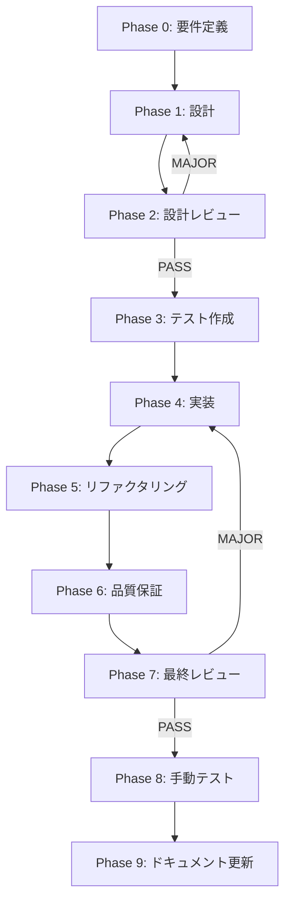

# APIキー設定UI改善 - タスク実行仕様書

## ユーザーからの元の指示

```
連携サービスのようにグリーンで囲われて登録済みというチェック付きの緑色の内容とのようなフォーマットでAPIキー設定も行ってください。
ただし、登録済み、編集、削除という3つの項目は必要です。
色とか内容をこの連携サービスと同じようなフォーマットにしてほしいです。
ただし、登録済み、編集、削除という項目は必要です。
```

## メタ情報

| 項目             | 内容                         |
| ---------------- | ---------------------------- |
| タスクID         | TASK-API-KEYS-UI-IMPROVE-001 |
| タスク名         | APIキー設定UI改善            |
| 分類             | 改善                         |
| 対象機能         | APIキー設定セクション        |
| 優先度           | 中                           |
| 見積もり規模     | 小規模                       |
| ステータス       | 未実施                       |
| 発見元           | ユーザー要望                 |
| 発見日           | 2025-12-12                   |
| 発見エージェント | .claude/agents/product-manager.md             |

---

## タスク概要

### 目的

APIキー設定セクションのUIを連携サービスセクションと同じデザインフォーマットに統一する。

### 背景

現在のAPIキー設定セクションは、連携サービスセクションとデザインが異なっている：

- 連携サービス：グリーンのボーダーで囲まれ、チェックマーク付きの「登録済み」バッジ
- APIキー設定：現在は異なるスタイル（グリーンバッジのみ）

UIの一貫性を保つため、両セクションのデザインを統一する必要がある。

**現状分析**:

- 連携サービス：グリーンボーダー + チェックアイコン + 「登録済み」テキスト + 「解除」ボタン
- APIキー設定：「登録済み」バッジ + 「編集」ボタン + 「削除」ボタン
- APIキーは「編集」「削除」の2つのアクションが必要（連携サービスは「解除」のみ）

### 最終ゴール

- APIキー設定の各行が連携サービスと同様にグリーンボーダーで囲まれる
- 「登録済み」表示がチェックマーク付きで統一される
- 「編集」「削除」ボタンは維持される
- 全体のデザインが統一され、視覚的な一貫性が保たれる

### 成果物一覧

| 種別           | 成果物             | 配置先                                                                     |
| -------------- | ------------------ | -------------------------------------------------------------------------- |
| コンポーネント | ApiKeysSection更新 | `apps/desktop/src/renderer/components/organisms/ApiKeysSection/`           |
| スタイル       | 共通スタイル抽出   | `apps/desktop/src/renderer/components/organisms/ApiKeysSection/styles.ts`  |
| テスト         | UIスタイルテスト   | `apps/desktop/src/renderer/components/organisms/ApiKeysSection/*.test.tsx` |
| ドキュメント   | 機能ドキュメント   | `docs/30-workflows/api-keys-ui-improvement/`                               |

---

## 参照ファイル

本仕様書のコマンド・エージェント・スキル選定は以下を参照：

- `docs/00-requirements/master_system_design.md` - システム要件
- `.claude/commands/ai/command_list.md` - /ai:コマンド定義
- `.claude/agents/agent_list.md` - エージェント定義
- `.claude/skills/skill_list.md` - スキル定義

---

## 参照UI（連携サービスセクション）

連携サービスの各行は以下の要素で構成されている：

```
┌─────────────────────────────────────────────────────────────┐
│ [アイコン] サービス名                    ✓ 登録済み   解除   │
│            メールアドレス                                    │
└─────────────────────────────────────────────────────────────┘
（グリーンのボーダーで囲まれている）
```

APIキー設定も同様のフォーマットにするが、アクションは「編集」「削除」を維持：

```
┌─────────────────────────────────────────────────────────────┐
│ [アイコン] プロバイダー名        ✓ 登録済み   編集   削除    │
└─────────────────────────────────────────────────────────────┘
（グリーンのボーダーで囲まれている）
```

---

## タスク分解サマリー

| ID     | フェーズ         | サブタスク名               | 責務                     | 依存   |
| ------ | ---------------- | -------------------------- | ------------------------ | ------ |
| T-00-1 | 要件定義         | UIデザイン要件定義         | デザイン統一要件の明確化 | なし   |
| T-01-1 | 設計             | コンポーネントスタイル設計 | 共通スタイルの設計       | T-00-1 |
| T-02-1 | 設計レビュー     | 設計レビューゲート         | 設計の妥当性検証         | T-01-1 |
| T-03-1 | テスト作成       | スタイル適用テスト         | グリーンボーダー表示検証 | T-02-1 |
| T-03-2 | テスト作成       | アクションボタンテスト     | 編集・削除ボタン動作検証 | T-02-1 |
| T-04-1 | 実装             | ApiKeysSection更新         | スタイル適用実装         | T-03-1 |
| T-05-1 | リファクタリング | 共通スタイル抽出           | 連携サービスとの共通化   | T-04-1 |
| T-06-1 | 品質保証         | 自動テスト実行             | テスト成功確認           | T-05-1 |
| T-06-2 | 品質保証         | Lint・型チェック           | コード品質確認           | T-06-1 |
| T-07-1 | 最終レビュー     | 最終レビューゲート         | 全体品質検証             | T-06-2 |
| T-08-1 | 手動テスト       | 手動テスト検証             | 実際のUI確認             | T-07-1 |
| T-09-1 | ドキュメント     | ドキュメント更新           | 仕様書更新               | T-08-1 |

**総サブタスク数**: 12個

---

## 実行フロー図



---

## Phase 0: 要件定義

### T-00-1: UIデザイン要件定義

#### 目的

連携サービスとAPIキー設定のデザイン統一要件を明確化する。

#### 背景

UIの一貫性はユーザー体験に直結する重要な要素。

#### 責務（単一責務）

UIデザイン統一の要件定義のみを担当。

#### Claude Code スラッシュコマンド

```
/ai:gather-requirements api-keys-ui-improvement
```

#### 使用エージェント

- **エージェント**: .claude/agents/ui-designer.md
- **選定理由**: UIデザインの専門性

#### 活用スキル

| スキル名             | 活用方法               |
| -------------------- | ---------------------- |
| .claude/skills/apple-hig-guidelines/SKILL.md | デスクトップUIパターン |
| .claude/skills/code-style-guides/SKILL.md    | スタイル統一           |

#### 成果物

| 成果物     | パス                                                        | 内容         |
| ---------- | ----------------------------------------------------------- | ------------ |
| 要件定義書 | `docs/30-workflows/api-keys-ui-improvement/requirements.md` | デザイン要件 |

#### 完了条件

- [ ] グリーンボーダーの仕様が定義されている
- [ ] チェックマーク付き「登録済み」表示の仕様が定義されている
- [ ] 「編集」「削除」ボタンの配置が定義されている
- [ ] 連携サービスとの差分が明確化されている

---

## Phase 1: 設計

### T-01-1: コンポーネントスタイル設計

#### 目的

ApiKeysSectionのスタイル変更を設計する。

#### 責務（単一責務）

スタイル設計のみを担当。

#### Claude Code スラッシュコマンド

```
/ai:refactor apps/desktop/src/renderer/components/organisms/ApiKeysSection
```

#### 使用エージェント

- **エージェント**: .claude/agents/ui-designer.md
- **選定理由**: UIスタイル設計の専門性

#### 成果物

| 成果物       | パス                                                        | 内容           |
| ------------ | ----------------------------------------------------------- | -------------- |
| スタイル設計 | `docs/30-workflows/api-keys-ui-improvement/style-design.md` | スタイル設計書 |

#### 完了条件

- [ ] CSSクラス/Tailwindクラスの変更箇所が特定されている
- [ ] 連携サービスとの共通スタイル抽出方針が決定されている
- [ ] ボーダー色・チェックアイコンの実装方法が設計されている

---

## Phase 3: テスト作成 (TDD: Red)

### T-03-1: スタイル適用テスト

#### 目的

グリーンボーダーとチェックマーク表示のテストを先に作成する。

#### Claude Code スラッシュコマンド

```
/ai:generate-unit-tests apps/desktop/src/renderer/components/organisms/ApiKeysSection
```

#### 使用エージェント

- **エージェント**: .claude/agents/unit-tester.md

#### 成果物

| 成果物         | パス                                                                                     | 内容           |
| -------------- | ---------------------------------------------------------------------------------------- | -------------- |
| テストファイル | `apps/desktop/src/renderer/components/organisms/ApiKeysSection/__tests__/Style.test.tsx` | スタイルテスト |

#### 完了条件

- [ ] 登録済みAPIキーにグリーンボーダーが適用されるテスト
- [ ] チェックマーク付き「登録済み」が表示されるテスト
- [ ] 未登録状態ではボーダーが適用されないテスト

---

### T-03-2: アクションボタンテスト

#### 目的

「編集」「削除」ボタンの動作テストを確認する。

#### 成果物

| 成果物         | パス                                                                                       | 内容             |
| -------------- | ------------------------------------------------------------------------------------------ | ---------------- |
| テストファイル | `apps/desktop/src/renderer/components/organisms/ApiKeysSection/__tests__/Actions.test.tsx` | アクションテスト |

#### 完了条件

- [ ] 「編集」ボタンが表示されるテスト
- [ ] 「削除」ボタンが表示されるテスト
- [ ] 各ボタンのクリックハンドラが動作するテスト

---

## Phase 4: 実装 (TDD: Green)

### T-04-1: ApiKeysSection更新

#### 目的

連携サービスと同様のスタイルをAPIキー設定に適用する。

#### 責務（単一責務）

ApiKeysSectionのスタイル更新のみを担当。

#### Claude Code スラッシュコマンド

```
/ai:refactor apps/desktop/src/renderer/components/organisms/ApiKeysSection
```

#### 使用エージェント

- **エージェント**: .claude/agents/ui-designer.md
- **選定理由**: UIコンポーネント実装の専門性

#### 成果物

| 成果物             | パス                                                                      | 内容         |
| ------------------ | ------------------------------------------------------------------------- | ------------ |
| コンポーネント更新 | `apps/desktop/src/renderer/components/organisms/ApiKeysSection/index.tsx` | スタイル適用 |

#### 実装内容

1. 登録済みAPIキーの行にグリーンボーダー（`border-green-500/30`）を追加
2. 「登録済み」表示をチェックマーク付きに変更（`✓ 登録済み`）
3. ボーダー色を連携サービスと同じ緑系に統一
4. 「編集」「削除」ボタンは現在の位置・機能を維持

#### TDD検証: Green状態確認

```bash
pnpm --filter @repo/desktop test:run
```

- [ ] テストが成功することを確認（Green状態）

#### 完了条件

- [ ] グリーンボーダーが適用されている
- [ ] チェックマーク付き「登録済み」が表示されている
- [ ] 「編集」「削除」ボタンが動作する
- [ ] 連携サービスと視覚的に統一されている

---

## Phase 8: 手動テスト検証

### 手動テストケース

| No  | カテゴリ   | テスト項目           | 前提条件        | 操作手順             | 期待結果                               |
| --- | ---------- | -------------------- | --------------- | -------------------- | -------------------------------------- |
| 1   | スタイル   | グリーンボーダー     | APIキー登録済み | 設定画面を開く       | 各行がグリーンボーダーで囲まれる       |
| 2   | スタイル   | チェックマーク       | APIキー登録済み | 設定画面を開く       | 「✓ 登録済み」と表示される             |
| 3   | スタイル   | 連携サービスと比較   | 両方登録済み    | 設定画面をスクロール | 両セクションのスタイルが統一されている |
| 4   | アクション | 編集ボタン           | APIキー登録済み | 「編集」をクリック   | 編集ダイアログが開く                   |
| 5   | アクション | 削除ボタン           | APIキー登録済み | 「削除」をクリック   | 削除確認ダイアログが開く               |
| 6   | 状態       | 未登録状態           | APIキー未登録   | 設定画面を開く       | ボーダーなし、「登録」ボタン表示       |
| 7   | アイコン   | プロバイダーアイコン | APIキー登録済み | 設定画面を開く       | 各プロバイダーのアイコンが表示         |

---

## リスクと対策

| リスク               | 影響度 | 発生確率 | 対策                       |
| -------------------- | ------ | -------- | -------------------------- |
| 既存機能の破壊       | 高     | 低       | 十分なテストカバレッジ確保 |
| デザイン崩れ         | 中     | 中       | 複数画面サイズでの確認     |
| アクセシビリティ低下 | 中     | 低       | 色だけに依存しない設計     |

---

## 前提条件

- ApiKeysSectionコンポーネントが存在
- AccountSectionコンポーネント（連携サービス）が参照可能
- Kanagawa Dragonテーマが適用済み

---

## 備考

### 技術的制約

- Tailwind CSSクラスを使用
- Kanagawa Dragonテーマのグリーン系カラー（`dragonGreen`）を使用
- 既存の「編集」「削除」ボタンのハンドラは変更しない

### デザイン仕様

連携サービスの現在のスタイル（参考）:

- ボーダー: `border-green-500/30` または類似
- チェックアイコン: `✓` または Lucide `Check` アイコン
- テキスト色: 緑系（`text-green-400` または類似）
