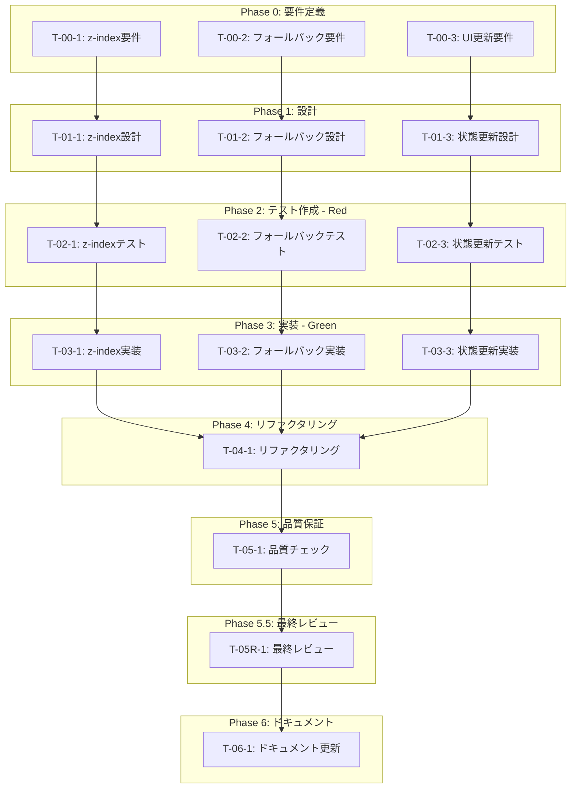

# 認証UI改善 - タスク実行仕様書

## ユーザーからの元の指示

```
- ホバーしたりクリックしたりして表示されるものに関しては、一番レイヤーが表側に来るようにしてください。じゃないと表示が見えないです。表示が隠れてしまっています。
- 名前を変更して保存するとエラーが出ます。「Could not find the table 'public.user_profiles' in the schema cache」
- 連携サービスを解除しても表示が解除済みに変わらないです。データベースの方はどうなっているか確認してください。本当に解除されているのか、バックエンドとの連携もどうなっているか確認しておいてください。
```

## メタ情報

| 項目             | 内容                                       |
| ---------------- | ------------------------------------------ |
| タスクID         | AUTH-UI-001                                |
| タスク名         | 認証UI改善                                 |
| 分類             | バグ修正                                   |
| 対象機能         | AccountSection, profileHandlers, authSlice |
| 優先度           | 高                                         |
| 見積もり規模     | 中規模                                     |
| ステータス       | 完了                                       |
| 発見元           | ユーザーフィードバック                     |
| 発見日           | 2025-12-10                                 |
| 発見エージェント | ユーザー                                   |

---

## タスク概要

### 目的

認証UIの3つの問題（z-index、名前変更エラー、連携解除UI更新）を修正し、ユーザーが認証機能を正常に使用できるようにする。

### 背景

認証機能（login-only-auth）実装完了後、実際の動作確認で以下の問題が報告された：

1. ホバー/クリックで表示されるメニューが他の要素に隠れる
2. 名前変更時にSupabaseの`user_profiles`テーブル不在エラー
3. 連携サービス解除後にUIが更新されない

### 最終ゴール

1. ポップアップメニュー（アバター編集メニュー等）が常に最前面に表示される
2. 名前変更がエラーなく完了し、`user_metadata`へのフォールバックが正常動作する
3. 連携サービス解除後にUIが即座に更新される

### 成果物一覧

| 種別   | 成果物                    | 配置先                                                         |
| ------ | ------------------------- | -------------------------------------------------------------- |
| 機能   | 修正されたAccountSection  | apps/desktop/src/renderer/components/organisms/AccountSection/ |
| 機能   | 修正されたprofileHandlers | apps/desktop/src/main/ipc/profileHandlers.ts                   |
| 機能   | 修正されたauthSlice       | apps/desktop/src/renderer/store/slices/authSlice.ts            |
| テスト | 追加されたユニットテスト  | 各ファイルの.test.tsファイル                                   |
| 品質   | テスト実行レポート        | -                                                              |

---

## 参照ファイル

本仕様書のコマンド・エージェント・スキル選定は以下を参照：

- `docs/00-requirements/master_system_design.md` - システム要件
- `.claude/commands/ai/command_list.md` - /ai:コマンド定義
- `.claude/agents/agent_list.md` - エージェント定義
- `.claude/skills/skill_list.md` - スキル定義

---

## タスク分解サマリー

| ID      | フェーズ  | サブタスク名                         | 責務                                   | 依存    |
| ------- | --------- | ------------------------------------ | -------------------------------------- | ------- |
| T-00-1  | Phase 0   | z-index問題の要件定義                | z-index階層の要件を明確化              | なし    |
| T-00-2  | Phase 0   | 名前変更エラーの要件定義             | フォールバック処理の要件を明確化       | なし    |
| T-00-3  | Phase 0   | 連携解除UI更新の要件定義             | 状態更新フローの要件を明確化           | なし    |
| T-01-1  | Phase 1   | z-index階層の設計                    | アプリ全体のz-index階層を定義          | T-00-1  |
| T-01-2  | Phase 1   | フォールバック処理の設計             | エラー検出条件を設計                   | T-00-2  |
| T-01-3  | Phase 1   | 状態更新フローの設計                 | IPC→Store→UI更新フローを設計           | T-00-3  |
| T-02-1  | Phase 2   | z-index問題のテスト作成              | ポップアップ表示のテストを作成         | T-01-1  |
| T-02-2  | Phase 2   | フォールバック処理のテスト作成       | user_metadataフォールバックのテスト    | T-01-2  |
| T-02-3  | Phase 2   | 連携解除後状態更新のテスト作成       | fetchLinkedProviders呼び出しのテスト   | T-01-3  |
| T-03-1  | Phase 3   | z-index修正の実装                    | z-[9999]に変更                         | T-02-1  |
| T-03-2  | Phase 3   | フォールバック処理の実装             | エラー検出条件の追加                   | T-02-2  |
| T-03-3  | Phase 3   | 状態更新フローの実装                 | onAuthStateChangedでの再取得追加       | T-02-3  |
| T-04-1  | Phase 4   | コードリファクタリング               | 重複排除、可読性向上                   | T-03-\* |
| T-05-1  | Phase 5   | 品質保証（テスト・Lint・型チェック） | 全テスト成功、Lint/型エラーなし        | T-04-1  |
| T-05R-1 | Phase 5.5 | 最終レビューゲート                   | コード品質・セキュリティ確認           | T-05-1  |
| T-06-1  | Phase 6   | ドキュメント更新                     | 必要に応じてdocs/00-requirementsを更新 | T-05R-1 |

**総サブタスク数**: 16個

---

## 実行フロー図



---

## Phase 0: 要件定義

### T-00-1: z-index問題の要件定義

#### 目的

ポップアップメニュー・ツールチップが他の要素に隠れないよう、z-index階層の要件を明確化する。

#### 背景

現状のアバター編集メニューは`z-50`、確認ダイアログは`z-[100]`だが、他の要素との競合により表示が隠れている。

#### 責務（単一責務）

z-index階層の要件を文書化する。

#### 成果物

| 成果物           | パス       | 内容                  |
| ---------------- | ---------- | --------------------- |
| 要件ドキュメント | 本仕様書内 | z-index階層の要件定義 |

#### 完了条件

- [ ] z-index階層ルールが明確に定義されている
- [ ] 対象コンポーネントが特定されている

---

### T-00-2: 名前変更エラーの要件定義

#### 目的

`user_profiles`テーブル不在時のフォールバック処理要件を明確化する。

#### 背景

Supabaseに`user_profiles`テーブルが存在しないため、「Could not find the table 'public.user_profiles' in the schema cache」エラーが発生する。`user_metadata`へのフォールバック処理が必要。

#### 責務（単一責務）

フォールバック処理の要件を文書化する。

#### 成果物

| 成果物           | パス       | 内容                         |
| ---------------- | ---------- | ---------------------------- |
| 要件ドキュメント | 本仕様書内 | フォールバック処理の要件定義 |

#### 完了条件

- [ ] 検出すべきエラーパターンが列挙されている
- [ ] フォールバック先（user_metadata）が明確に定義されている

---

### T-00-3: 連携解除UI更新の要件定義

#### 目的

連携サービス解除後のUI即時更新要件を明確化する。

#### 背景

連携解除のバックエンド処理は成功しているが、UIが更新されない。`AUTH_STATE_CHANGED`イベント受信時に`fetchLinkedProviders`が呼ばれていない可能性がある。

#### 責務（単一責務）

状態更新フローの要件を文書化する。

#### 成果物

| 成果物           | パス       | 内容                     |
| ---------------- | ---------- | ------------------------ |
| 要件ドキュメント | 本仕様書内 | 状態更新フローの要件定義 |

#### 完了条件

- [ ] 状態更新のトリガーポイントが特定されている
- [ ] 更新が必要な状態が列挙されている

---

## Phase 1: 設計

### T-01-1: z-index階層の設計

#### 目的

アプリ全体で一貫したz-index階層を設計する。

#### 責務（単一責務）

z-index値の階層構造を設計する。

#### Claude Code スラッシュコマンド

> ⚠️ 以下はターミナルコマンドではなく、Claude Code内で実行するスラッシュコマンドです

```
/ai:design-architecture
```

- **参照**: `.claude/commands/ai/command_list.md`

#### 使用エージェント

- **エージェント**: .claude/agents/ui-designer.md
- **選定理由**: UIコンポーネントのレイヤリング設計に専門性を持つ
- **参照**: `.claude/agents/agent_list.md`

#### 設計内容

```
z-index階層定義:
├─ z-0       : 通常のコンテンツ
├─ z-10      : 浮遊要素（カード等）
├─ z-50      : ドロップダウン・ポップオーバー（既存設定だが不十分）
├─ z-[100]   : ダイアログ・モーダル（既存設定）
├─ z-[9999]  : ポップアップメニュー・ツールチップ（新設定）
└─ z-[10000] : 緊急通知・トースト
```

#### 成果物

| 成果物           | パス       | 内容            |
| ---------------- | ---------- | --------------- |
| 設計ドキュメント | 本仕様書内 | z-index階層設計 |

#### 完了条件

- [ ] z-index値の階層が定義されている
- [ ] 変更対象コンポーネントと変更値が明確である

---

### T-01-2: フォールバック処理の設計

#### 目的

エラー検出条件とフォールバック処理のフローを設計する。

#### 責務（単一責務）

profileHandlersのエラーハンドリングロジックを設計する。

#### Claude Code スラッシュコマンド

```
/ai:debug-error "Could not find the table 'public.user_profiles' in the schema cache"
```

- **参照**: `.claude/commands/ai/command_list.md`

#### 使用エージェント

- **エージェント**: .claude/agents/gateway-dev.md
- **選定理由**: 外部サービス（Supabase）との連携とエラーハンドリングに専門性を持つ
- **参照**: `.claude/agents/agent_list.md`

#### 設計内容

```typescript
// エラー検出条件（追加すべき条件）
const shouldFallbackToUserMetadata = (error: PostgrestError): boolean => {
  return (
    error.message.includes("schema cache") ||
    error.message.includes("does not exist") ||
    error.message.includes("user_profiles") || // 追加
    error.message.includes("relation") || // 追加
    error.code === "PGRST200" ||
    error.code === "PGRST116" || // 追加
    error.code === "42P01"
  );
};
```

#### 成果物

| 成果物           | パス       | 内容                   |
| ---------------- | ---------- | ---------------------- |
| 設計ドキュメント | 本仕様書内 | フォールバック処理設計 |

#### 完了条件

- [ ] エラー検出条件が網羅的に定義されている
- [ ] フォールバック処理フローが明確である

---

### T-01-3: 状態更新フローの設計

#### 目的

連携解除後の状態更新フローを設計する。

#### 責務（単一責務）

authSliceの状態更新ロジックを設計する。

#### Claude Code スラッシュコマンド

```
/ai:design-architecture
```

- **参照**: `.claude/commands/ai/command_list.md`

#### 使用エージェント

- **エージェント**: .claude/agents/state-manager.md
- **選定理由**: クライアント状態管理に専門性を持つ
- **参照**: `.claude/agents/agent_list.md`

#### 設計内容

```typescript
// onAuthStateChangedリスナー内での修正
} else if (state.user) {
  // ... 既存処理 ...

  // Refresh profile and linked providers after auth state change
  // (連携解除時などにUIを即座に更新するため)
  get().fetchProfile();
  get().fetchLinkedProviders();  // 追加
}
```

#### 成果物

| 成果物           | パス       | 内容               |
| ---------------- | ---------- | ------------------ |
| 設計ドキュメント | 本仕様書内 | 状態更新フロー設計 |

#### 完了条件

- [ ] 状態更新トリガーが特定されている
- [ ] 追加すべきコードが明確である

---

## Phase 2: テスト作成 (TDD: Red)

### T-02-1: z-index問題のテスト作成

#### 目的

アバター編集メニューのz-index値が正しく設定されていることを検証するテストを作成する。

#### 責務（単一責務）

AccountSectionコンポーネントのz-indexテストを作成する。

#### Claude Code スラッシュコマンド

```
/ai:generate-unit-tests apps/desktop/src/renderer/components/organisms/AccountSection/index.tsx
```

- **参照**: `.claude/commands/ai/command_list.md`

#### 使用エージェント

- **エージェント**: .claude/agents/unit-tester.md
- **選定理由**: TDDに基づくテスト作成に専門性を持つ
- **参照**: `.claude/agents/agent_list.md`

#### 活用スキル

| スキル名       | 活用方法                                     |
| -------------- | -------------------------------------------- |
| .claude/skills/tdd-principles/SKILL.md | Red-Green-Refactorサイクルに従ったテスト作成 |

#### テストケース

```typescript
describe("AccountSection - Avatar Menu", () => {
  it("should render avatar menu with z-[9999] when open", async () => {
    // Arrange
    // ... setup authenticated state with avatar menu open

    // Act
    render(<AccountSection />);
    const avatarButton = screen.getByLabelText("アバターを編集");
    await userEvent.click(avatarButton);

    // Assert
    const avatarMenu = screen.getByRole("menu");
    expect(avatarMenu).toHaveClass("z-[9999]");
  });
});
```

#### TDD検証: Red状態確認

```bash
pnpm --filter @repo/desktop test:run src/renderer/components/organisms/AccountSection
```

- [ ] テストが失敗することを確認（Red状態）

#### 成果物

| 成果物         | パス                                                                         | 内容          |
| -------------- | ---------------------------------------------------------------------------- | ------------- |
| テストファイル | apps/desktop/src/renderer/components/organisms/AccountSection/index.test.tsx | z-indexテスト |

#### 完了条件

- [ ] テストが失敗する（Red状態）
- [ ] テストケースが要件を網羅している

---

### T-02-2: フォールバック処理のテスト作成

#### 目的

user_profilesテーブル不在時のフォールバック処理を検証するテストを作成する。

#### 責務（単一責務）

profileHandlersのフォールバックテストを作成する。

#### Claude Code スラッシュコマンド

```
/ai:generate-unit-tests apps/desktop/src/main/ipc/profileHandlers.ts
```

- **参照**: `.claude/commands/ai/command_list.md`

#### 使用エージェント

- **エージェント**: .claude/agents/unit-tester.md
- **選定理由**: TDDに基づくテスト作成に専門性を持つ
- **参照**: `.claude/agents/agent_list.md`

#### テストケース

```typescript
describe("profileHandlers - fallback to user_metadata", () => {
  it("should fallback to user_metadata when user_profiles error contains 'user_profiles'", async () => {
    // Arrange
    const error = {
      message: "Could not find the table 'public.user_profiles'",
      code: "PGRST200",
    };
    mockSupabase.from.mockReturnValue({
      select: vi.fn().mockReturnThis(),
      eq: vi.fn().mockReturnThis(),
      single: vi.fn().mockResolvedValue({ data: null, error }),
    });

    // Act
    const result = await profileGetHandler();

    // Assert
    expect(result.success).toBe(true);
    expect(result.data?.displayName).toBeDefined();
  });

  it("should fallback when error code is PGRST116", async () => {
    // ...
  });
});
```

#### TDD検証: Red状態確認

```bash
pnpm --filter @repo/desktop test:run src/main/ipc/profileHandlers.test.ts
```

- [ ] テストが失敗することを確認（Red状態）

#### 成果物

| 成果物         | パス                                              | 内容                 |
| -------------- | ------------------------------------------------- | -------------------- |
| テストファイル | apps/desktop/src/main/ipc/profileHandlers.test.ts | フォールバックテスト |

#### 完了条件

- [ ] テストが失敗する（Red状態）
- [ ] 追加のエラーパターンがテストされている

---

### T-02-3: 連携解除後状態更新のテスト作成

#### 目的

連携解除後にfetchLinkedProvidersが呼び出されることを検証するテストを作成する。

#### 責務（単一責務）

authSliceの状態更新テストを作成する。

#### Claude Code スラッシュコマンド

```
/ai:generate-unit-tests apps/desktop/src/renderer/store/slices/authSlice.ts
```

- **参照**: `.claude/commands/ai/command_list.md`

#### 使用エージェント

- **エージェント**: .claude/agents/unit-tester.md
- **選定理由**: TDDに基づくテスト作成に専門性を持つ
- **参照**: `.claude/agents/agent_list.md`

#### テストケース

```typescript
describe("authSlice - onAuthStateChanged", () => {
  it("should call fetchLinkedProviders when auth state changes with user", async () => {
    // Arrange
    const fetchLinkedProvidersSpy = vi.spyOn(
      store.getState(),
      "fetchLinkedProviders",
    );

    // Act
    // Simulate AUTH_STATE_CHANGED event with user data
    mockAuthStateChanged({ authenticated: true, user: mockUser });

    // Assert
    expect(fetchLinkedProvidersSpy).toHaveBeenCalled();
  });
});
```

#### TDD検証: Red状態確認

```bash
pnpm --filter @repo/desktop test:run src/renderer/store/slices/authSlice.test.ts
```

- [ ] テストが失敗することを確認（Red状態）

#### 成果物

| 成果物         | パス                                                     | 内容           |
| -------------- | -------------------------------------------------------- | -------------- |
| テストファイル | apps/desktop/src/renderer/store/slices/authSlice.test.ts | 状態更新テスト |

#### 完了条件

- [ ] テストが失敗する（Red状態）
- [ ] fetchLinkedProvidersの呼び出しが検証されている

---

## Phase 3: 実装 (TDD: Green)

### T-03-1: z-index修正の実装

#### 目的

アバター編集メニューのz-indexを`z-[9999]`に変更する。

#### 責務（単一責務）

AccountSection/index.tsxのz-index値を修正する。

#### Claude Code スラッシュコマンド

```
/ai:refactor apps/desktop/src/renderer/components/organisms/AccountSection/index.tsx
```

- **参照**: `.claude/commands/ai/command_list.md`

#### 使用エージェント

- **エージェント**: .claude/agents/ui-designer.md
- **選定理由**: UIコンポーネントの実装に専門性を持つ
- **参照**: `.claude/agents/agent_list.md`

#### 実装内容

**変更箇所**: `apps/desktop/src/renderer/components/organisms/AccountSection/index.tsx:384`

```diff
- className="absolute top-full left-0 mt-2 w-48 bg-[#1a1a1a] border border-white/10 rounded-lg shadow-lg z-50"
+ className="absolute top-full left-0 mt-2 w-48 bg-[#1a1a1a] border border-white/10 rounded-lg shadow-lg z-[9999]"
```

#### TDD検証: Green状態確認

```bash
pnpm --filter @repo/desktop test:run src/renderer/components/organisms/AccountSection
```

- [ ] テストが成功することを確認（Green状態）

#### 成果物

| 成果物       | パス                                                                    | 内容        |
| ------------ | ----------------------------------------------------------------------- | ----------- |
| 修正ファイル | apps/desktop/src/renderer/components/organisms/AccountSection/index.tsx | z-index修正 |

#### 完了条件

- [ ] テストが成功する（Green状態）
- [ ] z-indexが`z-[9999]`に変更されている

---

### T-03-2: フォールバック処理の実装

#### 目的

profileHandlersのエラー検出条件を追加する。

#### 責務（単一責務）

profileHandlers.tsのエラー検出ロジックを修正する。

#### Claude Code スラッシュコマンド

```
/ai:refactor apps/desktop/src/main/ipc/profileHandlers.ts
```

- **参照**: `.claude/commands/ai/command_list.md`

#### 使用エージェント

- **エージェント**: .claude/agents/gateway-dev.md
- **選定理由**: 外部サービス連携とエラーハンドリングに専門性を持つ
- **参照**: `.claude/agents/agent_list.md`

#### 実装内容

**変更箇所1**: `apps/desktop/src/main/ipc/profileHandlers.ts:108-120` (PROFILE_GET)

```diff
          if (error) {
            // user_profilesテーブルが存在しない場合はuser_metadataからフォールバック
+           // エラーコード: PGRST200 (テーブル不在), PGRST116 (行が見つからない), 42P01 (PostgreSQLのテーブル不存在エラー)
+           // または "schema cache", "does not exist", "user_profiles", "relation" を含むメッセージ
            if (
              error.message.includes("schema cache") ||
              error.message.includes("does not exist") ||
+             error.message.includes("user_profiles") ||
+             error.message.includes("relation") ||
              error.code === "PGRST200" ||
+             error.code === "PGRST116" ||
              error.code === "42P01"
            ) {
```

**変更箇所2**: `apps/desktop/src/main/ipc/profileHandlers.ts:253-265` (PROFILE_UPDATE) - 同様の修正

#### TDD検証: Green状態確認

```bash
pnpm --filter @repo/desktop test:run src/main/ipc/profileHandlers.test.ts
```

- [ ] テストが成功することを確認（Green状態）

#### 成果物

| 成果物       | パス                                         | 内容                   |
| ------------ | -------------------------------------------- | ---------------------- |
| 修正ファイル | apps/desktop/src/main/ipc/profileHandlers.ts | フォールバック条件追加 |

#### 完了条件

- [ ] テストが成功する（Green状態）
- [ ] 追加のエラーパターンが検出される

---

### T-03-3: 状態更新フローの実装

#### 目的

onAuthStateChangedリスナー内でfetchLinkedProvidersを呼び出す。

#### 責務（単一責務）

authSlice.tsの状態更新ロジックを修正する。

#### Claude Code スラッシュコマンド

```
/ai:refactor apps/desktop/src/renderer/store/slices/authSlice.ts
```

- **参照**: `.claude/commands/ai/command_list.md`

#### 使用エージェント

- **エージェント**: .claude/agents/state-manager.md
- **選定理由**: クライアント状態管理に専門性を持つ
- **参照**: `.claude/agents/agent_list.md`

#### 実装内容

**変更箇所**: `apps/desktop/src/renderer/store/slices/authSlice.ts:340-343`

```diff
              });
-             // Refresh profile after auth state change
+             // Refresh profile and linked providers after auth state change
+             // (連携解除時などにUIを即座に更新するため)
              get().fetchProfile();
+             get().fetchLinkedProviders();
            }
```

#### TDD検証: Green状態確認

```bash
pnpm --filter @repo/desktop test:run src/renderer/store/slices/authSlice.test.ts
```

- [ ] テストが成功することを確認（Green状態）

#### 成果物

| 成果物       | パス                                                | 内容                         |
| ------------ | --------------------------------------------------- | ---------------------------- |
| 修正ファイル | apps/desktop/src/renderer/store/slices/authSlice.ts | fetchLinkedProviders呼び出し |

#### 完了条件

- [ ] テストが成功する（Green状態）
- [ ] fetchLinkedProvidersがonAuthStateChanged内で呼び出される

---

## Phase 4: リファクタリング (TDD: Refactor)

### T-04-1: コードリファクタリング

#### 目的

実装したコードの品質を改善する（動作は変えない）。

#### 責務（単一責務）

コードの可読性と保守性を向上させる。

#### Claude Code スラッシュコマンド

```
/ai:refactor apps/desktop/src/main/ipc/profileHandlers.ts
```

- **参照**: `.claude/commands/ai/command_list.md`

#### 使用エージェント

- **エージェント**: .claude/agents/code-quality.md
- **選定理由**: コード品質管理に専門性を持つ
- **参照**: `.claude/agents/agent_list.md`

#### リファクタリング内容

1. **profileHandlers.ts**: エラー検出ロジックを共通関数に抽出

```typescript
/**
 * user_profilesテーブル不在エラーかどうかを判定
 */
function isUserProfilesTableError(error: PostgrestError): boolean {
  return (
    error.message.includes("schema cache") ||
    error.message.includes("does not exist") ||
    error.message.includes("user_profiles") ||
    error.message.includes("relation") ||
    error.code === "PGRST200" ||
    error.code === "PGRST116" ||
    error.code === "42P01"
  );
}
```

#### TDD検証: 継続Green確認

```bash
pnpm --filter @repo/desktop test:run
```

- [ ] リファクタリング後もテストが成功することを確認

#### 成果物

| 成果物       | パス                                         | 内容                 |
| ------------ | -------------------------------------------- | -------------------- |
| 修正ファイル | apps/desktop/src/main/ipc/profileHandlers.ts | リファクタリング済み |

#### 完了条件

- [ ] テストが継続して成功する
- [ ] コードの重複が排除されている

---

## Phase 5: 品質保証

### T-05-1: 品質保証（テスト・Lint・型チェック）

#### 目的

定義された品質基準をすべて満たすことを検証する。

#### 責務（単一責務）

全品質チェックを実行し、基準達成を確認する。

#### Claude Code スラッシュコマンド

```
/ai:run-all-tests --coverage
/ai:lint
```

- **参照**: `.claude/commands/ai/command_list.md`

#### 使用エージェント

- **エージェント**: .claude/agents/code-quality.md
- **選定理由**: 品質チェックの実行と評価に専門性を持つ
- **参照**: `.claude/agents/agent_list.md`

#### 実行コマンド

```bash
# テスト実行
pnpm --filter @repo/desktop test:run

# Lint
pnpm --filter @repo/desktop lint

# 型チェック
pnpm --filter @repo/desktop typecheck
```

#### 成果物

| 成果物         | パス | 内容         |
| -------------- | ---- | ------------ |
| テスト結果     | -    | 全テスト成功 |
| Lintレポート   | -    | エラー0件    |
| 型チェック結果 | -    | エラー0件    |

#### 完了条件

- [ ] 全テスト成功
- [ ] Lintエラーなし
- [ ] TypeScript型エラーなし

---

## 品質ゲートチェックリスト

### 機能検証

- [ ] 全ユニットテスト成功
- [ ] アバター編集メニューが最前面に表示される
- [ ] 名前変更がエラーなく完了する
- [ ] 連携解除後にUIが即座に更新される

### コード品質

- [ ] Lintエラーなし
- [ ] 型エラーなし
- [ ] コードフォーマット適用済み

### テスト網羅性

- [ ] 追加したテストがすべて通過

---

## Phase 5.5: 最終レビューゲート

### T-05R-1: 最終レビュー

#### 目的

実装完了後の全体的な品質・整合性を検証する。

#### レビュー参加エージェント

| エージェント  | レビュー観点       | 選定理由                               |
| ------------- | ------------------ | -------------------------------------- |
| .claude/agents/code-quality.md | コード品質         | コーディング規約、可読性、保守性       |
| .claude/agents/arch-police.md  | アーキテクチャ遵守 | レイヤー違反、依存関係                 |
| .claude/agents/unit-tester.md  | テスト品質         | テストカバレッジ、テストケースの適切性 |
| .claude/agents/sec-auditor.md  | セキュリティ       | 入力検証、エラーハンドリング           |

#### レビューチェックリスト

**コード品質** (.claude/agents/code-quality.md)

- [ ] コーディング規約への準拠
- [ ] 可読性・保守性の確保
- [ ] 適切なエラーハンドリング

**アーキテクチャ遵守** (.claude/agents/arch-police.md)

- [ ] レイヤー間の依存関係が適切か
- [ ] 既存設計との整合性

**テスト品質** (.claude/agents/unit-tester.md)

- [ ] テストケースが適切に設計されているか
- [ ] 境界値・異常系のテストがあるか

**セキュリティ** (.claude/agents/sec-auditor.md)

- [ ] 入力検証・サニタイズの実装
- [ ] エラーメッセージの適切性

#### レビュー結果

- **判定**: PASS / MINOR / MAJOR
- **指摘事項**: （レビュー後に記載）
- **対応方針**: （レビュー後に記載）

#### 完了条件

- [ ] 全レビュー観点でPASS または MINOR
- [ ] MINOR指摘がある場合は対応完了

---

## Phase 6: ドキュメント更新・未完了タスク記録

### T-06-1: システムドキュメント更新

#### 目的

必要に応じてdocs/00-requirements/配下のドキュメントを更新する。

#### 更新対象ドキュメント

- なし（本修正は既存機能のバグ修正であり、新しい機能追加ではないため）

#### Claude Code スラッシュコマンド

```
/ai:update-all-docs
```

- **参照**: `.claude/commands/ai/command_list.md`

#### 完了条件

- [ ] ドキュメント更新の必要性を評価済み
- [ ] 必要な場合は更新完了

---

## リスクと対策

| リスク               | 影響度 | 発生確率 | 対策                           | 対応サブタスク |
| -------------------- | ------ | -------- | ------------------------------ | -------------- |
| z-index競合          | 低     | 中       | グローバルなz-index階層を定義  | T-01-1         |
| フォールバック漏れ   | 中     | 中       | エラーパターンを網羅的にテスト | T-02-2         |
| 状態更新の無限ループ | 高     | 低       | 更新条件を慎重に設計           | T-01-3         |

---

## 前提条件

- Supabaseプロジェクトが設定済み
- 開発環境が構築済み
- pnpmがインストール済み

---

## 備考

### 技術的制約

- Supabaseに`user_profiles`テーブルが存在しない
- 認証にはSupabase Authを使用（`user_metadata`が利用可能）

### 参考資料

- `docs/30-workflows/login-only-auth/` - 認証機能の設計ドキュメント
- Supabase Auth API ドキュメント
