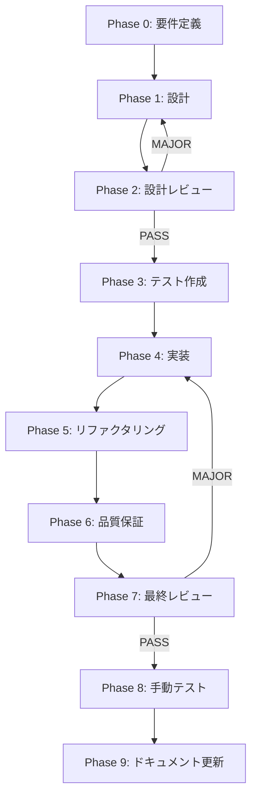

# タイトル動的表示機能 - タスク実行仕様書

## ユーザーからの元の指示

```
タイトルが長い部分になると保存ボタンが表示されなくなってしまうという問題が発生しているので、
スクロールしたら見えるのですが、この文字数は何文字以内かとか、画面の大きさに合わせて文字数を表示するもの、
あとは非表示とするようにしておいてください。これは画面のサイズに合わせて設定できるように、動的になるようにしてほしいです。
ただし、ファイル名は見えるようにしておかないといけないので、マウスをホバーするとタイトルやファイル名が全文見えるようにしてください。
改行などを含めて、2行や3行にわたってもいいので見えるように何かしら表現をするようにしておいてください。
```

## メタ情報

| 項目             | 内容                           |
| ---------------- | ------------------------------ |
| タスクID         | TASK-DYNAMIC-TITLE-DISPLAY-001 |
| タスク名         | タイトル動的表示機能           |
| 分類             | バグ修正 / 改善                |
| 対象機能         | エディター / ヘッダー          |
| 優先度           | 中                             |
| 見積もり規模     | 中規模                         |
| ステータス       | 未実施                         |
| 発見元           | ユーザー要望                   |
| 発見日           | 2025-12-12                     |
| 発見エージェント | .claude/agents/product-manager.md               |

---

## タスク概要

### 目的

エディターのタイトル表示を画面サイズに応じて動的に調整し、以下を実現する:

1. 長いタイトルを画面幅に応じて省略表示
2. ホバー時に全文をツールチップまたは展開表示
3. 保存ボタン等の重要UIが常に見える状態を維持
4. ファイル名は常に視認可能に保つ

### 背景

現在、タイトルが長い場合に保存ボタンが画面外に押し出されてしまい、ユーザーがスクロールしないとアクセスできない問題がある。これはUX上の重大な問題であり、即座に修正が必要。

**現状分析**:

- エディターヘッダーにタイトルとアクションボタンが配置
- 長いタイトルがオーバーフローしている
- ボタン類が画面外に押し出される
- レスポンシブ対応が不十分

### 最終ゴール

- タイトルが画面幅に応じて自動的に省略される
- 省略時は「...」で省略を示す
- ホバーでツールチップまたは展開して全文表示
- 保存ボタン等のアクションボタンは常に表示される
- ファイル名部分は優先的に表示される
- レスポンシブに対応（様々な画面サイズで適切に動作）

### 成果物一覧

| 種別           | 成果物                | 配置先                                                                 |
| -------------- | --------------------- | ---------------------------------------------------------------------- |
| コンポーネント | TruncatedTitle追加    | `apps/desktop/src/renderer/components/atoms/TruncatedTitle/`           |
| コンポーネント | EditorHeader更新      | `apps/desktop/src/renderer/components/organisms/EditorHeader/`         |
| フック         | useResizeObserver追加 | `apps/desktop/src/renderer/hooks/useResizeObserver.ts`                 |
| テスト         | タイトル表示テスト    | `apps/desktop/src/renderer/components/atoms/TruncatedTitle/*.test.tsx` |
| ドキュメント   | 機能ドキュメント      | `docs/30-workflows/dynamic-title-display/`                             |

---

## 参照ファイル

本仕様書のコマンド・エージェント・スキル選定は以下を参照：

- `docs/00-requirements/master_system_design.md` - システム要件
- `.claude/commands/ai/command_list.md` - /ai:コマンド定義
- `.claude/agents/agent_list.md` - エージェント定義
- `.claude/skills/skill_list.md` - スキル定義

---

## タスク分解サマリー

| ID     | フェーズ         | サブタスク名                     | 責務                       | 依存   |
| ------ | ---------------- | -------------------------------- | -------------------------- | ------ |
| T-00-1 | 要件定義         | タイトル表示要件定義             | UI/UX要件の明確化          | なし   |
| T-00-2 | 要件定義         | レスポンシブ要件定義             | 各画面サイズでの動作定義   | T-00-1 |
| T-01-1 | 設計             | TruncatedTitleコンポーネント設計 | 省略表示コンポーネント設計 | T-00-2 |
| T-01-2 | 設計             | ツールチップ/展開表示設計        | ホバー時の全文表示設計     | T-01-1 |
| T-01-3 | 設計             | EditorHeaderレイアウト設計       | フレックスレイアウト設計   | T-01-2 |
| T-02-1 | 設計レビュー     | 設計レビューゲート               | 設計の妥当性検証           | T-01-3 |
| T-03-1 | テスト作成       | 省略表示テスト                   | 文字数制限・省略動作検証   | T-02-1 |
| T-03-2 | テスト作成       | ホバー表示テスト                 | ツールチップ/展開表示検証  | T-02-1 |
| T-03-3 | テスト作成       | レスポンシブテスト               | 各画面サイズでの動作検証   | T-02-1 |
| T-04-1 | 実装             | useResizeObserver実装            | リサイズ検知フック         | T-03-1 |
| T-04-2 | 実装             | TruncatedTitle実装               | 省略表示コンポーネント     | T-04-1 |
| T-04-3 | 実装             | ツールチップ実装                 | ホバー時全文表示           | T-04-2 |
| T-04-4 | 実装             | EditorHeader更新                 | レイアウト修正             | T-04-3 |
| T-05-1 | リファクタリング | CSSの整理                        | スタイルの最適化           | T-04-4 |
| T-06-1 | 品質保証         | 自動テスト実行                   | テスト成功確認             | T-05-1 |
| T-06-2 | 品質保証         | Lint・型チェック                 | コード品質確認             | T-06-1 |
| T-07-1 | 最終レビュー     | 最終レビューゲート               | 全体品質検証               | T-06-2 |
| T-08-1 | 手動テスト       | 手動テスト検証                   | 実際のUI確認               | T-07-1 |
| T-09-1 | ドキュメント     | ドキュメント更新                 | 仕様書更新                 | T-08-1 |

**総サブタスク数**: 19個

---

## 実行フロー図



---

## Phase 0: 要件定義

### T-00-1: タイトル表示要件定義

#### 目的

タイトルの省略表示、全文表示の要件を明確化する。

#### 背景

ユーザーが長いファイル名を付けた場合でも、重要なUIが隠れないようにする必要がある。

#### 責務（単一責務）

タイトル表示の要件定義のみを担当。

#### Claude Code スラッシュコマンド

```
/ai:gather-requirements dynamic-title-display
```

#### 使用エージェント

- **エージェント**: .claude/agents/req-analyst.md, .claude/agents/ui-designer.md
- **選定理由**: UX観点での要件分析が必要

#### 活用スキル

| スキル名             | 活用方法               |
| -------------------- | ---------------------- |
| .claude/skills/accessibility-wcag/SKILL.md   | アクセシビリティ要件   |
| .claude/skills/apple-hig-guidelines/SKILL.md | デスクトップUIパターン |

#### 成果物

| 成果物     | パス                                                      | 内容         |
| ---------- | --------------------------------------------------------- | ------------ |
| 要件定義書 | `docs/30-workflows/dynamic-title-display/requirements.md` | 表示要件文書 |

#### 完了条件

- [ ] 省略表示のトリガー条件が定義されている
- [ ] 全文表示の方法が定義されている
- [ ] ファイル名の優先表示ルールが定義されている

---

### T-00-2: レスポンシブ要件定義

#### 目的

各画面サイズでの表示動作を定義する。

#### 責務（単一責務）

レスポンシブ対応の要件定義のみを担当。

#### 成果物

| 成果物           | パス                                                                 | 内容             |
| ---------------- | -------------------------------------------------------------------- | ---------------- |
| レスポンシブ設計 | `docs/30-workflows/dynamic-title-display/responsive-requirements.md` | 画面サイズ別要件 |

#### 完了条件

- [ ] 各ブレークポイントでの動作が定義されている
- [ ] 最小表示幅が定義されている
- [ ] アクションボタンの最低表示幅が確保されている

---

## Phase 1: 設計

### T-01-1: TruncatedTitleコンポーネント設計

#### 目的

テキストを動的に省略表示するコンポーネントを設計する。

#### 責務（単一責務）

TruncatedTitleコンポーネントの設計のみを担当。

#### Claude Code スラッシュコマンド

```
/ai:create-component TruncatedTitle atom
```

#### 使用エージェント

- **エージェント**: .claude/agents/ui-designer.md
- **選定理由**: UIコンポーネント設計の専門性

#### 活用スキル

| スキル名                       | 活用方法           |
| ------------------------------ | ------------------ |
| .claude/skills/component-composition-patterns/SKILL.md | コンポーネント設計 |
| .claude/skills/type-safety-patterns/SKILL.md           | Props型定義        |

#### 成果物

| 成果物             | パス                                                                | 内容                   |
| ------------------ | ------------------------------------------------------------------- | ---------------------- |
| コンポーネント設計 | `docs/30-workflows/dynamic-title-display/truncated-title-design.md` | コンポーネント設計文書 |

#### 完了条件

- [ ] Props定義が設計されている
- [ ] 省略ロジックが設計されている
- [ ] CSSアプローチが決定されている

---

### T-01-2: ツールチップ/展開表示設計

#### 目的

ホバー時の全文表示UIを設計する。

#### 責務（単一責務）

ホバー表示の設計のみを担当。

#### 成果物

| 成果物           | パス                                                        | 内容           |
| ---------------- | ----------------------------------------------------------- | -------------- |
| ツールチップ設計 | `docs/30-workflows/dynamic-title-display/tooltip-design.md` | ホバー表示設計 |

#### 完了条件

- [ ] ツールチップのスタイルが設計されている
- [ ] 展開表示（2-3行）のレイアウトが設計されている
- [ ] 表示タイミング（delay）が決定されている

---

### T-01-3: EditorHeaderレイアウト設計

#### 目的

タイトルとアクションボタンのレイアウトを設計する。

#### 責務（単一責務）

EditorHeaderのレイアウト設計のみを担当。

#### 成果物

| 成果物         | パス                                                                     | 内容               |
| -------------- | ------------------------------------------------------------------------ | ------------------ |
| レイアウト設計 | `docs/30-workflows/dynamic-title-display/editor-header-layout-design.md` | レイアウト設計文書 |

#### 完了条件

- [ ] Flexboxレイアウト設計が完了している
- [ ] タイトル領域の最大幅計算が設計されている
- [ ] アクションボタン領域の固定幅が決定されている

---

## Phase 3: テスト作成 (TDD: Red)

### T-03-1: 省略表示テスト

#### 目的

文字数制限と省略動作のテストを先に作成する。

#### Claude Code スラッシュコマンド

```
/ai:generate-unit-tests apps/desktop/src/renderer/components/atoms/TruncatedTitle
```

#### 使用エージェント

- **エージェント**: .claude/agents/unit-tester.md

#### 成果物

| 成果物         | パス                                                                                | 内容           |
| -------------- | ----------------------------------------------------------------------------------- | -------------- |
| テストファイル | `apps/desktop/src/renderer/components/atoms/TruncatedTitle/TruncatedTitle.test.tsx` | 省略表示テスト |

#### 完了条件

- [ ] 短いテキストがそのまま表示されるテスト
- [ ] 長いテキストが省略されるテスト
- [ ] 省略時に「...」が表示されるテスト

---

### T-03-2: ホバー表示テスト

#### 目的

ツールチップ/展開表示のテストを先に作成する。

#### 成果物

| 成果物         | パス                                                                         | 内容         |
| -------------- | ---------------------------------------------------------------------------- | ------------ |
| テストファイル | `apps/desktop/src/renderer/components/atoms/TruncatedTitle/Tooltip.test.tsx` | ホバーテスト |

#### 完了条件

- [ ] ホバー時にツールチップが表示されるテスト
- [ ] マウスアウトでツールチップが非表示になるテスト
- [ ] 全文が表示されるテスト

---

### T-03-3: レスポンシブテスト

#### 目的

各画面サイズでの動作テストを先に作成する。

#### 成果物

| 成果物         | パス                                                                            | 内容               |
| -------------- | ------------------------------------------------------------------------------- | ------------------ |
| テストファイル | `apps/desktop/src/renderer/components/atoms/TruncatedTitle/Responsive.test.tsx` | レスポンシブテスト |

#### 完了条件

- [ ] 幅変更時に省略が調整されるテスト
- [ ] 最小幅でファイル名が見えるテスト
- [ ] アクションボタンが常に表示されるテスト

---

## Phase 4: 実装 (TDD: Green)

### T-04-1 〜 T-04-4: 実装サブタスク

（設計に基づき順次実装）

---

## Phase 8: 手動テスト検証

### 手動テストケース

| No  | カテゴリ     | テスト項目             | 前提条件            | 操作手順                | 期待結果                       |
| --- | ------------ | ---------------------- | ------------------- | ----------------------- | ------------------------------ |
| 1   | 省略表示     | 短いタイトル           | ファイルを開く      | 短いファイル名を確認    | 全文が表示される               |
| 2   | 省略表示     | 長いタイトル           | ファイルを開く      | 長いファイル名を確認    | 省略されて「...」が表示        |
| 3   | ホバー表示   | ツールチップ           | 長いタイトル表示中  | タイトルにホバー        | 全文がツールチップで表示       |
| 4   | ホバー表示   | 展開表示               | 長いタイトル表示中  | タイトルにホバー        | 2-3行に展開して全文表示        |
| 5   | レスポンシブ | 幅を狭める             | ファイルを開く      | ウィンドウ幅を狭める    | タイトルが適切に省略される     |
| 6   | レスポンシブ | 幅を広げる             | 省略表示中          | ウィンドウ幅を広げる    | より多くのテキストが表示される |
| 7   | ボタン表示   | 保存ボタン常時表示     | ファイル編集中      | 長いタイトルを確認      | 保存ボタンが画面内に表示される |
| 8   | ボタン表示   | アクションボタン全表示 | ファイルを開く      | 長いタイトルを確認      | 全アクションボタンが表示される |
| 9   | ファイル名   | ファイル名優先         | 長いパス+ファイル名 | タイトルを確認          | ファイル名が常に見える         |
| 10  | アクセス     | キーボード             | タイトル表示中      | Tabキーでフォーカス移動 | ツールチップにアクセス可能     |

---

## リスクと対策

| リスク               | 影響度 | 発生確率 | 対策                         |
| -------------------- | ------ | -------- | ---------------------------- |
| ResizeObserver非対応 | 中     | 低       | ポリフィル使用または代替手法 |
| ツールチップ位置ずれ | 中     | 中       | 位置計算ロジックの適切な実装 |
| パフォーマンス低下   | 中     | 低       | debounce/throttle適用        |
| アクセシビリティ不足 | 中     | 中       | ARIA属性の適切な設定         |

---

## 前提条件

- EditorHeaderコンポーネントが存在
- Tailwind CSSが設定済み
- Kanagawa Dragonテーマが適用済み

---

## 備考

### 技術的制約

- CSSの`text-overflow: ellipsis`を活用
- ResizeObserver APIで幅を監視
- ツールチップはCSS変数でテーマ対応
- フレックスボックスでレイアウト制御

### 参考資料

- [MDN: text-overflow](https://developer.mozilla.org/en-US/docs/Web/CSS/text-overflow)
- [MDN: ResizeObserver](https://developer.mozilla.org/en-US/docs/Web/API/ResizeObserver)
- [WCAG: Text Alternatives](https://www.w3.org/WAI/WCAG21/Understanding/text-alternatives)
