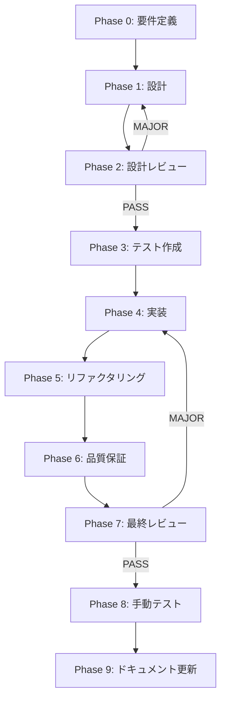

# ワークスペースツリー拡張・トグル機能 - タスク実行仕様書

## ユーザーからの元の指示

```
ワークスペースのファイルがワークスペースのディレクトリーツリーのファイルを見れるように広げたり、
ワークスペースのディレクトリのワークツリーの部分を広げたり狭くしたりできるようにしてほしいです。
また、トグルで隠したりもできるようにしたいです。
```

## メタ情報

| 項目             | 内容                                 |
| ---------------- | ------------------------------------ |
| タスクID         | TASK-WORKSPACE-TREE-TOGGLE-001       |
| タスク名         | ワークスペースツリー拡張・トグル機能 |
| 分類             | 機能追加                             |
| 対象機能         | WorkspaceSidebar                     |
| 優先度           | 中                                   |
| 見積もり規模     | 中規模                               |
| ステータス       | 未着手                               |
| 発見元           | ユーザー要望                         |
| 発見日           | 2025-12-12                           |
| 発見エージェント | .claude/agents/product-manager.md                     |

---

## タスク概要

### 目的

ワークスペースサイドバーのディレクトリツリーに以下の機能を追加する:

1. フォルダの展開・折りたたみ機能
2. ツリー全体の幅を調整できるリサイズ機能
3. サイドバー全体の表示・非表示トグル機能

### 背景

現在のワークスペースサイドバーでは、ディレクトリ構造の表示が固定されており、深い階層のファイルを確認しづらい。また、エディター領域を広く使いたい場合にサイドバーを隠す手段がない。

**現状分析**:

- `WorkspaceSidebar`コンポーネントが存在
- `FileTree`コンポーネントでツリー表示
- フォルダの展開状態管理は部分的に実装
- サイドバーの表示・非表示トグルは未実装
- リサイズ機能は未実装

### 最終ゴール

- フォルダをクリックして展開・折りたたみができる
- サイドバーの幅をドラッグで調整できる
- キーボードショートカットまたはボタンでサイドバーを隠せる
- 展開状態とサイドバー幅が永続化される

### 成果物一覧

| 種別           | 成果物             | 配置先                                                                       |
| -------------- | ------------------ | ---------------------------------------------------------------------------- |
| コンポーネント | FileTree更新       | `apps/desktop/src/renderer/components/organisms/WorkspaceSidebar/`           |
| コンポーネント | ResizeHandle追加   | `apps/desktop/src/renderer/components/atoms/ResizeHandle/`                   |
| 状態管理       | workspaceSlice更新 | `apps/desktop/src/renderer/store/slices/workspaceSlice.ts`                   |
| 状態管理       | uiSlice更新        | `apps/desktop/src/renderer/store/slices/uiSlice.ts`                          |
| テスト         | ツリートグルテスト | `apps/desktop/src/renderer/components/organisms/WorkspaceSidebar/*.test.tsx` |
| ドキュメント   | 機能ドキュメント   | `docs/30-workflows/workspace-tree-toggle/`                                   |

---

## 参照ファイル

本仕様書のコマンド・エージェント・スキル選定は以下を参照：

- `docs/00-requirements/master_system_design.md` - システム要件
- `.claude/commands/ai/command_list.md` - /ai:コマンド定義
- `.claude/agents/agent_list.md` - エージェント定義
- `.claude/skills/skill_list.md` - スキル定義

---

## タスク分解サマリー

| ID     | フェーズ         | サブタスク名         | 責務                           | 依存   |
| ------ | ---------------- | -------------------- | ------------------------------ | ------ |
| T-00-1 | 要件定義         | ツリー機能要件定義   | UI/UX要件の明確化              | なし   |
| T-01-1 | 設計             | 状態管理設計         | 展開状態・サイドバー状態の設計 | T-00-1 |
| T-01-2 | 設計             | UIコンポーネント設計 | FileTree/ResizeHandle設計      | T-01-1 |
| T-02-1 | 設計レビュー     | 設計レビューゲート   | 設計の妥当性検証               | T-01-2 |
| T-03-1 | テスト作成       | フォルダ展開テスト   | 展開・折りたたみ動作検証       | T-02-1 |
| T-03-2 | テスト作成       | リサイズテスト       | ドラッグリサイズ動作検証       | T-02-1 |
| T-03-3 | テスト作成       | トグルテスト         | 表示・非表示トグル検証         | T-02-1 |
| T-04-1 | 実装             | workspaceSlice更新   | 展開状態の状態管理             | T-03-1 |
| T-04-2 | 実装             | uiSlice更新          | サイドバー状態の状態管理       | T-04-1 |
| T-04-3 | 実装             | FileTree更新         | 展開・折りたたみUI実装         | T-04-2 |
| T-04-4 | 実装             | ResizeHandle実装     | ドラッグリサイズ実装           | T-04-3 |
| T-04-5 | 実装             | WorkspaceSidebar更新 | トグル機能統合                 | T-04-4 |
| T-05-1 | リファクタリング | アニメーション追加   | スムーズな展開・折りたたみ     | T-04-5 |
| T-06-1 | 品質保証         | 自動テスト実行       | テスト成功確認                 | T-05-1 |
| T-06-2 | 品質保証         | Lint・型チェック     | コード品質確認                 | T-06-1 |
| T-07-1 | 最終レビュー     | 最終レビューゲート   | 全体品質検証                   | T-06-2 |
| T-08-1 | 手動テスト       | 手動テスト検証       | 実際のUI確認                   | T-07-1 |
| T-09-1 | ドキュメント     | ドキュメント更新     | 仕様書更新                     | T-08-1 |

**総サブタスク数**: 18個

---

## 実行フロー図



---

## Phase 0: 要件定義

### T-00-1: ツリー機能要件定義

#### 目的

ワークスペースツリーの展開・折りたたみ、リサイズ、トグル機能の要件を明確化する。

#### 背景

ユーザーがファイル構造を効率的に閲覧・操作できるようにする。

#### 責務（単一責務）

機能要件定義のみを担当。

#### Claude Code スラッシュコマンド

```
/ai:gather-requirements workspace-tree-toggle
```

#### 使用エージェント

- **エージェント**: .claude/agents/req-analyst.md, .claude/agents/ui-designer.md
- **選定理由**: 要件定義にはUX観点の分析が重要

#### 活用スキル

| スキル名             | 活用方法                     |
| -------------------- | ---------------------------- |
| .claude/skills/accessibility-wcag/SKILL.md   | キーボードナビゲーション要件 |
| .claude/skills/apple-hig-guidelines/SKILL.md | デスクトップUI規約確認       |

#### 成果物

| 成果物     | パス                                                      | 内容         |
| ---------- | --------------------------------------------------------- | ------------ |
| 要件定義書 | `docs/30-workflows/workspace-tree-toggle/requirements.md` | 機能要件文書 |

#### 完了条件

- [ ] フォルダ展開・折りたたみの動作要件が定義されている
- [ ] リサイズの最小・最大幅が定義されている
- [ ] トグルのキーボードショートカットが定義されている
- [ ] 状態永続化要件が定義されている

---

## Phase 1: 設計

### T-01-1: 状態管理設計

#### 目的

展開状態、サイドバー幅、表示状態の状態管理を設計する。

#### 責務（単一責務）

状態管理の設計のみを担当。

#### Claude Code スラッシュコマンド

```
/ai:setup-state-management
```

#### 使用エージェント

- **エージェント**: .claude/agents/state-manager.md
- **選定理由**: Zustand状態管理の専門性

#### 活用スキル

| スキル名             | 活用方法         |
| -------------------- | ---------------- |
| .claude/skills/state-lifting/SKILL.md        | 状態管理設計     |
| .claude/skills/type-safety-patterns/SKILL.md | TypeScript型定義 |

#### 成果物

| 成果物         | パス                                                                 | 内容             |
| -------------- | -------------------------------------------------------------------- | ---------------- |
| 状態管理設計書 | `docs/30-workflows/workspace-tree-toggle/state-management-design.md` | 状態管理設計文書 |

#### 完了条件

- [ ] expandedFolders状態の型が設計されている
- [ ] sidebarWidth状態の型が設計されている
- [ ] isSidebarVisible状態の型が設計されている
- [ ] 永続化戦略が明確化されている

---

### T-01-2: UIコンポーネント設計

#### 目的

FileTree、ResizeHandle、トグルボタンのUIコンポーネントを設計する。

#### 責務（単一責務）

UIコンポーネントの設計のみを担当。

#### Claude Code スラッシュコマンド

```
/ai:create-component ResizeHandle atom
```

#### 使用エージェント

- **エージェント**: .claude/agents/ui-designer.md
- **選定理由**: UIコンポーネント設計の専門性

#### 活用スキル

| スキル名                       | 活用方法           |
| ------------------------------ | ------------------ |
| .claude/skills/component-composition-patterns/SKILL.md | コンポーネント設計 |
| .claude/skills/electron-ui-patterns/SKILL.md           | デスクトップUI設計 |

#### 成果物

| 成果物               | パス                                                             | 内容               |
| -------------------- | ---------------------------------------------------------------- | ------------------ |
| UIコンポーネント設計 | `docs/30-workflows/workspace-tree-toggle/ui-component-design.md` | コンポーネント設計 |

#### 完了条件

- [ ] FileTreeの展開・折りたたみUIが設計されている
- [ ] ResizeHandleのドラッグUIが設計されている
- [ ] トグルボタンの配置が設計されている

---

## Phase 3: テスト作成 (TDD: Red)

### T-03-1: フォルダ展開テスト

#### 目的

フォルダの展開・折りたたみ機能のテストを先に作成する。

#### Claude Code スラッシュコマンド

```
/ai:generate-unit-tests apps/desktop/src/renderer/components/organisms/WorkspaceSidebar
```

#### 使用エージェント

- **エージェント**: .claude/agents/unit-tester.md

#### 成果物

| 成果物         | パス                                                                                | 内容       |
| -------------- | ----------------------------------------------------------------------------------- | ---------- |
| テストファイル | `apps/desktop/src/renderer/components/organisms/WorkspaceSidebar/FileTree.test.tsx` | 展開テスト |

#### 完了条件

- [ ] フォルダクリックで展開するテストが作成されている
- [ ] フォルダクリックで折りたたむテストが作成されている
- [ ] キーボード操作（Enter/Space）のテストが作成されている

---

### T-03-2: リサイズテスト

#### 目的

サイドバーリサイズ機能のテストを先に作成する。

#### 成果物

| 成果物         | パス                                                                            | 内容           |
| -------------- | ------------------------------------------------------------------------------- | -------------- |
| テストファイル | `apps/desktop/src/renderer/components/atoms/ResizeHandle/ResizeHandle.test.tsx` | リサイズテスト |

#### 完了条件

- [ ] ドラッグ開始テストが作成されている
- [ ] ドラッグ中の幅変更テストが作成されている
- [ ] 最小・最大幅制限テストが作成されている

---

### T-03-3: トグルテスト

#### 目的

サイドバー表示・非表示トグルのテストを先に作成する。

#### 成果物

| 成果物         | パス                                                                                     | 内容         |
| -------------- | ---------------------------------------------------------------------------------------- | ------------ |
| テストファイル | `apps/desktop/src/renderer/components/organisms/WorkspaceSidebar/SidebarToggle.test.tsx` | トグルテスト |

#### 完了条件

- [ ] トグルボタンクリックで非表示になるテストが作成されている
- [ ] トグルボタンクリックで表示になるテストが作成されている
- [ ] キーボードショートカット（Cmd/Ctrl+B）のテストが作成されている

---

## Phase 4: 実装 (TDD: Green)

### T-04-1 〜 T-04-5: 実装サブタスク

（設計に基づき順次実装）

---

## Phase 8: 手動テスト検証

### 手動テストケース

| No  | カテゴリ | テスト項目         | 前提条件         | 操作手順               | 期待結果                     |
| --- | -------- | ------------------ | ---------------- | ---------------------- | ---------------------------- |
| 1   | 展開     | フォルダ展開       | ツリー表示中     | フォルダをクリック     | 子要素が表示される           |
| 2   | 展開     | フォルダ折りたたみ | フォルダ展開中   | フォルダをクリック     | 子要素が非表示になる         |
| 3   | リサイズ | 幅を広げる         | サイドバー表示中 | 境界をドラッグで右へ   | サイドバー幅が広がる         |
| 4   | リサイズ | 幅を狭める         | サイドバー表示中 | 境界をドラッグで左へ   | サイドバー幅が狭まる         |
| 5   | リサイズ | 最小幅制限         | サイドバー表示中 | 境界を左端までドラッグ | 最小幅で止まる               |
| 6   | トグル   | 非表示             | サイドバー表示中 | トグルボタンクリック   | サイドバーが非表示になる     |
| 7   | トグル   | 表示               | サイドバー非表示 | トグルボタンクリック   | サイドバーが表示される       |
| 8   | トグル   | キーボード         | アプリ起動中     | Cmd+B押下              | サイドバーの表示が切り替わる |
| 9   | 永続化   | 展開状態維持       | フォルダ展開後   | アプリ再起動           | 展開状態が維持される         |
| 10  | 永続化   | 幅維持             | 幅変更後         | アプリ再起動           | 幅が維持される               |

---

## リスクと対策

| リスク               | 影響度 | 発生確率 | 対策                             |
| -------------------- | ------ | -------- | -------------------------------- |
| パフォーマンス低下   | 中     | 中       | 仮想化リスト検討                 |
| ドラッグ操作の不具合 | 中     | 低       | ブラウザイベント適切処理         |
| 状態永続化の不整合   | 中     | 低       | バージョン管理・マイグレーション |

---

## 前提条件

- WorkspaceSidebarコンポーネントが存在
- Zustand状態管理が実装済み
- uiSliceが存在

---

## 備考

### 技術的制約

- ドラッグリサイズはマウスイベントで実装
- 展開状態はMapまたはSet構造で管理
- 永続化はelectron safeStorageを使用
